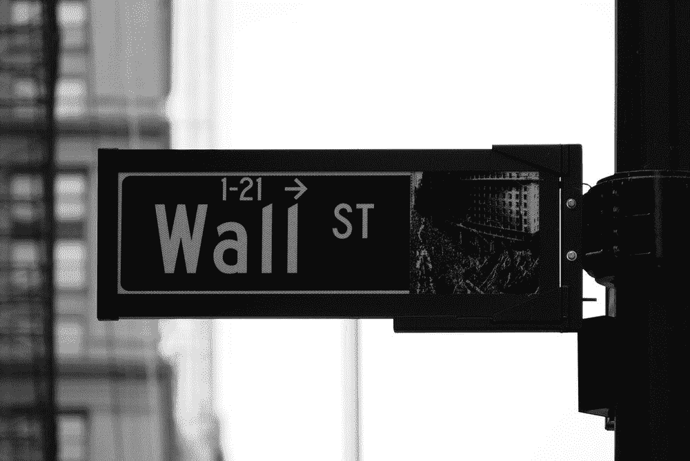
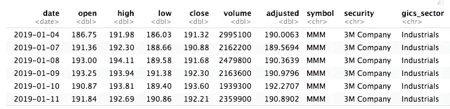
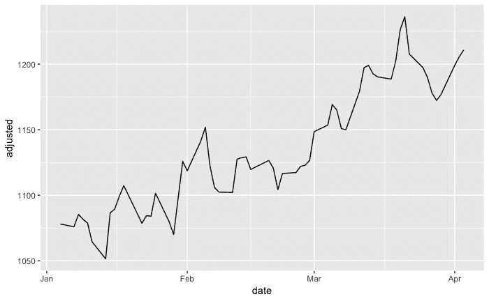
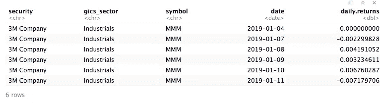
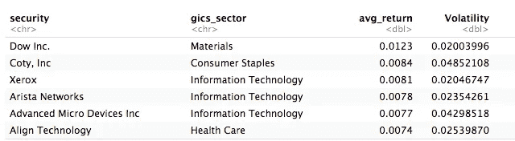
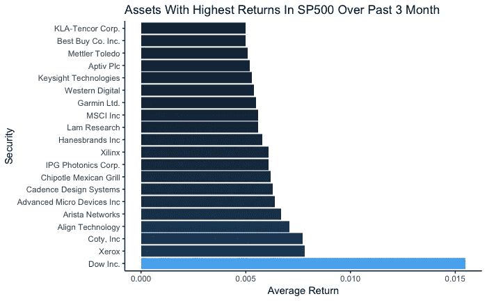
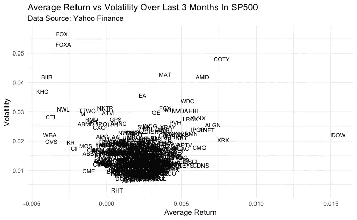
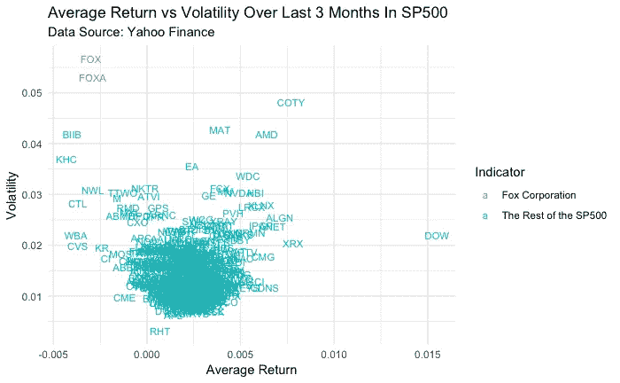
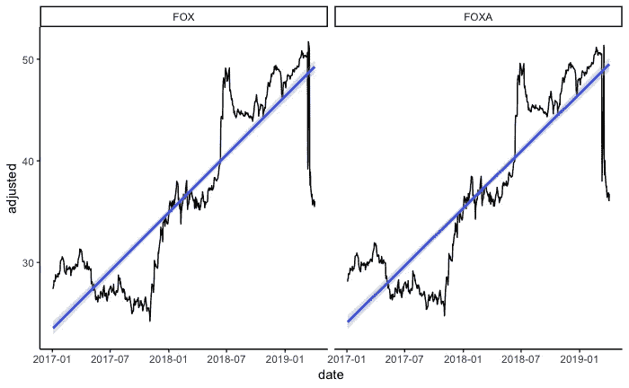
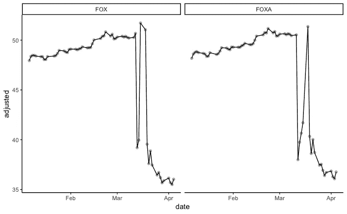

# 用 R 刮和探索 SP500 第二部分

> 原文：<https://towardsdatascience.com/exploring-the-sp500-with-r-part-2-asset-analysis-657d3c1caf60?source=collection_archive---------17----------------------->

## 资产分析和可视化



photo credit: [https://unsplash.com/photos/uJhgEXPqSPk](https://unsplash.com/photos/uJhgEXPqSPk)

在这篇博文的第一部分，我从维基百科搜集了一系列 SP500 符号，并使用这些信息从雅虎财经 API 中提取了所有 SP500 股票的 OHLC(开盘价、最高价、最低价、收盘价)数据。

在这篇博文的第二部分，我将回答我最初的问题:

*在过去的三个月里，哪些 SP500 资产的平均回报率最高？*

在第 1 部分中，我们创建了 tickers_df，这是一个包含所有 505 个 SP500 tickers 的数据框架。

**让我们再快速看一下 tickers_df:**



这个数据是**整理**的意思:

*   每个变量都是一列
*   每个观察(或案例)都是一行

这种结构使数据易于过滤和聚合，也更易于扩展。只需几行代码，我们就可以轻松提取和可视化一项资产的原始价格:

```
ticker = "GOOGL"
tickers_df %>% 
  filter(symbol == !!ticker) %>% 
  ggplot(aes(date, adjusted))+
  geom_line()
```



我们可以整天查看原始价格数据，但很难比较价格差异巨大的资产。通常，当我们分析资产时，我们会查看价格或回报的百分比变化。使用 tidyquant 包，计算回报极其容易。在下面的代码片段中，我将每项资产的原始调整收盘价转换为回报率。这是使用 tq _ transmute()函数完成的。

```
daily_sector = tickers_df %>% group_by(security, gics_sector, symbol) %>% 
tq_transmute(select     = adjusted, 
              mutate_fun = periodReturn, 
              period     = "daily") %>% 
              ungroup()
```



需要注意一些事情:

*   数据仍然很整洁
*   我们从雅虎财经 API 和维基百科页面上搜集了信息
*   使用这种格式，很容易按符号、证券或 gics_sector 进行汇总
*   别忘了解组！我最初是这样做的

**最佳表现者:**

让我们继续计算证券的平均日收益率，然后按这个排序，来回答我的问题。我还会计算收益的标准差。在数量金融学中，收益的标准差一般被称为波动率。

```
avg_return =daily_sector %>% 
  group_by(security, gics_sector) %>%
  summarise(avg_return = round(mean(daily.returns), 4),Volatility =   sd(daily.returns)) %>%         
arrange(desc(avg_return), desc(Volatility))
avg_return %>% head()
```



从这张表中我们可以很快地看到，美国著名的化学公司 Dow Inc .在过去的 3 个月里拥有最高的日平均回报率。这张表回答了我原来的问题。

让我们使用 ggplot 将此表可视化为一个条形图:

```
avg_return %>% head(20) %>% ggplot(aes(reorder(security, -avg_return), avg_return, fill = avg_return))+
  geom_col()+
  coord_flip()+
  labs(title = "Securities With Highest Average Returns In SP500 Over Past 3 Month", x = "Security", y = "Average Return")+
  theme_classic()+
  theme(legend.position="none")
```



Wow Dow Inc .的平均回报率远高于其他市场。我可能漏掉了一些重要的东西。快速的谷歌搜索告诉我这有一个明显的原因。自 3 月底正式从 Dowdupont 分离出来后，陶氏公司才作为一家独立的化学公司上市。平均回报率可能只有这么高，因为它是一种新交易的资产，我们没有太多的观察数据。

看着其他表现出色的人，我注意到一些事情:

*   过去 30 天里，许多表现最佳的公司都是科技公司。
*   Chipotle 的强劲表现让我有点吃惊。他们显然已经从之前围绕食物中毒的争论中恢复过来
*   两家计算机硬件制造商 Nvidia 和 Advanced Micro Devices 的回报率高于其竞争对手英特尔，后者在历史上表现更好。

通常，当你用数据回答一个问题时，更多的问题就会出现。我已经知道哪些股票在过去几个月的平均回报率最高，但波动性呢？波动性是证券或投资组合最重要的投资指标之一。

根据[维基百科](https://en.wikipedia.org/wiki/Volatility_(finance))的说法，投资者关心波动性至少有八个原因:

1.  投资价格的波动越大，就越难不担心；
2.  交易工具的价格波动可以定义投资组合中的头寸规模；
3.  当在特定的未来日期需要通过出售证券获得一定的现金流时，更高的波动性意味着更大的短缺机会；
4.  在为退休储蓄的同时，回报的波动性更高，导致可能的最终投资组合价值分布更广；
5.  退休时回报率的波动性更高，这使得提款对投资组合的价值产生更大的永久影响；
6.  价格波动提供了低价买入资产、高价卖出的机会；
7.  投资组合波动对该投资组合的[复合年增长率](https://en.wikipedia.org/wiki/Compound_annual_growth_rate) (CAGR)有负面影响
8.  波动率影响[期权](https://en.wikipedia.org/wiki/Option_(finance))的定价，是[布莱克-斯科尔斯模型](https://en.wikipedia.org/wiki/Black%E2%80%93Scholes_model)的一个参数。

通常，年轻投资者可以承受更大的波动性，而接近退休年龄的投资者则希望小心波动性。

使用 ggplot2，我们可以很容易地绘制出平均回报和回报波动性之间的关系。我将创建一个散点图，使用资产标记而不是图中的点。

```
plot = avg_return %>% ggplot(aes(avg_return, Volatility))+
  geom_text(aes(label = symbol), size = 3)+
  labs(title = "Average Return vs Volatility Over Last 3 Months In SP500", x = "Average Return", subtitle = "Data Source: Yahoo Finance")+
  theme_minimal()

plot
```



这张图比我们之前的柱状图更好地展示了市场上正在发生的事情。

与市场上的其他股票相比，一些股票的确很突出

*   道琼斯公司有最高的平均回报率，似乎围绕市场波动。
*   AMD 和黄凤英表现突出，高于市场波动和回报。对于年轻投资者来说，这些可能是可靠的投资机会
*   Matel 和 EA games 表现突出，其市场回报率在 100%左右，但波动性较高.这种高波动性让投资者有机会在证券价格过低时买入，在价格过高时卖出。
*   图左上角最突出的是福克斯公司两种资产类别的高波动性和低平均回报率

让我们在图表上突出显示福克斯公司的代号:

```
avg_return = avg_return %>% 
  mutate(Indicator = case_when(symbol %in% c('FOX', 'FOXA') ~ "Fox Corporation",
                               TRUE ~ "The Rest of the SP500"))plot = avg_return %>% ggplot(aes(avg_return, Volatility, color = Indicator))+
  geom_text(aes(label = symbol), size = 3)+
  labs(title = "Average Return vs Volatility Over Last 3 Months In SP500", x = "Average Return", subtitle = "Data Source: Yahoo Finance")+
  theme_minimal()

plot
```



哇！看那个！我走进这个分析，对哪些公司表现最好感兴趣。但是，最终，真正脱颖而出的是福克斯公司，在过去的 3 个月里，相对于市场的其他公司，它的表现似乎相当疲软。

福克斯公司，尤其是他们的新闻站假新闻(我拼对了吗？)，多年来一直颇有争议。该网络对许多问题有独特的观点，比一般的新闻网络有更多基于观点的节目。

让我们获得更多一点的福克斯公司的价格数据:

```
symbols = c('FOX', 'FOXA')
fox = tq_get(symbols, from = '2017/01/01')
fox %>% 
  ggplot(aes(date, adjusted))+
  geom_line()+
  geom_smooth(method = 'lm', alpha = 0.3)+
  facet_wrap(~symbol)+
  theme_classic()
```



*   在过去的几年里，这两个狐狸的标志似乎都在稳步增长
*   最近价格大幅下跌。随后继续呈下降趋势

让我们放大最近的价格:

```
tickers_df %>% 
  filter(symbol %in% c('FOX', 'FOXA')) %>% 
  ggplot(aes(date, adjusted))+
  geom_point(alpha = 0.3, color = 'black')+
  geom_line()+
  facet_wrap(~symbol)+
  theme_classic()
```



我们可以看到价格下跌发生在 3 月初。3 月 13 日出现了最初的大幅下跌，随后出现了短暂反弹。继反弹之后，价格下跌，并继续呈下降趋势。

让我们求助于谷歌来弄清楚 3 月 13 日发生了什么。快速的谷歌搜索告诉我，媒体事务在 3 月 13 日组织了一场反对福克斯公司的大规模抗议活动。

继 3 月 13 日下跌后，2019 年 3 月 19 日，福克斯公司开始独立于 21 世纪福克斯进行交易。这使得资产价格急剧下跌。不过，这并不像人们最初认为的那样，代表着资产表现不佳。

实际发生的是，福克斯公司开始使用 21 世纪福克斯的代码进行交易，21 世纪福克斯现在使用 TFCF 和 TFCFA 的代码进行交易。这导致许多新闻媒体错误地报道了福克斯和福克斯下降了 22% **。**

完成并制作最后的情节:

好了，现在我们想分享一下我们在互动情节中发现的东西，这样技术用户就不会有有趣的、信息丰富的互动情节了。

r 有很多很好的交互式数据可视化框架。我个人最喜欢的 R 中的交互式图形库是 plotly 库。Plotly 是一个交互式的 javascript 库，带有许多不同编程语言的 API。我更熟悉 python API(以及一般的 python 语言)。

使用与 ggplot2 中非常相似的代码，我们可以生成一个漂亮的交互式绘图。我会在这篇文章中嵌入情节。

```
p <- plot_ly(avg_return, x = ~avg_return, y = ~Volatility, type = 'scatter',
        mode = 'text', text = ~symbol, textposition = 'middle right',
        color = ~Indicator, colors = 'Set1',
        textfont = list(size = 8)) %>%
  layout(title = 'Average Return vs Volatility Over Last 3 Months In SP500',
         xaxis = list(title = 'Averaage Return', zeroline = FALSE
                      ),
         yaxis = list(title = 'Volatility'
                      ))
```

**概括地说，在这两部分系列中，我们:**

*   复习了关于抓取、函数式编程和 tidyverse 的介绍
*   整个 SP500 的导入股票数据
*   提出一个问题，**哪些股票在过去 3 个月的平均回报率最高？**
*   我们回答了这个问题，并通过对我们的数据提出更多的问题，我们更全面地回答了这个问题，并发现最终有趣的是**看似较低的平均回报率和相对于市场的高波动性。**
*   这种不断对数据提出问题的循环工作流在数据科学中很常见
*   我们需要小心数据质量，确保我们理解我们的数据。FOX，FOXA 看起来表现很差，而道琼斯看起来比市场其他股票表现好得多。这些结论会产生误导！

***来自《走向数据科学》编辑的注释:*** *虽然我们允许独立作者根据我们的* [*规则和指南*](/questions-96667b06af5) *发表文章，但我们并不认可每个作者的贡献。你不应该在没有寻求专业建议的情况下依赖一个作者的作品。详见我们的* [*读者术语*](/readers-terms-b5d780a700a4) *。*