# 探索纽约街区的品味

> 原文：<https://towardsdatascience.com/exploring-the-taste-of-nyc-neighborhoods-1a51394049a4?source=collection_archive---------22----------------------->

## k-均值聚类——一种无监督的机器学习算法

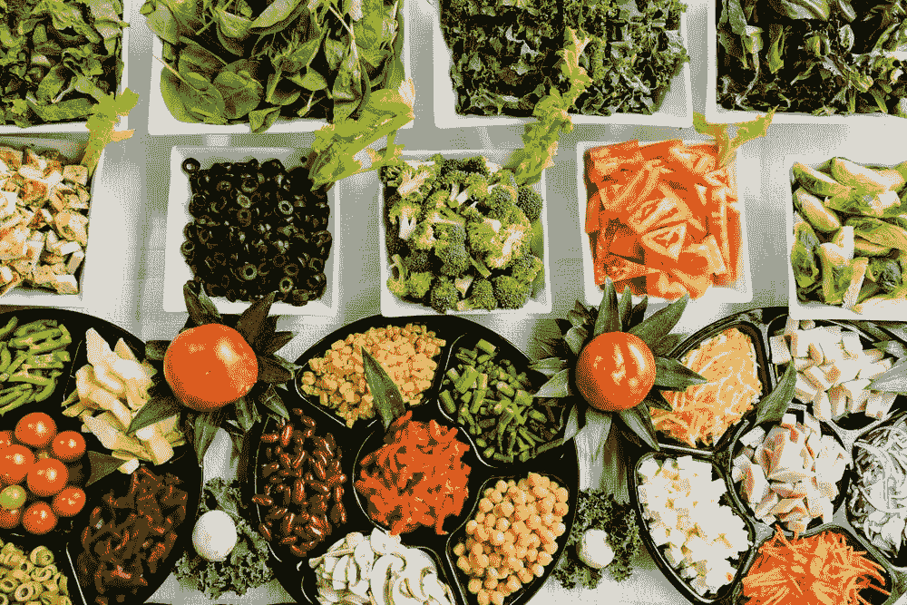

[Image Source — Unsplash](https://unsplash.com/photos/4_jhDO54BYg)

这是一篇图文并茂的文章。要访问 Jupyter 笔记本— [*点击这里*](https://nbviewer.jupyter.org/github/eklavyasaxena/The-Battle-of-Neighborhoods/blob/master/Exploring-the-Taste-of-NYC-Neighborhoods/Project_Notebook.ipynb)

# 介绍

## 背景

纽约市是美国人口最多的城市，是联合国总部所在地，也是重要的国际外交中心。它可能是地球上最多样化的城市，因为它是 860 多万人和 800 多种语言的家园。

正如一篇文章中所引用的— [食物告诉我们的文化](https://freelymagazine.com/2017/01/07/what-food-tells-us-about-culture/)
*“传统美食是一代一代传下来的。它也是一种文化身份的表达。移民无论去哪里都会带着他们国家的食物，烹饪传统食物是他们搬到新地方时保存自己文化的一种方式。”*

## 问题

毫无疑问，食物的多样性是一个多民族大都市的重要组成部分。这个项目的想法是将纽约市的街区分成几个主要的区域，并研究他们的烹饪。一个可取的意图是检查附近集群的饮食习惯和口味。进一步的研究可能会揭示食物是否与社区的多样性有任何关系。这个项目将通过利用 Foursquare 的“Places API”和“k-means clustering”无监督机器学习算法的场地数据，帮助了解一个街区的多样性。探索性数据分析(EDA)将有助于进一步发现社区的文化和多样性。

## 利益相关者

这种可量化的分析可以用来理解不同文化和美食在“地球上最多样化的城市——纽约市”的分布。此外，它还可以被愿意开餐馆的新食品供应商使用。或者由政府机构更好地检查和研究他们城市的文化多样性。

# 数据

为了检查上述内容，使用了以下数据来源:

## 纽约市数据集

链接:[https://geo.nyu.edu/catalog/nyu_2451_34572](https://geo.nyu.edu/catalog/nyu_2451_34572)

这个纽约市街区名称点文件是作为纽约市街区指南创建的，它出现在网络资源“纽约:街区之城”上标签质心的最佳估计值是以 1:1，000 的比例建立的，但理想情况下以 1:50，000 的比例查看。该数据集将以 json 格式提供纽约市附近的地址。json 的摘录如下:

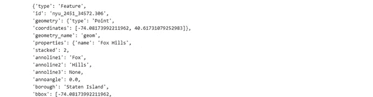

## 四方应用编程接口

链接:[https://developer.foursquare.com/docs](https://developer.foursquare.com/docs)

Foursquare API 是一个位置数据提供者，它将被用来进行 RESTful API 调用，以检索不同街区的场馆数据。这是到 [Foursquare 场馆类别层级](https://developer.foursquare.com/docs/resources/categories)的链接。从所有街区检索到的场馆大致分为“艺术&娱乐”、“学院&大学”、“活动”、“美食”、“夜生活场所”、“户外&娱乐”等。API 调用的摘录如下:

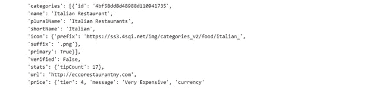

# 方法学

## 下载并探索纽约市数据集

为了分割纽约市的街区，需要一个包含 5 个区和街区的数据集，每个区都有各自的纬度和经度坐标。这个数据集是使用提到的 URL 下载的。

一旦。json 文件被下载，它被分析以理解文件的结构。URL 返回一个 python 字典，所有相关数据都在 features 键中，features 键基本上是一个邻域列表。通过遍历数据并一次一行地填充数据帧，字典被转换成 pandas 数据帧。

结果，创建了一个数据帧，其中包含纽约市街区的区、街区、纬度和经度细节。

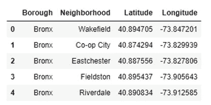

经分析发现，该数据框架由 5 个区和 306 个街区组成。

此外，“geopy”库用于获取纽约市的纬度和经度值，返回的值为纬度:40.71，经度:-74.01。

然后，通过创建纽约市地图，将精选的数据帧用于可视化，在地图上叠加街区。以下描述是使用 python“folium”库生成的地图。

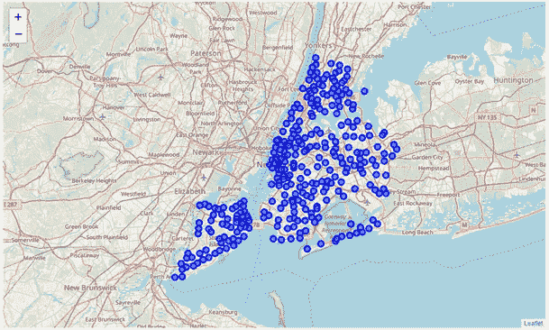

## 对 Foursquare 的 RESTful API 调用

Foursquare API 用于探索邻域并对其进行分割。为了访问 API，定义了“客户端 ID”、“客户端秘密”和“版本”。

Foursquare 上有许多端点可用于各种 GET 请求。但是，为了探索美食，要求所有提取的地点都来自“食物”类别。检索 Foursquare 场所类别层次结构，并进一步分析返回的请求。

分析发现，场馆有 10 个大类或母类，所有其他子类都包含在这些大类或母类下。

如前所述,“食物”类别是感兴趣的问题。我们创建了一个函数来返回一个字典，其中包含“食品”及其子类别的“类别 ID”和“类别名称”。

上面的函数获取父类别 ID，并返回所有子类别的类别名称和类别 ID。

为了进一步理解 GET 请求的结果，探索“纽约市”数据集的第一邻域。返回的第一个邻域是“Wakefield ”,纬度为 40.89，经度为-73.85。然后，创建一个 GET 请求 URL 来搜索“类别 ID”= '*4d 4b 7105d 754 a 06374d 81259*'，即“食物”的“类别 ID”，半径= 500 米的地点。然后检查返回的请求，如下所示:

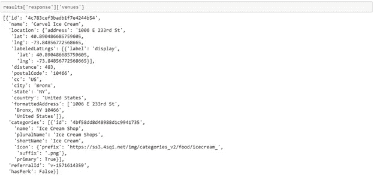

因为目标是根据纽约市附近的“食物”来分割纽约市的邻近地区，所以还需要从所有 306 个邻近地区的场所获取该数据。

为了克服上述过程的冗余，创建了函数“getNearbyFood”。这个函数遍历纽约市的所有街区，并创建一个半径= 500，限制= 100 的 API 请求 URL。通过限制，定义了最多应该返回 100 个附近的场所。此外，GET 请求是向 Foursquare API 发出的，只从中提取每个附近地点的相关信息。然后，数据被追加到 python“列表”中。最后，python“列表”被展开或展平，以将其附加到函数返回的数据帧中。

令人好奇的是，如果在 GET 请求中指定了顶级类别，Foursquare API 会返回所有子类别。

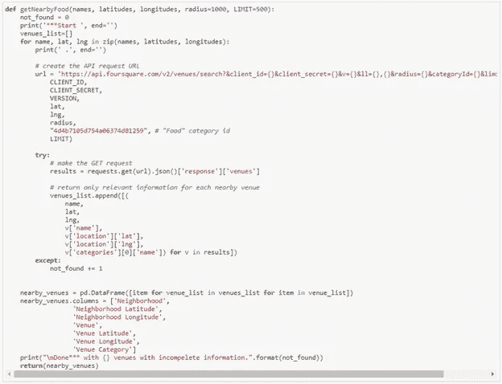

## 泡菜

Pickle 是一个非常重要且易于使用的库。它用于序列化从 GET 请求中检索到的信息，以使。“pkl”文件。这个文件稍后可以被反序列化以检索精确的 python 对象结构。这是至关重要的一步，因为它将阻止对 Foursquare API 的任何冗余请求，这些请求的收费超过了阈值限制。

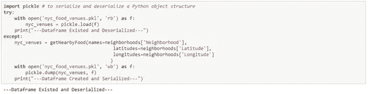

返回的“数据帧”如下:

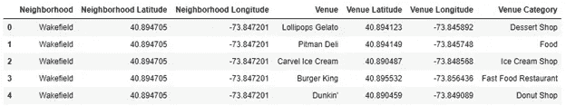

到目前为止，创建了两个 python“数据帧”:

1.“neighborhoods ”,包含纽约市邻近地区的区、邻近地区、纬度和经度细节，以及

2.“nyc _ venues”是“neighborhoods”数据框架与其“Food”类别场馆的合并，使用“半径”= 500 米和“限制”= 100 进行搜索。此外，每个场馆都有自己的纬度，经度和类别。

# 探索性数据分析

合并后的数据框架“nyc _ venues”包含所有必需的信息。确定该数据帧的大小，并且发现总共有 14，047 个地点。

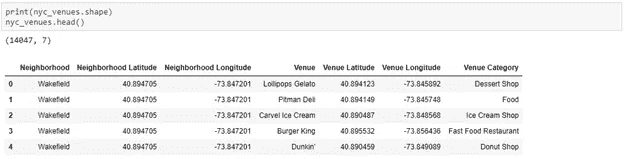

现在，重要的是要找出有多少独特的类别可以从所有返回的场馆策划。并且发现有 194 个这样的类别。

## 数据清理

重要的是要明白，这个项目的兴趣点是通过使用场地的类别对社区进行分类，从而了解社区的文化多样性。因此，重要的是从“数据框架”中移除所有具有一般化类别的场馆。这里，概括地说，这意味着这些分类的场所在不同的文化和饮食习惯中是常见的。这种类型的场所的类别的例子是咖啡店、咖啡馆等。因此，首先，所有独特的类别都被输入到一个 python“列表”中。

然后，手动将类别确定为“一般”(如上所述)。这种数据预处理完全取决于“数据分析师”的判断，可以根据需要进行修改。以下是列为“一般”的类别:

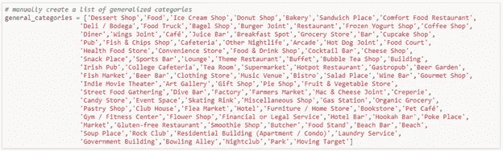

两个 python“列表”即“唯一 _ 类别”和“一般 _ 类别”的简单相减给出了进一步分析所需的所有类别的“列表”。python“列表”管理用于删除所有类别不在“食物类别”中的场所。

再次检查独特类别的数量，发现只有 92 个，而以前有 194 个。这意味着，几乎 50%的数据对于分析来说是一个噪音。这个重要的步骤，数据清理，有助于捕获感兴趣的数据点。

## 特征工程

现在，对每个街区进行单独分析，以了解其 500 米范围内最常见的菜肴。

上述过程是通过使用 python“熊猫”库的“一次热编码”功能实现的。一种热编码将分类变量(即“场地类别”)转换成可以提供给 ML 算法的形式，以便在预测中做得更好。

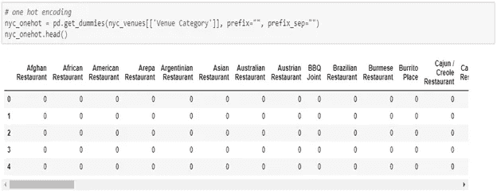

在转换分类变量时，如上所示，“邻域”列被添加回来。检查新数据帧“nyc_onehot”的大小，发现总共有大约 6，846 个数据点。

此外，统计每个街区中每个类别的场地数量。观察到，在数据帧的前五个邻近区域中，“安纳代尔”、“阿登高地”和“阿灵顿”在其 500 米附近具有 3、3、2 个“美国餐馆”。

前 10 个“场馆类别”也可以通过统计它们的出现次数来找到。下面的分析显示，“韩国餐厅”、“中国餐厅”、“加勒比海餐厅”、“印度餐厅”和“快餐店”位列前五。

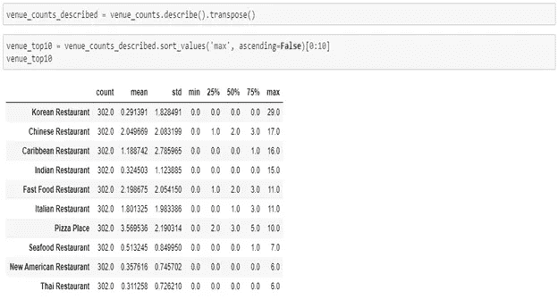

## 数据可视化

使用 python 'seaborn '库将这 10 大类别分别绘制在条形图上。创建一个代码块，该代码块循环并绘制一个类别的前 10 个邻域的图形。

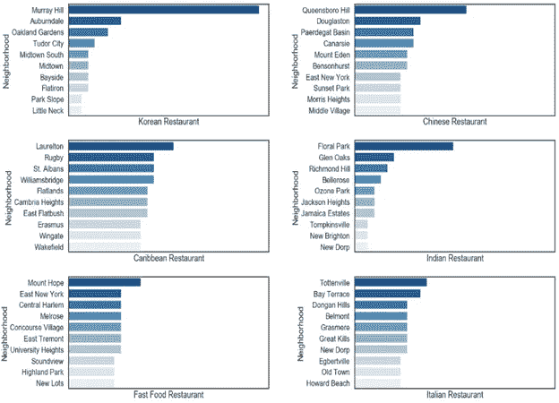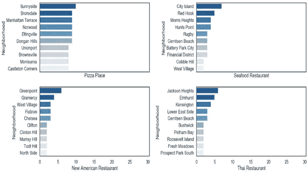

接下来，将邻域的行分组在一起，并通过取平均值来计算每个类别的出现频率。

由于限制被设置为 100，Foursquare API 将返回许多地点。但是一个社区的饮食习惯可以由它附近的前五个地点来定义。此外，所创建的数据帧然后被馈入相应邻域中的前 5 个最常见的场所类别。

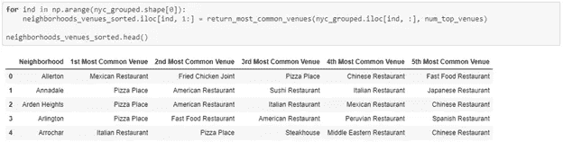

# 机器学习

“k-means”是一种无监督的机器学习算法，它创建由于某些相似性而聚集在一起的数据点的聚类。该算法将用于计算可变聚类大小的每个聚类标签的邻域。

为了实现该算法，确定最佳的聚类数(即 k)是非常重要的。有两种最流行的方法，即“肘法”和“剪影法”。

## 肘法

对于不同的“k”值，肘形法计算样本到其最近聚类中心的平方距离之和。最佳聚类数是这样一个值，在该值之后，距离的平方和没有显著减少。

以下是该方法的实现(具有从 1 到 49 的不同数目的聚类):

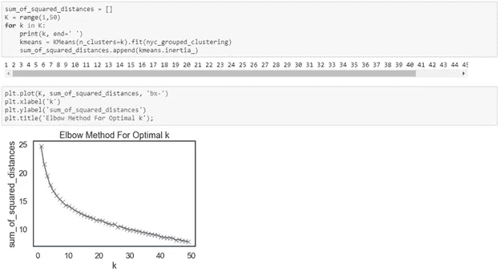

有时，肘方法不能给出所需的结果，这种情况就发生了。由于距离的平方和逐渐减少，因此无法确定最佳的聚类数。为了解决这个问题，可以实现另一种方法，如下所述。

## 剪影法

正如维基百科中引用的那样——“侧影法衡量的是一个点与自己的聚类(内聚)相比与其他聚类(分离)的相似程度。”

下面是此方法的一个实现。由于需要至少 2 个聚类来定义相异度，聚类数(即“k”)将在 2 到 49 之间变化:

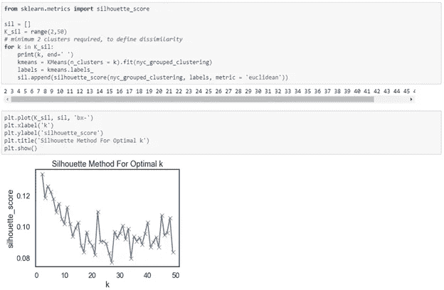

在 k = 2、k = 4 和 k = 8 处有一个峰值。两个和四个数量的聚类将非常广泛地聚类邻域。因此，簇的数量(即“k”)被选择为 8。

## k 均值

以下代码块运行聚类数= 8 的 k-Means 算法，并打印分配给不同聚类的邻域计数:

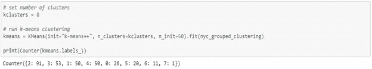

此外，所管理的聚类标签被添加到数据帧，以获得基于其附近最常见的地点分割邻域的期望结果。现在，“neighborhoods _ venues _ sorted”与“nyc_data”合并，以添加每个街区的区、纬度和经度。

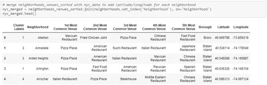

同样，纽约市的街区也是利用 python“叶”库可视化的。生成的以下地图显示了所需的纽约市街区分割:

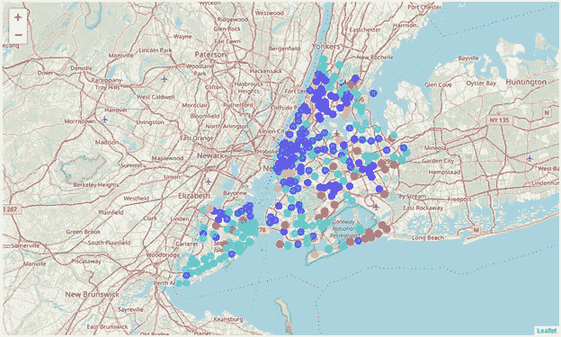

# 结果

## 群集— 0

以下是 0 类分析的结果:

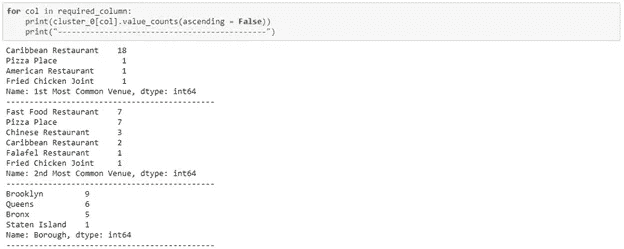

“加勒比海餐厅”对这一集群负有重大责任，在不同社区的“第一最常见地点”中出现了 18 次，其次是“快餐店”和“披萨店”，在“第二最常见地点”中出现了 7 次。此外，“加勒比海餐厅”在“第二常见场所”中出现了 2 次。另外，令人好奇的是，这些社区大部分都在纽约市的“布鲁克林”区。

因此，Cluster-0 是一个“加勒比海餐馆”占优势的聚类。

## 集群— 1

以下是第 1 类分析的结果:

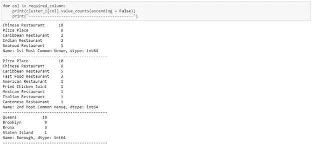

“中国餐馆”在这个集群中有 18 次出现，其次是“比萨饼店”，在不同社区的“第一大常见场所”中有 8 次出现。此外，在“第二常见地点”中，“披萨店”出现了 10 次，其次是“中国餐馆”，出现了 8 次。此外，令人好奇的是，这些社区大部分都在纽约市的“皇后”区。

因此，Cluster-1 是“中国餐馆”和“比萨饼店”的组合。

## 群组— 2

以下是第 2 类分析的结果:

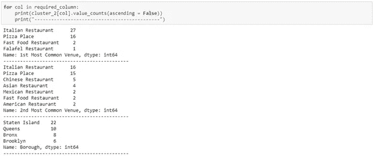

“意大利餐厅”是该集群的主要原因，出现了 27 次，其次是“披萨店”，在不同社区的“第一大常见场所”中出现了 16 次。此外，“意大利餐厅”出现了高达 16 次，其次是“披萨店”，在“第二大常见场所”中出现了 15 次。此外，令人好奇的是，这些社区大部分都在纽约市的“斯塔滕岛”和“皇后区”。

因此，Cluster-2 是“意大利餐馆”和“比萨饼店”的组合。披萨是一种意大利美食，因此集群-2 可以被称为“意大利餐厅”主导集群。

## 群组— 3

以下是第 3 类分析的结果:

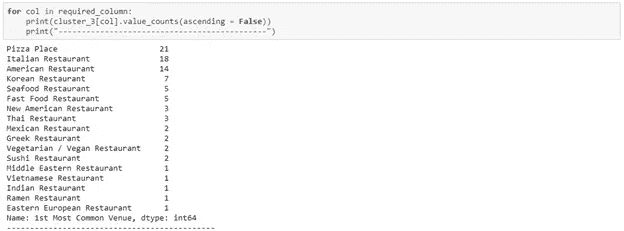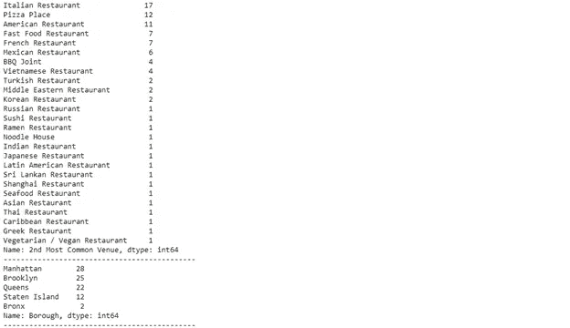

这是所有聚类中最大的一个，这意味着大多数的邻居都聚集在其中。同样，如聚类 2 所示，“比萨饼店”和“意大利餐馆”在“第一最常见场所”和“第二最常见场所”中占据这些类别出现次数的前 2 位，但是，有趣的是，第 3 位主要由“美国餐馆”类别占据，这就是该聚类与聚类 2 分离的原因。

此外，令人好奇的是，这个集群中的社区平均分布在“曼哈顿”、“布鲁克林”和“皇后区”，其中“斯塔滕岛”有相当数量的社区。

因此，聚类-3 是“意大利餐馆”、“比萨饼店”和“美国餐馆”的组合，其中“美国餐馆”显示了从聚类-2 中分割该聚类的优势

## 群组— 4

以下是 Cluster-4 分析的结果:

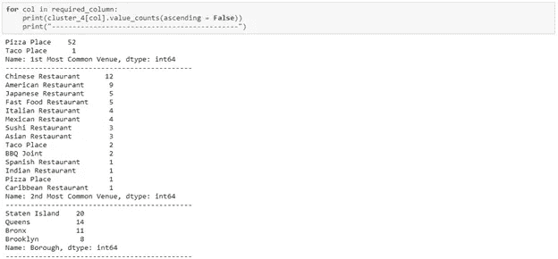

在这个集群中，“披萨店”占据了所有其他类别，在不同社区的“第一最常见场所”中拍摄了 52 次，其次是“中国餐馆”，在“第二最常见场所”中拍摄了 12 次。此外，令人好奇的是，这些社区中的大多数几乎平均分布在纽约市的“斯塔滕岛”、“皇后区”和“布朗克斯区”。

因此，簇 4 可以被称为“比萨饼店”优势簇。

## 群组— 5

以下是 Cluster-5 分析的结果:

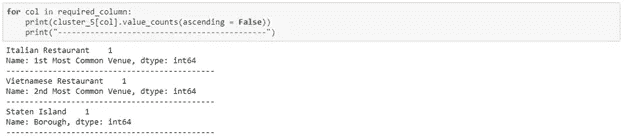

很明显，只有一个社区“灯塔山”是在这个集群下管理的。这种分割可以从“灯塔山”是其遗产的旅游景点这一事实中得到理解，它位于从斯塔滕岛东北角辐射出来的一连串山脉的最南端。这个街区有各种各样的美食，在最常见的 5 个地点列表中，因此是一个独立的集群。

因此，到目前为止，Cluster-5 可以说是非常出色的。

## 群组— 6

以下是 Cluster-6 分析的结果:

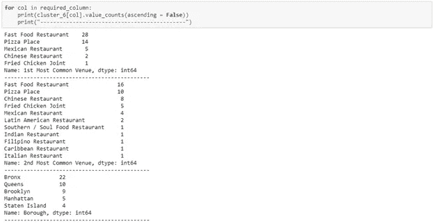

“快餐店”以 28 次出现在该集群中，其次是“披萨店”，在不同社区的“第一大常见场所”中有 14 次出现。此外，在“第二常见地点”出现次数中也可以看到相同的比例分布。

另外，令人好奇的是，这些社区大部分都在纽约市的“布朗克斯”和“皇后”区。

众所周知，虽然比萨饼是一种意大利美食，但它也是一种快餐。因此，集群 6 可以被称为“快餐店”优势集群。

## 群组— 7

以下是 Cluster-7 分析的结果:

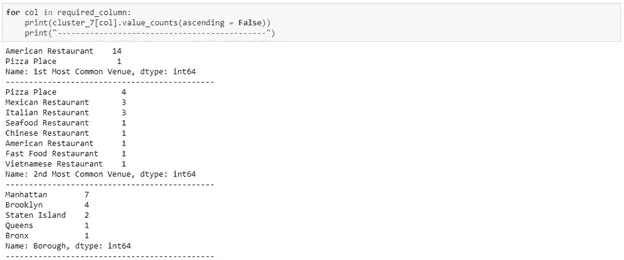

“美国餐厅”在不同社区的“第一最常见场所”中出现了 14 次，对这一群体负有重大责任。此外，在“第二最常见的场所”有各种美食。另外，令人好奇的是，这些社区大多位于纽约市的“曼哈顿”和“布鲁克林”区。

因此，集群 7 可以被称为“美国餐馆”优势集群。

# 讨论

为了理解集群，进行了三个分析，即:

1.“区”的计数

2.“第一最常见地点”的计数

3.“第二常见场所”的数量

以上信息充分说明了基于邻域间相似性度量的聚类的基础现实。

将 k 均值无监督机器学习算法的结果列表:

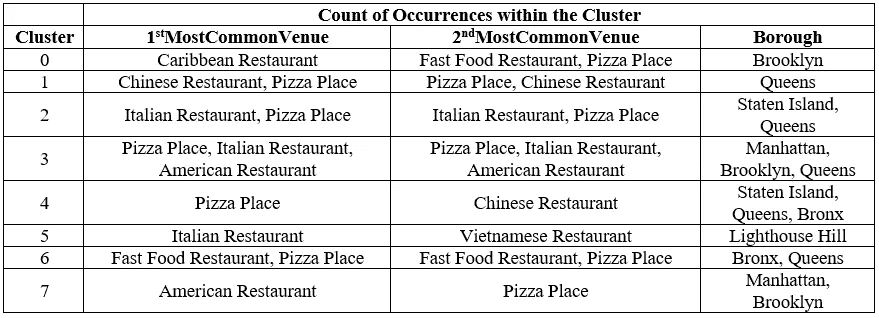

比萨饼，谁不喜欢它。从分析中可以明显看出，披萨店是所有集群或社区中最常见的场所。因此，由于 Pizza Place 对纽约市来说是一个现成的地方，所以它被放在一边以重命名集群。

以下可能是由 k-Means 无监督机器学习算法分割和管理的聚类的名称:

集群 0 — *加勒比海*

集群 1 — *中文*

集群 2 — *意大利语*

集群 3 — *意大利裔美国人*

集群 4 — *披萨*

集群 5 — *美食组合*

集群 6 *—快餐*

集群 7 — *美国*

# 结论

对多维数据集应用*聚类算法*、k-Means 或其他算法，可以得到非常有趣的结果，这有助于理解和可视化数据。纽约市的街区被非常简单地划分为八个集群，通过分析，可以根据该街区及其周围的场地类别对它们进行重命名。除了美国菜，意大利菜和中国菜在纽约市占主导地位，多样性统计也是如此。

通过使用当前纽约市的数据集以及对美食场所更感兴趣的 API 平台(如 Yelp 等),可以改进这个项目的结果，并使其更具好奇心。)这个项目的范围可以进一步扩大，以了解每个社区的动态，并向新的供应商建议一个有利可图的地点来开设他或她的食品店。此外，政府当局可以利用它来更好地检查和研究他们城市的文化多样性。

# 参考

Alex Aklson 和 Polong Lin 为 Coursera 上的“应用数据科学顶点”课程制作的笔记本

感谢您的阅读！如果你觉得这有帮助或者没有帮助，请在评论中告诉我。如果这篇文章有帮助， [*分享一下*](https://medium.com/@eklavyasaxena/exploring-the-taste-of-nyc-neighborhoods-1a51394049a4) 。

*访问 Jupyter 笔记本—* [*点击此处*](https://nbviewer.jupyter.org/github/eklavyasaxena/The-Battle-of-Neighborhoods/blob/master/Exploring-the-Taste-of-NYC-Neighborhoods/Project_Notebook.ipynb)

**领英**

 [## Eklavya Saxena -东北大学-马萨诸塞州波士顿| LinkedIn

### 东北大学精通数据科学的研究生，在以下领域有 2 年以上的工作经验

linkedin.com](https://linkedin.com/in/EklavyaSaxena) 

**GitHub**

 [## eklavyasaxena/邻里之战

### 纽约市是美国人口最多的城市，也是联合国总部和纽约市的所在地

github.com](https://github.com/eklavyasaxena/The-Battle-of-Neighborhoods/tree/master/Exploring-the-Taste-of-NYC-Neighborhoods)