# 探索东京街区:现实生活中的数据科学

> 原文：<https://towardsdatascience.com/exploring-the-tokyo-neighborhoods-data-science-in-real-life-8b6c2454ca16?source=collection_archive---------4----------------------->

## 网络抓取、Foursquare API、叶子地图等等

Tokyo! (Source: [Louie Martinez](https://unsplash.com/photos/IocJwyqRv3M))

作为最终的 [IBM 顶点项目的一部分，](https://www.coursera.org/learn/applied-data-science-capstone)我们了解了数据科学家在现实生活中的经历。期末作业的目标是定义一个商业问题，在网上寻找数据，并使用 [Foursquare](https://developer.foursquare.com/) 位置数据来比较东京行政区内的不同地区(城市的选择取决于学生)，以找出哪个社区适合开办餐馆业务(“想法”也取决于学生个人)。为了准备作业，我一步一步地完成了问题设计、数据准备和最终分析部分。详细的代码和图片在 Github 中给出，链接可以在文章末尾找到。

# 1.业务问题的讨论和背景:

## 问题陈述:日本东京靠近办公区的午餐餐馆的前景。

我现在住的东京是世界上人口最多的大都市。东京目前在全球经济实力指数中排名第三，绝对是创业的最佳地点之一。

During the daytime, specially in the morning and lunch hours, office areas provide huge opportunities for restaurants. Reasonably priced (one lunch meal 8$) shops are usually always full during the lunch hours (11 am — 2 pm) and, given this scenario, we will go through the benefits and pitfalls of opening a breakfast cum lunch restaurant in highly densed office places. Usually the profit margin for a decent restaurant lie within 15−20% range but, it can even go high enough to 35%, as discussed [here](https://www.ichefpos.com/en-sg/blog/japanese-restaurants-profits). The core of Tokyo is made of 23 wards (municipalities) but, I will later concentrate on 5 most busiest [business wards](https://www.realestate-tokyo.com/office/tokyo-business-districts/) of Tokyo — Chiyoda (千代田区), Chuo (中央区), Shinjuku (新宿区), Shibuya (渋谷区) and Shinagawa (品川区), to target daily office workers.

我们将讨论这个项目的每个步骤，并分别解决它们。我首先概述了最初的数据准备，并描述了在东京开始邻里之战的未来步骤。

**目标受众**

什么类型的客户或群体会对这个项目感兴趣？

1.  想投资或开餐馆的商务人员。这一分析将是一个全面的指南，以在午餐时间开设或扩大针对东京大量上班族的餐厅。
2.  喜欢把自己的餐馆作为副业的自由职业者。这个分析会给出一个思路，开一个餐厅有多大的好处，这个生意有哪些利弊。
3.  应届毕业生，寻找靠近办公室的合理午餐/早餐地点。
4.  初露头角的数据科学家，他们希望实现一些最常用的探索性数据分析技术，以获得必要的数据，对其进行分析，并最终能够从中讲述一个故事。

# 2.数据准备:

## 2.1.从维基百科抓取东京病房表

我首先利用 Wiki 上的东京特殊病房页面来创建一个数据框。为此，我使用了[请求](https://2.python-requests.org//en/master/)和 [Beautifulsoup4](https://pypi.org/project/beautifulsoup4/) 库来创建一个包含东京 23 个区的名称、面积、人口和第一大区的数据框。我们从下面开始—

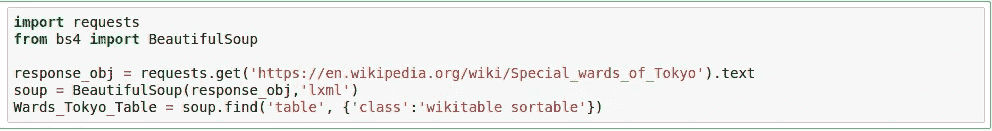

稍加处理后，数据帧如下所示

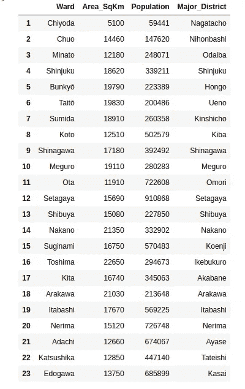

Data-frame from Wikipedia Table.

## 2.2.获取主要区域的坐标: [Geopy 客户端](https://geopy.readthedocs.io/en/stable/)

下一个目标是使用 Geopy 客户端的 geocoder 类获得这 23 个主要地区的坐标。使用下面的代码片段—

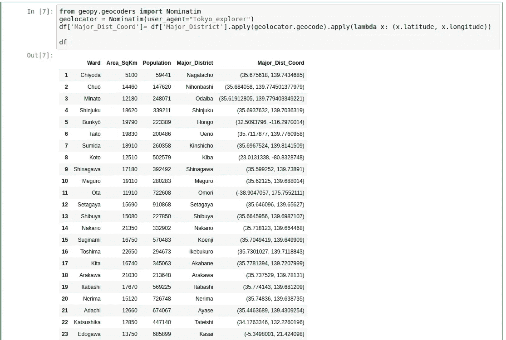

正如你所看到的，4 个坐标是完全错误的(文京、江东、大田、江户川)，这是由于这些地区的名称写得与它们在这个数据框中的方式没有什么不同(例如 hong \u- Hongo)，所以，我必须用从 google 搜索获得的值替换这些坐标。在和熊猫玩了一会儿之后，我可以得到一个排列良好的数据框，如下所示

## 2.3.东京主要行政区的平均地价:网络抓取

另一个可以指导我们以后决定哪个地区最适合开餐馆的因素是，23 个区的平均土地价格。我从刮“[东京](https://utinokati.com/en/details/land-market-value/area/Tokyo/)土地市场价值区域”网页上获得这些信息，与之前的维基页面类似。由于我想考虑第 1 节中提到的东京 5 个最繁忙的商业区，数据框如下所示

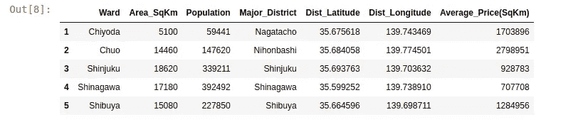

## 2.4.使用 [Foursquare](https://developer.foursquare.com/) 位置数据:

Foursquare 的数据非常全面，它为苹果、优步等公司提供位置数据。对于这个商业问题，作为作业的一部分，我使用了 Foursquare API 来检索东京这 5 个主要地区的热门景点的信息。返回的热门景点取决于最高的客流量，因此取决于进行呼叫的时间。因此，根据一天中不同的时间，我们可能会得到不同的受欢迎的场所。该调用返回一个 JSON 文件，我们需要将它转换成一个数据帧。在这里，我为半径 1 公里内的每个主要地区选择了 100 个热门景点。下面是从 Foursquare 返回的 JSON 文件中获得的数据帧

# 3.可视化和数据探索:

## 3.1.树叶库和树叶地图:

Folium 是一个 python 库，可以使用坐标数据创建交互式传单地图。因为我对作为热门地点的餐馆感兴趣，所以我首先创建一个数据框，其中前面的数据框中的`‘Venue_Category’`列包含单词“餐馆”。我用了下面这段代码—

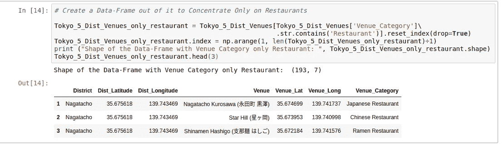

下一步是使用此数据框创建一个带有叶子的传单地图，以查看 5 个主要地区中最常去的餐馆的分布。

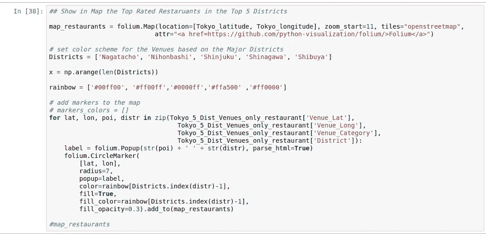

传单地图上面的代码片段如下所示

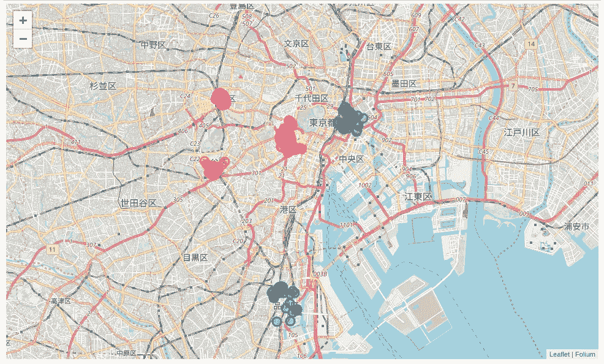

Figure 1: Circular marks represent the most frequently visited restaurants in the 5 Major (Nihombashi- Green, Nagatacho- Red, Shibuya- Orange, Shinjuku- Magenta, Shinagawa- Blue) districts of Tokyo, according to Foursquare data.

## 3.2.探索性数据分析:

有 134 个独特的场所类别，拉面餐厅名列榜首，正如我们在下面的图表中看到的—

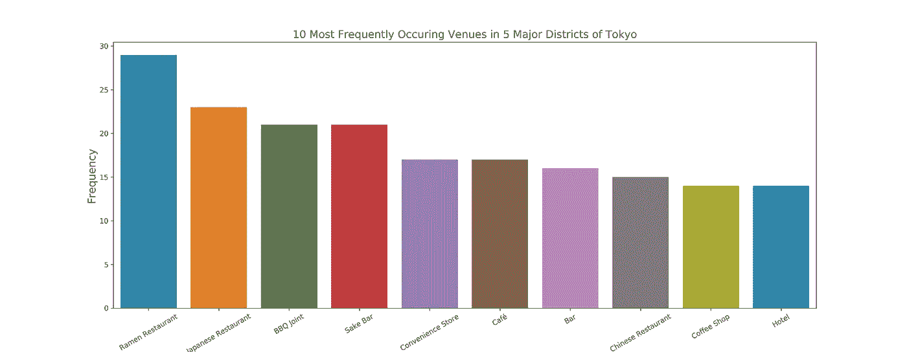

Figure 2: Most Frequent venues around Shinjuku, Shibuya, Nagatacho, Nihombashi, Shinagawa, according to Foursquare data.

现在，这让我想起了拉面，的确是时候休息一下了。

Ramen Restaurants are the most frequently visited places around 5 major districts of Tokyo. Yum!

在美味的拉面之后，让我们回到探索数据上来。要了解每个地区排名前 5 的场馆，我们按如下步骤进行

*   为场馆类别创建一个带有[熊猫 one hot 编码](https://pandas.pydata.org/pandas-docs/stable/reference/api/pandas.get_dummies.html)的数据框。
*   使用地区列上的 pandas groupby，并获得一次性编码场馆类别的平均值。
*   转置步骤 2 中的数据帧，并按降序排列。

让我们看看下面的代码片段—

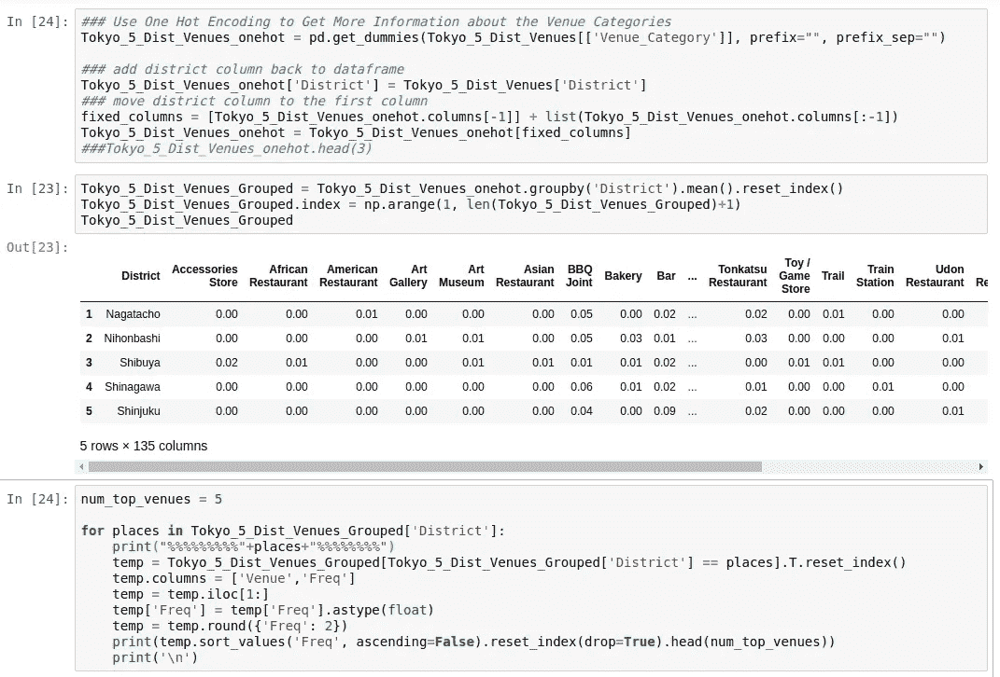

上面的代码输出每个地区的前 5 个场馆—

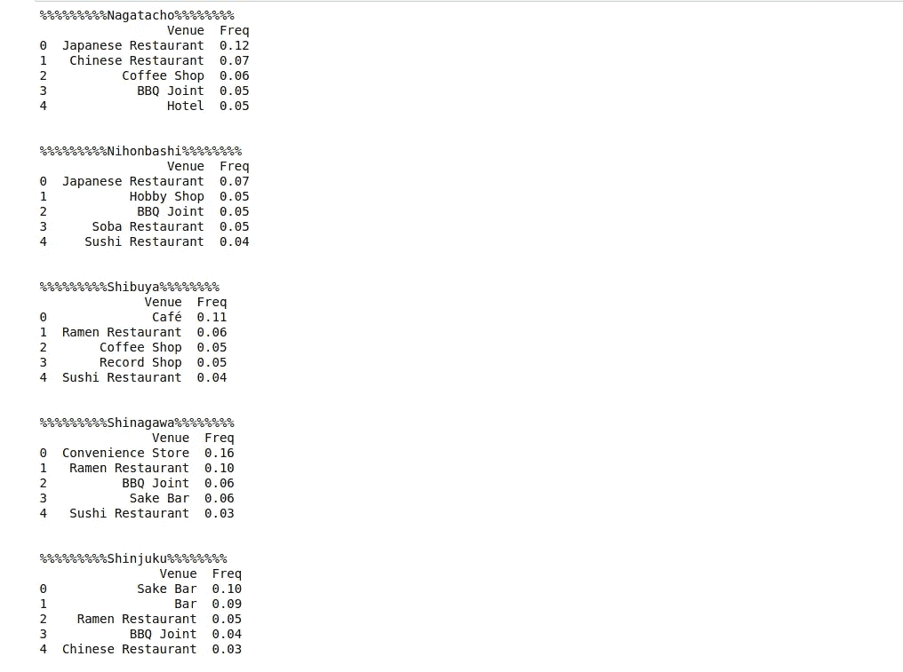

从我为探索性数据分析创建的几个数据框中，使用其中的一个，我绘制了哪个区有最常去的餐馆，千代田区的永田町有 56 家餐馆。

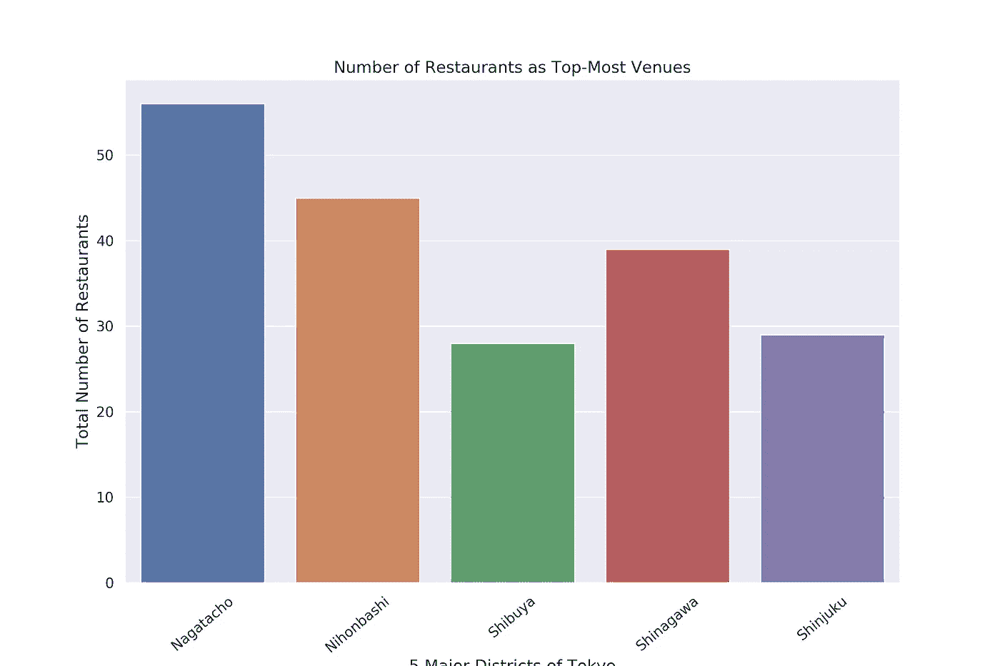

Figure 4: Number of restaurants as top most common venues in 5 districts of Tokyo.

我们也可以看看[小提琴图](https://seaborn.pydata.org/generated/seaborn.violinplot.html) s，它们被用来表示分类数据，我用 seaborn 图书馆展示了 4 种主要类型的餐馆在不同地区的分布

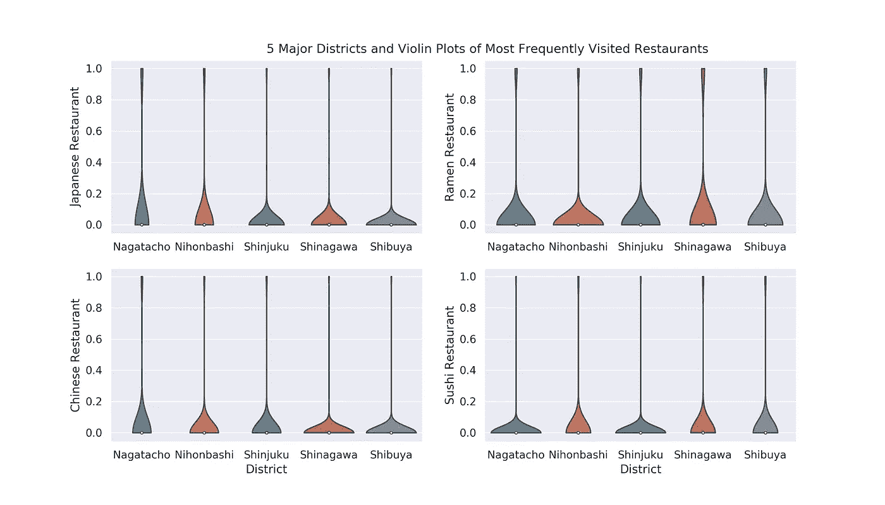

Figure 5: Lots of Japanese and Chinese restaurants in Nagatacho, whereas Shinagawa has many Ramen restaurants.

一旦我们对东京 5 个主要地区的不同类型的场所，特别是餐馆有了大致的了解，就该使用 K-Means 对这些地区进行聚类了。

# 4.聚集地区

最后，我们尝试根据场地类别对这 5 个地区进行聚类，并使用 K-Means 聚类。因此，我们的预期将基于场馆类别的相似性，这些地区将被分组。我使用了下面的代码片段—

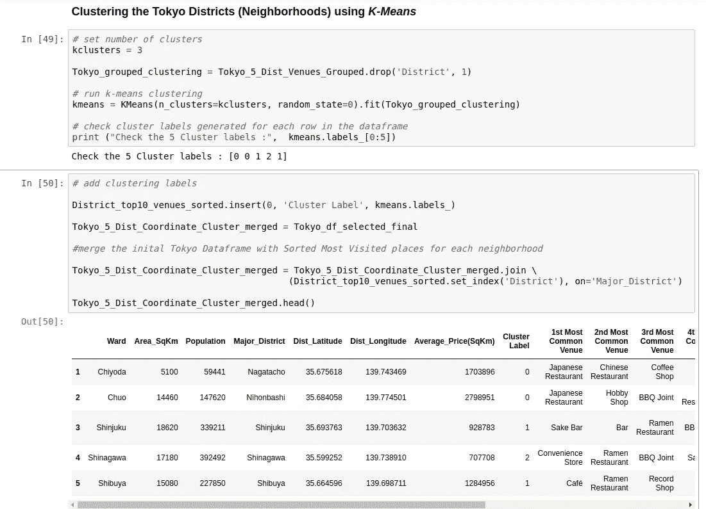

5 districts of Tokyo divided in 3 clusters based on the most common venues obtained from Foursquare Data.

我们可以使用叶库在活页地图中表示这 3 个聚类，如下所示—

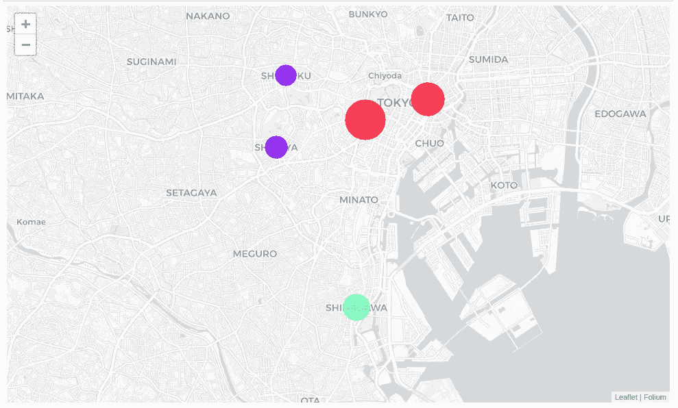

Figure 6: 5 major districts of Tokyo segmented into 3 clusters based on the most common venues. The size of the circles represents number of restaurants as most common venues for each district, which is highest at Nagatacho and lowest at Shibuya as shown in figure 4.

# 5.结果和讨论:

在分析的最后，我们得到了东京 5 个主要行政区的一个秘密峰值，由于商业问题始于在最繁忙的地区之一开一家午餐餐馆的好处和缺点，数据探索主要集中在餐馆上。我使用了来自维基百科等网络资源、Geopy 等 python 库和 Foursquare API 的数据，建立了一个非常真实的数据分析场景。我们发现—

*   拉面餐厅在这五个地区最常见的场所中名列前茅。
*   千代田区的永田町区和中央区的日本桥以餐馆为主，是最常见的场所，而涉谷和新宿区以酒吧、酒馆和咖啡馆为主，是最常见的场所。
*   永田町的餐厅数量最多，是最常见的场所，而涩谷区的餐厅数量最少。
*   由于聚类仅基于每个地区最常见的场馆，新宿、涉谷属于同一聚类，永田町、日本桥属于另一聚类。品川与这两个集群是分开的，因为便利店是最常见的场所(频率非常高)。

根据该分析，品川区将为即将开业的午餐餐厅提供最少的竞争，因为便利店是该地区最常见的场所，与其他地区相比，餐厅作为常见场所的频率非常低。从网上废弃的数据也可以看出，品川及其周边地区的平均土地价格比靠近东京市中心的地区要便宜得多。所以，毫无疑问，这个地区有可能成为开设高档餐厅的目标。这种分析的一些缺点是——聚类完全基于从 Foursquare 数据中获得的最常见的场所。由于土地价格、场馆与最近车站的距离、潜在客户的数量、品川作为港口地区的优势和劣势都可能发挥重要作用，因此，这一分析肯定远非结论性的。然而，它确实给了我们一些非常重要的初步信息，关于在东京主要地区周围开餐馆的可能性。此外，这种分析的另一个缺陷可能是只考虑东京每个区的一个主要地区，考虑 5 个主要区下的所有地区会给我们一个更现实的画面。此外，如果我们使用 DBSCAN 等其他聚类技术，这个结果也可能会有所不同。我写了一篇单独的[帖子](/dbscan-algorithm-complete-guide-and-application-with-python-scikit-learn-d690cbae4c5d)介绍 DBSCAN 的详细理论以及我们如何使用它来集群空间数据库。

# 6.结论

最后，为了结束这个项目，我们已经对现实生活中的数据科学项目有了一点了解。我使用了一些常用的 python 库来删除 web 数据，使用 Foursquare API 来探索东京的主要地区，并看到了使用小叶地图分割地区的结果。这种分析在现实生活商业问题中的潜力将被详细讨论。此外，还提到了一些缺点和改进的机会，以呈现更真实的图片。最后，由于我的分析主要集中在开一家针对大量办公室工作人员的餐馆的可能性上，所以得到的一些结果出乎意料地与我在东京呆了 5 年后的预期完全一致。特别是新宿和涉谷地区最常去的咖啡馆、酒吧和酒馆，以及永田町地区日本桥附近的日本餐馆！希望这种分析能够为您提供初步的指导，让您能够利用数据科学应对更多现实生活中的挑战。

保持坚强，干杯！！

在 [Github](https://github.com/suvoooo/Coursera_Capstone/tree/master/Week5) 中找到代码。

在 [Linkedin](https://www.linkedin.com/in/saptashwa/) 找到我。