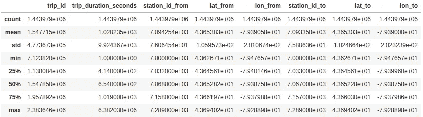

# 使用 Python 探索多伦多自行车共享出行

> 原文：<https://towardsdatascience.com/exploring-toronto-bike-share-ridership-using-python-3dc87d35cb62?source=collection_archive---------9----------------------->

在过去的几年里，自行车共享已经成为一种越来越有吸引力的城市出行方式。考虑到我家附近自行车被盗的数量、Bike Share 站点覆盖范围的迅速扩大以及 TTC 票价的上涨，今年 3 月我很容易就决定续签第三年的会员资格。

美国人也在做出类似的决定:[2017 年，美国的自行车爱好者通过自行车共享计划进行了 3500 万次出行，比 2016 年增长了 25%](https://www.wired.com/story/americans-falling-in-love-bike-share/)。与此同时，自行车共享多伦多见证了同一时期[81%的乘客量增长。](https://www.toronto.ca/legdocs/mmis/2018/pa/bgrd/backgroundfile-121986.pdf)

我想探索自行车共享乘客数据集，以更好地了解多伦多人如何使用自行车共享，并展示一些可用于探索由[开放数据计划](https://www.toronto.ca/city-government/data-research-maps/open-data/)发布的其他 294 个(还在统计中)数据集的技术。

# 关于数据

Bike Share 使用第三方机构提供的系统收集数据。由于 2016 年提供商变更，历史乘客数据的可用性有限。我决定专注于 2017 年的数据。数据可以从[开放数据目录](https://www.toronto.ca/city-government/data-research-maps/open-data/open-data-catalogue/#343faeaa-c920-57d6-6a75-969181b6cbde)或新的[门户](https://portal0.cf.opendata.inter.sandbox-toronto.ca/dataset/bike-share-toronto-ridership-data/)(今年晚些时候取代目录的新网站)中检索。

如果你愿意跟随我的步骤，我使用的笔记本也可以在 [GitHub](https://github.com/open-data-toronto/story-bike-share-ridership) 上找到。

该数据是一个包含多个 CSV 的 ZIP 文件，按季度分隔年度数据。对 Q1 数据的初步检查显示，数据中的每个记录代表一次独特的旅行，并包含以下各列:

*   **trip_id** :每次行程的唯一标识符
*   **行程开始时间**:行程开始的时间
*   **行程停止时间**:行程结束的时间
*   **trip_duration_seconds** :以秒为单位测量的行程持续时间
*   **from_station_id** :旅程开始的车站 id
*   **from_station_name** :行程开始的车站名称
*   **to_station_id** :行程结束的站点 id
*   **to_station_name** :行程结束的车站名称
*   **user_type** :识别用户是会员还是购买了通行证

但是，进一步研究其他文件中的数据会发现一些问题:

1.  文件之间的日期时间格式有所不同(例如，2017 年 12 月 31 日 12:30 与 2017 年 12 月 30 日 12:30:00)
2.  只有 Q1 和 Q2 的数据包含站点 id
3.  车站名称不一致(例如*湖岸*大道与*湖岸*大道)
4.  起点站和终点站相同的行程，表明潜在的数据收集错误

不理想，但在典型的数据分析项目中也相当常见。在任何分析中，数据清理占用高达 80%的时间并不罕见。来自真实世界的数据通常是杂乱的，在进行任何分析或建模之前，必须对其进行清理。虽然数据清理既繁琐又耗时，但它也会对最终结果产生重大影响。

为了这个分析，我创建了一个包含 Jupyter 笔记本的新目录和一个包含我使用的所有数据的数据文件夹。

# 数据清理

该步骤的目标是将来自多个来源的数据整合到一个单一的 *pandas* 数据框架中，该框架包含标准化的日期和站点信息，并且剔除了异常值。参见[这篇文章](/the-art-of-cleaning-your-data-b713dbd49726)了解更多其他情况下常见数据清理步骤的深入分析。

Bike Share 公开了[包含服务信息的 API 端点](https://tor.publicbikesystem.net/ube/gbfs/v1/)。station_information 端点可用作事实的来源，以解决桩号 id 和名称之间的不一致，还可以使用每个桩号的附加地理空间信息来增强数据。

# 标准化

首先，我导入了所需的库，并从自行车共享 API 端点加载了站点数据:

接下来，我手工确定了每个文件中使用的日期结构，并使用确定的结构将乘客数据连接成一个数据帧。

此外，来自 Q1 和 Q2 的数据位于 UTC 时区(提前 4 小时)，而来自 Q3 和 Q4 的数据位于东部时区。这一点并不明显，我只是在后来可视化数据时才意识到这个问题。数据清理是一个迭代的过程，几乎不可能一次就发现所有的问题。

接下来，我需要解决站点 id 和名称的问题。为了提高效率，我提取了电台 ID 和电台名称的唯一组合。

具有 id 的站可以很容易地从 API 数据更新，但是没有 id 的站需要稍微复杂一点的解决方案。模糊匹配是一种用于识别相似事物的技术(例如央街*圣* vs 央街*街*)。Python 中有很多模糊匹配字符串的方法，我选择了使用 [*fuzzywuzzy*](https://github.com/seatgeek/fuzzywuzzy) 库。

最后，我连接了站点数据，将其与 API 数据合并以包含站点的位置坐标，并用正确的站点 id 和名称更新了数据帧。

与多伦多停车管理局(TPA )(负责管理自行车共享的城市部门)的对话显示，车站 id 与物理终端而不是位置相对应。如果终端移动，API 将只显示新的坐标。因此，通过与车站 id 上的 API 数据合并，存在一些起点或终点位置不正确的行程。

# 极端值

在移除异常值之前，我使用了`describe()`函数来查看数据帧中数据的简单轮廓(为了更清晰地查看，我排除了所有 ID 列):

考虑到 Bike Share 的定价模式，我预计大部分行程不到 30 分钟。但是数据显示旅行持续时间从 1 到 6，382，030 秒不等(约 74 天)，表明数据中有异常值。

在他们自己分析中，TPA 通常认为少于一分钟的行程是错误的行程。我去掉了这 29595 次出行，约占总出行的 2%。

从数据中剔除异常值的常用统计方法是考虑四分位距(IQR)，即数据的中间 50%。异常值定义为距离中值 1.5*IQR 的数据点。我用这种方法去除了一些异常值。参见[这篇文章](/ways-to-detect-and-remove-the-outliers-404d16608dba)中一个很好的分步示例。

最后，我保存了清理后的数据以备后用。

# 研究问题定义

在开始分析之前，我们应该在分析结束时定义我们想要回答的问题(否则我经常会创建一个又一个没有得出特定结论的图表)。我们采用了一种相当非正式的方法进行分析:

1.  集思广益，讨论各种与城市自行车共享和骑自行车相关的问题
2.  确定这些问题是否可以用现有数据来回答，或者是否需要其他外部数据集
3.  删除了由于数据访问受限而无法回答的问题(例如，由于隐私原因删除了用户信息)
4.  将遗留的问题分成几个主题

A sample of the questions identified relating to Bike Share and biking in Toronto

我们确定的最终主要类别是:

*   谁在使用自行车共享服务？会员和临时用户的行为有明显的区别吗？如果有，这些区别是什么？
*   **什么时候**人们开始使用自行车共享？一年中、一周中和一天中的使用情况如何变化？
*   **自行车共享的使用情况如何？人们主要使用自行车共享作为通勤上班或探索城市的方式吗？天气如何改变人们使用自行车共享的方式？**

# 分析和可视化

就个人而言，我更喜欢创建一个新的 Jupyter 笔记本，仅用于分析。在新的笔记本中，我首先导入库和清理的数据，然后为一周中的某一天(星期一、星期二等)创建新的 *pandas* Categorical 数据类型。)和月份名称，以确保固定的排序顺序(在可视化数据时很有用)。

接下来，我转换了数据，使以后的分析和可视化更加容易。这些转变包括:

*   为清晰起见，重命名了字段
*   从旅行开始时间解析出季度、月份、日期、星期几和小时
*   以“起点站 id-终点站 ID”的格式为每个行程生成新的 route_id，以标识行程的路线

接下来，我还计算了起点站和终点站之间的距离。这增加了另一个维度，以后可能会有帮助。

# 谁在使用自行车共享？

回答“谁”这个问题的一个常用方法是研究人口统计学。最初，根据车站位置估计人口似乎是有希望的。例如，我们可能期望位于年轻人口居住区的电视台更受欢迎。

然而，大多数车站位于地铁/有轨电车线路附近，并且位于市中心。因此，结果可能偏向不同于用户真实代表的特定人口统计。请随意使用[邻域概况](https://www.toronto.ca/city-government/data-research-maps/open-data/open-data-catalogue/#8c732154-5012-9afe-d0cd-ba3ffc813d5a)数据集对此进行探索。

因为我不能可靠地推断出任何用户信息，所以我只能使用用户类型(会员和临时会员)。我深入研究了用户类型，并可视化了行程持续时间和距离的分布。

该图显示了会员和临时用户之间行为的明显差异:虽然两个群体通常在相似的距离内旅行，但会员到达目的地的速度要快得多。

在接下来的章节中，我通过查看这些用户使用自行车共享的时间和方式，进一步分析了他们之间的行为差异。

# 什么时候使用自行车共享？

我按照用户类型和旅行日期汇总了数据，并计算了每天的旅行次数。

然后，我设想了 2017 年的乘客趋势。

虽然图表显示了一些预期的趋势(例如，在温暖的月份有更多的乘客)，但也出现了一些不太预期的模式:

*   会员和临时用户之间的旺季转移
*   在小时间范围内持续上升和下降

我放大并可视化了几个月的数据，以便在更精细的层次上获得更好的视图。

虽然 7 月份的趋势更加明显，但图表显示每周的乘客量会增加和减少。为了进一步梳理这个循环，我可视化了每个工作日的平均每日出行量，并按照季度和用户类型来分离数据。

这些图表进一步讲述了不同用户类型如何骑车的故事:会员主要在工作日骑车，而临时用户主要在周末骑车。唯一的例外是第三季度，周三的休闲旅行显著增加。深入研究这几个月的数据显示，这实际上只发生在 7 月。

谷歌快速搜索显示，这是因为 [Bike Share 在 2017 年 7 月](https://bikesharetoronto.com/news/mayor-john-tory-bike-share-toronto-roll-free-ride-wednesdays-july/)周三提供免费服务。

最后，我还想看看一天中每小时的乘客趋势。

此外，该图显示了会员和临时用户之间行为的明显差异:会员在早上 8 点和下午 5 点左右经历高峰时间，而临时用户在一天中更加稳定。

这与之前的发现(会员主要在工作日使用自行车共享)相结合，表明会员通常使用自行车共享作为通勤方式，而临时用户则使用自行车共享进行休闲旅行。

# 自行车共享是如何使用的？

前面部分的分析已经回答了我提出的一些关于如何使用自行车共享的问题(如会员通勤)。相反，我决定把重点放在天气和乘客量之间的关系上。

我从加拿大的[政府气象站获取了每日的温度和降水数据，从多伦多城市气象站获取了数据](http://climate.weather.gc.ca/historical_data/search_historic_data_e.html)。

首先，我将乘客数据与天气数据合并，并创建了一个 pairplot，以便在较高的层面上理解变量之间的关系。此外，我创建了一个热图来可视化变量之间的皮尔逊相关系数。

虽然我最初对降雨量和乘车量之间的低相关性感到惊讶，但这个结果是有意义的。该数据仅提供特定气象站位置每天的总降雨量。然而，一整天的降雨量很少是一致的，在所有自行车共享站的位置上也很少是均匀的。由于乘客量随小时而变化，我需要多个气象站每小时的降雨量数据，以了解这些变量之间的关系。

使用[雨量计数据](https://www.toronto.ca/city-government/data-research-maps/open-data/open-data-catalogue/#09dee024-b840-174f-7270-29c1a1773d14)随意探索这个话题，对于这个分析的其余部分，我将重点放在温度上。我将不同时间的客流量和温度可视化为会员和临时用户的双轴图。

事实上，在温暖的月份里，人们越来越多地骑自行车，这有点“废话”所以我想更进一步，找到人们决定是否骑自行车的转折点。我决定只关注临时用户，因为他们与温度的相关性更高，但是同样的想法也适用于这两种用户类型。

我在试图定义这一点时遇到了一些困难。直觉上，似乎必须有一种方法来从数学上确定这一点，然而，许多行业只是根据长期的经验观察来确定这一点。最后，我的一个同事找到了[这篇文章](https://raghavan.usc.edu//papers/kneedle-simplex11.pdf)，它提出了一种基于曲线的通用方法。原来已经有一个 Python 库在使用这个应用程序: [*kneed*](https://github.com/arvkevi/kneed) 。

*kneed* 库要求在确定点之前对数据进行曲线拟合。给定数据后，我将数据拟合为线性函数、Y 轴无偏移的指数函数和指数函数，然后评估结果。

只有没有偏移的指数增长导致了可以确定拐点的曲线(其他两条曲线太线性)。结果显示该点在 16.1℃

我可以通过使用百分比累积行程(即计算 *x* 百分比的行程发生在 *y* C)下，其中曲线拟合函数将是一个最大极限为 100%的逻辑增长。该方法显示的温度为 16.0℃

利用类似的概念，我想找到一个点，在这个点上，乘客数量会随着温度的升高而停止增长。直觉上，一旦温度“足够高”，用户不再关心温度是有意义的(例如，22℃和 23℃之间的差异不会成为用户决定是否骑自行车的决定性因素)。为了找到这一点，我简单地将相同的计算应用于大于初始点的曲线部分，我发现这第二个点是 21.6 C。

我有兴趣将这一概念用于一个更温暖的城市的数据，那里的日平均温度可能达到 30+ C，看看在什么温度下热量会抑制乘车。

# 结论和下一步措施

虽然这个数据集本身相当简单，只包含几列基本信息，但我能够通过将数据与其他公共数据集合并来确定一些细微的见解。

在我们与 TPA 的交谈中，他们提到，尽管他们努力将自行车共享作为旅行“第一英里和最后一英里”的方法，但公众通常将自行车共享视为促进多伦多旅游业的一项计划。该分析中确定的行为表明，大多数自行车共享用户实际上是经常骑自行车的通勤者。

虽然用户信息不公开，无法进行用户行为分析，但深入研究自行车共享计划的地理空间方面是值得的。例如，将 TTC/GO 站(或其他公共中心)的数量与自行车共享站的受欢迎程度联系起来，或者进一步考虑站点之间自行车道的路线和可用性。

我希望这个数据故事提供了使用 Python 进行数据分析的介绍，并确定了您在进行分析时可能要考虑的一些工具。如果您有任何问题，请随时通过 opendata@toronto.ca 联系开放数据团队，我鼓励您使用开放数据进行自己的分析。