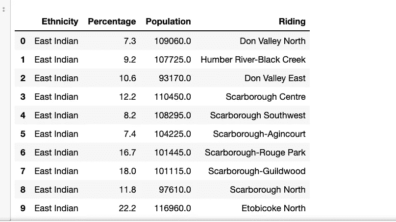
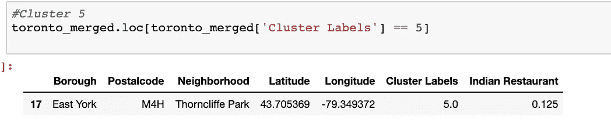

# 探索多伦多街区-开一家印度餐馆

> 原文：<https://towardsdatascience.com/exploring-toronto-neighborhoods-to-open-an-indian-restaurant-ff4dd6bf8c8a?source=collection_archive---------16----------------------->

## 网络抓取、Foursquare API、叶子地图和机器学习

Toronto, City in Ontario, Canada

作为 IBM 数据科学专业计划 Capstone 项目的一部分，我们使用真实数据集来体验数据科学家在现实生活中的经历。这个项目的主要目标是定义一个商业问题，在网上寻找数据，并使用 Foursquare 位置数据来比较多伦多的不同社区，以找出哪个社区适合开办新的餐馆业务。在这个项目中，我们将一步一步地完成从问题设计、数据准备到最终分析的所有过程，并最终提供一个商业利益相关者可以用来做决策的结论。

# 1.业务问题描述和背景讨论(介绍部分):

## 问题陈述:在加拿大多伦多开一家印度餐馆的前景。

多伦多，安大略省的省会，是加拿大人口最多的城市。它的多样性反映在多伦多的种族社区，如唐人街，Corso Italia，Greektown，Kensington Market，Koreatown，Little India，Little Italy，Little Jamaica，Little Portugal & Roncesvalles。多伦多是北美对移民最友好的城市之一，超过一半的印裔加拿大人居住在这里，这里是开印度餐馆的最佳地点之一。

在这个项目中，我们将通过一步一步的过程来决定开一家印度餐馆是否是一个好主意。我们分析了多伦多的社区，以确定最赚钱的地区，因为餐厅的成功取决于人和氛围。因为我们已经知道多伦多比加拿大任何其他城市都容纳了更多的印度人，所以在这里开餐馆是个好主意，但我们需要确定这是否有利可图。如果是这样，我们可以把它放在哪里，这样它会给所有者带来更多的利润。

Source: Bethesda Indian Food Festival

## 目标受众

谁会对这个项目更感兴趣？什么样的客户或群体会受益？

1.  想在多伦多投资或开印度餐馆的商务人员。这一分析将成为针对印度人群开办或扩大餐馆的全面指南。
2.  喜欢把自己的餐馆作为副业的自由职业者。这个分析会给出一个思路，开一个餐厅有多大的好处，这个生意有哪些利弊。
3.  想要寻找有很多印度餐馆的街区的印度人。
4.  业务分析师或数据科学家，他们希望使用探索性数据分析和其他统计和机器学习技术来分析多伦多的街区，以获得所有必要的数据，对其执行一些操作，并最终能够讲述一个故事。

# 2.数据采集和清理:

## 2.1 数据来源

a)我正在使用“加拿大邮政编码列表:M”([https://en . Wikipedia . org/wiki/List _ of _ Postal _ codes _ of _ Canada:_ M](https://en.wikipedia.org/wiki/List_of_postal_codes_of_Canada:_M))wiki 页面来获取多伦多现有街区的所有信息。这一页有邮政编码，borough &是多伦多所有街区的名称。

b)然后我使用“【https://cocl.us/Geospatial_data"】CSV”文件来获取所有街区的地理坐标。

c)为了获得按种族划分的人口分布信息，我使用了“多伦多人口统计”([https://en . m . Wikipedia . org/wiki/Demographics _ of _ Toronto # Ethnic _ diversity](https://en.m.wikipedia.org/wiki/Demographics_of_Toronto#Ethnic_diversity))维基页面。使用此页面，我将确定印度人密集的社区，因为这可能有助于确定合适的社区来开设一家新的印度餐馆。

d)我使用 Foursquare 的 explore API 来获取多伦多各个场馆的位置和其他信息。使用 Foursquare 的 explore API(提供场馆推荐)，我获取了多伦多现有场馆的详细信息，并收集了它们的名称、类别和位置(纬度和经度)。

从 four square API([https://developer.foursquare.com/docs)](https://developer.foursquare.com/docs))，我为每个场馆检索了以下内容:

*   名称:场地名称。
*   类别:由 API 定义的类别类型。
*   纬度:场地的纬度值。
*   经度:场地的经度值。

## 2.2 数据清理

**a)从维基百科抓取多伦多邻居表**

抓取了下面的 Wikipedia 页面，“加拿大邮政编码列表:M ”，以获得多伦多&及其邻近地区的数据。

为获得以下数据框架所做的假设:

*   数据帧将由三列组成:邮政编码、区和邻居
*   只会处理具有指定区的像元。未分配的行政区将被忽略。
*   一个邮政编码区可以有多个邻居。例如，在维基百科页面的表格中，您会注意到 M5A 被列出了两次，并且有两个街区:Harbourfront 和 Regent Park。这两行将合并成一行，相邻行用逗号分隔，如上表中的第 11 行所示。
*   如果像元有一个区，但没有分配邻域，那么邻域将与区相同。

Wikipedia —包用于从 wiki 中抓取数据。

Dataframe formed from the scraped wiki page

经过一些清理，我们得到了带有邮政编码、行政区和社区信息的正确数据帧。

Dataframe from ‘*List of Postal code of Canada: M’* Wikipedia Table.

**b)向邻居添加地理坐标**

下一个重要步骤是将地理坐标添加到这些社区中。为此，我提取了地理空间数据 csv 文件中的数据，并根据邮政编码将它们与现有的邻域数据帧合并。

DataFrame with latitude & longitude of Postal codes in Toronto

我将对这些列进行重命名，以匹配现有的由加拿大邮政编码列表组成的数据框架。之后，我通过合并邮政编码将两个数据帧合并成一个。

Merged new dataframe with info about Neighborhoods, borough, postalcode, latitude & longitude in Toronto

**c)从维基百科中删除人口分布**

另一个可以帮助我们决定哪个社区是开餐馆的最佳选择的因素是，每个社区基于种族多样性的人口分布。因为这有助于我们识别印度人聚居的街区，因为那是开印度餐馆的理想地点。

抓取了下面的维基百科页面，“多伦多人口统计”，以获得关于多伦多及其邻近地区的数据。与下面多伦多的所有街区相比，给定的街区只有相当数量的印度人。我们正在检查这些社区的人口，以确定印度人口密集的社区。

Scraping the wiki page

多伦多只有六个街区有印度人居住，所以我们收集了这些街区的人口比例。

*TORONTO & EAST YORK population distribution by ethnicity*

NORTH YORK population distribution by ethnicity

SCARBOROUGH population distribution by ethnicity

ETOBICOKE & YORK population distribution by ethnicity

**d)使用 Foursquare 获取位置数据**

Foursquare API 是一个非常有用的在线应用程序，被我的许多开发者和其他应用程序如优步等使用。在这个项目中，我用它来检索多伦多附近地区的信息。API 返回一个 JSON 文件，我们需要将它转换成数据帧。在这里，我为半径 1 公里内的每个社区选择了 100 个热门景点。

Dataframe with venues in each neighborhood along with the category info of the venues.

# 3.探索性数据分析:

## 3.1 叶片库和叶片图

Folium 是一个 python 库，我用它来绘制一个使用坐标数据的交互式传单地图。

code to draw the folium map

Folium map of Toronto Neighborhood with popup label

## 3.2 邻里和印度餐厅的关系

首先，我们将从上面的多伦多数据框架中提取邻居和印度餐馆列，以供进一步分析:

Dataframe formed using Foursquare api information about venues in each neighborhoods

代码片段

Manipulating the data to make the analysis easy

在为场馆类别执行了 [pandas one hot encoding](https://pandas.pydata.org/pandas-docs/stable/reference/api/pandas.get_dummies.html) 之后，让我们将这个数据帧与多伦多数据帧合并，该数据帧带有附近地区的纬度&经度信息。最后，只提取印度餐馆的值和街区信息。

Toronto Dataframe for Indian restaurants count in each neighborhood

让我们试着用上面的数据框画一些图:

Figure: Violin plot

借助这张小提琴图，我们可以识别出印度餐馆密集的行政区。它是使用 seaborn library 绘制的，显示了印度餐馆在不同行政区的分布。

让我们想象一下有印度餐馆的街区:

Figure : Bar plot

## 3.3 邻里和印第安人的关系

另一个重要特征是印度人在每个社区的分布。让我们分析一下这些街区，找出印度人口最多的街区。

为了实现这一点，我们将使用 wiki 页面的所有社区数据框架与少数民族人口连接起来，并且我们只提取每个社区的印度人口。

Dataframe with neighborhoods & their population distribution

Extracted dataframe with just Indian population information

让我们画一张图来直观地显示社区中的人口分布:

Bar graph to show the population in each ridings in Toronto

这种对邻里之间的关系以及这些邻里中的印度人口的分析和可视化有助于我们识别人口高度密集的印度邻里。一旦我们确定了这些社区，它就能帮助我们决定在哪里开新的印度餐馆。位于人口稠密的印度社区的印度餐馆比位于印度人口较少或没有印度人口的社区的餐馆更有可能吸引更多的印度顾客。因此，这种分析有助于确定新印度餐馆的成功。

## 3.4 印度人口与印度餐馆的关系

在进行数据清理和数据分析后，我们无法确定人口密集的印度社区和印度餐馆数量之间的关系。这可能是因为数据中的缺失，因为这是一个可以在未来的分析中改进的领域，以便更深入地了解业务问题。

Dataframe of densely populated neighborhoods with number of Indian restaurants

# 4.预测建模:

## 4.1 多伦多的聚集街区:

K 均值聚类的第一步是确定最佳 K 值，即给定数据集中的聚类数。为此，我们将对具有印度餐馆百分比的多伦多数据集使用肘方法。

Elbow method to identify best k value

代码片段—

Elbow visualizer to identify the K value

***用肘法分析后用失真评分&对每个 K 值的平方误差，看起来 K = 6 是最佳值。***

**使用 K =6 的 K-Means 聚类多伦多邻域**

6 clusters & its labels

code snippet for clustering the Toronto dataframe

Dataframe with cluster labels for neighborhood

Folium map for the clusters of different neighborhoods

## 4.2 检查集群:

我们总共有 6 个集群，如 0，1，2，3，4，5。让我们一个接一个地检查。

聚类 0 包含印度餐馆数量最少的所有邻域。它在地图中以红色显示

聚类 1 包含人口稀少的印度餐馆。它在地图上以紫色显示。

聚类 2 & 4 没有行，这意味着在这些质心附近没有数据点或邻域。

聚类 3 包含所有中等印度餐馆数量的邻近地区。它在地图中以蓝色显示。

聚类 5 包含印度餐馆密集分布的所有邻近地区。它在地图中以橙色显示

# 5.结果和讨论:

## 5.1 结果

我们已经到达了分析的末尾，在这一节中，我们将记录上述数据集的聚类和可视化的所有发现。在这个项目中，我们从寻找一个好的社区来开一家新的印度餐馆的商业问题开始。为了实现这个目标，我们调查了多伦多的所有街区，分析了每个街区的印度人口&这些街区的印度餐馆数量，以得出哪个街区更好的结论。我们使用了各种数据源来建立一个非常现实的数据分析场景。我们发现—

*   在这 11 个行政区中，借助于多伦多行政区印度餐馆数量之间的小提琴图，我们发现只有多伦多市中心、多伦多市中心、东多伦多、东约克、北约克和斯卡伯勒行政区有大量的印度餐馆。
*   在所有骑马区中，斯卡伯勒-吉尔伍德、斯卡伯勒-鲁日公园、斯卡伯勒中心、斯卡伯勒北部、亨伯河-布莱克克里克、东河谷、斯卡伯勒西南部、东河谷和斯卡伯勒-阿金库尔是印第安人骑马区的密集区。
*   借助集群检查&小提琴阴谋看起来像多伦多市中心，多伦多市中心，东纽约已经密集的印度餐馆。因此，最好不要考虑这些行政区，而只考虑新餐馆的地点——斯卡伯勒、东多伦多和北约克。
*   经过仔细考虑，在斯卡伯勒开一家新的印度餐馆是一个好主意，因为那里有大量的印度人口，这给了更多的顾客可能性和更低的竞争，因为附近的印度餐馆很少。

## 5.2 讨论

根据这一分析，斯卡伯勒将为即将开业的新印度餐馆提供最少的竞争，因为很少有印度餐馆或在几个社区没有印度餐馆。此外，从人口分布来看，这里似乎是印度人的聚居地，这有助于新餐厅提高顾客到访的可能性。所以，毫无疑问，这个地区可能是开办优质印度餐馆的绝佳地点。这种分析的一些缺点是-聚类完全只基于从 Foursquare API 获得的数据，关于每个街区的印度人口分布的数据也是基于 2016 年的人口普查，而不是最新的。因此，人口分布数据有 3 年的巨大差距。尽管有很多地方可以改进，但这一分析无疑为我们提供了一些很好的见解，关于可能性的初步信息&通过正确地设置垫脚石来开始这个业务问题。

# 6.结论:

最后，为了结束这个项目，我们有机会讨论一个商业问题，比如一个真正的数据科学家会怎么做。我们使用了许多 python 库来获取数据、操作内容&分析和可视化这些数据集。我们利用 Foursquare API 探索多伦多附近的场馆，然后从维基百科获得大量数据，这些数据是我们在维基百科 python 库的帮助下收集的，并使用 seaborn & matplotlib 中的各种情节进行了可视化。我们还应用机器学习技术来预测给定数据的输出，并使用 follow 将其可视化在地图上。

一些缺点或改进领域向我们表明，这种分析可以在更多数据和不同机器学习技术的帮助下进一步改进。同样，我们可以使用这个项目来分析任何场景，如开设一个不同的美食餐厅或开设一个新的健身房等。希望这个项目有助于作为使用数据科学应对更复杂的现实生活挑战的初始指导。

在 [github](https://github.com/kruthika86/Coursera_Capstone/blob/master/ExploringTorontoNeighborhoods.ipynb) 中找到代码，但是使用 [nbviewer 和 github url](https://nbviewer.jupyter.org/github/kruthika86/Coursera_Capstone/blob/master/ExploringTorontoNeighborhoods.ipynb) 查看。

在 [LinkedIn](https://www.linkedin.com/in/kruthikanarendran/) 找我！