# 使用 Golang 探索多伦多选民统计

> 原文：<https://towardsdatascience.com/exploring-toronto-voter-statistics-using-golang-33077b6db123?source=collection_archive---------27----------------------->

十月标志着加拿大联邦选举活动的正式开始。因此，我对探索由[多伦多开放数据](https://open.toronto.ca/)发布的[多伦多选民统计](https://open.toronto.ca/dataset/elections-voter-statistics/)数据集很感兴趣。虽然数据是从多伦多市政选举中收集的，但它似乎是一个有趣的数据集，可以提供一些关于多伦多人如何投票的见解。

选民投票率低被认为是特朗普赢得 2016 年美国总统大选的主要原因之一。虽然加拿大自己的 2015 年联邦选举出现了几十年来最高的投票率，全国平均投票率为 68.49%，但我很好奇这一趋势是否也反映在加拿大最大的直辖市的地方层面。

与我之前研究过的多伦多自行车共享出行数据集不同，这个数据集结构良好，易于使用。我没有像往常一样使用 Python，而是决定利用这个数据集来探索 Go 的数据处理和可视化能力。

围棋进入我的视野已经有一段时间了。尽管 Go 并不以其与数据相关的功能而闻名，但诸如 [gophernotes](https://github.com/gopherdata/gophernotes) 和 [gonum](https://github.com/gonum/gonum) 之类的软件包正在使与数据相关的工作变得更加平易近人。此外，像[这样的帖子](https://blog.chewxy.com/2017/11/02/go-for-data-science/)正在令人信服地论证为什么对于数据密集型应用程序，Go 可能是比 Python 更好的选择。

# 关于数据

提供了 2003-2018 年过去 5 次选举的数据。但是，由于 2018 年的病房数量从 [44 个变成了 25 个](https://www.thestar.com/news/toronto-election/2018/09/21/what-you-need-to-know-about-torontos-25-new-wards.html)，我决定把事情简单化，只关注 2018 年选举的数据。

所提供的数据由选区和投票站汇总，并提供以下信息:

*   选区和投票站号码
*   投票站地点名称和地址
*   选民名单上的选民人数、选民名单的修改以及最终合格选民的人数
*   投票的选民人数
*   学校支持的选民人数
*   被拒绝和拒绝的选票计数

我感兴趣的是根据投票站地址对数据进行地理编码，并将历史投票数据映射到包含 25 个选区的新地图上。这将使我能够跟踪这些年来投票趋势的变化。目前，我认为这已经超出了探究 Go 的范围。

如果你愿意跟随，我使用的数据和笔记本可以在 GitHub 上的[这里](https://github.com/open-data-toronto/story-election-voter-statistics)找到。

# 准备

在深入分析之前，我确定了一些我有兴趣回答的研究问题:

1.  道岔按病区分布是怎样的？在比较高投票率病房和低投票率病房时有什么模式吗？
2.  病房的变化对道岔有什么影响？
3.  这些年来，登记选民和投票人数有什么变化？
4.  进入投票站的便利性对投票率有影响吗？
5.  投票站的投票率高低有什么规律吗？

问题 2、3 和 4 需要与之前的选举年份进行比较或进行地理编码，因此不在本次分析的范围之内。

我定义了一些函数，将在后面的分析中使用:

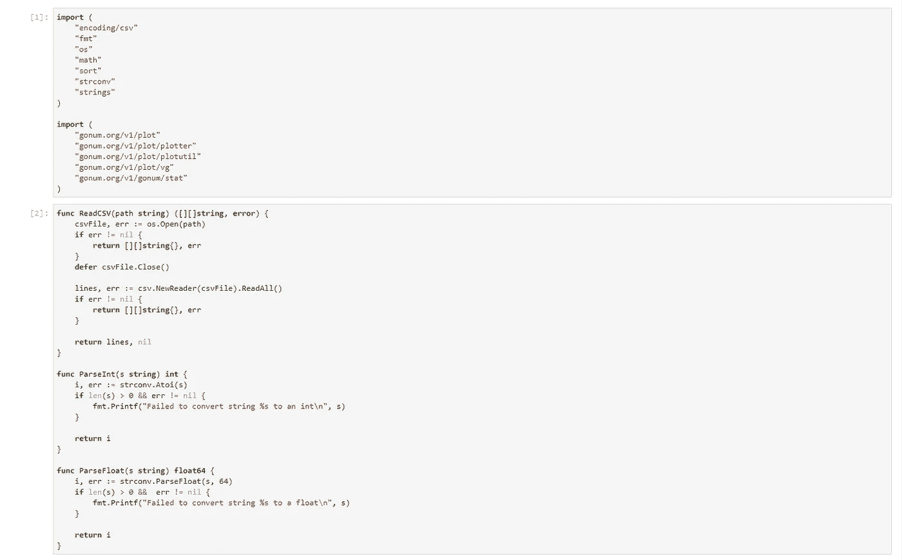

数据本身的结构相当好，数据清理很少。混合在数据(按选区和投票站汇总)中的还有按选区汇总的数据行。我删除了这些行，因为以后可以很容易地计算它们。

原始数据以 Excel 表格的形式提供，为了便于导入，我手动将其转换为 CSV 格式。然后，我通过以下方式将数据读入内存:

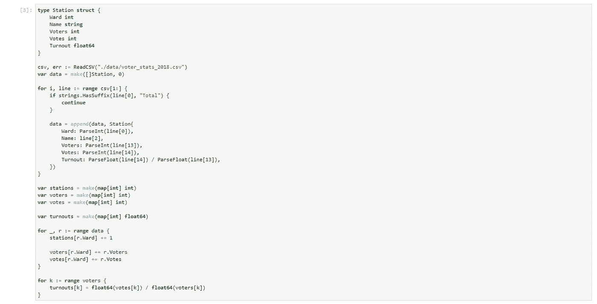

# 道岔分布

gonum 绘图库使可视化变得相当简单。我把病房和道岔想象成:

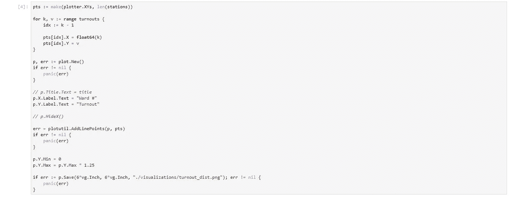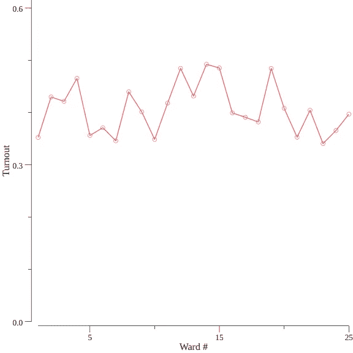

有几件事引起了我的注意。首先，2018 年多伦多市政选举的投票率比 2015 年的联邦选举少得多**。所有 25 个选区的平均投票率为 40.67%，比 2016 年的联邦投票率低约 28%。**

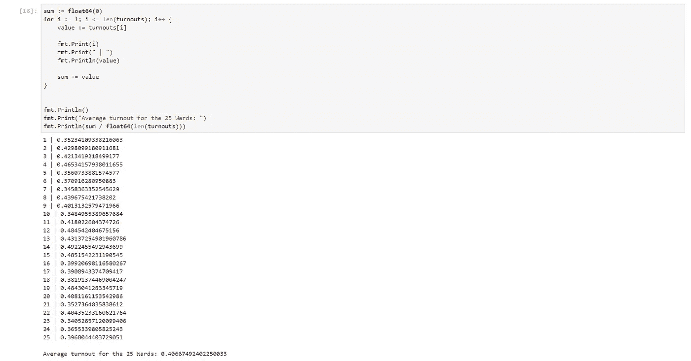

最高和最低失误率的病房之间也有很大的差异。14 区投票率最高，为 49.22%，23 区投票率最低，为 34.05%。

快速的视觉比较显示，客流量最大的 5 个病房(14、15、12、19 和 4 号病房)都位于市中心附近。人数最少的 5 个区(23 区、7 区、10 区、1 区和 21 区)大多位于郊区，10 区是个例外。

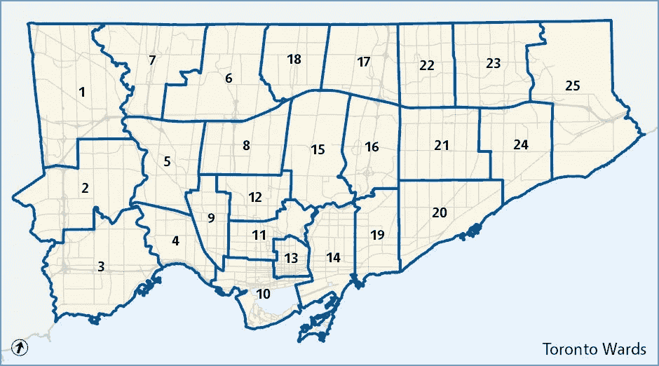

[https://www.toronto.ca/city-government/data-research-maps/neighbourhoods-communities/ward-profiles/](https://www.toronto.ca/city-government/data-research-maps/neighbourhoods-communities/ward-profiles/)

在地图上进行视觉对比感觉不太靠谱，所以我从[选区概况](https://open.toronto.ca/dataset/ward-profiles-2018-25-ward-model/)数据集中提取了一部分数据进行更系统的分析，并重点研究了教育和收入对选民投票率的影响。我使用的提取数据文件在 GitHub 上也有。

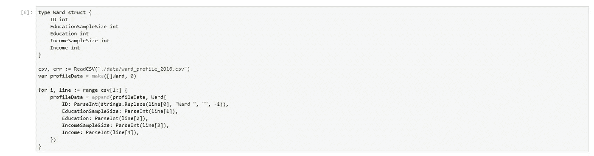

该数据集按选区显示了最新的人口普查数据。由于人口普查数据是在 2016 年收集的，我假设在 2016 年和选举之间没有发生重大的人口统计变化。我特别关注两个因素:

1.  受过大专或高等教育的人口百分比
2.  总收入高于 80，000 美元的家庭人口百分比(2016 年家庭收入中位数为[78，373 美元](https://www12.statcan.gc.ca/census-recensement/2016/dp-pd/hlt-fst/inc-rev/Table.cfm?Lang=Eng&T=102&PR=0&D1=1&RPP=25&SR=1&S=104&O=D))

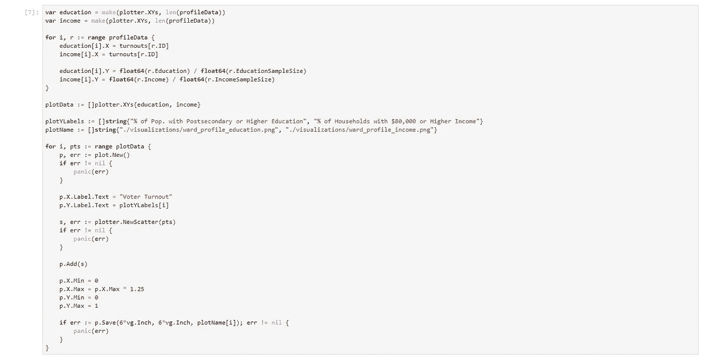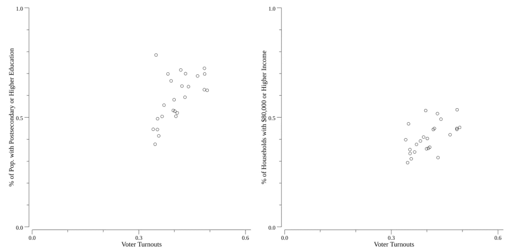

教育和收入的皮尔逊相关系数分别为 0.57 和 0.55。基于此，似乎可以公平地说，教育和收入对投票率都有积极影响。虽然相关值较低，但这很可能是由于其他因素也影响了选民投票的可能性。

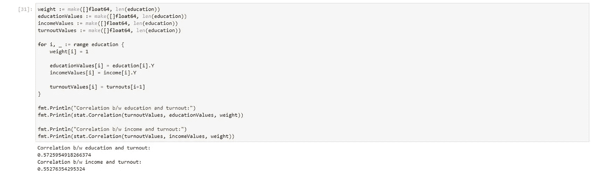

第 10 选区的投票率为 34.85%，在选区地图的初步审查和人口普查数据分析中都很突出。这个区不仅位于市中心(这里的投票率通常很高)，住在这个区的 78%的人都受过高等教育。我有兴趣在未来的分析中将年龄作为一个额外的因素，看看它是否可能导致 10 区异常低的投票率。

# 投票站趋势

接下来，我通过将每个车站的道岔可视化为盒须图来进一步分解道岔。

提前投票站没有固定的合格选民数量，我从这个可视化中删除了这些投票站。

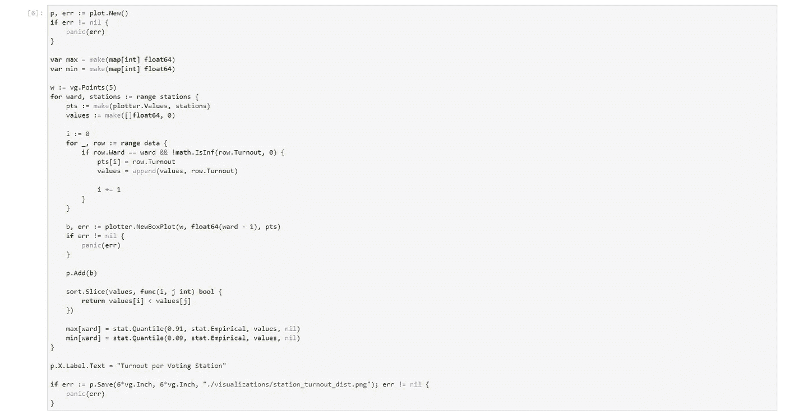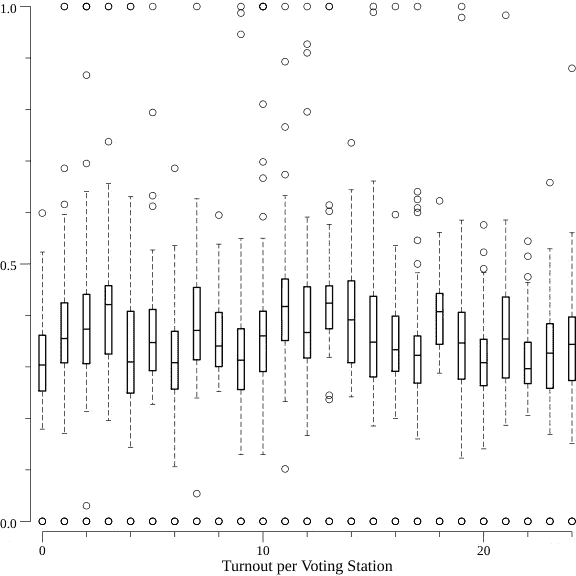

我很惊讶地看到有 100%和 0%的投票率的车站。我回顾了这些数据，试图理解这些异常值发生在哪里。

虽然投票率为 0%的车站没有明显的趋势，但我注意到投票率为 100%的车站中有许多是长期护理机构(即养老院、退伍军人护理场所等。).我为这些设施确定了一个关键词列表，并计算了名称中包含这些关键词的异常站点的数量。

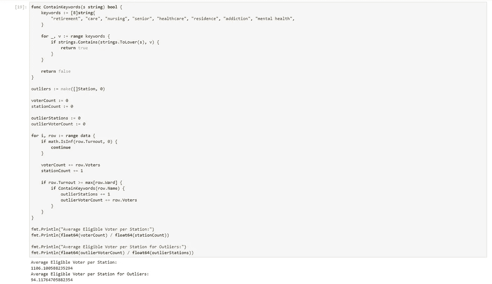

我没有只关注 100%道岔的车站，而是检查了所有道岔大于或等于其选区第 91 百分位的车站。在这 164 个投票站中，只有 34 个投票站包含其中一个关键字。这些只是所有异常值站的一小部分。

接下来，我计算了一下，每个投票站平均预计大约有 1106 名投票人。但是这些投票率很高(> 91%)的投票站预计只有大约 94 名选民。由于这些投票站预计只有少数选民，因此在这些地点很容易达到高投票率。这可能是这些投票站投票率通常很高的原因，而不是这些投票站选民人口统计数据的差异。

# 关于围棋的思考

我立即注意到了 Go 的两件大事:

1.  它是冗长的。我总是需要明确地说明预期的内容，无论是定义来自 CSV 的数据的预期输入，还是如何将数字字符解析为数值类型
2.  数据的预建函数较少。熊猫和 numpy 可能用简单的数据操作宠坏了我。尽管 gonum plot 函数简单易用，但在 Go 中创建可视化效果也比 Python 受限得多(例如，在创建条形图时，我需要明确说明每个条形之间的距离，以避免条形重叠)。

这两件事都导致了花在代码上的时间更长。我已经习惯了这样的工作流程，我可以将数据直接加载到内存中(作为一个熊猫数据帧)，浏览数据，然后决定下一步。但是，使用 Go 时，工作流程会发生逆转。我需要知道数据包含什么，我计划用数据做什么(这样我就可以定义正确的结构)，然后最终加载数据。

总的来说，**用 Go 探索数据感觉笨拙而缓慢**尽管 gophernotes 使得在 Jupyter 笔记本上运行代码片段成为可能。

但这并不是说在数据科学的世界里没有发展的空间。熊猫之类的图书馆做假设。例如，在 pandas 中，包含 NaN 的整数列的数据类型是 float 而不是 int。虽然这些假设几乎总是正确的，但它们并不总是保证 100%正确。由于 Go 冗长，功能通常由开发人员定义，所以 Go 应用程序通常以更可控的方式执行。这意味着 **Go 在生产中更加健壮、更加可靠**。

总的来说，我不认为我会在另一个主要目的是探索数据的项目中使用 Go。但是对于任何强调一致性的应用程序(如数据管道、仪表板后端等)。)我肯定会考虑用 Go over Python。

# 后续步骤和结论

我有兴趣在将来使用 Python 以更具地理空间的方式重新访问这个数据集。潜在的未来分析可能包括:

1.  对所有可用选举的投票数据进行地理编码，并将历史数据映射到当前的邻域边界。然后跟踪每个街区的投票率随时间的变化
2.  将数据与邻里档案数据集相结合，并在教育和收入之外的更多维度上分析人口统计数据和投票率之间的关系

我希望这个数据故事概述了一些关于多伦多人民如何投票的有趣见解，并为您自己进行更深入(和有趣)的分析指明了方向。如果您有任何问题，请随时通过 opendata@toronto.ca 联系开放数据团队，或者直接通过赵毅联系我。谭@多伦多。