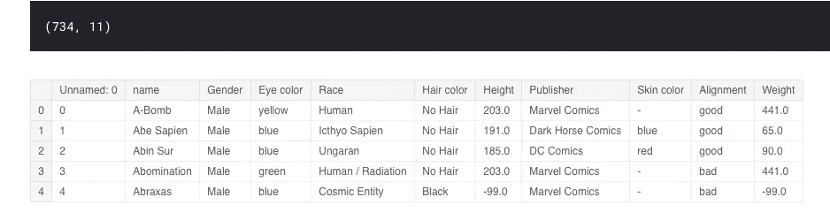
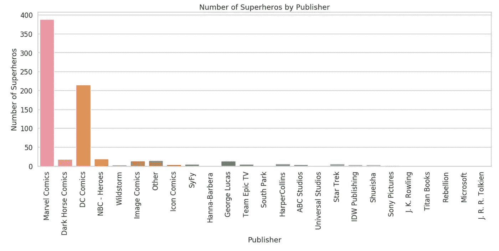
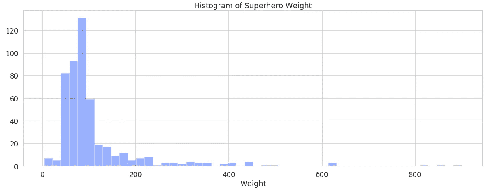

# 探索单变量数据

> 原文：<https://towardsdatascience.com/exploring-univariate-data-e7e2dc8fde80?source=collection_archive---------6----------------------->

## 使用超级英雄数据开始使用 Python 中的单变量 EDA


Photo by [Limor Zellermayer](https://unsplash.com/photos/j5MCxwaP0R0?utm_source=unsplash&utm_medium=referral&utm_content=creditCopyText) on [Unsplash](https://unsplash.com/search/photos/super-hero?utm_source=unsplash&utm_medium=referral&utm_content=creditCopyText)

Wikipedia 称“单变量分析可能是最简单的统计分析形式。。。关键事实是只涉及一个变量。”

因为单变量分析非常简单，所以它是探索性分析的好起点。

开始时要考虑的一些问题包括:

*   我有多少变量？
*   我有丢失的数据吗？
*   我有哪些类型的变量？

我们将探索来自 Kaggle 的[超级英雄数据集](https://www.kaggle.com/claudiodavi/superhero-set)来开始回答这些问题。数据包括两个 csv 文件。我们在这里使用的第一个包含了每个超级英雄的特征。第二个列出了每个英雄拥有的超能力。完整的笔记本可以在[这里](https://www.kaggle.com/tboyle10/superhero-exploratory-analysis)找到。

# 我有多少变量？

我喜欢从查看数据帧的前几行开始，并打印出图形:

```
print(info_df.shape)
info_df.head()
```



马上我们可以看到我们有列“未命名:0 ”,我们最有可能安全地删除它。这样我们总共有 10 个变量。

我们还可以在肤色栏中看到，我们缺少一些值，这就引出了我们的下一个问题。

# 我有丢失的数据吗？

我们已经看到我们有一些丢失的数据，但是让我们检查每个变量的空值的总和。

```
*#check for null values*
info_df.isnull().sum()name           0
Gender         0
Eye color      0
Race           0
Hair color     0
Height         0
Publisher     15
Skin color     0
Alignment      0
Weight         2
dtype: int64
```

虽然这表明存在缺失数据，但这可能有些误导。

上面我们看到皮肤颜色列包含破折号值，Python 在技术上不将其解释为空值。这表明数据的视觉检查是重要的。我们可以清除破折号并用 NaN 替换:

```
info_df['Skin color'].replace('-', np.nan, inplace=True)
```

整理好数据后，我们可以进入下一个问题。

# 我有哪些类型的变量？

变量可以是两种类型之一:分类的或数字的。

## 分类数据

分类数据将项目分类成组。这种类型的数据可以进一步细分为名义值、序数和二进制值。

*   序数值有固定的顺序。这里的一个例子可以是从低到高的排序。
*   名义值没有固定的顺序。例子包括超级英雄的性别和排列。
*   二进制数据只有两个值。这可以表示为真/假或 1/0。

总结分类变量的一种常用方法是使用频率表。为了形象化，我们将使用条形图。

```
sns.countplot(x='Publisher', data='info_df')plt.title('Number of Superheros by Publisher')
plt.ylabel('Number of Superheros')
plt.xlabel('Publisher')
plt.xticks(rotation = 90)
plt.show();
```



Barchart visualizing the number of Super Heroes by publisher.

这里我们可以看到漫威漫画的超级英雄数量最多，其次是 DC 漫画。

## 数据

数字数据是我们可以对其执行数学运算的值。它们被进一步细分为连续和离散数据类型。

*   离散变量必须是整数。一个例子是超级英雄的数量。
*   连续可以是任何值。这里的例子包括身高和体重。

数字数据可以用直方图显示出来。直方图是对连续数据的一个很好的初步分析。这里要考虑的四个主要方面是形状、中心、分布和异常值。

*   形状是直方图的整体外观。它可以是对称的、偏斜的、均匀的或者具有多个峰值。
*   中心指的是平均值或中间值。
*   传播指的是数据到达的范围或多远。
*   离群值是远离大部分数据的数据点。

```
sns.distplot(info_2.Weight, kde=False)plt.title('Histogram of Superhero Weight')
plt.show();
```



Histogram of superhero weight.

从直方图中我们可以看到大多数超级英雄的体重在 50 到 150 磅之间。我们有一个大约 100 磅的峰值和超过 800 磅的异常值。我们可以通过使用 describe 函数打印数字摘要来确认这一点:

```
info_2.Weight.describe()count    490.000000
mean     112.179592
std      104.422653
min        4.000000
25%       61.000000
50%       81.000000
75%      106.000000
max      900.000000
Name: Weight, dtype: float64
```

Describe 向我们显示关键统计数据，包括平均值、标准偏差和最大值。除了上面的直方图之外，使用汇总统计可以让我们对数据的样子有一个很好的了解。

# 单变量结论

数据集包含 10 个变量和一些缺失数据。我们看到 DC 漫画拥有最多的超级英雄，而权重变量有一些异常值。

这绝不是一个完整的探索性分析。我们可以继续探索剩下的变量，然后进行双变量分析。

进一步探索的有趣的事情可能是比较漫威和华盛顿的漫画。我们可以用数据科学来确定超级宇宙吗？