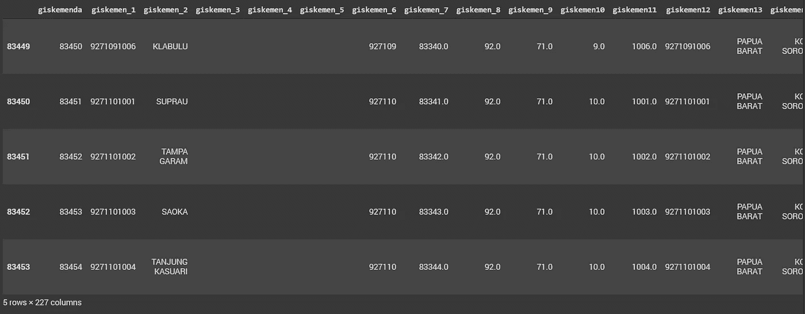
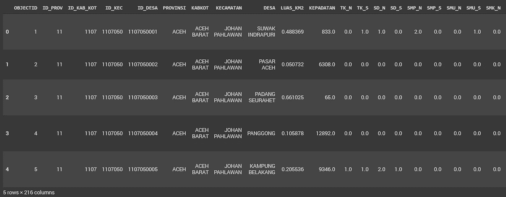
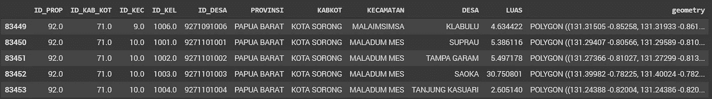
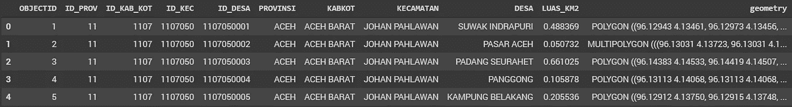
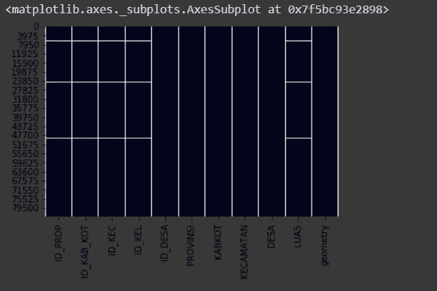
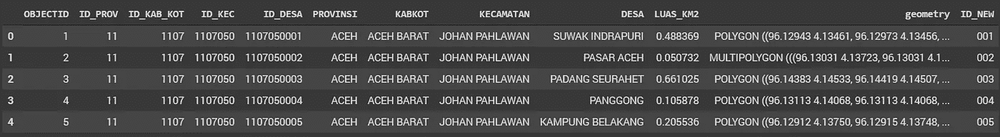
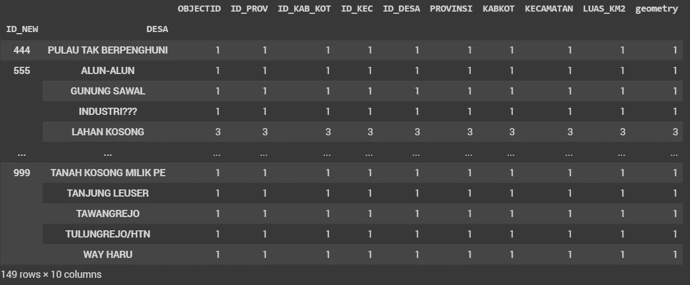

# 探索印度尼西亚的村庄边界空间数据集

> 原文：<https://towardsdatascience.com/exploring-village-boundaries-spatial-dataset-in-indonesia-part-1-cleaning-and-identifying-data-cf94d0099359?source=collection_archive---------10----------------------->

## 清理和识别数据


Photo by [Capturing the human heart.](https://unsplash.com/@dead____artist?utm_source=medium&utm_medium=referral) on [Unsplash](https://unsplash.com?utm_source=medium&utm_medium=referral)

测绘 19.05 亿平方公里的广阔覆盖面并不是一项容易的任务，沿途有无数的障碍。地理位置——山区、河流和群岛——是典型的困难，除了与解决边界线问题的当地利益相关者进行复杂的谈判之外，这些困难也使这项工作资源枯竭。因此，现在我们仍然可以在印度尼西亚的一些地方，尤其是东部地区，发现明显的概括——直线和粗略的划分。但是，至少政府正在努力逐年改进，以提供关于行政边界信息的最准确信息，这对于土地登记和管理至关重要。由于地理空间信息局(BIG)试图将包括 1:5.000 比例的全印度尼西亚底图项目在内的交易安全交付给潜在投资者，如世界银行和英国国家测绘局，因此可能还需要更多的改进。因此，我们仍然需要等待像样的行政边界。

此外，在 2019 年任期内，BIG 发布了字母为 [**SK Kepala BIG 第 27/2019 号**](https://drive.google.com/file/d/1-7XDyqC_y4hsKLM03www6Y9ISUSo0C3B/view?usp=sharing) 的专题地图，包括四级行政边界的测绘归*Direktorat penata an administra si and Pemerintahan Desa*管辖，而二级和三级则归*Direktorat topo nimi Dan Batas DAE rah*管辖。仍然在同一个部，但不同的董事会。这可能会解决以前的问题，当时仍然没有明确的权限来确定谁对数据负责，有时 BPS 和 BIG 在此数据方面会出现重叠。尽管如此，当涉及到这个问题时，应该依靠哪些数据之间仍然存在一些二元论，甚至其他部委也有同样的头痛。为了更好地理解这一问题，我将这一问题的范围界定为更详细的视图，因此我们通过基于来自内政部(Kemendagri)和印度尼西亚统计局(BPS)的数据集进行一些探索性数据分析，对村庄边界数据有了更多的了解。

所使用的村庄边界数据是从 [BPS](http://tig.co.id/ags/rest/services/BPS/BPS_2016_DESA/MapServer) 和 [Kemendagri](http://gis.dukcapil.kemendagri.go.id:6080/arcgis/rest/services/Data_Baru_26092017/MapServer) 各自的 REST 服务中获得的。在谷歌合作实验室[这里](https://colab.research.google.com/drive/1rVp1o2L5vzDLID5zTTMMOQkO2xF9bU_T)，我使用熊猫、海牛和地质熊猫，试图探索其背后的数据。在此**第一部分**中，进行了清洁和识别程序，以提供一些一般信息，并对这两者进行一些交叉检查。

# 清理数据

清理数据过程初始化，以清理一些凌乱的数据，其中一些看起来令人恼火。首先，打开驱动器中的数据，将其加载到 Google Colabs 中，地理空间格式是提供商提供的原始格式(geojson 格式)

打开来自 Kemendagri 的空间数据，第一时间很难解释，因为讨厌的列名。为了更好地理解每一个专栏，你可以在这里看到真正的名字。使用 *tail()* 而不是 *head()* 是为了区分该数据的前 10 行中的空值。后来，我设法简化了数据并提高了可读性。

```
df_1 = gpd.read_file("/content/drive/My Drive/village_boundary/desa_kemendagri.json")df_1.tail()
```



Data from village boundary (Source: [http://gis.dukcapil.kemendagri.go.id/](http://gis.dukcapil.kemendagri.go.id/))

从 BPS 打开空间数据集，不需要太多清理，只是为了简化必要的数据，这将是很大的考虑。尽管如此，数据仍然需要改进，因为我发现一些数据包括地理特征(湖泊、森林和田野),这实际上不是一个村庄名称类别，所以后来我试图删除其中一些。

```
df_2 = gpd.read_file("/content/drive/My Drive/village_boundary/desa_bps.json")df_2.head()
```



Data from village boundary (Source: BPS)

接下来，我想知道这两个中使用了多少数据。也许通过分析数字就能发现两者之间的显著差异是有用的

```
df_dagri.count() # the result is 83.322df_bps.count() # the result is 79.191
```

Kemendagri 的数据就是这种情况，通过使用*来提高简单性和可读性。iloc* 从第 17 栏到第 225 栏，我可以区分出一些在这一部分并不真正需要的特性，然后使用原始[源](http://gis.dukcapil.kemendagri.go.id:6080/arcgis/rest/services/Data_Baru_26092017/MapServer)中的指南对其进行重命名。我打算保留的列是不同级别管理的代码编号和管理名称。

```
df_dagri = df_1.drop(df_1.iloc[:, 17:225], axis = 1)df_dagri = df_dagri.drop([‘giskemenda’, ‘giskemen_1’, ‘giskemen_2’, ‘giskemen_3’, ‘giskemen_4’, ‘giskemen_5’, ‘giskemen_6’, ‘giskemen_7’], axis=1)df_dagri.columns = ['ID_PROP', 'ID_KAB_KOT', 'ID_KEC', 'ID_KEL', 'ID_DESA', 'PROVINSI', 'KABKOT', 'KECAMATAN', 'DESA', 'LUAS', 'geometry']df_dagri.tail()
```



在 BPS 的情况下，就像前面的数据一样，它在某种程度上是可管理的..

```
df_bps = df_2.drop(df_2.iloc[:, 10:215], axis = 1)df_bps.head()
```



现在是清理数据的最后一步，Kemendagri 的数据仍然有一个空值，包括湖泊要素(称为 Danau)，因此我尝试通过基于列 ID_PROP 来消除这些要素，但我真的不知道我是否通过简单地删除它们做出了正确的选择。



```
df_dagri_clean = df_dagri.dropna(subset=['ID_PROP'])
```

继续讨论更困难的问题，虽然 BPS 的数据没有任何空值，但是有一些要素在地理要素之前没有被归类为村庄，例如湖泊、森林和田地。

那么，我们如何区分这些特征呢？我意识到 ID_DESA 列是由唯一代码组成的。例如，ID_DESA = 1107050001 意味着 11 是省代码，07 是县/市代码，050 是地区代码，最后 001 是村代码。因此，我决定将这些值拆分到名为 ID_NEW 的新列中，该列只显示村庄代码。

```
df_bps['col'] = df_bps['ID_DESA'].astype(str)df_bps['ID_NEW'] = df_bps['col'].str[7:10]df_bps.drop('col', axis=1, inplace=True)df_bps.head()
```



然后，我尝试显示基于该列的唯一值

```
df_bps.ID_NEW.unique()
df_bps.count()
```

结果就在这里..注意数据之间有一些异常值:444、555、888 和 999。

```
array([‘001’, ‘002’, ‘003’, ‘004’, ‘005’, ‘006’, ‘007’, ‘008’, ‘009’, ‘010’, ‘011’, ‘012’, ‘013’, ‘014’, ‘015’, ‘016’, ‘017’, ‘018’, ‘019’, ‘020’, ‘021’, ‘022’, ‘023’, ‘024’, ‘025’, ‘026’, ‘027’, ‘028’, ‘029’, ‘030’, ‘031’, ‘032’, ‘033’, ‘034’, ‘035’, ‘036’, ‘037’, ‘038’, ‘039’, ‘040’, ‘041’, ‘042’, ‘043’, ‘044’, ‘045’, ‘046’, ‘047’, ‘048’, ‘049’, ‘050’, ‘051’, ‘052’, ‘053’, ‘054’, ‘055’, ‘056’, ‘057’, ‘058’, ‘059’, ‘060’, ‘062’, ‘063’, ‘070’, ‘071’, ‘079’, ‘080’, ‘061’, ‘064’, ‘065’, ‘067’, ‘068’, ‘069’, **‘999’**, ‘066’, ‘072’, ‘073’, **‘888’**, ‘078’, ‘081’, ‘083’, ‘084’, ‘103’, ‘104’, ‘105’, ‘106’, ‘107’, ‘108’, ‘109’, ‘111’,  ‘112’, ‘113’, ‘114’, ‘115’, ‘116’, ‘117’, ‘118’, ‘119’, ‘120’, ‘121’, ‘122’, ‘074’, ‘075’, ‘076’, ‘077’, ‘085’, ‘086’, ‘087’, ‘088’, ‘089’, ‘090’, ‘091’, ‘092’, ‘093’, ‘094’, ‘095’, ‘096’, ‘097’, ‘099’, ‘100’, ‘101’, ‘102’, ‘110’, ‘082’, ‘098’, **‘555’**, ‘**444’**, ‘123’, ‘124’, ‘125’, ‘126’, ‘128’, ‘129’, ‘131’, ‘132’, ‘133’, ‘134’, ‘136’, ‘137’, ‘138’, ‘127’], dtype=object)
```

因为我真的很好奇这些数据意味着什么，所以我决定更进一步…

```
outliers = [‘444’, ‘555’, ‘888’, ‘999’]select_outliers = df_bps.loc[df_bps[‘ID_NEW’].isin(outliers)]select_outliers.groupby(['ID_NEW', 'DESA']).count()
```

如您所见，这里有一些异常值，如无人居住岛屿的“444”和“555”，湖泊的“888”，森林的“999”。



最后，最后一件事是放弃 200 以上的值，因为我发现这样做真的很方便，而不是使用一些条件。

```
df_bps_clean = df_bps.drop(df_bps[(df_bps['ID_NEW'] >= '200')].index)df_bps_clean.count()
```

现在，数据比以前干净多了，但在删除一些特征之前，在大小上有一些缺点。为了显示原始版本和清理版本之间的差异，这里快速查看了各自数据的总大小。

```
dagri_before = df_dagri[‘LUAS’].sum()dagri_after = df_dagri_clean[‘LUAS’].sum()bps_before = df_bps[‘LUAS_KM2’].sum()bps_after = df_bps_clean[‘LUAS_KM2’].sum()
```

Kemendagri 和 BPS 数据的计算结果分别为 0 和 2，4 ha。零值仅仅是因为我删除了一开始没有任何大小值的特征。由于删除了一些巨大的特征，如大湖和大森林，因此 2,4 ha 的 BPS 差异是可以接受的。此外，改造后两者相差 1.4 公顷

```
**bps_before** # the result is 1913322.973425157 km2**dagri_before - dagri_after** # the result is 0.0 km2**bps_before — bps_after** # the result is 24101.28374174121 km2**bps_before - dagri_after** # the result is 38489.174897136865 km2**bps_after — dagri_after** # the result is 14387.891155395657 km2
```

如您所见，BPS 的原始数据与内政部的官方规定(见:Permendagri 编号 137/2017)相符，该规定称印度尼西亚的总面积为 191 万平方公里。BPS 数据于 2016 年发布，而 Kemendagri 数据于 2017 年发布，但后者显示出 3.8 公顷的巨大缺口。怎么会这样

印度尼西亚，我们真的在缩小吗？为什么一年后的数据会比前一年的数据小？尽管 Kemendagri 数据中的特征数量(83.322 行)比 BPS (79.191 行)多。我看不出这两者之间有任何更清晰的解释，甚至没有挑选出任何可信的数据。

> 无论如何，Kemendagri 真的需要尽快解决这个问题，这是他们的责任之一。

**第 2 部分**将对之前在此清理的数据进行分析和可视化。没有更多的无聊的编辑，可能是一些令人着迷的图表和有趣的信息将被显示。