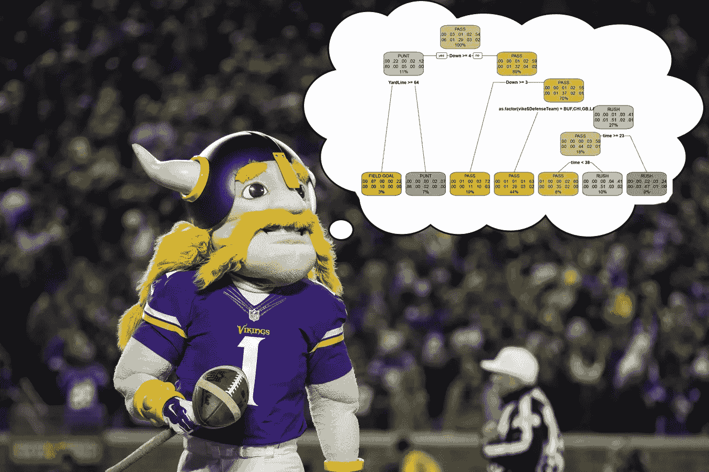
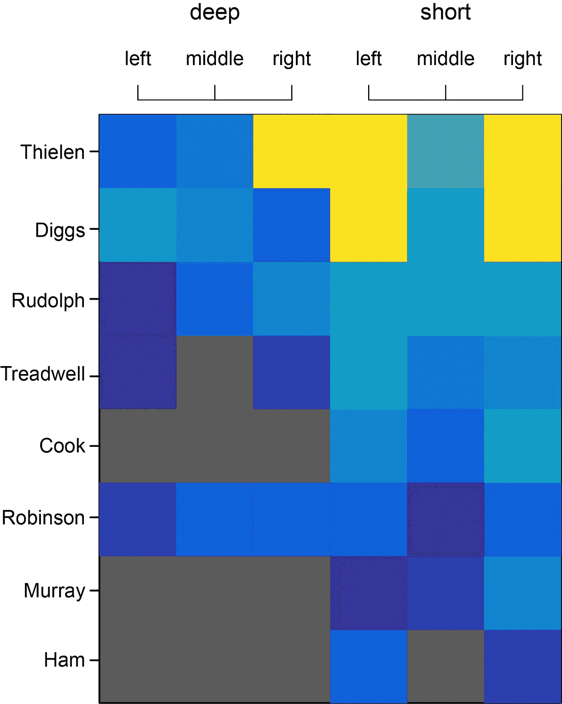
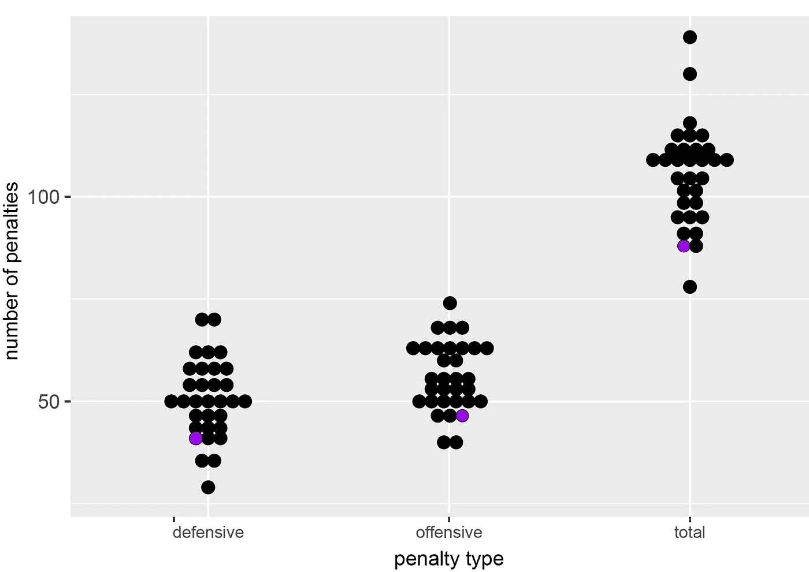
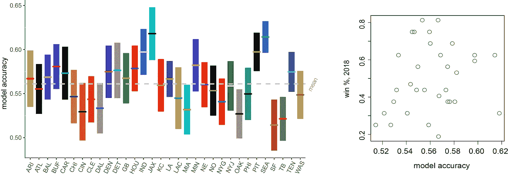
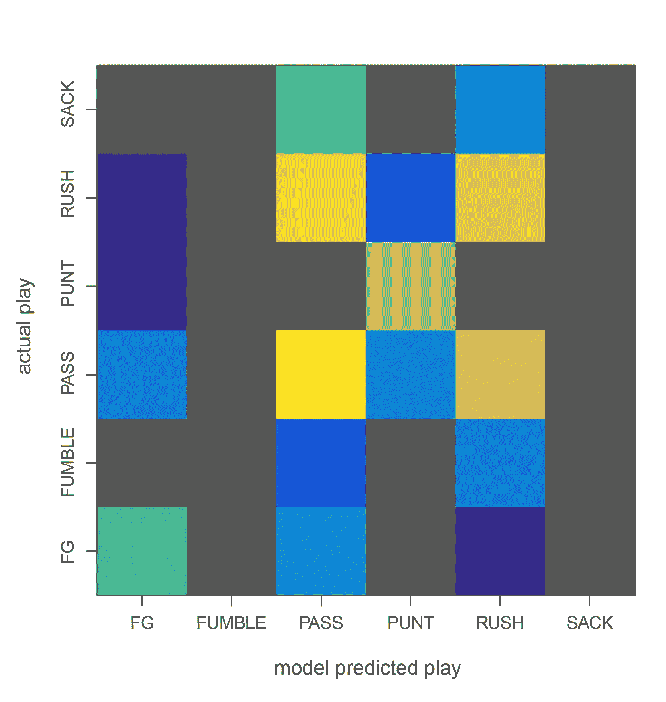

# 探索，可视化和建模明尼苏达维京人队的进攻

> 原文：<https://towardsdatascience.com/exploring-visualizing-and-modeling-the-minnesota-vikings-offense-f8ebdcabf473?source=collection_archive---------17----------------------->

Viktor the Viking gazes into the abyss.

经过简短的搜索，我从 [NFL 专家](http://www.nflsavant.com/about.php)那里获得了整个 2018 赛季的详细数据。因为我本质上是明尼苏达的粉丝，所以我决定尝试一些机器学习技术，看看能否找到一些量化的方法，让维京人在过去的一年中有所欠缺。

对于一些最初的 [EDA](https://en.wikipedia.org/wiki/Exploratory_data_analysis) ，我决定看看通过传球积累的码数，按传球位置和接球手细分。根据传球方向，我汇总了每个维京人接球手在赛季中至少 10 次接球的所有接球码。因为平均码数/接发球受几次长时间接发球的影响很大(并且因为不完整传球导致平均码数/接发球经常为 0)，所以我使用总码数(总和)来汇总数据。该数据显示在左侧，并按总接收码/球员(从多到少)排序。我认为值得注意的是:蒂伦和迪格斯倾向于在球场的对立双方分裂；蒂伦在球场右侧接到更多的远传码，而迪格斯在左侧接到更多的远传码。我认为，这也凸显了可靠的第三 WR 的相对稀缺；凯尔·鲁道夫无疑是球队最好的第三选择，但是奥尔德里奇·罗宾逊(总共 17 次接球)和拉昆·特德韦尔(总共 35 次接球)如果他们不得不在蒂伦和迪格斯坐在一场比赛中排队的话，那他们就太掉队了。

Dot plots of penalties/team, grouped by defensive penalties, offensive penalties, and all penalties. MN Vikings are marked in purple.

鉴于他们在本赛季最后一场比赛中由于点球至少部分被取消，我接下来看了看维京人在点球上的总体表现。明尼苏达队是第二个受到处罚最少的球队。整个 2018 赛季，他们只接受了 88 次处罚(47 次进攻，41 次防守)，而平均每支球队接受了 106 次处罚(56 次进攻，50 次防守)。这些处罚只有 729 码有效，在联盟中排名第三(平均每个球队有 881 码的处罚)。虽然这个基本总结中肯定有额外的混杂因素(不是所有的处罚都是平等的，无论是在放弃的绝对码数方面还是在它们对比赛结果的影响程度方面)，但数据表明明尼苏达州训练有素，纪律严明。所以我想知道明尼苏达是否在他们的比赛叫牌中做了一些奇怪的事情，也许是向对方的防守倾斜，给他们的对手额外的信息来准备。

首先，我简单地用逻辑回归来尝试预测一部戏是否过关。作为预测，我使用了当前的比赛条件:比赛剩余的时间(通过将四分之一、一分钟和一秒钟组合成一个单一的度量标准来计算)，当前的比分差距，要走的距离和码数，距离端区的距离，以及对方球队的身份。在 1，000 次训练拆分中，逻辑回归预测维持数据的通过状态的准确率约为 58%(-3%)。虽然这明显比运气好(如果你只是在每场比赛中预测“传球”，你会有 53.7%的准确率；针对该值对我们观察到的精度进行单样本 t 检验，得到 t=15.18，*p*<2–16)，这在解释数据方面并不特别令人印象深刻。从系数来看，时间对一部戏是否合格没有影响；虽然随着时间的推移，球队不应该总是传更多的球，但在一些常见的情况下，他们应该这样做。然而，我们的逻辑模型没有考虑预测因素的相互作用，例如当两个或更多的财产下降时是否有时钟的影响，或者它是否是第三个下降和英寸或第三个下降和长，这有助于说明这种相对简单的方法的一些缺点。

鉴于这些结果，我开始想知道能够预测一场比赛是否会通过(即使没有场上所有的额外信息)是否真的是一件好事，以及更多“可预测”的球队是否会赢得更少的比赛。我分别在每个团队中重新运行了相同的逻辑建模代码；根据逻辑回归模型方法，明尼苏达是第五个最“可预测”的球队，排在杰克逊维尔、西雅图、匹兹堡和印第安纳波利斯之后。在所有 32 个团队中，胜率和逻辑可预测性之间没有显著相关性(r=0.19，p=0.30，见下图)。然而，逻辑准确性和获胜之间的非显著正相关可能可以用这样一个事实来解释，即获胜最多的团队往往会通过，直到他们以多个分数获胜，然后在场上尽可能快地结束比赛。此外，一些最不可预测的球队(例如旧金山、奥克兰和坦帕湾)在赛季中途就基本上被淘汰出季后赛了。当没有动力去最大化你的胜利数字时，我想球队会更愿意多样化他们的打法，让他们的球员尽可能多的代表不同种类，并在下赛季给他们自己更多的经验和更好的机会。

Logistic regression model accuracy for each NFL team (left), and win percentage by logistic model accuracy (right).

Confusion matrix for the random forest model of Minnesota’s offensive play calls.

为了改进基本的逻辑回归结果，并考虑到预测因素之间可能的相互作用，我接下来使用了随机森林模型来预测游戏条件下的游戏类型。我没有简单地估计“is_pass”结果，而是允许结果具有数据中实际存在的多个级别。总共使用了 500 棵树，每次分裂选择 2 个变量。总的来说，预测的随机森林模型比通过概率的逻辑回归模型发挥得更好，在所有条件下具有大约 63%的准确性。看一下混淆矩阵(左)，随机森林模型在预测大多数特定游戏类型方面做得很好。它预测射门的准确率为 81%，传球准确率为 69%，踢门准确率为 91%。自然地，失球和麻袋从来没有被模型预测到，考虑到它们的稀有性和内在的不可预测性，这是有意义的(大多数进攻协调者可能不会故意制造失球)。

随机森林模型最不可靠的地方是预测灯芯草；只有 52%的预测会是快攻的比赛最终实际上停留在地面上，而 43%最终是传球。这可能是由于建立模型的数据的缺点(例如，使用阵型和人员信息可能会有所帮助)，但也可能是由于维京人倾向于(至少在赛季早期)成为传球优先的球队。

我选择不包括在初始随机森林模型中的最大数据源之一是队形类型(对于维京人，这些包括散弹枪、中锋下方、无拥挤、无拥挤散弹枪、平底船和球门队形)。最初，我更感兴趣的是尝试从*教练的角度*，看看我是否能预测他们在给定的比赛情况下会想出什么打法。然而，另一种方法是扮演*对方防守*的角色，并尝试根据比赛情况*和*阵型(这是混战线的公开信息)预测比赛叫牌。

在随机森林模型中加入该信息得到了更高的精确度，误差率仅为 29%。更重要的是，以前预测维京人何时会抢球的难度大大降低了，因此当模型预测抢球时，63%的时间是正确的(相比之下，在没有阵型数据的情况下，52%的准确率)。在其他团队中尝试这种随机的 forest+模型在准确性方面产生了类似的改进。所有 32 个团队的平均错误率为 33%，范围从 24-40%不等。明尼苏达队再次成为最“可预测”的球队之一(总排名第五)，但考虑到第一和第三最可预测的球队(分别是新英格兰队和洛杉矶公羊队)正在参加超级碗比赛，这再次表明该模型预测球队比赛类型的能力并不一定能更容易地阻止他们取得成功。

到综上所述，使用随机森林方法来模拟逐场比赛数据，在确定当前游戏条件下将进行何种类型的比赛方面相当准确，并且在通过/不通过的简单逻辑回归上有明显的改进。鉴于维京人在点球和失球等“错误”指标上的表现远高于平均水平，我也不认为有太多理由认为他们只是运气不佳。

一些分析家认为柯克考辛斯是罪魁祸首，但我肯定不会说他是主要问题。在[他的](https://www.pro-football-reference.com/teams/was/2017.htm) [最近的几个赛季中，考辛斯有五个不同的接球手，整个赛季有 500+的接球码，而今年他只有蒂伦、迪格斯和鲁道夫可以依靠。部分原因是库克错过了赛季的一部分，但即使他整年都健康，可靠的接收选择仍然比考辛斯习惯的要少。进攻线在快攻和传球阻挡上的困难也是需要改进的地方，](https://www.pro-football-reference.com/teams/was/2016.htm)[可能会出现在选秀中](https://www.theringer.com/nfl/2018/12/30/18162106/exit-interview-minnesota-vikings)。不过，总的来说，这个建模练习表明，在给定的比赛条件下，比赛的类型与联盟中一些最成功的球队是一致的，这让我对明年的改进感到乐观，特别是如果球队可以增加另一个一致的接收选项。