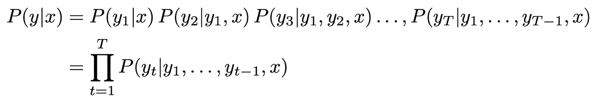

# 探索自然语言生成的西部——从 n-gram 和 RNNs 到 Seq2Seq

> 原文：<https://towardsdatascience.com/exploring-wild-west-of-natural-language-generation-from-n-gram-and-rnns-to-seq2seq-2e816edd89c6?source=collection_archive---------12----------------------->

NLP Wild West

## 斯坦福大学 NLP 课程中讲授的自然语言模型介绍

最初，文本生成是基于模板或基于规则的系统，对于特定的狭义应用程序来说，它们具有相当好的可解释性和良好的行为。但是扩展这样的系统需要大量不可行的手工工作。简单地说，语言没有清晰明确的规则，这就是为什么它经常被许多人比作西部荒野。由于这个原因，这个领域转移到了*统计语言模型*。

> ***语言建模(LM)是预测下一个单词是什么的任务，或者更一般地说，是一个为一段文本序列分配概率的系统。***

***N-gram*** 是*最简单的*语言模型，其性能受到缺乏复杂性的限制。像这种简单的模型无法实现流畅、足够的语言变化和正确的长文本写作风格。由于这些原因，***神经网络* ( *NN* )** 被探索为新的黄金标准，尽管它们很复杂，并且 ***递归神经网络(RNN)*** 成为用于任何种类的序列的*基本架构*。如今，RNN 被认为是文本的“香草”架构，但 rnn 也有自己的问题:它不能长时间记住过去的内容，并且它很难创建*长的相关文本序列*。由于这些原因，其他架构如***【LSTM】***和 ***门控循环单元(GRU)*** 被开发出来，并成为许多 NLG 任务的*最先进解决方案*。在本文中，我们将探索这些*基本思想和模型*的*演变*。

Different flavours of RNN: RNN, GRU and LSTM ([source of images](https://minimalistbaker.com/))

毫无疑问，***【NLP】***和***【NLG】***已经经历了重大的进步，尤其是最近五年，这就是为什么我们每天多次使用语言模型并从中受益。每当我们在*搜索框*中键入文字或者在*手机*上书写文字时，幕后的一个模型就在预测下一个即将出现的字符或单词。 *Gmail* 和 *LinkedIn* 根据我们之前的对话和*虚拟助手*(例如 *Siri* 或 *Alexa* 生成*类似人类的回复*。聊天机器人正在成为客户服务的重要组成部分，谷歌翻译为大量语言提供了更好的翻译。生成流畅连贯的冗长文本，同时*保持对输出*语义的控制，这是一个挑战。这可以通过类似于 ***序列到序列(Seq2Seq)*** 的架构来解决，该架构用于解决条件文本生成问题，但我们将在本文的后面对此进行更多讨论。

Examples of applications with NLG models

# **N-gram**

最直接的语言模型是一个*n*gram 模型。文本只不过是一系列字符(或单词)。词汇 *V* = { *W* ₁,…， *W* |ᵥ|}下一个单词 *x* ⁽ᵗ⁺ ⁾的概率分布为:

因此，单词序列 *x* ⁽ ⁾， *x* ⁽ ⁾,…， *x* ⁽ᵀ⁾的概率为:

> ***N-gram*** 假设 ***下一个字 x* ⁽ᵗ⁺ ⁾只依赖前面的 *n-1 个*字。**

用数学术语来说，这意味着:

N-gram 又称为 ***非光滑极大似然估计*** 。对于*最大* *似然估计*，我们统计每个单词在 n-1 个单词(历史)之后出现的次数，并除以这 n-1 个单词在训练数据中出现的次数。*未平滑*部分意味着，如果我们在训练数据中没有看到 n-1 个单词历史之后的给定单词，我们将为其分配零概率。

> *4 克 LM 的示例:*
> 
> *H̵e̵l̵l̵o̵,̵ ̵I̵想 ____*
> 
> p(字| *想)= count(想*字)/ *count(想*)
> 
> P(观| *想)=0.03，* P(书| *想)=0.04*

完成这些计算后，文本生成就很容易了。生成下一个消息 的 ***步骤为:***

1.  看最后 n-1 克(历史)。
2.  从 n-gram 模型中获得下一个单词的分布。
3.  根据相应的分布抽取一克样本。(注意，有不同的方法来选择下一个 gram，并在本文的结尾进行了解释。)

为了生成一系列的 k 线图，我们简单地*循环上面的过程*，在每一轮用生成的 k 线图更新历史。

Sparsity problem

这种简单化的方法有一个 ***稀疏性问题*** :

1.  正如我们已经提到的，如果一个 gram 从未出现在历史数据中，n-gram 分配 *0 概率* ( **0 分子**)。一般来说，我们应该 ***平滑*** 的概率分布，因为每件事都应该至少有一个小概率分配给它。
2.  如果历史数据中从未出现过 n-1 个 gram 序列，我们*就无法计算出下一个 gram 的* *概率*(**0 分母**)。在这种情况下，我们应该只考虑一个*更短的 n-gram* (即使用 n-1 gram 模型代替)。这种技术叫做 ***回退*** 。

由于模型的简化假设，如果我们保持上下文和长期依赖性，我们就不会像我们一样擅长预测即将到来的单词。于是我们以**等不连贯的文字收场**

> **"在鞋楦和制鞋业生产的同时，股市也随之上涨"**

**然后，有人可能认为更大的上下文可能给出更好的预测，但是通过增加模型中的克数(n)*稀疏性*成为更大的问题，并且整个模型实际上变得不正常。此外，更大的 n 会导致型号的*更大，根据经验， ***n 不应超过 5*** 。***

# ***NN***

**

*Trade-offs between these two types of systems. ([source](https://cs.stanford.edu/~zxie/textgen.pdf))*

*需要一种具有上下文感知的更复杂的模型。有了 NN，就没有稀疏性问题，因为它可以给我们以前从未见过的组合的概率分布，并且不需要存储所有观察到的 n-gram。一个 NN 似乎是现在每个硬数据问题的解决方案，这里的情况是这样吗？*

**

*Fixed window neural language model*

*例如，固定窗口神经 LM 查看固定长度窗口中的单词，其输入层是连接的单词嵌入向量。但是我们仍然在看一个有限大小的固定窗口，并且*扩大窗口*大小导致模型参数 不可维护的 ***增加。此外，在处理输入的方式上也没有 ***对称性***——看上面的图，我们可以看到单词被乘以不同的权重。因此，我们有效地多次学习相似的函数。****

> **在我们如何处理引入的单词嵌入方面应该有很多共性*。*

*顾名思义，递归神经网络(RNN)通过对所有单词输入 循环使用相同的网络和权重矩阵来解决这个问题 ***。因此，RNN 可以被认为是同一个网络的多个副本，每个副本都向后继者传递消息。这使得 RNN 成为比固定窗口 NNs 更紧凑的模型。下一节将使这一陈述更加清晰。****

**

*Unrolling of an RNN (modified figure from [source](http://colah.github.io/posts/2015-08-Understanding-LSTMs/))*

# ***rnn、gru 和 lstm***

*在 RNN 中， ***输入序列*** 可以是任意长度的**，因为我们对每个时间步(字)应用相同的权重矩阵。这意味着型号*的尺寸不会因输入*变长而增加，并且在输入处理方式上存在 ***对称性*** 。此外，RNN 具有一系列隐藏状态(而不是像我们在固定窗口神经 LM 中那样只有一个隐藏状态)。某个步骤的输出是基于先前的隐藏状态和该步骤的输入计算的。隐藏状态就像一个单一的状态，随着时间的推移而变异，形成网络的记忆。***

****

**Vanilla RNN architecture where Xt is the input (eg. encoding of word at step t) and ht is output value (eg. encoding of the next word) (modified figure from [source](http://colah.github.io/posts/2015-08-Understanding-LSTMs/))**

**隐藏状态是前一个隐藏状态和当前模型输入的线性组合，然后通过非线性处理(如 sigmoid，tanh)。我们正在尝试学习一个 ***通用函数*** (上图中的 A)关于我们应该如何处理一个单词*给定的前一个单词*的上下文，而*学习语言和上下文*的一般表示。**

**在字符级而不是单词级预测即将到来的上下文是一个分类问题，因为字符比词汇表中的单词范围少，所以分类数量明显较少。在训练了一个预测下一个字符的 RNN 之后，我们可以按照下面的 ***步骤生成新的文本*** :**

1.  **首先选择一个字符串，初始化 RNN 状态，并设置要生成的字符数。**
2.  **使用起始字符串和 RNN 状态，将预测作为下一个字符的分布。使用分类分布计算预测字符的索引。**
3.  **使用这个预测的字符作为模型的下一个输入。**
4.  **由模型返回的 RNN 状态被反馈到模型中，以便它现在具有更多的上下文，而不仅仅是输入(预测的先前字符)。(见上面 RNN 展开的图)**

**对文本序列中的一个字符的计算(理论上)使用来自许多步骤之前的信息，但是循环字符计算仍然很慢，并且在实践中很难访问来自许多步骤之前的信息。**

> **预测“太阳在**天空**照耀”这句话的最后一个单词是可行的。但是“11 月的天气主要是**晴**”这句话的最后一个字就比较难预测了当 100 个单词之前有一句话“我计划去塞浦路斯旅行。”。**

****RNNs 挣扎**记住长范围依赖关系主要是由于所谓的 ***消失梯度问题*********上下文信息的线性衰减*** 。梯度的大小受激活函数的权重和导数的影响(由于链式法则),它们在网络中反复出现。如果这些因子中的任何一个小于 1(当我们将小值相乘时)，梯度可能会及时消失，如果这些因子大于 1，梯度可能会爆炸。在这两种情况下，我们都会丢失信息，尤其是当文本较长时。训练期间非常小的梯度转化为重量的微小变化，因此，*没有显著的学习*。*****

> **LSTM 和后来的 GRU 的设计是为了缓解控制模型更新记忆的消失梯度问题。**

****lstm**和 **GRUs** 中的重复模块(图中的 A)具有不同的结构，这使得它们 ***能够学习长期依赖*** 。它们的结构使用由非线性(例如 sigmoid)神经网络层和乘法或加法运算组成的门。**

****

**LSTM architecture and equations of its repeating module (modified figure from [source](http://colah.github.io/posts/2015-08-Understanding-LSTMs/))**

**有不同类型的 ***门*** 可用于 ***更新状态*** 。例如，*遗忘门*决定我们要丢弃什么信息，而*输入门*决定我们要存储什么新信息。LSTM 的一个关键特征是*单元状态*(上图中 LSTM 顶部的水平线)，它通过网络，只有一些微小的线性交互，允许信息沿着网络流动。 ***GRU 是 LSTM*** 的一个更快(但功能更弱)的变体，它合并了单元格状态和隐藏状态。**

****

**GRU architecture and equations of its repeating module (modified figure from [source](http://colah.github.io/posts/2015-08-Understanding-LSTMs/))**

# ****条件语言模型— Seq2Seq****

**到目前为止，我们已经看到了可以生成文本的不同模型(n-gram、RNN、LSTM、GRU ),但是我们还没有探索如何基于除起始文本之外的条件来生成文本。一些条件文本生成**应用**如下:**

> **作者姓名 **>** 作者风格的文本**
> 
> ****话题>话题**关于那个话题的文章**
> 
> **电子邮件 **>** 电子邮件主题行(又名总结)**
> 
> **问题 **>** 自由形式问题回答(又名聊天机器人)**
> 
> ****条>条**条的总结(又名总结)**
> 
> **图像 **>** 描述图像的文本(又名图像字幕)**
> 
> **自然语言代码描述 **>** 代码(又名代码生成)**
> 
> ****句>句**句翻译成不同的语言(又名机器翻译)**

**在条件语言模型中，我们希望在给定一些条件上下文( *x* )的情况下，将概率分配给单词序列( *y* ):**

****

**这种范式被称为 ***Seq2Seq*** 建模，它是 2014 年*神经机器翻译*的一大突破。从那时起，它一直是一种领先的标准方法，并在 2016 年使用了 ***谷歌翻译*** 。为了训练这样一个模型，我们需要大量的*并行数据*。**

****

**The Rosetta Stone: First parallel language dataset**

**Seq2Seq 的架构是由两个 rnn 组成的单一神经网络模型:**

*   ****一个*编码器*** :创建一个固定长度的编码(一个实数向量)*封装关于输入*的信息。在机器翻译中，编码器从源句子中提取所有相关信息以产生编码。**
*   ****一个*解码器*** (本质上是一个条件 LM):一个语言模型，*用编码器创建的编码生成目标序列条件*。在机器翻译中，解码器生成源句子的翻译句子。**

****

**Seq2Seq example for generating a message to property agents based on some search criteria**

**解码器是用一种叫***老师强制*** 的方法训练的。这意味着“老师”迫使解码器的输入成为黄金目标输入，而不是它的预测。目标序列是偏移了一个单词的输入序列，以便网络学习预测下一个单词。Seq2Seq 中的*反向传播*端到端操作*(一端是损耗函数，另一端是编码器 RNN 的起点)，我们 ***相对于*学习整个系统*。******

****

**End-to-end training using one loss function *J***

**由编码器创建的嵌入成为解码器 RNN 的初始状态。我们强制在这个向量中捕获关于源句子的所有信息，因为这是提供给解码器的唯一信息。这样我们就陷入了一种***的信息瓶颈*** 的问题中。如果一些信息不在这个向量中，那么解码器就无法正确翻译这个句子。 ***注意*** 提供了这个问题的解决方案，同时也帮助解决了其他问题，包括 ***消失渐变问题*** 。**

> *****注意*是通用的*深度学习技术*。给定一组*向量值*和一个*向量查询*，它计算*依赖于查询的值的加权和*。****

****

**Seq2Seq with Attention**

**在 Seq2Seq 情况下，每个解码器隐藏状态 s𝘵(查询)关注所有编码器隐藏状态 h₁,…,h_N(值)。因此，在**解码器**的每一步，我们都有一个**直接连接到编码器**，但是我们**关注源句子的不同部分**。**

**上面的网络图在数学上**所做的**是:**

****

**Attention (a_t) translated in mathematical equations**

1.  **计算解码器隐藏状态(步骤 t 中的 s)与每个编码器隐藏状态(h₁,…,h_N)的点积，以便获得注意力分数(eᵗ)**
2.  **使用软蜡获得这一步的注意力分布(αᵗ)**
3.  **使用该分布来获得注意力输出(步骤 t 中的 a ),作为编码器隐藏状态的加权和。**
4.  **将注意力输出与解码器隐藏状态([a；s])并按照非注意 Seq2Seq 模型进行。**

**最后，在训练 Seq2Seq 模型之后，可以遵循不同的**策略来通过解码器预测下一个字**:**

*   *****贪婪*** :我们总是**挑选概率最高的词**(又名 argmax)。我们现在做了最好的选择，没有回头路了。然而，这不一定会给我们整个句子的 argmax。**
*   *****光束搜索*** :光束搜索**跟踪每一步的 *k* 可能变量**，避免被局部最大值引入歧途。当 k 为*小* ( *k=1 表示贪婪*)时，我们可能会得到*不合语法的不自然的*、*无意义的不正确的*句子。当 k 比*大*时，这些问题会减少，但会更加*昂贵*并给出更多*通用*回复，汇聚成*安全“正确”*响应，然而*不太相关*。**
*   *****采样*** :我们**从一个截断的条件词概率分布**中采样，即从前 k 个最可能的词中采样。用这种方法，通常句子由于随机性而没有太大的意义。注意 *k=1* 与*贪婪*解码相同， *k=* 大小的*词汇*与纯*采样*相同。**

# ****遗言****

**我们讨论了生成文本的不同方法，从简单的*方法到不同的 ***RNN*** 架构，包括*和 ***GRU*** 。我们还研究了 **S *eq2Seq*** 架构，其中用*可以处理 ***条件文本生成*** 机器翻译等问题。*****

**这些模型在谷歌和我的团队**之外有**[**Zoopla**](https://www.zoopla.co.uk/)**的数据科学团队用这些知识挑战财产门户体验**。希望在读完这篇文章后，你对文本生成有了更好的直觉，并且你现在也能够为你的行业找到有用的应用。如果你想了解更多，以下是我发现的一些有用且有见地的资源:**

*   **[CS224n](http://web.stanford.edu/class/cs224n/) :深度学习的自然语言处理。斯坦福大学，2019 年冬季(该课程是本博客的灵感来源)**
*   **A.卡帕西。[递归神经网络的不合理有效性](http://karpathy.github.io/2015/05/21/rnn-effectiveness/)，2015**
*   **C.奥拉。[了解 LSTM 网络](http://colah.github.io/posts/2015-08-Understanding-LSTMs/)，2015**
*   **Z.谢。神经文本生成:实用指南。arXiv 预印本 arXiv: 1711.09534v1，2017 年**
*   **Z.胡。[走向文本的受控生成](https://arxiv.org/pdf/1703.00955.pdf)，2018**
*   **[https://www . tensor flow . org/beta/tutorials/text/text _ generation](https://www.tensorflow.org/beta/tutorials/text/text_generation)**
*   **[https://py torch . org/tutorials/intermediate/seq 2 seq _ translation _ tutorial . html](https://pytorch.org/tutorials/intermediate/seq2seq_translation_tutorial.html)**

****

**特别感谢我在 Zoopla 的同事们，他们重视知识分享和新想法的实验，并感谢 Jan Teichmann 对本文的反馈和支持。**