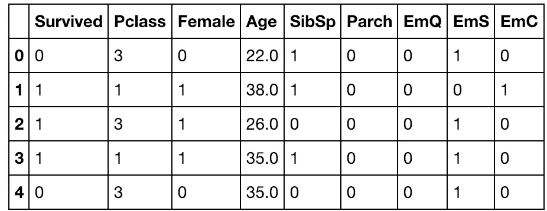
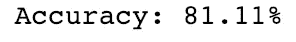
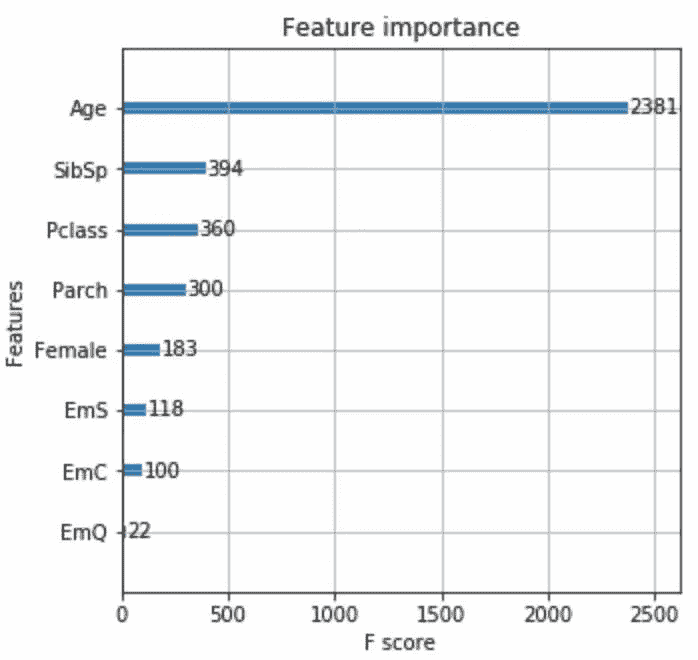
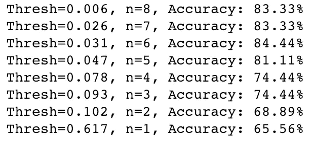

# 探索 XGBoost

> 原文：<https://towardsdatascience.com/exploring-xgboost-4baf9ace0cf6?source=collection_archive---------5----------------------->

## 集成学习和 XGBoost 在分类和特征选择中的应用

我最近在[弗朗索瓦·乔莱](https://medium.com/@francois.chollet)的《用 Python 进行[深度学习》一书中偶然发现了一种新的【对我来说】方法，梯度推进机器(具体来说就是 XGBoost)。Chollet 提到，XGBoost 是一个成功的应用机器学习者今天应该熟悉的一种肤浅的学习技术，所以我相信了他的话，并深入了解了更多。](https://www.manning.com/books/deep-learning-with-python)

我主要想写这篇文章，因为我认为其他具有一些机器学习知识的人也可能像我一样错过了这个主题。我绝不是这方面的专家，老实说，我在理解一些机制方面有困难，但是我希望这篇文章是你探索这方面的一个很好的入门(底部也有很好的资源列表)！

# 集成学习

那么 XGBoost 是什么，它在 ML 的世界中处于什么位置呢？梯度推进机器属于称为集成学习的 ML 类别，集成学习是 ML 方法的一个分支，它可以同时用许多模型进行训练和预测，以产生单一的优秀输出。把它想象成规划出几条不同的路线去一个你从未去过的地方；当你使用所有的路线时，你开始了解哪些交通灯需要很长时间，以及一天中的时间如何影响一条路线，使你能够精心设计一条完美的路线。您试验并组合了一些不同的模型，以得出最佳结论。集成学习也差不多！

集成学习分为三个主要子集:

*   **Bagging** : Bootstrap 聚合或 Bagging 有两个不同的特征，这两个特征定义了它的训练和预测。对于训练，它利用引导程序将训练数据分成不同的随机子样本，模型的不同迭代使用这些子样本进行训练。对于预测，bagging 分类器将使用每个模型中投票最多的预测来产生其输出，bagging 回归将取所有模型的平均值来产生输出。Bagging 通常应用于高方差模型，如决策树，随机森林算法是 bagging 的一个非常接近的变体。
*   **堆叠**:堆叠模型是一个“元模型”,它利用来自许多不同模型的输出作为输入特性。例如，这允许您使用所有训练数据训练 K-NN、线性回归和决策树，然后获取这些输出并将它们与逻辑回归合并。这个想法是，这可以减少过度拟合，提高精度。
*   **助推**:终于助推了！boosting 的核心定义是一种将弱学习者转换为强学习者的方法，通常应用于树。更明确地说，boosting 算法依次增加模型的迭代，同时调整弱学习者的权重。这减少了来自模型的偏差，并且通常提高了准确性。流行的提升算法有 AdaBoost、梯度树提升和 XGBoost，我们将在这里重点介绍。

# XGBoost

eXtreme Gradient Boosting 或 [XGBoost](https://xgboost.readthedocs.io/en/latest/) 是一个针对现代数据科学问题和工具优化的梯度提升算法库。它利用了 boosting 中提到的技术，并封装在一个易于使用的库中。XGBoost 的一些主要优点是它的高度可伸缩性/可并行性、执行速度快，并且通常优于其他算法。

在这一节中，我们将通过预测泰坦尼克号上的乘客是否幸存来探索 XGBoost。用于此分析的完整 jupyter 笔记本可在[这里](https://github.com/shibby576/data_sandbox/blob/master/ML_Explore/titanic_XGboost.ipynb)找到。

我首先将 Titanic 数据加载到 Pandas 数据框中，并探索可用的字段。*注意:为了简洁起见，在加载之前，我手动转换了 csv 中的‘上船’和‘性别’特征*

大多数元素似乎是连续的，那些包含文本的元素似乎与预测幸存者无关，所以我创建了一个新的数据框(“train_df”)，只包含我想要训练的特征。还要注意，XGBoost 将处理 nan，但(至少对我来说)不处理字符串。

就像其他模型一样，将数据分成训练和测试数据很重要，我在 SKLearn 的`train_test_split`中就是这么做的。请注意，我决定只采用 10%的测试数据。我这样做主要是因为 titanic 数据集已经很小了，而我的训练数据集已经是全部可用数据集的一个子集。这可能会导致过度拟合，可能不是最佳实践。

准备好数据后，我的目标是将乘客分类为生还者，我从 XGBoost 导入了 XGBClassifier。然后我们为`XGBClassifier()`创建一个对象，并传递给它一些参数(没有必要，但我最终想尝试手动调整一下模型)。最后我们把模型`fit()`交给我们的训练特征和标签，我们准备进行预测！如您所见，使用 XGBoost 库与使用 SKLearn 非常相似。

使用我的模型进行预测，并使用准确性作为我的衡量标准，我可以看到我达到了超过 81%的准确性。这是经过一点手动调整后的结果，虽然我希望得到更好的结果，但这仍然比我过去在相同数据上使用决策树所获得的结果要好。

XGBoost 的一个超级酷的模块是`plot_importance`，它为您提供每个特性的 [f 值](https://www.quora.com/What-is-an-intuitive-explanation-of-F-score)，显示该特性对模型的重要性。这对于选择特性很有帮助，不仅对于 XGB，对于您可能在数据上运行的任何其他类似模型也是如此。

更进一步，我发现了一个[精彩的代码样本和一篇关于自动评估要使用的特性数量的文章](https://machinelearningmastery.com/feature-importance-and-feature-selection-with-xgboost-in-python/)，所以我必须尝试一下。

本质上，这段代码通过按照重要性反复删除特征来训练和测试模型，并记录模型的准确性。这使您可以轻松地删除功能，而不是简单地使用试错法。虽然这里没有示出，但是这种方法也可以应用于模型的其他参数(`learning_rate`、`max_depth`等)，以自动尝试不同的调整变量。我不会深入讨论模型调优的细节，但是大量的调优参数是 XGBoost 如此受欢迎的原因之一。

我希望这是对 XGBoost 是什么以及如何使用它的有用介绍。感谢阅读。现在，去做点什么吧！

# 有用的资源/参考资料

[GXBoost 概述](https://www.datacamp.com/community/tutorials/xgboost-in-python) ( **必读！**)

[特征重要性和选择](https://machinelearningmastery.com/feature-importance-and-feature-selection-with-xgboost-in-python/)

[调优 XGBoost](https://www.analyticsvidhya.com/blog/2016/03/complete-guide-parameter-tuning-xgboost-with-codes-python/)

[集成学习](https://blog.statsbot.co/ensemble-learning-d1dcd548e936)

*注:此内容原载于*[*AI Time Journal*](https://www.aitimejournal.com/@jonathan.hirko/intro-to-classification-and-feature-selection-with-xgboost)