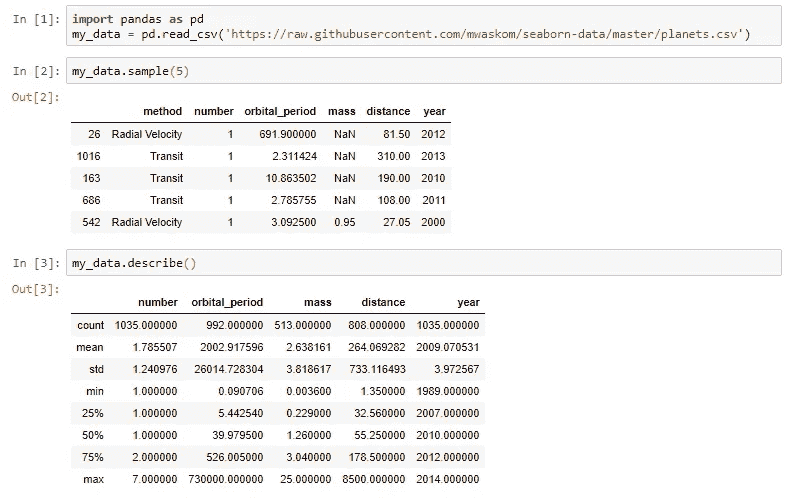
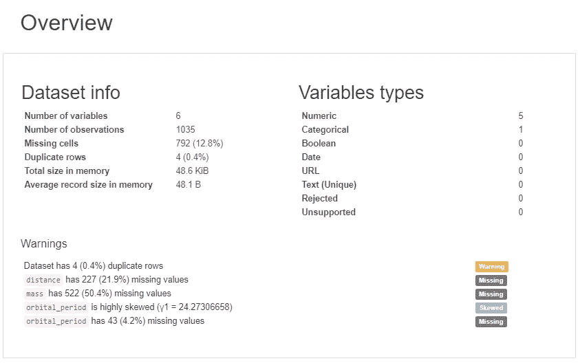
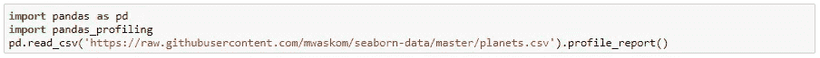
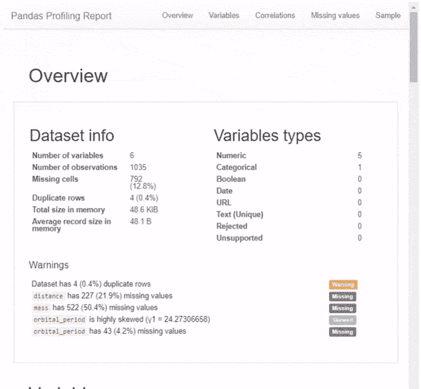

# 仅用一行 Python 代码探索您的数据

> 原文：<https://towardsdatascience.com/exploring-your-data-with-just-1-line-of-python-4b35ce21a82d?source=collection_archive---------2----------------------->


A pretty picture to catch your eye.

在不到 30 秒的时间内完成所有标准数据分析。熊猫侧写的奇迹。

## 谢谢你。

这是一篇非常短的文章，但在我们开始之前，我只想对所有阅读并分享我上一篇文章的人表示感谢: [**Python 窍门 101，每个新程序员都应该知道的事情**](/python-tricks-101-what-every-new-programmer-should-know-c512a9787022) 。招待会完全是疯狂的。掌声和观点的数量完全使我的其他文章相形见绌。所以谢谢，让我们继续吧！

# 香草熊猫之路(无聊之路)


任何使用 Python 处理数据的人都会熟悉 pandas 包。如果你不是，pandas 是大多数行列格式数据的首选包。如果您还没有 pandas，请确保在您的首选终端中使用 pip install 安装它:

```
pip install pandas
```

现在，让我们看看默认的 pandas 实现能为我们做些什么:



Pretty decent, but also bland.. And where did the “**method**” column go?

对于那些不知道上面发生了什么的人:

任何熊猫' DataFrame '都有一个. describe() 方法返回上面的摘要。但是，请注意，在该方法的输出中，分类变量丢失了。在上面的例子中，输出中完全省略了"**方法**"列！

让我们看看我们是否能做得更好。
(提示:… *我们可以！*)

# 熊猫侧写(奇特的方式)



This is just the beginning of the report.

如果我告诉您，我只用 3 行 Python 代码*(如果不计算我们的导入，实际上只有* ***1 行代码)就可以生成以下统计数据，您会怎么想？)* :**

*   **要素**:类型、唯一值、缺失值
*   **分位数统计**如最小值、Q1、中值、Q3、最大值、范围、四分位间距
*   **描述性统计**如均值、众数、标准差、总和、中位数绝对偏差、变异系数、峰度、偏度
*   **最频繁值**
*   **直方图**
*   **相关性**突出显示高度相关的变量、Spearman、Pearson 和 Kendall 矩阵
*   **缺失值**缺失值的矩阵、计数、热图和树状图

*(特性列表直接来自* [*【熊猫仿形】GitHub*](https://github.com/pandas-profiling/pandas-profiling) *)*

我们可以。通过使用熊猫概况包！要安装 Pandas Profiling 软件包，只需在您的终端中使用 pip install:

```
pip install pandas_profiling
```

经验丰富的数据分析师乍一看可能会嘲笑这种方式过于浮华，但它绝对有助于快速获得数据的第一手印象:



See, 1 line, just as I promised! #**noclickbait**

首先你会看到的是**概述**(见上图)，它给出了你的数据和变量的一些非常高级的统计数据，以及**警告**，比如变量之间的高相关性、高偏斜度等等。

但这还不是全部。向下滚动我们会发现该报告有多个部分。简单地用图片展示这个一行程序的输出并不公平，所以我制作了一个 GIF:



我强烈建议您亲自探索这个包的特性——毕竟，它只是一行代码，您可能会发现它对您未来的数据分析很有用。

```
import pandas as pd
import pandas_profiling
pd.read_csv('[https://raw.githubusercontent.com/mwaskom/seaborn-data/master/planets.csv').profile_report()](https://raw.githubusercontent.com/mwaskom/seaborn-data/master/planets.csv').profile_report())
```

# 更像这样

如果您喜欢这些易于应用的东西来改进您的 Python 工作流，请看看我的新文章:

[](/7-things-to-quickly-improve-your-data-analysis-in-python-3d434243da7) [## 快速改进 Python 数据分析的 7 件事

### 让您的数据分析更上一层楼！

towardsdatascience.com](/7-things-to-quickly-improve-your-data-analysis-in-python-3d434243da7) 

# 结束语

这只是一个非常快速和简短的问题。我刚刚发现熊猫在给自己做简介，所以想和大家分享一下！

希望你觉得有用！

如果你想多看多学，一定要 [**关注我上媒**](https://medium.com/@peter.nistrup) 🔍**[**碎碎念**](https://twitter.com/peternistrup) 🐦**

**[](https://medium.com/@peter.nistrup) [## 彼得·尼斯特鲁普-中等

### 阅读彼得·尼斯特拉普在媒介上的作品。数据科学、统计和人工智能...推特:@PeterNistrup，LinkedIn…

medium.com](https://medium.com/@peter.nistrup)**