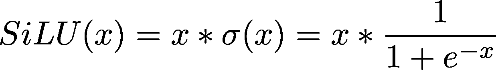
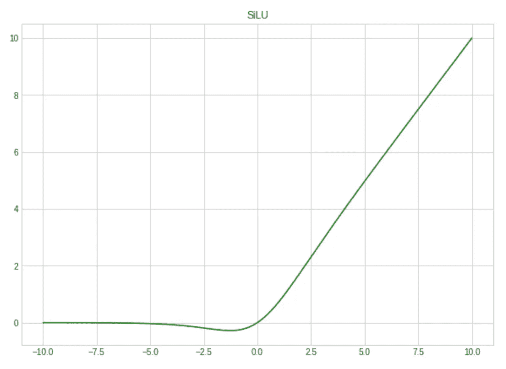
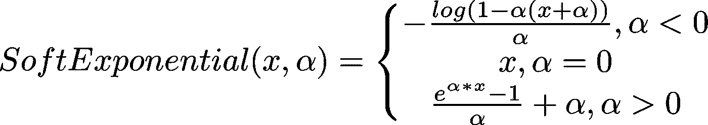
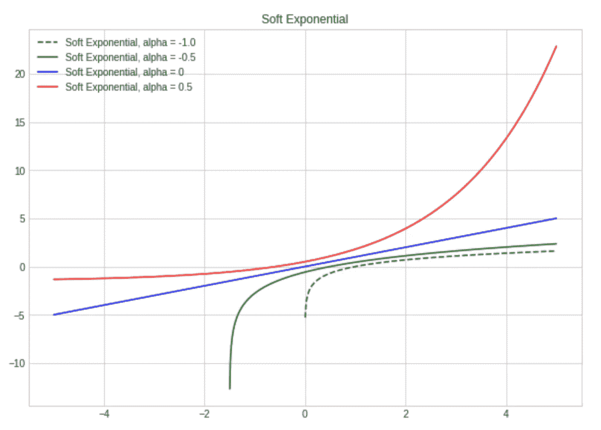
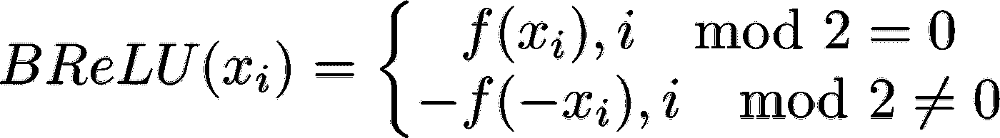
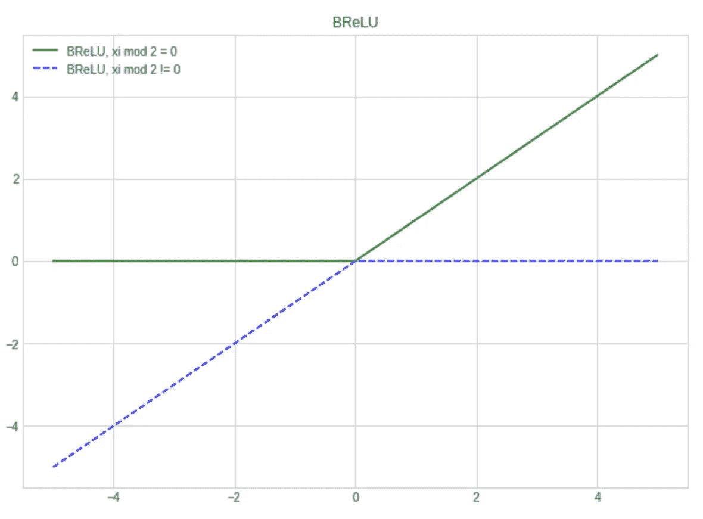

# 用自定义激活函数扩展 PyTorch

> 原文：<https://towardsdatascience.com/extending-pytorch-with-custom-activation-functions-2d8b065ef2fa?source=collection_archive---------5----------------------->

Photo by [chivozol](https://www.pexels.com/@chivozol-43727?utm_content=attributionCopyText&utm_medium=referral&utm_source=pexels) from [Pexels](https://www.pexels.com/photo/close-up-photography-of-spider-web-167259/?utm_content=attributionCopyText&utm_medium=referral&utm_source=pexels)

## PyTorch 和深度学习初学者教程

# 介绍

今天，深度学习正在迅速传播，并被应用于各种机器学习问题，如图像识别、语音识别、机器翻译等。有各种高度可定制的神经网络架构，当给定足够的数据时，它们可以适合几乎任何问题。每个神经网络都应该被精心设计以足够好地适应给定的问题。您必须微调网络的超参数(学习率、下降系数、权重衰减和许多其他参数)以及隐藏层的数量和每层中的单元数量。**为每一层选择正确的激活函数也至关重要，可能会对模型的度量分数和训练速度产生重大影响**。

# 激活功能

[激活函数](https://en.wikipedia.org/wiki/Activation_function)是每个神经网络的基本构建模块。我们可以从流行的深度学习框架的大量流行激活函数中进行选择，如 [ReLU](https://en.wikipedia.org/wiki/Rectifier_(neural_networks)) 、 [Sigmoid](https://en.wikipedia.org/wiki/Sigmoid_function) 、 [Tanh](https://en.wikipedia.org/wiki/Hyperbolic_function) 以及许多其他函数。

然而，要创建一个特别为您的任务定制的最先进的模型，您可能需要使用自定义激活功能，这是您正在使用的深度学习框架中所没有的。激活功能可以根据复杂性大致分为以下几组:

1.  **简单的激活功能**如[路斯](https://arxiv.org/pdf/1710.09967.pdf)、[平方根倒数单元(ISRU)](https://arxiv.org/pdf/1710.09967.pdf) 。你可以使用任何深度学习框架快速实现这些功能。
2.  **具有可训练参数**的激活功能，如[软指数](https://arxiv.org/pdf/1602.01321.pdf)激活或 [S 形整流线性单元(SReLU)](https://arxiv.org/pdf/1512.07030.pdf) 。
3.  **激活功能，在某些点**不可微，需要自定义实现后退步骤，例如[双极整流线性单元(BReLU)](https://arxiv.org/pdf/1709.04054.pdf) 。

在本教程中，我将介绍使用 [PyTorch](https://pytorch.org) 框架实现和演示所有这些类型的函数。你可以在 GitHub 上找到这篇文章[的所有代码。](https://github.com/Lexie88rus/Activation-functions-examples-pytorch/blob/master/custom_activations_example.py)

# 安装

要浏览激活函数的实现示例，您需要:

*   安装 [PyTorch](https://pytorch.org/get-started/locally/) ，
*   要将必要的导入添加到脚本中，

The necessary imports

*   为演示准备数据集。我们将使用众所周知的[时尚 MNIST 数据集](https://www.kaggle.com/zalando-research/fashionmnist)。

Prepare the dataset

最后一件事是建立一个示例函数，它运行模型训练过程并打印出每个时期的训练损失:

A sample model training function

现在已经为创建带有定制激活功能的模型做好了一切准备。

# 实现简单的激活功能

最简单常见的激活功能

*   **是可微的**并且不需要手动执行后退步骤，
*   **没有任何可训练参数**。它们的所有参数都应该预先设定。

这种简单功能的一个例子是 [Sigmoid 线性单元或路斯](https://arxiv.org/pdf/1606.08415.pdf)，也称为 Swish-1:

SiLU

这样一个简单的激活函数可以像 Python 函数一样简单地实现:

所以现在路斯可以用在用神经网络创建的模型中。顺序:

或者在一个简单的模型中，它扩展了 nn。模块类别:

# 用可训练参数实现激活功能

有很多带参数的激活函数，可以在训练模型的同时用梯度下降法进行训练。其中一个很好的例子是[软指数](https://arxiv.org/pdf/1602.01321.pdf)函数:

Soft Exponential

要使用可训练参数实现激活功能，我们必须:

*   从 nn 派生一个类。模块，并使该参数成为其成员之一，
*   将参数包装为 PyTorch 参数，并将 requiresGrad 属性设置为 True。

以下是软指数的一个例子:

现在，我们可以在模型中使用软指数，如下所示:

# 用自定义后退步骤实现激活功能

激活功能的完美例子是 [BReLU](https://arxiv.org/pdf/1709.04054.pdf) (双极性整流线性单元)，它需要实现自定义的后退步骤:

BReLU

此函数在 0 处不可微，因此自动梯度计算可能会失败。这就是为什么我们应该提供一个自定义的后退步骤来确保稳定的计算。

要使用后退步骤实现自定义激活功能，我们应该:

*   创建一个继承 torch.autograd 函数的类，
*   重写静态向前和向后方法。Forward 方法只是将函数应用于输入。向后方法是在给定损失函数相对于输出的梯度的情况下，计算损失函数相对于输入的梯度。

让我们看一个 BReLU 的例子:

我们现在可以在模型中使用 BReLU，如下所示:

# 结论

在本教程中，我介绍了:

*   如何用 PyTorch 创建一个**简单的自定义激活函数**，
*   如何创建一个带有可训练参数的**激活函数，该函数可以使用梯度下降进行训练，**
*   如何创建一个自定义后退的**激活函数？**

本教程的所有代码都可以在 [GitHub](https://github.com/Lexie88rus/Activation-functions-examples-pytorch/blob/master/custom_activations_example.py) 上获得。为 [PyTorch](https://pytorch.org) 和 [Keras](https://keras.io) 实现定制激活功能的其他例子可以在[这个 GitHub 库](https://github.com/digantamisra98/Echo/tree/Dev-adeis)中找到。

# 改进

在构建许多自定义激活函数时，我注意到它们通常会消耗更多的 GPU 内存。使用 PyTorch 就地方法创建定制激活的**就地实现**改善了这种情况。

# 附加参考

以下是额外资源和进一步阅读材料的链接:

1.  [激活功能 wiki 页面](https://en.wikipedia.org/wiki/Activation_function)
2.  【PyTorch 扩展教程