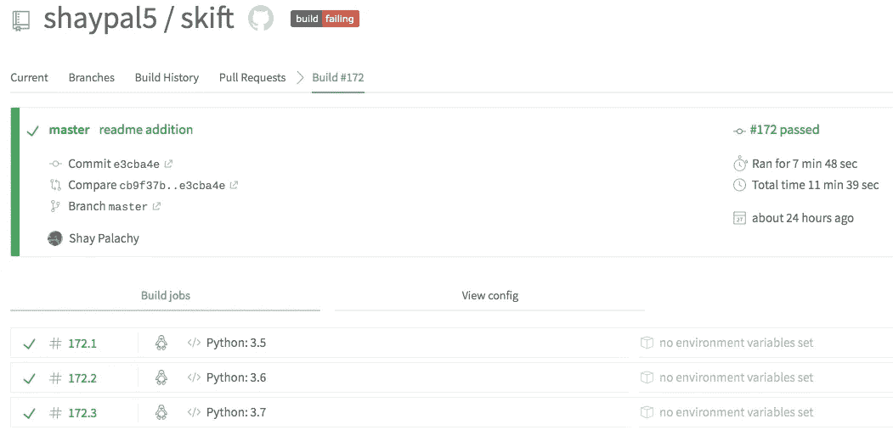
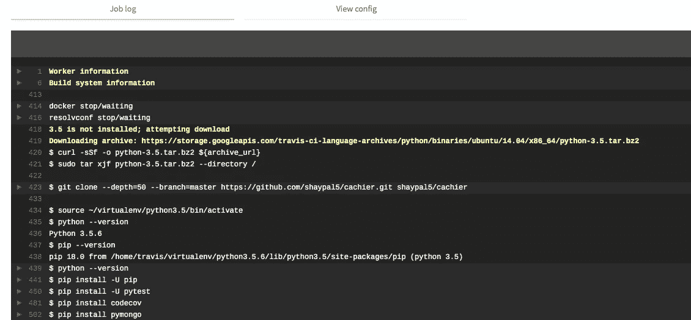
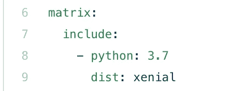
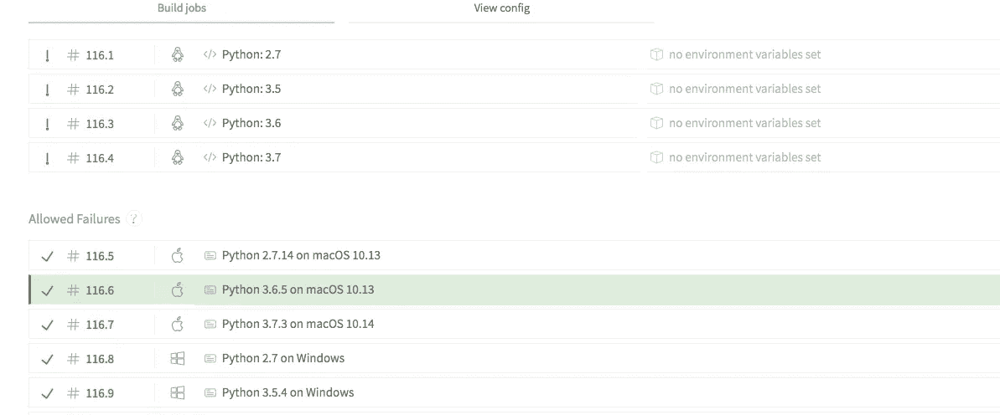

# 在 Travis CI 上进行广泛的 Python 测试

> 原文：<https://towardsdatascience.com/extensive-python-testing-on-travis-ci-4c24db9bf961?source=collection_archive---------17----------------------->

## 在几种操作系统上测试开源 Python

假设您有一个正在维护的开源 Python 项目或包。您可能想在目前广泛使用的主要 Python 版本上测试它。你绝对**应该**。在某些情况下，您可能还需要在不同的操作系统上测试它。在这篇文章中，我将讨论这两种情况，并建议一种方法来做到这一点。

为了这篇文章，我假设你是:

1.  在 Github 上托管你的**开源**项目。
2.  使用`pytest`来测试你的代码。
3.  检查代码覆盖率。
4.  您希望向免费服务 [codecov.io](https://codecov.io/gh/shaypal5/cachier) 提交覆盖率统计数据，以便在您的 repo 上有一个漂亮的[动态测试覆盖率徽章。](https://github.com/shaypal5/pdpipe)

因为这是一个很好的简单流程，也是我使用的流程。然而，这里介绍的方法可以很容易地适用于其他流程。

下面的帖子向你展示了产生 *.travis.yml* 文件的[结构的各个阶段和合理性，该文件全面涵盖了不同 Python 版本和操作系统上的测试。如果你对这些都不感兴趣，你可以看看我为它创建的 GitHub gist 的最终结果。](https://gist.github.com/shaypal5/7fd766933fb265af6f71a88cb91dd08c)

# Travis 的基本 Python 测试

在几个 Python 版本上测试代码的一个很好的方法是使用 [Travis CI](https://travis-ci.org) 服务，它为开源(即公共)GitHub 项目提供(除了其他特性之外)基于云的持续测试**免费**。让我简单地向您介绍一下 Travis 的基本 Python 测试。如果你熟悉这个话题，请随意跳过。

要使用 Travis，只需遵循以下三个步骤:

1.  向 Travis 注册 GitHub，允许 Travis 访问您的项目。
2.  在[您的存储库页面](https://travis-ci.org/account/repositories)中为您想要测试的存储库启用 Travis。
3.  将一个`.travis.yml`文件放在您的存储库的根目录下；这个文件将告诉 Travis 应该如何构建和测试这个特定的项目。

## . travis.yml 文件

那么假设你有一个[小 Python 包](https://github.com/shaypal5/skift)，带[一个简单的](https://github.com/shaypal5/skift/blob/master/setup.py) `[setup.py](https://github.com/shaypal5/skift/blob/master/setup.py)` [文件](https://github.com/shaypal5/skift/blob/master/setup.py)。您有下面这个非常基本的`.travis.yml`，它通过几个 Python 版本运行您的测试:

让我们检查一下上述文件的每个部分:

*   第一行声明我们正在构建一个 Python 项目。
*   第二个条目详细描述了我们想要构建的 Python 版本:2.7、3.5 和 3.6。
*   第三个条目按顺序详细说明了我们想要运行的预安装命令集。我使用四个命令:
    (1) `python --version`来查看我正在运行的**确切的** Python 版本。因为你总是要使用最新的画中画。有些构建会因为没有这个而失败(比如 Python 2.7，对我来说)。
    (3)`pip install -U pytest`——我已经决定一直这样做，因为这又一次让我免于失败。对于我目前的一些项目，如果我只有`pip install pytest`而没有`-U`来更新，Python 3.6 将会失败。
    (4) `pip install codecov` —因为我只在 Travis 上使用它，而不是在本地，所以它不是我的包的额外`[test]`依赖项的一部分。
*   第四个条目详细介绍了安装命令。在这种情况下，由于命令在存储库的根文件夹中运行，并且我们有一个 pip-installable 包，我们用可选的测试依赖项`pip install`“this”文件夹(so `.`)。我的包的测试依赖通常是集成了两者的`pytest`、`coverage`和`pytest-cov`。
*   第五个条目详细描述了要运行的构建/测试脚本。我们只想运行`pytest`。我假设您在一个`pytest.ini`文件中详细描述了`pytest`的所有 CLI 参数。当我们开始添加内容时，这将有助于保持`.travis.yml`文件的整洁。这里有一个`pytest.ini`的例子:

*   最后一项详细描述了测试脚本成功完成后要运行的命令。在我们的例子中，我们只想向 [codecov.io](https://codecov.io/gh/shaypal5/cachier) 报告测试覆盖结果，所以我们运行相应包的命令。它将获取由我们的`pytest`运行生成的覆盖报告，并将其发布到那里。如果您想要任何构建的覆盖率结果——失败的或者成功的——只需将这一行作为`script`条目的第二项。

## 特拉维斯建造

有了这个配置，每次提交到您的存储库都会触发 Traivs CI 上相应项目的良好构建，每个构建由每个 Python 版本的一个作业组成(都在 Linux 机器上)，如下所示:



A travis build consisting of several jobs

您还可以进入每个作业的日志，查看每个命令的结果，无论是实时的还是事后的:



A log for a specific job in a Travis build

在几个 Python 版本上测试您的 Python 代码的另一种方法是使用 [tox，这是一个自动化和标准化 Python 测试的强大工具](https://tox.readthedocs.io/en/latest/)。我支持上面的方法，因为它的*one job = = one Python version*方法意味着构建完成得更快(因为在 Travis 上有多达三个作业并行运行)，并且您可以立即了解哪个版本给您带来了麻烦，而无需深入查看日志。当然这只是我个人的喜好。

## 事情急转直下…

当我们试图使用上述结构来测试 Python 3.7 时，多版本 Python 测试中的第一个复杂性出现了。如果您只是在 Python 版本条目中添加了`3.7`，那么您的新 3.7 版本将很早就失败，需要寻找一个足够的归档。这是因为 Linux 构建默认运行在 Ubuntu 14.04(昵称`trusty`)上，而 Python 3.7 和更高版本的作业需要 Ubuntu 16.04(昵称`xenial`)。

你可以通过在你的`.travis.yml`文件中添加一个`dist: xenial`条目来解决这个问题，让所有版本的作业都建立在 Ubuntu 16.04 上。但是如果你喜欢在 Ubuntu 14.04 上测试较低版本，并且只在 Python 3.7 上使用`xenial`呢？虽然这可能是一个可以忽略的特例，但它将允许我以渐进的方式介绍 Travis 构建矩阵，这些将在稍后被证明是至关重要的，所以请跟我来。

# 构建矩阵和 Python 3.7

在 Travis 中有两种方法可以指定多个并行作业。首先是为影响构建环境的多个条目提供多个选项；所有可能组合的[构建矩阵](https://docs.travis-ci.com/user/build-matrix/)被自动创建并运行。例如，以下配置生成一个扩展到 4 个单独(2 * 2)作业的构建矩阵:

第二个是在`matrix.include`中指定您想要的配置的精确组合。继续上面的例子，如果 Python 2.7 不支持并行化，您可能更喜欢指定三个特定的作业:

或者，在我们的例子中，要在`xenial`上运行 Python 3.7 作业，添加一个条目:



酷毙了。因此，我们看到了在 Travis 上测试 Python 3.7(Python 的特殊雪花)的两种方法，并对 Travis 构建矩阵有了一些了解。我们继续吧。

# 在其他操作系统上测试 Python 项目

因此，您正在 Python 的每个重要主要版本上测试您的简单纯 Python 包。你是一个负责任的开源贡献者。为你欢呼。

但是如果你的 Python 项目不是纯血统，而是包含一些专门的 C++代码的麻瓜呢？或者也许你的代码*是*纯 Python，但是它与操作系统交互(例如写文件、处理线程或进程等。)从某种意义上说，这在不同的操作系统之间会有所不同？

如果是这样的话，如果您希望您的项目支持这三种主要的操作系统，那么您肯定应该在这三种操作系统上测试您的代码(也可能构建它)。

对我自己来说，需求来自两个项目，都是纯 Python:

1.  第一个是 [*Cachier*](https://github.com/shaypal5/cachier) ，一个为 Python 函数提供持久、无陈旧、本地和跨机器缓存的包。当我写文件时，为了多线程的安全，我不得不锁定文件，结果是当一个 Windows 用户第一次试图使用我的包时，我的内置解决方案(使用`fcntl`)崩溃了。
2.  第二个是 [*Skift*](https://github.com/shaypal5/skift) ，为[Python*fast text*](https://github.com/facebookresearch/fastText/tree/master/python)实现[*scikit-learn*](http://scikit-learn.org)wrappers。实现需要以不同的编码读写文件，在某些情况下，这在不同的操作系统上表现不同。

我选定的解决方案是扩展 Travis 构建矩阵，以包含操作系统和主要 Python 版本的特定组合，每个版本都在完全独立的环境中运行，各司其职。

同样，当将这种方法与使用`tox`进行比较时，我要说的主要优势是:

1.  把复杂性和责任从你身上卸给特拉维斯。
2.  获得真实环境的更准确的表示:直接在操作系统级安装单一版本的纯 Python，而不是通过`tox`。这是大多数小型开源 Python 项目用户安装代码的方式。
3.  *一个作业==一个 OS 版本和一个 Python 版本*。您可以立即看到构建是否因为您的测试在特定 Python 版本(例如，所有操作系统上的 2.7 版本)、特定操作系统(Windows 上的所有 Python 版本)或特定组合上失败而失败。这在作业视图中非常明显:



We obviously have a Linux-related build problem

希望我已经让你相信这是一种有效的多操作系统测试方法，所以我们可以进入细节了。我们将从在 macOS 上进行测试开始，到在 Windows 上结束。

## 在 macOS 上测试 Python 项目

在撰写本文时， [Python 版本在 macOS 环境](https://docs.travis-ci.com/user/languages/python/)中不可用。这并不意味着不可能用 Travis 在 macOS 上测试 Python，只是下面这种幼稚的方法行不通:

无论你给`python`键分配什么版本号，你都会得到一台安装了 Python 3.6.5 的 macOS 机器。这是因为请求一台带有`os: osx`的机器会启动一台使用默认 Xcode 映像[的机器，对于 Travis](https://docs.travis-ci.com/user/reference/osx/) 来说，默认 Xcode 映像当前是 Xcode 9.4.1。

当前获取特定 Python 版本的 macOS 机器的黑客方式是使用`osx_image`标签请求一个特定的 Xcode 映像，您知道它预装了您想要使用的 Python 版本。

例如，要获得一台装有 Python 3.7 的机器，您可以添加条目`osx_image: xcode10.2`(具体来说，您将获得 Python 3.7.3)。酷毙了。那么如何知道哪个 Xcode 映像来自哪个 Python 版本呢？不幸的是，这个映射在 Travis 的网站或文档中没有列出。

不过，你很幸运，我做了肮脏的工作，挖出了这个信息。这基本上意味着[积极地在 Travis 的博客中搜索关于 Xcode 图片的帖子](https://blog.travis-ci.com/search?q=xcode+python)发布版，以搜寻每张图片的 Python 版本。我发现的主要 Python 版本的最新版本有:

*   `xcode9.3` —预装 Python 2.7.14_2
*   `xcode9.4` —预装在 Python 3.6.5 中
*   `xcode10.2` —预装 Python 3.7.3

不幸的是，我还没有找到 Python 3.5 预装的 Travis Xcode 映像(如果有，请告诉我！).

所以你得到了正确的 Xcode 标签。然而，您仍然需要修改一些构建命令。例如，对于 Python 3 版本，我们需要显式调用`pip3`和`python3`来安装和调用(分别)Python 3 代码，因为 macOS 预装了 Python 2(这是`python`命令所指向的):

考虑到这一点，您可能会认为 Python 2 作业需要更少的自定义条目。不幸的是，因为我们使用的是 OS Python，所以 pip 安装命令需要附加 Python 2 的`--user`标志。此外，结果是他们的 CLI 命令不会被安装，所以我们将不得不再次通过`python`命令调用他们的命令:

很好，我们已经完成了在 macOS 上测试 Python。吃块饼干吧。


A cookie

## 在 Windows 上测试 Python 项目

Travis 对 Windows 版本的支持还处于早期阶段。目前，仅支持 Windows Server(版本 1803)。这不是 Python 自带的，而是 Chocolatey 自带的，它是 Windows 的一个包管理器，我们将用它来安装 Python。

因为我们使用 Chocolatey 来安装 Python，所以我们受限于通过它可以获得的版本。对于 Python 3，它们是 3.5.4、3.6.8 和 3.7.4。对于 Python 2，版本 2.7.16 是当前默认安装的版本。

下面是获取 Windows-Python 作业的作业条目的简单变体，它包括 Chocolatey install 命令`choco`和一个环境变量设置:

如您所见，通用的`script`和`after_success`阶段工作得很好。你可以看一下最终文件[来了解每个版本所需的细微变化，包括 Python 2.7。](https://gist.github.com/shaypal5/7fd766933fb265af6f71a88cb91dd08c)

# 最终注释

到目前为止，我们已经介绍了几乎所有常见操作系统和重要 Python 版本的组合。结合我们上面看到的零碎内容，我们可以得出一个不那么短的`.travis.yml`文件，为 Python 项目提供全面的测试，你可以在我创建的 [Github gist](https://gist.github.com/shaypal5/7fd766933fb265af6f71a88cb91dd08c) 中找到它。

然而，在我结束这篇文章之前，我想补充一些最后的注释。

## 允许失败和快速完成

在某些情况下，您可能希望在您预计会失败的特定操作系统版本组合上连续测试您的代码，例如当某些测试在 Windows 上失败，但您正准备在不久的将来添加 Windows 支持时。在这种情况下，最好不要因为这样的工作而导致整个构建失败，这样您就不会收到烦人的构建失败通知(还因为您可以在 repo 上展示一个漂亮而闪亮的“build: passing”徽章)。


Gandalf being a dick about a failing Windows job

您可以通过在矩阵条目下添加一个`allow_failures`条目来实现这一点，详细说明允许作业失败的键值对。例如，要允许 macOS 上的 Python 3.7 失败，请使用:

```
matrix:
  - allow_failures:
      - os: osx
        osx_image: xcode 10.2
```

设置`- os: windows`将允许所有 Windows 构建失败。

此外，如果您已经在使用`allow_failures`逻辑，您可能想要利用`fast_finish`功能。一旦所有不允许失败的任务完成，设置`fast_finish: true`将决定整体构建状态——通过或失败，而其余的任务保持运行。这在小型开源项目中通常并不重要，但是拥有它是很好的，特别是当一些外来的操作系统或 Python 版本的任务被允许失败**和**需要很多时间的时候。

## 针对开发分支的测试

您可以通过添加相应的条目来针对不同 Python 版本的开发分支测试您的代码，比如在`python`键下的`3.7-dev`。要测试的一个重要的开发分支可能是`3.8-dev`，为即将到来的事情做准备。您可能还希望允许所有使用开发分支的作业失败。

## Python 版本或基于操作系统的逻辑

我介绍的解决方案将 macOS 和 Windows 版本的大部分特殊代码放在构建矩阵中。但是，如果您有一些特定于 Python 版本的安装或测试代码，但应该在所有操作系统上运行，则可以根据相应 Travis 环境变量的值来调整命令:

```
if [ "$TRAVIS_PYTHON_VERSION" == "2.7" ]; then pip install . ancient_testing_packge; else pip install ".[test]"; fi
```

要对同一操作系统的所有作业执行相同的操作，请使用:

```
if ["$TRAVIS_OS_NAME" == "linux"]; then pip install . special_linux_packge; else pip install ".[test]"; fi
```

当然，如果是这种情况，您可能应该考虑在您的`setup.py`文件中更干净地处理这个问题，通过基于 Python 版本或操作系统(使用 Python 代码推断)动态地为`test`构建`extras_require`。

感谢你通读这篇文章。希望你觉得有用。:)
同样，您可以在专用的 [Github gist](https://gist.github.com/shaypal5/7fd766933fb265af6f71a88cb91dd08c) 中查看完整的结果`.travis.yml`文件。

如果您有任何意见、更正或改进的想法，请写在下面，或者通过我的个人网站联系我[。干杯！](http://www.shaypalachy.com/)