# 外部产品

> 原文：<https://towardsdatascience.com/exterior-product-ecd5836c28ab?source=collection_archive---------16----------------------->

## 为什么线性代数可能不是最后的空间数学形式

# 线性代数

在使用线性代数一段时间后，你开始忘记一些小东西并没有真正的意义。

## 决定因素

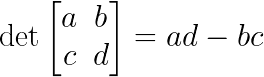

之字形图案起初令人困惑，但你被告知要放心。你可以认为矩阵 A 的行列式等于它的向量所覆盖的面积。

好的，那么下面矩阵的行列式呢？

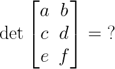

原来，行列式只为方阵定义。🤔

好吧，但是如果你有两个矩阵 A 和 B 的面积，你当然可以把它们加起来！

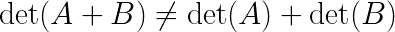

不，结果是没有人知道 lhs 是否是 rhs 的一个功能。

## 交叉乘积

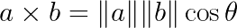

几何学上，叉积指的是两个向量 a 和 b 的平行四边形所跨越的面积。

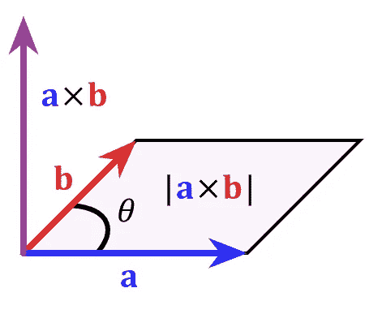

[https://en.wikipedia.org/wiki/Cross_product](https://en.wikipedia.org/wiki/Cross_product)

但是由于某种神秘的原因，叉积只定义在ℝ上。🤔

想想看，当你处理任何类型的数据集时，你都在处理比ℝ大得多的维度，所以为什么你会在深度学习代码中看到内积，而不是叉积，尽管它确实计算了一些有用的东西。

老实说，挥动你的手指并根据你的选择改变你的计算结果也很奇怪。如果你维护一个物理相关的代码库，你需要确保你正在使用的所有库都有足够的方向转换。

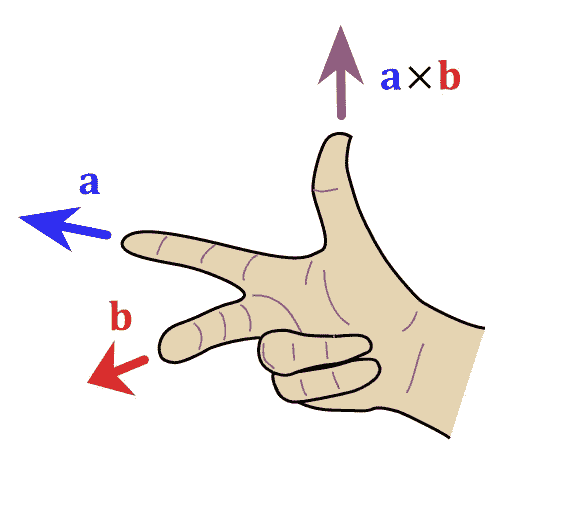

[https://en.wikipedia.org/wiki/Cross_product#/media/File:Right_hand_rule_cross_product.svg](https://en.wikipedia.org/wiki/Cross_product#/media/File:Right_hand_rule_cross_product.svg)

# 我们能做得更好吗？

原来，线性代数只是在麦克斯韦公布了他著名的方程之后才变得流行起来，但是还有其他人，比如格拉斯曼和克利福德，正在用不太为人所知的形式来工作，使得某些空间运算变得更加简单。

虽然现在研究几何代数的细节可能看起来很深奥，但考虑到在可预见的未来，我们将与深度模型和制造机器人一起工作，因此我们的数学工具自然会进化以更好地适应我们。

# **外部产品**

为了体验用几何代数可以做的事情，我们将看看外部产品。

外积定义为某个向量空间 V 中的 a ∧ b，其中 a，b ∈ V。

它需要满足两个属性

1.**反对称** : a ∧ b =-b ∧ a

2.**双线性** : a ∧ (b + λ c) = a ∧ b + λ a ∧ c

到目前为止，这两个性质似乎很抽象，但让我们看一个反对称和双线性成立的例子。几何！

## 决定因素

我们取一个平行四边形，边向量为 a 和 b。

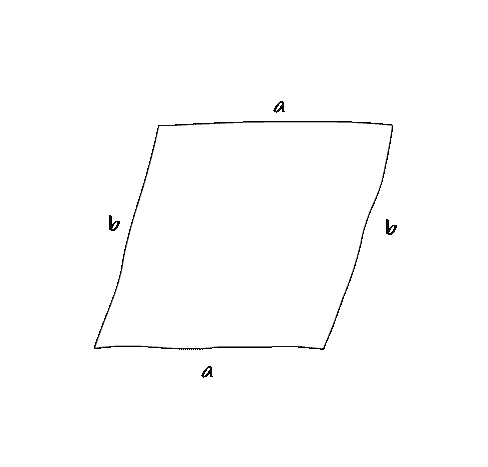

> 问:如果我们将 b 加倍，平行四边形的面积如何变化？
> 
> a:面积(a，2b) = 2 面积(a，b)
> 
> 问:如果我们将 b 乘以-2，平行四边形的面积会如何变化？
> 
> a:面积(a，-2b) =面积(a，2b) = 2 面积(a，b)
> 
> 问:如果我们把 c 加到 b 上，平行四边形的面积如何变化？
> 
> a:面积(a，b + c) =面积(a，b) +面积(a，c)

区域也有一个方向，这是我们在线性代数中通常忽略的，但对于像计算机图形中的碰撞检测和剔除这样的问题是有用的。

面积(a，b)是旋转远离屏幕的面积，面积(b，a)是旋转朝向屏幕的面积，它们的关系是面积(a，b)=-面积(b，a)

我们可以把这些例子归纳成 3 条定律

1.面积(a，b)=-面积(b，a)

2.面积(λ a，b) = λ面积(a，b)

3.面积(a，b + c) =面积(a，b) +面积(a，c)

现在，如果我们将 Area(a，b)重命名为 a ∧ b，你会看到平行四边形的面积只是楔形积的一个特殊应用

1.  a ∧ b =-b ∧ a

2.(λ a) ∧ b = λ (a ∧ b)

3.a ∧ (b + c) = a ∧ b + a ∧ c

在线性代数中，我们通常认为向量或矩阵是保存ℝ元素的容器，因此一个 n 维向量保存 n 个ℝ.元素相反，我们可以把一个 n 维向量看作ℝ^n 的一个元素，并在这个更高层次的结构上执行我们的计算。

任何向量都可以用基向量来表示。在二维空间中，我们有两个基向量:

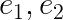

我们可以用它们的基向量来表示 a 和 b

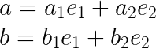

楔形积∧有一个重要的性质

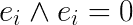

现在如果我们取 a ∧ b

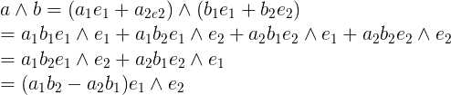

我们拿回**行列式**公式！在任何时候我们都没有把自己局限在方阵中。

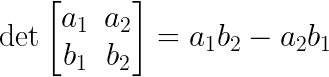

## 交叉乘积

叉积通常定义在ℝ上，这意味着我们需要计算 3 个基本向量

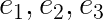

我们想用两个向量 a 和 b。

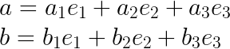

如果我们取他们的楔形积∧

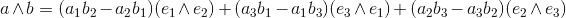

如果我们看看这些系数，它们看起来和典型的叉积是一样的。

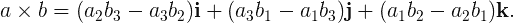

这个定义没有理由只适用于ℝ，我们可以很容易地把它推广到ℝ⁴和更远的地方。

但是我们不用 I，j，k 作为基本向量，而是用 e ∧ e，这是一个更高维的空间。这是几何代数中的一个普遍主题。

在线性代数中，我们通常认为向量是矩阵，是保存ℝ元素的容器，所以一个 n 维向量保存 n 个ℝ.元素相反，我们可以把一个 n 维向量看作ℝ^n 的一个元素，并在这个更高层次的结构上执行我们的计算。

# **下一步**

> 几何代数是一种数学语言，用于规划几何问题。

由于深度学习和机器人技术变得如此流行，我们极有可能在未来做更多的几何。如果线性代数不能像几何代数那样自然地表达几何问题，为什么要选择它这样一种流行的形式主义呢？

我只讨论了一个运算符，即 wedge product∧——它还有很多应用，了解它们的一个好方法是查看下面的参考资料。

*   [计算机科学的几何代数](https://www.amazon.com/Geometric-Algebra-Computer-Science-Revised/dp/0123749425/ref=sr_1_8?keywords=geometric+algebra&qid=1570577296&s=books&sr=1-8)—这本书令人惊奇的地方在于，它详细介绍了构建一个高效的几何代数库和渲染器的所有细节，你可以随意摆弄。这是我最喜欢的几何代数书，但不可否认它很难阅读，据我所知，没有教科书对初学者非常友好，但这应该改变，因为越来越多的人开始注意形式主义的优点。
*   [R 上的几何代数介绍](https://bitworking.org/news/ga/2d) —伟大的几何代数第一次介绍。我强烈建议你在检查动画时也检查源代码，看看一切是如何工作的。
*   [线性代数做对了](https://www.amazon.com/Linear-Algebra-Right-Undergraduate-Mathematics/dp/0387982582)在我看来是我读过的线性代数理论方面最好的介绍。(比 Strang 清晰)。它将帮助你把矩阵看作线性映射，这简化了对矩阵所有性质的理解。
*   [应用线性代数简介:向量、矩阵和最小二乘](https://www.amazon.com/Introduction-Applied-Linear-Algebra-Matrices/dp/1316518965/ref=pd_sbs_14_6/131-4946721-1001121?_encoding=UTF8&pd_rd_i=1316518965&pd_rd_r=d709bbc8-8dbd-4fcf-8eec-c71269c9779d&pd_rd_w=31Q4B&pd_rd_wg=CBGVR&pf_rd_p=d66372fe-68a6-48a3-90ec-41d7f64212be&pf_rd_r=S5YJ3AAJ9H10G8C1NZA3&psc=1&refRID=S5YJ3AAJ9H10G8C1NZA3)专注于数值线性代数及其在优化和机器学习中的应用。它附带了一个免费的在线指南，介绍了 Julia 中的所有算法，大约和主书一样长。
*   [通过外积的线性代数](https://www.amazon.com/Linear-Algebra-via-Exterior-Products/dp/140929496X/ref=sr_1_1?keywords=linear+algebra+via+the+exterior+product&qid=1570577186&s=books&sr=1-1)是一个很好的参考，它使用外积重新证明了线性代数的所有主要定理。
*   [ganja . js](https://github.com/enkimute/ganja.js)-Javascript 中的几何代数库，有疑问的时候看看代码。通过查看[示例](https://enkimute.github.io/ganja.js/examples/coffeeshop.html#pga3d_points_and_lines)，你会学到很多东西。
*   几何代数在 66 页中给出了严格的介绍。
*   [游戏引擎开发基础，第 1 卷:数学](https://www.amazon.com/Foundations-Game-Engine-Development-Mathematics/dp/0985811749)——涵盖了 3D 图形所需的所有数学知识，这本书的最后一部分致力于 Clifford 和 Grassman 代数。这本书简洁明了，附有大量精美的插图

# 承认

我从来没有想过我会最终研究像几何代数这样的东西，但是亚当·尼梅克多次坚持认为这是值得的，他是对的。他维持着一个有趣而活跃的图形研究人员和数学家的[不和谐社区](https://discordapp.com/invite/vGY6pPk)，讨论如何更广泛地使用几何代数。我还要感谢 u/muntoo 仔细校对了这篇文章。