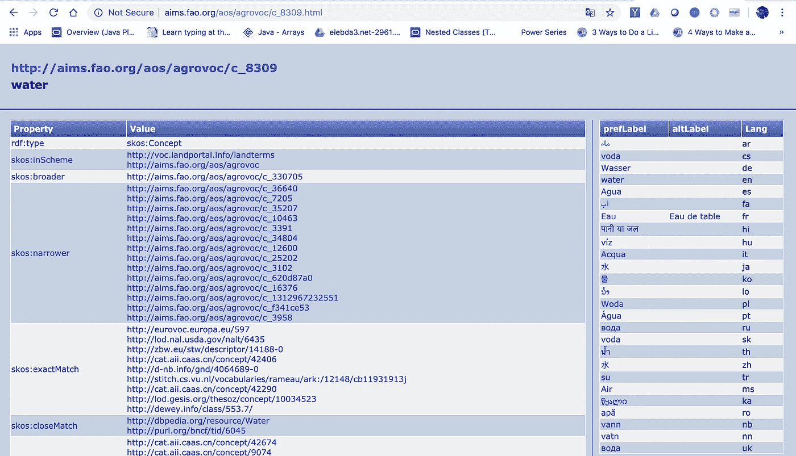

# 使用 Apache Jena (SPARQL 引擎)提取和查询知识图

> 原文：<https://towardsdatascience.com/extract-and-query-knowledge-graphs-using-apache-jena-sparql-engine-5c66648797a4?source=collection_archive---------28----------------------->


Image by LTDatEHU — Pixabay

# 在本文中，我们将使用 Apache Jena 下载、提取和查询 AGROVOC 三元组

**AGROVOC** 是一个受控词汇，涵盖了联合国粮食及农业组织( [FAO](http://www.fao.org/home/en/) )关注的所有领域，包括粮食、营养、农业、渔业、林业、环境等。

AGROVOC 由资源描述框架(RDF)三元组组成。每个三元组由 3 个部分(主语、谓语和宾语)组成，如“Alice — knows — Bob”，其中“Alice”是主语，“knows”是谓语或关系，“Bod”是宾语。然而，由于我们可能有不止一个人的名字叫“爱丽丝”，那么最好给主题添加一个统一的资源标识符(URI ),使其唯一。例如，“http://Google . com/developers/teamA/Alice”现在更容易区分不同的主题。称为**知识图的 RDF 三元组的集合。**

# 为什么我们需要提取三元组？

如果你观察水的 URI`<http://aims.fao.org/aos/agrovoc/c_8309>`，你会注意到最初的实体`c_8309`代表“水”。然而，我们把它的 ID 而不是真正的单词“water ”,因为它也可能存在于其他语言中(查看下图)。因此，我们需要提取实际的单词，而不是 id，这是第一个查询的目的。



The page for the entity “c_8309”, notice the entity names in different languages on the right bar

# 下载要求

*   首先，你需要下载 AGROVOC 数据集。点击这里或在谷歌上搜索 AGROVOC，然后点击“发布”并下载文件“[agro VOC LOD nt(zipped-44 MB)](http://agrovoc.uniroma2.it/agrovocReleases/agrovoc_2019-11-04_lod.nt.zip)”，扩展名“nt”告诉你这是一个三重文件。
*   您还需要下载 Apache Jena，以便我们可以使用 SPARQL 引擎提取和查询数据集。点击这里或者谷歌搜索 Apache Jena 然后下载"[Apache-Jena-3 . 13 . 1 . zip](http://mirror.reverse.net/pub/apache/jena/binaries/apache-jena-3.13.1.zip)([sha 512](https://www.apache.org/dist/jena/binaries/apache-jena-3.13.1.zip.sha512)， [PGP](https://www.apache.org/dist/jena/binaries/apache-jena-3.13.1.zip.asc) )"

# 提取三元组

下载 Apache Jena 后，我们将使用两个主要命令:`tdbloader2`和`tdbquery.`，第一个命令为三元组创建索引以使将来的查询更快，第二个命令允许我们运行 SPARQL 查询。请注意:为了能够使用这些命令，您需要导航到`apache-jena-<version>/bin/`然后运行命令，或者您需要提供其位置的路径，例如`apache-jena-<version>/bin/tdbloader2`

## 为三元组建立索引

```
tdbloader2 --loc Indices agrovoc_2019-06-03_lod.nt
```

注意:`Indices`是存储索引的目录(给出任何名称)。`agrovoc_2019-06-03_lod.nt`是我们从 AGROVOC 下载的输入文件(triples)的名称。

之后，创建一个新文件(我更喜欢扩展名为`.sparql`)并编写以下 SPARQL 查询，该查询只提取英语对象:

```
**SELECT** ?subject ?predicate ?object
**WHERE** {
?subject ?predicate ?object
**FILTER**(lang (?object) = 'en')
}
```

最后，使用以下命令执行查询:

```
tdbquery --loc Indices --query English_Query.sparql 
```

`English_Query.sparql`是查询文件的名称。可以使用 Linux `>`命令将输出定向到一个文件，如下所示:

```
tdbquery --loc Indices --query English_Query.sparql > output.txt
```

## 其他查询示例

另一个简单的查询是返回整个知识图(所有三元组)而不进行任何过滤:

```
**SELECT** ?subject ?predicate ?object
**WHERE** {
?subject ?predicate ?object
}
```

运行以下查询以返回所有以“水”为主题的三元组(不要忘记在水之前包括 URI):

```
**SELECT** ?predicate ?object
**WHERE** {
<water> ?predicate ?object
}
```

注意，在这个例子中，我们没有在查询中包含`?subject`，因为我们的目标是返回与`<water>`主题相关的谓词和对象。

您可以使用非常有用的命令，比如与 SQL 语法非常相似的`FILTER, GROUP BY, HAVING, etc.`。然而，其他数据集可能由四元组而不是三元组组成。四元组由三元组组成，第四部分称为上下文。比如“Alice—knows—Bobs—Google dev department”。您仍然可以使用包含上下文部分的精确查询，因为图中可能有多个上下文。以下查询将返回上下文为“GoogleDevDepartment”的所有四边形:

```
**SELECT** * **WHERE** {
**GRAPH** ?GoogleDevDepartment {
?subject ?predicate ?object
}
}
```

恭喜你，现在你应该能够提取和查询知识图了！