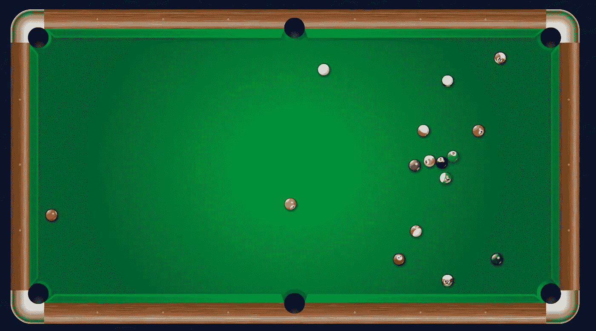
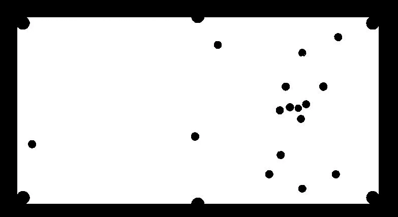
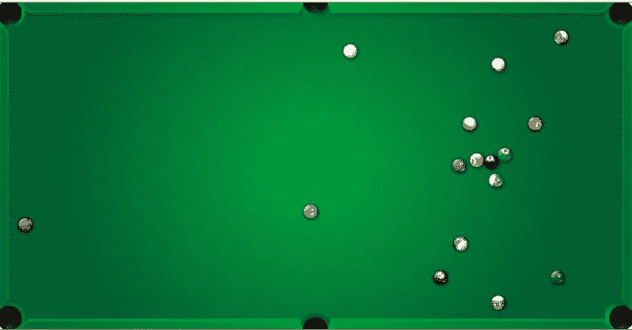
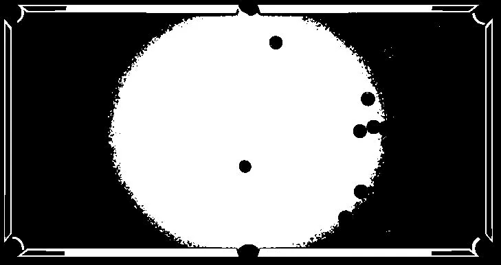
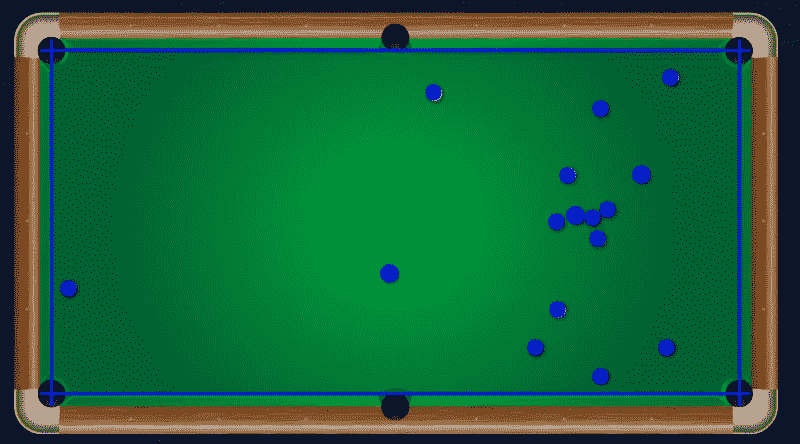

# 使用 OpenCV 和 Python 从图像中提取形状

> 原文：<https://towardsdatascience.com/extracting-circles-and-long-edges-from-images-using-opencv-and-python-236218f0fee4?source=collection_archive---------7----------------------->

## 利用 OpenCV 从图像中高效提取已知形状的物体

欢迎阅读本系列博客中关于使用 OpenCV 和 Python 从图像中提取特征的第一篇文章。

图像和视频的特征提取是计算机视觉领域的一个常见问题。在本帖中，我们将考虑识别台球桌上的球和桌边的任务。

考虑下面这个在线台球游戏的例子。

Screenshot from an online game of pool (image source author)

假设我们想要标记这个图像中每个球的位置以及桌子的四个内边。有多种方法可以做到这一点，对于给定的图像，有些方法比其他方法效果更好。然而，一个有用的方法是尝试根据图像的颜色组成来分离出图像的内容。

例如，在上面的图像中，我们可以看到桌面、球和图像背景都有不同的颜色。

因此，如果我们能够分离出图像中的颜色，我们就离解决问题更近了一步。

一种简单的方法是将 RBG 图像转换成 HSV 格式，然后找出与感兴趣的对象相对应的 H、S 和 V 值的范围。

关于这一步的细节，请参考我的关于 HSV 提取的博客(即将发布)。

一旦我们有了桌面的 HSV 颜色图，我们可以使用 OpenCV **"inRange()"** 函数来获得提取的遮罩的可视化，如下所示。

Image mask generated using OpenCV (image source author)

正如我们所见，这一步骤有助于实现以下目标:

1.  表格对象(白色)与图像背景(黑色)明显不同
2.  球(黑色)与桌面(白色)清晰可辨

作为第一步，我们需要从图像中提取表格对象，以便将注意力集中在表格及其内容上，而忽略图像中的其他对象，例如背景、外部对象等。

现在是应用边缘检测技术从图像中识别和提取所需成分的正确时间。有多个选项可用，如 Canny 和 Sobel 函数，每个都有其优点和缺点。

我们将使用 OpenCV**“find contours()”**函数进行边缘检测，以提取掩模图像中的所有轮廓。面积最大的轮廓是对应于桌子本身的轮廓。

为了实现桌子的平滑提取，我们将找到桌子轮廓的外接矩形(OpenCV **"boundingRect()"** 函数)，并使用其坐标从仅包含感兴趣对象的原始图像中提取子图像，在这种情况下，桌子表面和球如下图所示。

Extracted only the region of interest using OpenCV (image source author)

现在剩下的任务是提取单个的球并识别球台的内边缘。

为了实现这一点，我们将再次使用先前使用的基于 HSV 的提取方法来获得遮罩，首先聚焦于球，然后聚焦于桌子边缘。

# 探测球

球的遮罩图像看起来将与我们之前用于桌子的图像相同。从获得的掩模图像中，我们将再次使用 OpenCV **"findContours()"** 函数提取球轮廓。这一次我们感兴趣的只是那些类似圆的给定大小的轮廓。

同样，有许多方法来检测球的轮廓，但是最有效的一种方法是为每个检测到的轮廓找到最小的外接矩形，并且选择最类似正方形并且也位于期望的区域范围内的那些。在这种情况下，我们将使用 OpenCV 函数**“minarerect()”**。

在选定的一组轮廓上，我们将进一步应用 OpenCV**“minEnclosingCircle()**”函数来获得每个球上统一大小的圆。

现在我们只需要使用 OpenCV **"circle()"** 函数用我们选择的任何颜色绘制每个检测到的球。

# 检测表格边缘

这是一个分两步走的方法，因为表既有外边缘又有内边缘，我们只对后者感兴趣。

第一步是使用基于 HSV 的方法得到桌子边缘的遮罩。得到的面具看起来像下面，其中所有的四个方面都可以很容易区分。

Mask for table edges detection obtained using OpenCV (image source author)

有了这个遮罩，我们现在可以通过定位离图像中心最近的两条水平线和两条垂直线来提取内部边缘。

我们将使用 OpenCV **"HoughLines()"** 函数来查找图像中的所有线条，并只选择我们感兴趣的 4 条。

一旦检测到 4 条线，我们只需要使用 OpenCV **"line()"** 函数来绘制相应的表格边缘。

然后可以将获得的图像覆盖在原始图像上，以完成如下所示的任务。

Identified all the balls and four table edges with high accuracy (image source author)

希望你喜欢阅读这篇文章。

在我的下一篇文章中，我将介绍另一个有趣的特征提取的例子，请继续关注。

重要免责声明:

这篇博文中使用的方法，尤其是用于检测球和桌子边缘的 HSV 值，不一定适用于每张图像。每幅图像的特征都是独一无二的，并且需要正确的参数集，以使特征提取按预期工作。这正是计算机视觉如此有趣和具有挑战性的领域。