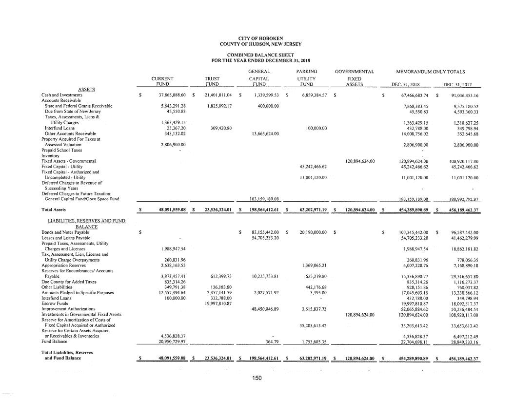
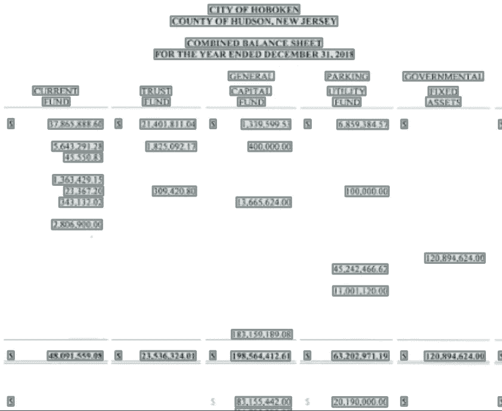
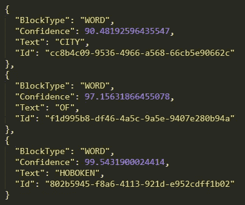
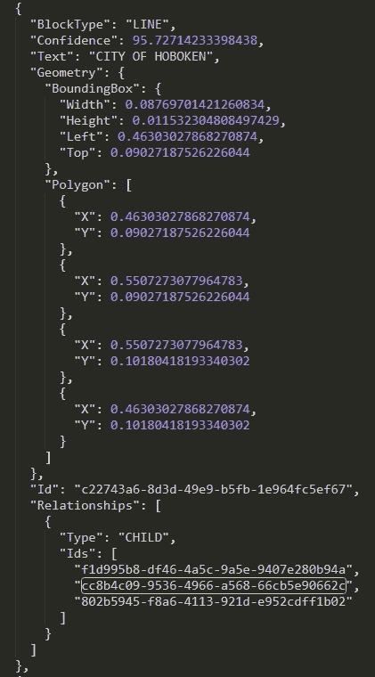
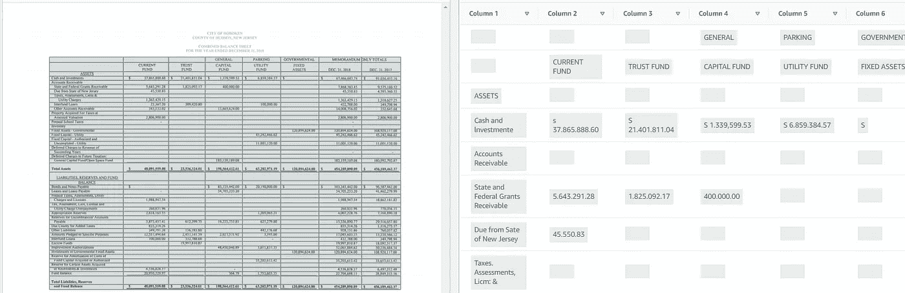

# 从金融 pdf 中提取数据

> 原文：<https://towardsdatascience.com/extracting-data-from-financial-pdfs-dc2fa0b73169?source=collection_archive---------8----------------------->

如何从市政债券 CAFR 报告中快速提取文本和数据

Photo by [Markus Spiske](https://unsplash.com/@markusspiske?utm_source=unsplash&utm_medium=referral&utm_content=creditCopyText) on [Unsplash](https://unsplash.com/s/photos/financial-documents?utm_source=unsplash&utm_medium=referral&utm_content=creditCopyText)

## 什么在传播

财务的很大一部分是用来写和读财务报表的。在美国，财务报表必须是 PDF 格式，才能被认为是官方的。这给以后使 pdf 成为机器可读的文件带来了挑战。

在过去，银行和金融机构常常雇佣整个团队来阅读 PDF 格式的财务报表，并将其输入到银行的数据库中。这些职位是数据输入，表格输入。然而，其他团队会将输入的值映射到银行常用的值。这一系列的任务被称为[金融传播](https://pactola.com/blog/2014/12/3/the-dos-and-donts-of-financial-spreading)。

例如，一个申请贷款的大型家庭农场会在农场的存货清单中列出诸如[彼得比尔特](https://www.truckpaper.com/listings/trucks/for-sale/list/category/210/heavy-duty-trucks-conventional-trucks-w-sleeper/manufacturer/peterbilt/model-group/379)卡车之类的项目。但是，当银行的财务人员读取财务数据时，他们需要将卡车归类为子类别“车辆”下的非流动(非货币)资产。这使得银行可以减少财务不确定性，因为它可以将这种特定的卡车映射到银行已经处理多年的其他类似车辆。用金融术语来说，它允许银行将这种情况映射到更广泛的、标准化的帐户集合。

在不久以前，这些吊具位于低成本地区和离岸地区。今天，许多金融机构已经以某种形式采用了人工智能，以减轻人工阅读每一份金融 PDF 文件的人类负担。

我们来讨论一下 AI 是如何读取和处理这些 pdf 的。

## 用机器提取 PDF

我们将查看综合年度财务报告(CAFR ),这是市政债券的主要年度披露文件。CAFRs 往往主要是 PDF 格式的扫描文档。[这里是纽约州](https://emma.msrb.org/ES1350734.pdf)市 CAFR 的一个例子。

美国大多数城市都有未偿债券，有义务通过 CAFRs 披露年度财务状况。[这是一张很好的幻灯片，展示了城市总体规模和 CAFR 覆盖率](http://www.msrb.org/msrb1/pdfs/MSRB-Muni-Facts.pdf)。让我们来看一个来自 CAFR 的样本页面，我们将使用它来运行光学字符识别(OCR)数据提取—

[CAFR from City of Hoboken, NJ](https://emma.msrb.org/ES1304860-ES1020414-ES1422032.pdf), page 150

如果你仔细看，你会注意到这是一个扫描页面，保存为 PDF 格式，所以它还不是机器可读的。

CAFR 文件包含了非常有趣的关于市政规划、预算和运作的信息。它们包含了公立学校、警察部门、消防部门的信息。比如公立医院有多少病床，每张病床的收入和其他运营成本。

## 引擎盖下发生了什么

那么 AI 如何让上面的文档成为机器可读的文本呢？

在核心部分，人工智能试图隔离有黑色墨迹的区域和没有黑色墨迹的区域。然后，另一个人工智能，像小学生一样，观察单个墨迹来辨认单词和字符。而另一个人工智能试图理解所有检测到的文本是否被组织成表格、表格或自由形式的文本。

更具体地说，PDF 是作为图像被机器读入的。然后，一种算法试图在它看到的任何文本周围画出方框。每一个单词或字符组会得到它的盒子。一旦算法覆盖了边界框中的每一段文本，则下一组算法可以继续进行。这是边界框的样子—

Bounding box detection algorithm at work

接下来，另一种算法——光学字符识别(OCR)开始对每个边框内的文本进行解码。该算法接收文本图像，并将它们转换成包含在该图像中的计算机可理解的文本。

最后，另一种算法查看所有这些边界框和其中的文本，以了解每个单词是构成一行还是表格的一部分。

例如，最上面一行写着“霍博肯市”，边界框算法检测到 3 个带有文本的区域——“城市”、“OF”、“霍博肯”，并为它们分配置信度得分和唯一 id——

然后，合并器算法获取 3 个单词的输出，并根据文本在页面上的位置将它们组合在一起

Notice Confidence: 95 of Text: “CITY OF HOBOKEN”

最后一种合并算法还对表格、自由格式文本或表单等页面区域进行分类。这是它放在一起的样子—

Machine interpretation of the PDF table on the right

今天，上面提到的每个算法都是一个深度神经网络，用单独的训练数据进行训练，并由人类进行注释。我们可以看到每一步的置信度得分，因此我们可以通过主动学习来修正算法。

如果您对在 AWS 上建立端到端 OCR 即服务感兴趣[，请点击这里](/guide-on-aws-textract-set-up-8cddb8a3b3a3)。

## 结论

由于人工智能的最新进展，我们现在可以将 PDF 文档一起读入我们的数据湖，并执行下游机器学习和分析来揭示 alpha。

新的创业公司正在涌现，从金融领域的大量文件中收集见解，这在过去是极其昂贵的。

OCR 只是金融文档如何被摄取、处理和显示以供投资专业人员获得货币优势(alpha)的一小部分，但却很重要。