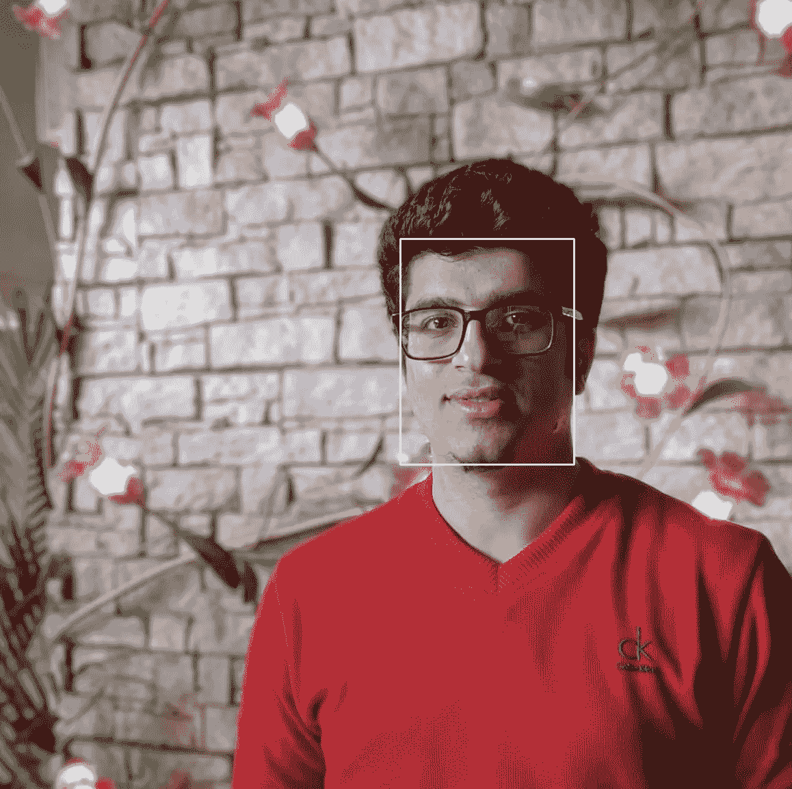

# 利用 OpenCV 人脸检测神经网络提取人脸

> 原文：<https://towardsdatascience.com/extracting-faces-using-opencv-face-detection-neural-network-475c5cd0c260?source=collection_archive---------9----------------------->

Photo by [Maxim Dužij](https://unsplash.com/@zoner?utm_source=medium&utm_medium=referral) on [Unsplash](https://unsplash.com?utm_source=medium&utm_medium=referral)

最近，我偶然发现了 https://www.pyimagesearch.com/的网站，那里有一些关于 OpenCV 的很棒的教程。在通读它的众多文章时，我发现 OpenCV 有自己的人脸检测神经网络，准确率非常高。

所以我决定用 OpenCV 的这个神经网络做一个项目，从图像中提取人脸。每当有人处理人脸并需要从大量图像中提取人脸时，这样的过程就会很方便。

完整的项目可以作为 [GitHub 库](https://github.com/kb22/Create-Face-Data-from-Images)获得。为了这篇文章，我从我的 Instagram 账户上拍了一张照片。

Image used for extracting face

# 目标

这个项目有两个基本要素。**包围人脸的方框:**在图像中识别的所有人脸周围显示白色方框。Python 文件是*data _ generator . py*2。**提取的人脸:**从一个文件夹中的所有图像中提取人脸，并将每个人脸保存到一个目标文件夹中，以创建一个方便的数据集。Python 文件是 *face_extractor.py*

Face detection and extraction

首先，让我们执行这两个部分的共同步骤，即导入库、加载人脸检测模型、创建输出目录、读取图像和检测人脸。

# 项目

## 导入库

我导入`os`来访问目录中的各种文件。然后，`cv2`将用于处理图像。`numpy`有助于轻松处理多维数组。

## 定义路径和负载模型

OpenCV repo 本身提供了模型的`prototxt`和`caffemodel`。我使用了相同的方法，并将它们放在我的项目中的`model_data`目录中。`prototxt`文件包括网络的文本描述，而`caffemodel`包括权重。我读取了这两个文件，并使用`cv2`加载了我的`model`。

## 创建目录

如果存储结果图像的目录不存在，我将创建一个目录。输出文件夹为**更新 _ 图像**。

在提取人脸时，我会将人脸保存到目录 **faces** 中。如果它不存在，我将创建它。

## 读取图像

我遍历了**图像**文件夹中的所有图像。提取扩展名后，我检查文件是否属于类型`.png`或`.jpg`，并且只对这些文件进行操作。

## 检测人脸

使用`cv2.imread`，我读取图像，并使用`cv2.dnn.blobFromImage`创建一个斑点。然后，我将这个斑点输入到模型中，并使用`model.forward()`从页面中获取检测结果。

通用步骤现在已经完成。对于第一个任务，我将在人脸周围绘制白色矩形，并将它们保存在 **updated_images** 目录中。对于第二个任务，我将把提取的人脸保存在 **faces** 目录中。

## 1.在面周围创建方框

我一个接一个地迭代图像中检测到的所有人脸，并提取它们的起点和终点。然后，提取检测的置信度。如果算法有超过 50%的把握检测到的是人脸，我会在它周围显示一个矩形。

然后，使用`cv2.imwrite`，我将图像保存到同名的`updated_images`文件夹中。

Image with white rectangle around face

## 2.提取人脸

如上所述，我迭代所有人脸，计算检测的置信度，如果超过 50%，我提取人脸。注意这条线`frame = image[startY:endY, startX:endX]`。它从图像中提取人脸。

然后，我将这个新图像转储到`faces`文件夹中，名称为 face number，后跟`_`，然后是文件名。如果我们从名为`sampleImage.png`的图像中提取第一张人脸，人脸文件的名称将为`0_sampleImage.png`。对于每个面，我递增`count`并在完成执行后，将计数打印到控制台。

Extracted face

终于，项目准备好了。您可以输入尽可能多的图像，并生成可用于后续项目的数据集。

# 结论

在本文中，我讨论了使用 OpenCV 人脸检测神经网络来检测图像中的人脸，用白色矩形标记它们，并将人脸提取到单独的图像中。

一如既往，我很想听听你的想法和建议。