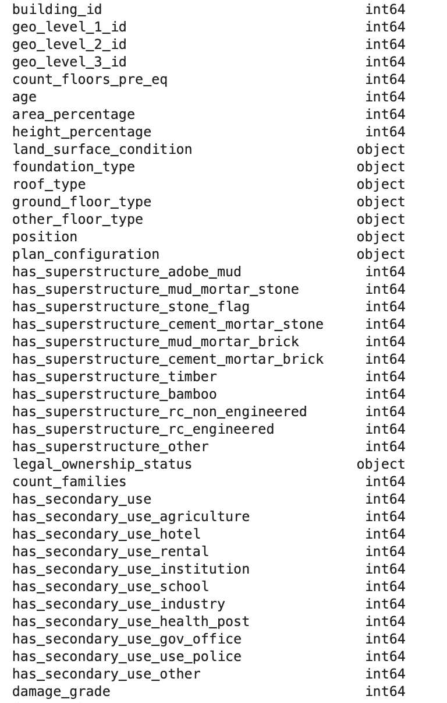
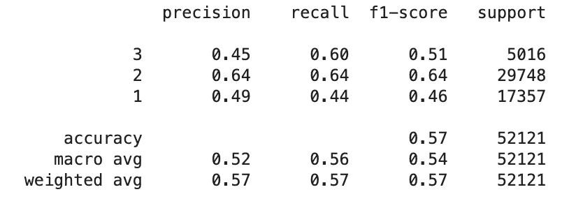
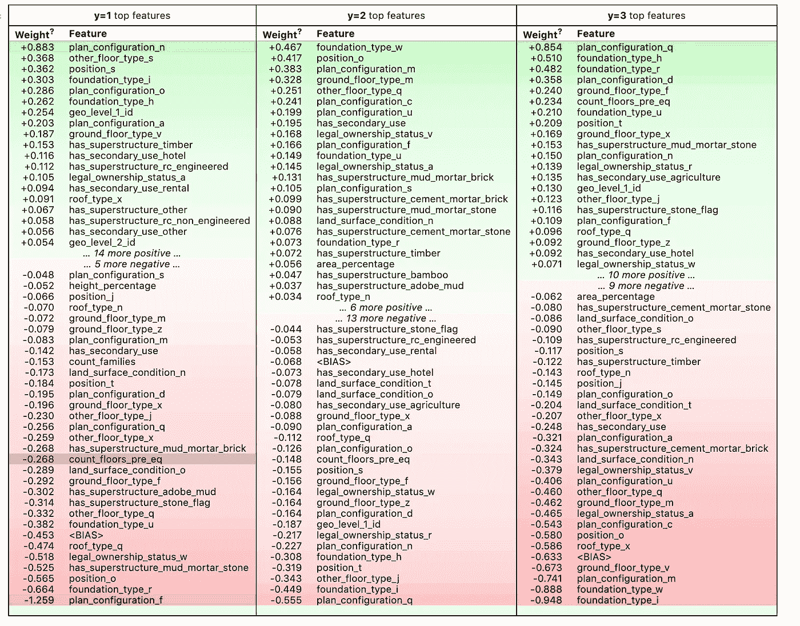

# 从 Scikit-Learn 管道中提取特征重要性

> 原文：<https://towardsdatascience.com/extracting-feature-importances-from-scikit-learn-pipelines-18c79b4ae09a?source=collection_archive---------6----------------------->


Photo by [Thomas Ashlock](https://unsplash.com/@thomas_ashlock?utm_source=unsplash&utm_medium=referral&utm_content=creditCopyText) on [Unsplash](https://unsplash.com/s/photos/pipeline?utm_source=unsplash&utm_medium=referral&utm_content=creditCopyText)

## 评估管线中特征重要性的简单方法

Scikit-learn 管道提供了一种非常简单的方法来将机器学习开发中的预处理步骤与模型拟合阶段链接在一起。使用管道，您可以嵌入这些步骤，以便在一行代码中，模型将在拟合模型或调用 predict 的同时执行所有必要的预处理步骤。

除了减少项目中的代码行之外，这样做还有很多好处。使用标准管道布局意味着同事或未来的自己很容易快速理解您的工作流程。这反过来意味着你的工作更具可复制性。此外，通过管道，您可以强制执行转换发生的顺序。

然而有一个缺点，尽管 scikit-learn 模型具有高度可解释的优点。一旦您将模型嵌入到管道中，就很难提取元素，例如使这些模型如此可解释的特性重要性。

我最近花了一些时间研究这个问题。在下一篇文章中，我将展示一个我发现的简单方法，使用 python 库 [ELI5](https://eli5.readthedocs.io/en/latest/overview.html) 从管道中提取特性重要性。

## 简单管道

在本文中，我将使用来自机器学习竞赛网站 drivendata.org 的数据集。数据集可以在这里[下载。](https://www.drivendata.org/competitions/57/nepal-earthquake/)

首先，我将导入我正在使用的所有库。

```
import pandas as pd
import numpy as npfrom sklearn import preprocessing
from sklearn.model_selection import train_test_split
from sklearn.pipeline import Pipeline
from sklearn.impute import SimpleImputer
from sklearn.preprocessing import StandardScaler
from sklearn.compose import ColumnTransformer
from sklearn.metrics import f1_score
from sklearn.preprocessing import OneHotEncoder
from sklearn.base import BaseEstimator, TransformerMixin
from sklearn.metrics import classification_report
from sklearn.linear_model import LogisticRegressionimport eli5
```

然后，我使用 pandas 库读取我之前下载的数据集。特征和目标标签在单独的 CSV 文件中，所以我也使用熊猫[合并](https://pandas.pydata.org/pandas-docs/stable/reference/api/pandas.DataFrame.merge.html)功能将它们合并到一个数据框中。

```
train_values = pd.read_csv('train_values.csv')
train_labels = pd.read_csv('train_labels.csv')
train_data = train_values.merge(train_labels, left_on='building_id', right_on='building_id')
```

如果我们检查数据类型，我们可以看到数字和分类数据的混合。因此，我们需要在训练模型之前应用一些预处理。因此，管道对于该数据集将是有用的。

```
train_data.dtypes
```



在构建管道之前，我删除了“building_id”列，因为它不需要用于训练，将数据分成测试集和训练集，并定义一些变量来标识分类列和数字列。

```
train_data = train_data.drop('building_id', axis=1)numeric_features = train_data.select_dtypes(include=['int64', 'float64']).drop(['damage_grade'], axis=1).columns
categorical_features = train_data.select_dtypes(include=['object']).columns
X = train_data.drop('damage_grade', axis=1)
y = train_data['damage_grade']
X_train, X_test, y_train, y_test = train_test_split(X, y, test_size=0.2)
```

我将构建一个简单的管道，将预处理和模型拟合步骤连接在一起。此外，我将为任何缺失值添加一个估算器。虽然我在这里使用的数据集没有任何丢失的数据，但在这一步添加是明智的。这是因为在现实世界中，如果我们将它部署为一个机器学习应用程序，我们试图预测的新数据可能会丢失值。因此，将它添加为安全网是一种良好的做法。

下面的代码构建了一个管道，用于估算任何缺失值，将标准缩放器应用于数字特征，将任何分类特征转换为数字特征，然后拟合分类器。

```
numeric_transformer = Pipeline(steps=[
    ('imputer', SimpleImputer(strategy='median')),
    ('scaler', StandardScaler())])
categorical_transformer = Pipeline(steps=[
    ('imputer', SimpleImputer(strategy='constant', fill_value='missing')),
    ('one_hot', OneHotEncoder())])
preprocessor = ColumnTransformer(
    transformers=[
        ('num', numeric_transformer, numeric_features),
        ('cat', categorical_transformer, categorical_features)
    ])pipe = Pipeline(steps=[('preprocessor', preprocessor),
                      ('classifier',  LogisticRegression(class_weight='balanced', random_state=0))])

model = pipe.fit(X_train, y_train)
```

我们可以通过运行下面的代码来检查管道的质量。

```
target_names = y_test.unique().astype(str)
y_pred = model.predict(X_test)
print(classification_report(y_test, y_pred, target_names=target_names))
```



我们可以看到，就模型的性能而言，很可能还有改进的空间。除了模型选择和超参数优化之外，我们想探索的一个领域是特征工程。然而，为了决定设计哪些新功能，我们首先需要了解哪些功能最具预测性。

## ELI5

从这条管道中提取特征重要性并不容易。然而，有一个叫做 [ELI5](https://eli5.readthedocs.io/en/latest/tutorials/index.html) 的 python 库使这变得非常简单。这个库以俚语“像我 5 岁一样解释”命名，是一个提供简单方法来解释和解释机器学习模型的包。它兼容大多数流行的机器学习框架，包括 scikit-learn、xgboost 和 keras。

该库可以通过 pip 或 conda 安装。

```
pip install eli5conda install -c conda-forge eli5
```

让我们使用 ELI5 从管道中提取特性重要性。

ELI5 需要知道所有的特性名称，以便构造特性重要性。通过对管道中的分类变量应用一次性编码，我们引入了许多新特性。因此，我们首先需要提取这些特征名称，并将它们添加到已知的数字特征列表中。下面的代码使用 scikit-learn 管道中内置的“named_steps”函数来实现这一点。

```
onehot_columns = list(pipe.named_steps['preprocessor'].named_transformers_['cat'].named_steps['one_hot'].get_feature_names(input_features=categorical_features))
numeric_features_list = list(numeric_features)
numeric_features_list.extend(onehot_columns)
```

为了提取特性的重要性，我们只需要运行这行代码。

```
eli5.explain_weights(pipe.named_steps['classifier'], top=50, feature_names=numeric_features_list)
```

这给出了一个格式良好的输出。



ELI5 库还提供了解释单个预测的能力，但管道尚不支持这一功能。在本文中，我演示了一种从 scikit-learn 管道中提取特性重要性的简单方法，这为调试和改进机器学习模型提供了一个良好的起点。

感谢阅读！