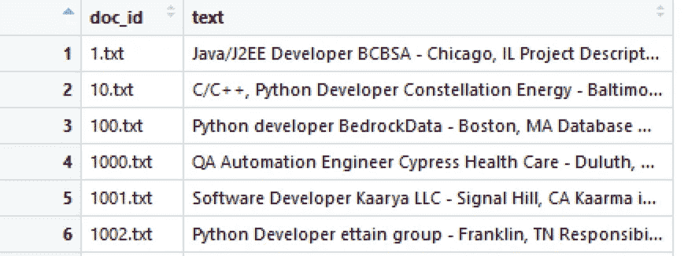
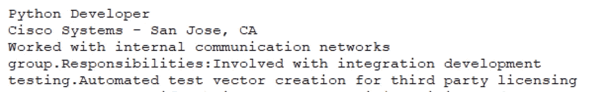
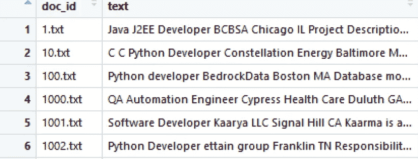
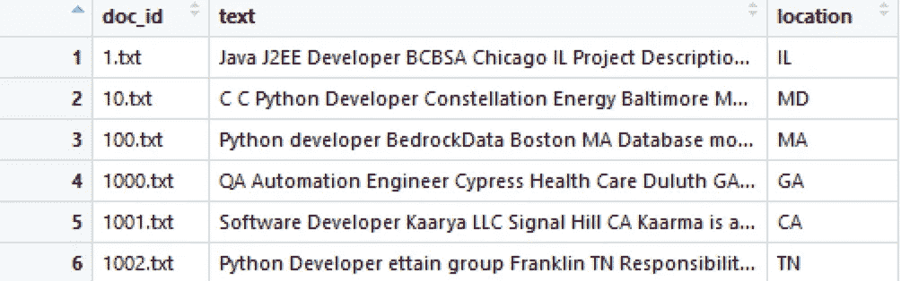
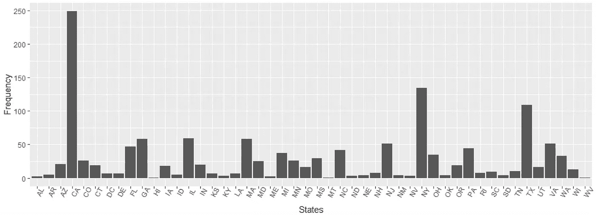

# 使用 R Regex 从文本中提取关键字(简单)

> 原文：<https://towardsdatascience.com/extracting-information-from-a-text-in-5-minutes-using-r-regex-520a859590de?source=collection_archive---------10----------------------->

## 我们可以从美国的职位描述中提取相关信息，并将其可视化。


photo credit to Jason from unsplash

当您有大量文本文件时，只提取相关信息并不容易。这既复杂又耗时。出于这个原因，我想向您展示我是如何使用 Regex 从美国职位描述中提取位置的。

# **文本文件**

以下是工作描述的结构。我的目标是从这个文本列中只提取州。



Preview of the job description



Example of one job description

# **第一步。去掉标点符号和尾随空格**

状态有一个尾随空格，它位于一行的末尾，后面没有任何字符。如果不删除它(\\n)，将会提取出多余的单词。

此外，保持州名缩写为大写字母也很重要(对于加利福尼亚，用‘CA’而不是‘CA’)，因为如果你不这样做，它将提取所有包含‘CA’的单词。

```
# deleting punctuations
description$text<-gsub("[[:punct:][:blank:]]+", " ", description$text)# deleting trailing space
description$text<-gsub("\\n"," ", description$text)
```



Job description after cleaning

# **第二步。使用正则表达式**

清理后，您可以按空格分割工作描述文本，并找到与州缩写列表(字典)匹配的字符串。完成后，您可以将其分配到 location 列，如下所示。

```
#creating a location columndescription$location <- NA #using for loop to extract all the states for (i in 1:length(description$text)){ #split the text by space  
split <- strsplit(description$text[i]," ")[[1]] #comparing split with the state abbreviation   
state <- match(split, stateabbreviation$Abbreviation) #if it matches, get the position of each state  
state <- which(!is.na(state)) #extract the state based on the position  
state_split <- split[state] #adding states to the new column   
description$location[i] <- state_split[1]  
}
```

为了找到职位描述中的州缩写，我使用了自己创建的字典“stateabbreviation”。


和...瞧啊。这是结果。

如果还想提取城市，只需使用相同的代码和' which(！idspnonenote)即可。is.na(位置))-1 '。你用“-1”是因为城市在州的前面。



# 第三步。可视化

现在你可以把它形象化，以便更好地理解你的发现。

```
library(ggplot2)state_count<-table(description$location)state_count<-as.data.frame(state_count)ggplot(state_count, aes(x = as.character(state_count$Var1), y = state_count$Freq)) + geom_bar(stat="identity") + theme(axis.text.x = element_text(angle = 60, vjust = )) + labs(y = "Frequency", x= "States")
```



这是我工作的一部分，以便更好地了解当前的数据科学就业市场。根据这一结果，加利福尼亚州、纽约州和德克萨斯州非常需要精通数据/技术的专业人员。

关于我的文本挖掘项目的更多细节，请随时访问我的 [GitHub](https://github.com/dkewon/Text-Mining-Entity-Extraction) 页面。感谢您的阅读！

另外，请随意查看我的其他文章:

[*如何获得关于货币汇率的 Twitter 通知:Web 抓取和自动化*](/how-to-get-twitter-notifications-on-currency-exchange-rate-web-scraping-and-automation-94a7eb240d60)

[数据块:如何在本地计算机上将数据帧保存为 CSV 文件](/databricks-how-to-save-files-in-csv-on-your-local-computer-3d0c70e6a9ab)