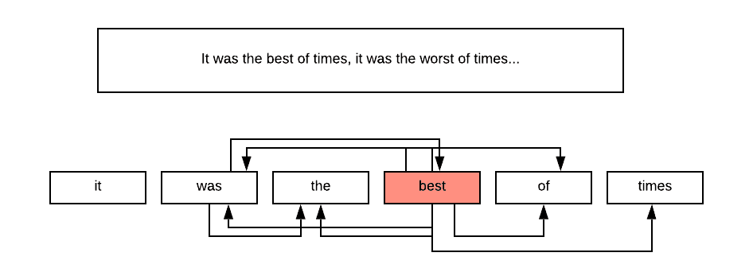
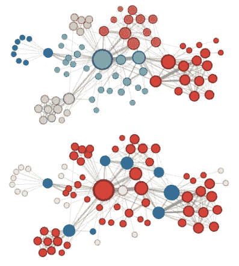
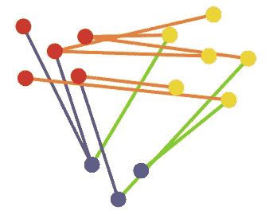
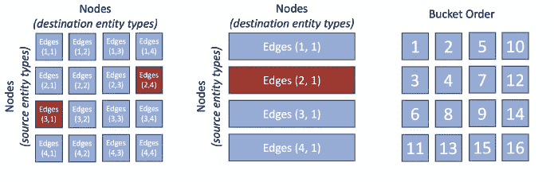

# 使用脸书 Pytorch BigGraph 从知识图中提取知识。

> 原文：<https://towardsdatascience.com/extracting-knowledge-from-knowledge-graphs-e5521e4861a0?source=collection_archive---------6----------------------->

机器学习让我们有能力训练一个模型，它可以将数据行转换成标签，以这样的方式将**相似的**数据行映射到**相似的**或相同的标签。

例如，我们正在为电子邮件构建垃圾邮件过滤器。我们有很多电子邮件，其中一些被标记为垃圾邮件，一些被标记为收件箱。我们可以建立一个学习识别垃圾邮件的模型。将被标记为垃圾邮件的消息在某些方面类似于那些已经被标记为垃圾邮件的消息。

**相似度**的概念对于机器学习来说至关重要。在现实世界中，相似性的概念对于主题来说是非常具体的，它取决于我们的知识。

另一方面，大多数数学模型假定相似性的概念是确定的。通常，我们将数据表示为多维向量，并测量向量之间的距离。

[https://www.quora.com/Why-do-we-use-cosine-similarity-on-Word2Vec-instead-of-Euclidean-distance](https://www.quora.com/Why-do-we-use-cosine-similarity-on-Word2Vec-instead-of-Euclidean-distance)

特征工程是将我们对现实世界物体的知识转换成这种物体的数字表示的过程。我们认为相似的物体被表示为邻近矢量。

例如，我们正在估算房价。我们的经验告诉我们，房子是由卧室的数量、浴室的数量、年龄、面积来决定的。镜头、位置等。位于同一街区、大小和年龄相似的房子，价格应该差不多。我们将我们对住房市场的了解转化为表征房屋的数字，并用它来估计房屋的价格。

不幸的是，如上所述，手动特征工程在我们将知识转化为描述性特征的能力方面存在局限性。

有时我们的知识仅限于相似性原则，而不是使物体相似的确切特征。我们对现实世界的了解往往比简单的表格形式更复杂。这是一个典型的相互联系的概念和关系的图表。

**嵌入模型**允许我们获取原始数据，并根据我们的原理知识自动将其转换为特征。

# Word2Vec

Word2Vec 可能是最著名的嵌入模型，它为单词构建相似性向量。在这种情况下，我们关于世界的知识是以叙事的形式呈现的，表现为文本，文本是一系列的单词。

几十年来，人们努力尝试使用人工定义的特征来表征单词，但成效有限。在有限的情况下，这些解决方案通常不能扩展到全部知识或工作。

当托马斯·米科洛夫和他在谷歌的团队决定建立一个基于众所周知的相似性原理的模型时，一切都改变了。在相似的上下文中使用的单词通常是相似的。在这种情况下，上下文是由位于附近的单词定义的。

Graph representation of the sequence of words.

我们看到的是，牢记这些原则，我们可以通过简单地在预定义的窗口(通常是 5 个单词)内将每个单词与其邻居连接起来，从我们的文本中构建一个图表。

现在我们有了一个基于我们的知识连接成图的真实单词对象(单词)的图。

## 最简单/复杂的单词表示

我们仍然无法建立任何模型，因为单词不是用形式或向量来表示的。

如果我们需要的只是将单词转换成数字，有一个简单的解决方案。让我们拿起字典，给每个单词指定它在字典中的位置。

比如我有三个词:猫，毛毛虫，小猫。

我的向量表示将如下:猫-[1]，毛毛虫-[2]和小猫-[3]。

不幸的是，这不起作用。通过像这样分配数字，我们隐含地引入了单词之间的距离。猫和毛毛虫之间的距离是 1，猫和小猫之间的距离是 2。我们在说，猫更像毛毛虫，而不是小猫，这与我们的知识相矛盾。

替代表示也称为**一键编码**可以做到这一点:

猫— [1，0，0]

卡特彼勒— [0，1，0]

小猫— [0，0，1]

这个模式认为所有的单词都是相互正交的。我们承认对词语相似性没有先入为主的概念。我们将依靠我们的知识图(如上所述)来构建嵌入，该知识图结合了我们的单词相似性原则。

在现实世界中，字典的大小比 3 大得多。典型的维数从数万到数百万。不仅这些向量不能真正代表我们的相似性概念，而且这些向量非常庞大，不能真正用于实践。

## 构建单词嵌入

我们的知识图为我们提供了大量的图边，每条边都可以被解释为输入数据作为边的起点，标签作为边的终点。我们正在构建一个模型，它试图使用单词周围的单词作为标签来预测单词。通常有两种方式。我们或者从它的邻居的总和中重建单词向量，或者我们通过尝试从单词中预测邻居来做相反的事情。

[https://papers.nips.cc/paper/5021-distributed-representations-of-words-and-phrases-and-their-compositionality.pdf](https://papers.nips.cc/paper/5021-distributed-representations-of-words-and-phrases-and-their-compositionality.pdf)

该模型的细节不在讨论范围内，在许多其他帖子中有详细描述。从根本上说，该团队使用基本的编码器/解码器模型来学习从高维空间(数百万维)到有限维空间(通常为 300 维)的投影，然后再回到高维空间。训练的目标是在压缩过程中保留尽可能多的信息(最小化交叉熵)。

[http://mccormickml.com/2016/04/19/word2vec-tutorial-the-skip-gram-model/](http://mccormickml.com/2016/04/19/word2vec-tutorial-the-skip-gram-model/)

这种将低维投影从稀疏正交数据集学习到更密集的低维空间的概念是许多其他嵌入训练模型的基础。

该模型通常在 google crawl、twitter 数据集或维基百科等来源上进行训练。我们正在消费世界知识，并以此为基础构建我们的词汇。

## Word2Vec 嵌入的属性

Word2Vec 的重要属性是保留关系和暴露结构等价的能力。

下面的图表显示了国家和首都之间的联系。

或者其他不同的概念。

[https://www.tensorflow.org/tutorials/representation/word2vec](https://www.tensorflow.org/tutorials/representation/word2vec)

本质上，它允许对这样的单词进行代数运算:

> 国王——男人+女人=王后。

## 使用单词嵌入

单词嵌入极大地改善了文本分类、命名实体识别、机器翻译等任务。

以下是更多信息:[http://www . wild ml . com/2015/11/understanding-convolutionary-neural-networks-for-NLP/](http://www.wildml.com/2015/11/understanding-convolutional-neural-networks-for-nlp/)

# **Node2Vec**

由 A. Grover 和 J. Leskovec 设计的 [Node2Vec](https://snap.stanford.edu/node2vec/) 。是模型，它通过扩展 Word2Vec 的思想来分析同质加权图。这篇论文背后的思想是，我们可以通过探索它的周围来表征图节点。我们对世界的理解基于两个原则——同质性和结构等效性。

## 同质性

类似的节点位于附近。

示例:

*   社交网络——我们和像我们一样的人联系更加紧密。
*   商业位置——金融公司、诊所或营销公司似乎通常位于同一条街道上
*   组织结构——同一个团队的人拥有相似的特质

## 结构等价

不同的社区共享相同的结构:

*   组织结构——虽然团队之间的联系可能很弱，但团队的结构(经理、高级成员、新人、初级成员)在团队之间是重复的。

[https://arxiv.org/pdf/1607.00653.pdf](https://arxiv.org/pdf/1607.00653.pdf)

为了将这两个原则结合到我们的嵌入中，Node2Vec 论文的作者提出了一种随机行走方法，该方法结合了广度优先采样来捕获同伦性，以及深度优先采样来捕获结构等价性。

正如我们可以看到的，节点(u)充当组(s1，s2，s3，s4)中的集线器，这类似于 s6 是(s7，s5，s8，s9)的集线器。我们通过做 DFS 发现了 BFS 的(s1，s2，s3，s4)社区和(u) (s6)相似性。

我们通过探索周围环境来了解每个节点。这种探索将图形转换成由随机游走产生的大量序列(句子)，随机游走结合了 BFS 和 DFS 探索。BFS 和 DFS 混合由图边的权重以及模型的超参数控制。

一旦我们有了完整的序列(句子)，我们就可以像应用于文本一样应用 Word2Vec 方法。它产生图节点嵌入，这是基于我们定义的原则以及来自图的知识。

## Node2Vec 属性

Node2Vec 表示改进了节点的聚类和分类模型。学习到的嵌入的相似性将有助于像欺诈检测这样的任务。

> node2vec 生成的 Les Misérables 共生网络的补充可视化，标签颜色反映了同质性(上图)和结构等价性(下图)。—[https://arxiv.org/pdf/1607.00653.pdf](https://arxiv.org/pdf/1607.00653.pdf)

[https://arxiv.org/pdf/1607.00653.pdf](https://arxiv.org/pdf/1607.00653.pdf)

Node2Vec 在链路预测方面表现出显著的改进。它能够提高重建图形的能力，其中一些百分比的边被删除。链接预测评估过程将在本文中进一步讨论。

# 知识图表

下面我们要讨论的是 [PYTORCH-BIGGRAPH:一个大规模图嵌入系统](https://www.sysml.cc/doc/2019/71.pdf)论文进一步命名为 PBG 以及相关的论文家族。

知识图是特殊类型的图，它包含已知的实体以及不同类型的边。它代表结构知识。

在知识图中，节点通过不同类型的关系连接。

[https://arxiv.org/pdf/1503.00759.pdf](https://arxiv.org/pdf/1503.00759.pdf)

训练的目标是产生代表我们知识的嵌入。一旦我们有了节点的嵌入，应该很容易确定相应的节点在我们的知识图中是否通过特定类型的关系被连接(或者应该被连接)。

不同的模型提出了不同的比较嵌入的方法。最简单的模型使用余弦或矢量积距离来比较嵌入矢量。更复杂的模型在比较之前对向量的元素应用不同的加权方案。加权方案被表示为矩阵，并且特定于关系的类型。作为培训的一部分，我们可以学习加权矩阵。

[https://www.sysml.cc/doc/2019/71.pdf](https://www.sysml.cc/doc/2019/71.pdf)

我们需要找到一种方法来测量边之间的**相似性得分**，并使用该得分来估计这些节点连接的可能性。

## 知识图的表示

知识图可以表示为邻接张量。为了建立它，我们将有一个正方形矩阵来代表每一种关系。每个矩阵都有与图中节点一样多的列或行。矩阵的值将是 1，这些节点通过这种类型的关系连接，如果不是，则为 0。很明显，这个矩阵会非常大，非常稀疏。

为了学习我们的嵌入，我们需要将每个节点转换成固定大小的向量。让我们讨论“好”嵌入的性质。

好的嵌入表示我们以图边的形式表达的知识。位于“附近”的嵌入向量应该代表更可能连接的节点。基于这一观察，我们将以这样的方式训练我们的模型，即在邻接张量中标记为 1 的连接节点的相似性得分将更高，而在邻接张量中标记为 0 的连接节点的相似性得分将更低。

[https://arxiv.org/pdf/1503.00759.pdf](https://arxiv.org/pdf/1503.00759.pdf)

我们正在训练我们的嵌入以 ***用最小的信息损失从节点嵌入中重建*** 知识图的边。

## 负采样

我们的训练方法有点问题。我们正在尝试使用图形数据来区分 1(节点已连接)和 0(节点未连接)。然而，我们实际拥有的唯一数据是连接在一起的节点。这就像学习只看猫来区分猫和狗一样。

负采样是一种通过使用非常简单的观察来扩展我们的数据集并提供更好的训练数据的技术。任何随机选择的节点，不作为我们的图的一部分连接，将代表一个标签为 0 的样本数据。出于训练的目的，PBG 的论文提出读取图的每条边，然后提出一个负样本，其中一个节点被随机选择的节点代替。

对于每个边，我们可以分配一个正的相似性得分和一个负的相似性得分。基于节点嵌入和边关系类型权重来计算*正相似性得分*。以相同的方式计算*负的* *相似性得分*，但是边的一个节点被破坏并被随机节点替换。

**排名损失**功能，将在训练中优化。它被构造成在图中所有节点和所有关系类型的正和负相似性得分之间建立可配置的**余量**。排序损失是节点嵌入和关系特定权重的函数，这将通过找到最小排序损失来学习。

# 培养

现在，我们拥有了训练嵌入模型所需的一切:

*   数据—负边缘和正边缘
*   标签— (1 或 0)
*   要优化的函数(可以是排序损失、更传统的逻辑回归损失或 word2vec 中使用的交叉熵 softmax 损失)
*   我们的参数是相似性得分函数的嵌入和权重矩阵。

现在的问题是使用微积分找到参数——嵌入，优化我们的损失函数。

## 随机梯度下降

随机梯度下降的本质是逐渐调整损失函数的参数，使得损失函数逐渐减小。为此，我们以小批量读取数据，使用每一批来计算损失函数的参数更新，以使其最小化。

有多种方法可以实现随机梯度下降。PBG 论文使用 ADAGrad，这是随机梯度下降的一种风格来寻找参数，使我们的损失函数最小化。强烈推荐这篇博客了解梯度下降的所有味道:[http://ruder . io/optimizing-gradient-descent/index . html # adagrad](http://ruder.io/optimizing-gradient-descent/index.html#adagrad)

像 tensorflow 和 pytorch 这样的软件包提供了不同风格的现成实现。

梯度下降的关键要素是多次更新模型参数的过程，直到我们最小化损失函数。在训练结束时，我们期望有嵌入和评分功能，这满足了整合我们的知识的目标。

## HogWild —分布式随机梯度下降

使用随机梯度下降进行分布带来了挑战。如果我们同时通过调整参数来最小化损失函数，那么就需要某种锁定机制。在传统的多线程开发中，我们通过悲观或乐观锁定在更新期间锁定数据。锁定减慢了进度，但确保了结果的正确性。

幸运的是，[的论文](https://people.eecs.berkeley.edu/~brecht/papers/hogwildTR.pdf)证明了我们不需要一个锁定机制。我们可以简单地批量读取数据，计算参数调整，并将其保存在共享参数空间中，而不考虑正确性。霍格维尔德算法就是这么做的。训练可以是分布式的，每个 HogWild 线程可以更新我们的参数，而不用考虑其他线程。

我推荐这个博客来获得更多关于 HogWild 的信息:[https://medium . com/@ Krishna _ SRD/parallel-machine-learning-with-hog wild-f 945 ad 7 e 48 a 4](https://medium.com/@krishna_srd/parallel-machine-learning-with-hogwild-f945ad7e48a4)

# 分布式培训

当图形跨越数十亿个节点和数万亿条边时，很难在一台机器的内存中容纳所有参数。如果我们要等到每一批结束时才开始下一批计算，也会花费很多时间。我们的图表如此之大，以至于能够并行化训练并同时学习参数将是有益的。这个问题被脸书团队解决了，他们发布了 PBG 论文。

节点按实体类型拆分，然后组织成分区:

[https://torchbiggraph.readthedocs.io/en/latest/data_model.html](https://torchbiggraph.readthedocs.io/en/latest/data_model.html)

[https://torchbiggraph.readthedocs.io/en/latest/data_model.html](https://torchbiggraph.readthedocs.io/en/latest/data_model.html)

[https://www.sysml.cc/doc/2019/71.pdf](https://www.sysml.cc/doc/2019/71.pdf)

1.  节点被划分成 P 个桶，边被划分成 PxP 个桶。基数小的实体类型不必分区。
2.  训练与以下约束并行进行:

> 对于每个边缘桶(P1；p2)除了第一个，重要的是边缘桶(P1；*)或(*；p2)在先前的迭代中被训练。
> 
> 只要在不相交的分区集上操作，就可以并行训练多个边缘桶。

[https://www.sysml.cc/doc/2019/71.pdf](https://www.sysml.cc/doc/2019/71.pdf)

训练在多台机器上并行进行，每台机器上有多个线程。每个线程根据分配的桶和数据批次计算参数更新。锁服务器根据建立的约束分配训练桶。请注意，锁服务器只控制数据批次在 hogwild 线程中的分布，而不控制参数更新。

# PBG 嵌入的特征

知识嵌入可以以两种方式使用:

*   链接预测。链接预测通过找到可能连接或即将连接的节点来帮助填补我们知识中的空白。
    示例:图表代表客户和客户购买的产品。边是采购订单。嵌入可以用来形成下一个购买建议。
*   学习节点的属性
    嵌入可以用作特征向量，作为各种分类模型的输入。学习过的类可以填补我们关于物体属性知识的空白。

## 使用 MRR/Hits 评估链接预测 10

这个过程在论文中有所描述——“[学习知识库的结构化嵌入](https://ronan.collobert.com/pub/matos/2011_knowbases_aaai.pdf)”，后来在包括脸书·PBG 在内的许多其他论文中被用作衡量嵌入模型质量的方法。

该算法采用测试边缘的子集，并执行以下操作:

1.  通过用负采样边替换边的开始或结束来破坏边。
2.  在部分损坏的数据集上训练模型
3.  计算测试数据集中边的聚合 MRR 和 Hits10 度量。

## 平均倒数等级

MRR 或平均倒数排名是对搜索质量的衡量。我们选取一个未损坏的节点，并使用定义为相似性得分的距离来查找“最近的邻居”。我们通过相似性得分对最近的邻居进行排序，并期望被连接的节点出现在排序的顶部。如果节点不在顶部倾斜，MRR 会降低准确度分数。

另一个度量是 Hits10，我们期望被破坏的节点出现在前 10 个最近的邻居中。

[https://www.sysml.cc/doc/2019/71.pdf](https://www.sysml.cc/doc/2019/71.pdf)

PBG 的论文表明，在许多数据集上，随着我们将资源分配到训练中，MRR 度量逐渐增加。并行性在一定程度上不会影响排序的质量，但会节省大量时间。

通过简单地探索和可视化图形，可以执行进一步的评估。

[https://ai.facebook.com/blog/open-sourcing-pytorch-biggraph-for-faster-embeddings-of-extremely-large-graphs/](https://ai.facebook.com/blog/open-sourcing-pytorch-biggraph-for-faster-embeddings-of-extremely-large-graphs/)

上图是从 Freebase 知识图构建的嵌入的 2d 投影。如我们所见，相似的节点被组合在一起。国家、数字、科学期刊、专业人士甚至在精心准备的二维投影上似乎都有集群。

# 知识图模型的局限性。

如上所述的知识图表代表了我们知识的静态快照。它没有反映出知识是如何积累起来的。在现实世界中，我们通过观察时间模式来学习。虽然可以了解节点 A 和节点 B 之间的相似性，但很难看出节点 A 和节点 C 之间的相似性，就像 3 年前一样。

例如，如果我们观察森林一天，我们会看到两棵大红杉之间的相似之处。然而，如果不对森林进行长期观察，很难理解哪棵树苗会长成一棵大红杉。

理想情况下，我们需要探索在不同时间点构建的一系列知识图，然后构建嵌入，这将包含代际相似性。