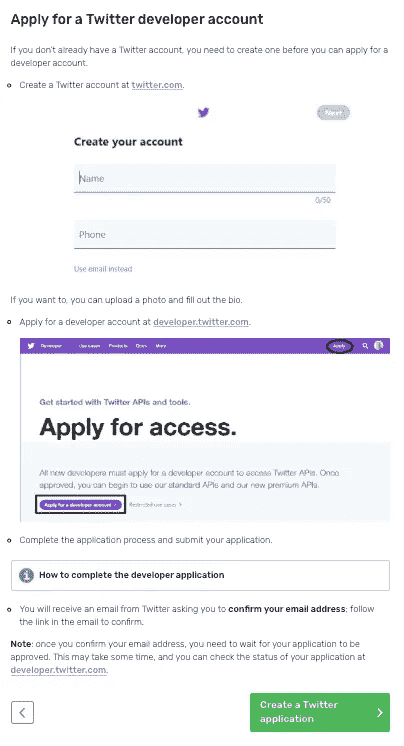
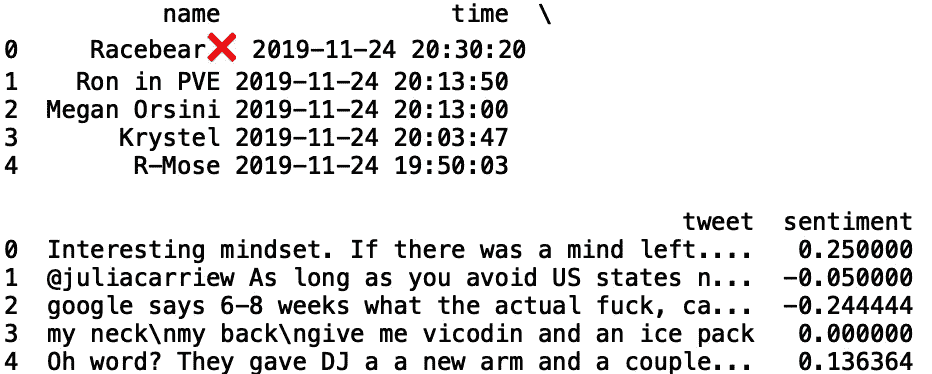

# 来自 Twitter 的患者对药品的看法

> 原文：<https://towardsdatascience.com/extracting-patient-sentiment-for-pharmaceutical-drugs-from-twitter-2315870a0e3c?source=collection_archive---------38----------------------->


Photo by [Pixabay](https://www.pexels.com/@pixabay) on [Pexels](https://www.pexels.com/photo/bunch-of-white-oval-medication-tablets-and-white-medication-capsules-159211/)

制药公司面临的一个常见问题是根据患者的旅程预测患者是否会更换药物。指示寻求转换处方药的患者的信息可以出现在社交媒体帖子中。分析患者在关于处方药的推文中表达的情绪，可能是朝着解决这个问题的正确方向迈出的一步。

在本帖中，我们将提取美国一些最常见处方药的患者情绪。我们将关注在美国开出的前 10 种药物中的 5 种:

1.  **维柯丁**:一种用于治疗中度至重度疼痛的药物
2.  **辛伐他汀**:一种 HMG-CoA 还原酶抑制剂(他汀类)，用于降低中风和心脏病发作的风险
3.  **赖诺普利**:一种血管紧张素转换酶(ACE)抑制剂，用于降低高血压和预防糖尿病引起的肾衰竭
4.  **立普妥**:一种用于预防冠心病患者中风和心脏病发作的他汀类药物
5.  **二甲双胍**:治疗二型糖尿病的药物

首先，你需要申请一个 Twitter 开发者账户:



[Source](https://projects.raspberrypi.org/en/projects/getting-started-with-the-twitter-api/3)

您的开发人员帐户获得批准后，您需要创建一个 Twitter 应用程序:


[Source](https://projects.raspberrypi.org/en/projects/getting-started-with-the-twitter-api/4)

申请 Twitter 开发者账户和创建 Twitter 应用程序的步骤在这里[列出](https://projects.raspberrypi.org/en/projects/getting-started-with-the-twitter-api/4)。

为了访问 Twitter API，我们将使用免费的 python 库 tweepy。tweepy 的文档可以在[这里](https://tweepy.readthedocs.io/en/latest/getting_started.html)找到。

1.  **安装**

首先，确保您已经安装了 tweepy。打开命令行并键入:

```
pip install tweepy
```

2.**导入库**

接下来，打开您最喜欢的编辑器，导入 tweepy 和 pandas 库:

```
import tweepy
import pandas as pd
```

3.**认证**

接下来，我们需要我们的消费者密钥和访问令牌:


[Source](https://projects.raspberrypi.org/en/projects/getting-started-with-the-twitter-api/4)

请注意，该网站建议您保持您的密钥和令牌私有！这里我们定义了一个假的密钥和令牌，但是在创建 Twitter 应用程序时，您应该使用真正的密钥和令牌，如上所示:

```
consumer_key = '5GBi0dCerYpy2jJtkkU3UwqYtgJpRd' 
consumer_secret = 'Q88B4BDDAX0dCerYy2jJtkkU3UpwqY'
access_token = 'X0dCerYpwi0dCerYpwy2jJtkkU3U'
access_token_secret = 'kly2pwi0dCerYpjJtdCerYkkU3Um'
```

下一步是创建 OAuthHandler 实例。我们传递上面定义的消费者密钥和访问令牌:

```
auth = tweepy.OAuthHandler(consumer_key, consumer_secret)
auth.set_access_token(access_token, access_token_secret)
```

接下来，我们将 OAuthHandler 实例传递给 API 方法:

```
api = tweepy.API(auth)
```

4. **TWITTER API 请求**

接下来，我们为我们有兴趣分析的字段初始化列表。现在，我们可以查看推文字符串、用户和推文时间。接下来，我们在一个 tweepy“Cursor”对象上编写一个 for 循环。在“Cursor”对象中，我们传递“api.search”方法，为我们想要搜索的内容设置查询字符串，并设置“count”= 1000，这样我们就不会超过 twitter 的速率限制。在这里，我们将搜索关于维柯丁的推文，维柯丁是一种用于治疗中度至重度疼痛的止痛药。我们还使用“item()”方法将“Cursor”对象转换为 iterable。

为了简化查询，我们可以删除转发，只包含英文推文。为了了解该请求返回的内容，我们还可以打印附加到每个列表的值:

```
twitter_users = []
tweet_time = []
tweet_string = []
for tweet in tweepy.Cursor(api.search,q='Vicodin', count=1000).items(1000):
            if (not tweet.retweeted) and ('RT @' not in tweet.text):
                if tweet.lang == "en":
                    twitter_users.append(tweet.user.name)
                    tweet_time.append(tweet.created_at)
                    tweet_string.append(tweet.text)
                    print([tweet.user.name,tweet.created_at,tweet.text])
```


我们也可以看看辛伐他汀的微博:

```
twitter_users = []
tweet_time = []
tweet_string = []
for tweet in tweepy.Cursor(api.search,q='Simvastatin', count=1000).items(1000):
            if (not tweet.retweeted) and ('RT @' not in tweet.text):
                if tweet.lang == "en":
                    twitter_users.append(tweet.user.name)
                    tweet_time.append(tweet.created_at)
                    tweet_string.append(tweet.text)
                    print([tweet.user.name,tweet.created_at,tweet.text])
```


为了实现可重用性，我们可以将它封装在一个函数中，该函数将药物关键字作为输入。我们还可以将结果存储在数据帧中并返回值:

```
def get_related_tweets(key_word):twitter_users = []
    tweet_time = []
    tweet_string = [] 
    for tweet in tweepy.Cursor(api.search,q=key_word, count=1000).items(1000):
            if (not tweet.retweeted) and ('RT @' not in tweet.text):
                if tweet.lang == "en":
                    twitter_users.append(tweet.user.name)
                    tweet_time.append(tweet.created_at)
                    tweet_string.append(tweet.text)
                    print([tweet.user.name,tweet.created_at,tweet.text])
    df = pd.DataFrame({'name':twitter_users, 'time': tweet_time, 'tweet': tweet_string})

    return df
```

当我们可以用药物名称‘赖诺普利’调用函数时，我们得到:

```
get_related_tweets('Lisinopril')
```


对于“立普妥”:

```
get_related_tweets('Lipitor')
```


最后是“二甲双胍”:

```
get_related_tweets('Metformin')
```


为了获得情感分数，我们需要导入一个名为 textblob 的 python 包。textblob 的文档可以在这里找到[。要安装 textblob，请打开命令行并键入:](https://textblob.readthedocs.io/en/dev/)

```
pip install textblob
```

下次导入 textblob:

```
from textblob import TextBlob
```

我们将使用极性得分作为积极或消极感觉的衡量标准。极性得分是一个从-1 到+1 的浮点数。

例如，如果我们定义一个 textblob 对象并传入句子“我喜欢 Aetna 的健康保险计划”,我们应该得到一个正值的极性得分:

```
sentiment_score = TextBlob(“I love my health insurance plan with Aetna”).sentiment.polarity
print("Sentiment Polarity Score:", sentiment_score)
```


让我们给关于“维柯丁”的推文打分:

```
df = get_related_tweets("Vicodin")
df['sentiment'] = df['tweet'].apply(lambda tweet: TextBlob(tweet).sentiment.polarity)
print(df.head()
```



我们也可以计算积极和消极情绪的数量:

```
df_pos = df[df['sentiment'] > 0.0]
df_neg = df[df['sentiment'] < 0.0]
print("Number of Positive Tweets", len(df_pos))
print("Number of Positive Tweets", len(df_neg))
```


同样，对于代码重用，我们可以将其全部封装在一个函数中:

```
def get_sentiment(key_word):
    df = get_related_tweets(key_word)
    df['sentiment'] = df['tweet'].apply(lambda tweet: TextBlob(tweet).sentiment.polarity)
    df_pos = df[df['sentiment'] > 0.0]
    df_neg = df[df['sentiment'] < 0.0]
    print("Number of Positive Tweets about {}".format(key_word), len(df_pos))
    print("Number of Negative Tweets about {}".format(key_word), len(df_neg))
```

如果我们用“立普妥”调用这个函数，我们得到:

```
get_sentiment(“Lipitor”)
```


如果我们能以编程方式可视化这些结果，那将会很方便。让我们导入 seaborn 和 matplotlib 并修改我们的 get _ 情操函数:

```
import seaborn as sns
import matplotlib.pyplot as pltdef get_sentiment(key_word):
    df = get_related_tweets(key_word)
    df['sentiment'] = df['tweet'].apply(lambda tweet: TextBlob(tweet).sentiment.polarity)
    df_pos = df[df['sentiment'] > 0.0]
    df_neg = df[df['sentiment'] < 0.0]
    print("Number of Positive Tweets about {}".format(key_word), len(df_pos))
    print("Number of Negative Tweets about {}".format(key_word), len(df_neg))
    sns.set()
    labels = ['Postive', 'Negative']
    heights = [len(df_pos), len(df_neg)]
    plt.bar(labels, heights, color = 'navy')
    plt.title(key_word)get_sentiment(“Lipitor”)
```


其他四种药物的结果是:


如您所见，维柯丁、辛伐他汀、二甲双胍和立普妥的积极情绪多于消极情绪，赖诺普利的消极情绪略多于积极情绪。我鼓励读者对其他药物进行同样的分析，看看推特上对该药物的普遍看法。收集几年的数据来观察某些药物的情绪得分是否存在任何时间依赖性(季节性)将是有趣的。也许我会把它留到以后的文章里。

感谢您的阅读。这篇文章的代码可以在 [GitHub](https://github.com/spierre91/medium_code) 上找到。祝好运，机器学习快乐！

***注来自《走向数据科学》的编辑:*** *虽然我们允许独立作者根据我们的* [*规则和指导方针*](/questions-96667b06af5) *发表文章，但我们不认可每个作者的贡献。你不应该在没有寻求专业建议的情况下依赖一个作者的作品。详见我们的* [*读者术语*](/readers-terms-b5d780a700a4) *。*