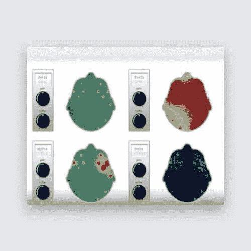
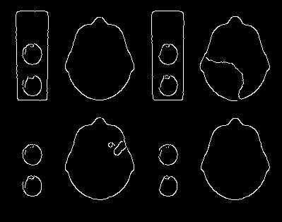
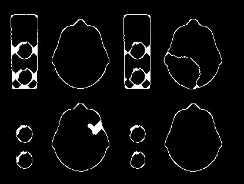
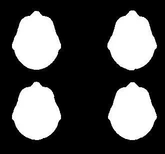
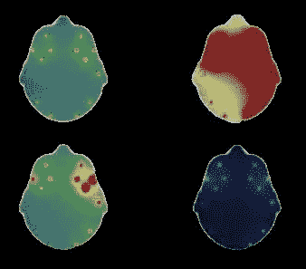
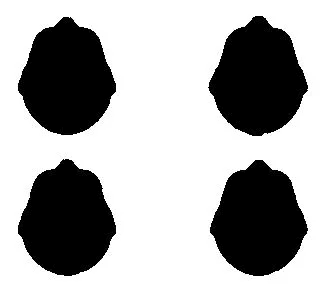
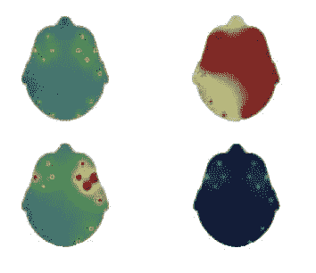

# 从图像中提取感兴趣区域

> 原文：<https://towardsdatascience.com/extracting-regions-of-interest-from-images-dacfd05a41ba?source=collection_archive---------3----------------------->

## 利用 OpenCV 从图像中高效提取感兴趣区域

欢迎来到本系列的第二篇文章，我们将讨论使用 OpenCV 和 Python 从图像中提取感兴趣区域(ROI)。

回顾一下，在本系列的第一篇文章中，我们介绍了从台球桌的图像中提取球和球台边缘的步骤。我们使用简单的 OpenCV 函数，如 **inRange，findContours，boundingRect，minAreaRect，****mineclosing Circle，circle，HoughLines，line 等**来实现我们的目标。

对于 OpenCV 的初学者，我建议浏览一下[的帖子](https://debalb.wordpress.com/2019/08/19/feature-extraction-using-opencv-and-python-part1/)，以便熟悉上述函数的用法。

在这篇文章中，我们将着眼于一个更复杂的问题，并探索一些我们可以用来获得预期结果的方法。

我们今天的任务是从包含患者大脑活动图快照的图像中提取所需的片段。然后，所提取的片段可以用于许多应用中，例如可以诊断任何健康异常的机器学习模型中。

让我们从输入图像本身开始。这是神经科学领域中使用的医疗仪器生成的典型报告，这些仪器使用传感器来检测来自患者大脑的信号，并将它们显示为彩色图。通常有四幅地图，每幅地图都描绘了某个特征，并一起进行分析以进行诊断(进一步的细节不在当前范围内)。

Our target image for this exercise containing the four brain maps (image source author)

从上面的图像中，我们只想提取对应于四个地图(头部扫描)的区域，其他的都不提取。所以我们走吧。

第一步是检测我们想要提取的片段的边缘。这是一个多步骤的过程，如下所述:

1.  使用**“CVT color()”**将 RGB 图像转换为灰度
2.  通过应用模糊函数**“Gaussian blur()”**去除灰度图像中的噪声
3.  最后对模糊图像应用**“Canny()”**函数以获得边缘

边缘检测过程的输出如下所示:

Edge detection output using Canny algorithm (image source author)

请注意，虽然识别了脑图片段，但是有许多不需要的边缘需要消除，并且一些边缘之间有间隙需要闭合。

用于此目的的一种常用方法是**形态变换**，它涉及到在图像上使用一系列的膨胀和腐蚀来移除不需要的边缘和闭合间隙。

我们在多次迭代中使用 OpenCV 函数“explain()”和“erode()”来获得如下输出。

Some enhancements in the edges using OpenCV (image source author)

正如你所看到的，边缘现在是完整的，比以前平滑多了。

现在，我们可以使用 OpenCV 函数**“find contours()”**提取该图像中的轮廓，并仅选择具有以下属性的轮廓:

1.  几何形状是圆形或椭圆形
2.  面积高于某个阈值(在本例中，值 7000 很好)。

对于第一部分，我们将使用 OpenCV“bounding rect()”检测每个轮廓的外接矩形，并检查纵横比(高度与宽度之比)是否接近 1。

看起来我们的任务已经完成，但是还需要一点微调。

通常情况下，在一个片段上检测到多个重叠的轮廓，而我们只对一个感兴趣。

使用**非最大值抑制**解决了这个问题，即我们查看所有重叠的轮廓，并选择具有最大面积的轮廓作为最终候选轮廓。逻辑非常简单，因此我们不需要任何内置的 OpenCV 或 Python 函数。

另一个重要的逻辑是分别识别四个部分，即左上、右上、左下和右下。

这也非常简单，包括识别图像中心坐标以及我们检测到的每个片段的质心。分段轮廓的质心检测需要在轮廓上应用 OpenCV **"moments()"** 函数，然后使用下面的公式计算中心 X，Y 坐标:
**center_x，center _ Y =(int(M[" M10 "]/M[" m00 "])，int(M[" m01 "]/M[" m00 "])**

将分段质心坐标与图像中心坐标进行比较，可以让我们将四个分段放置在它们各自的位置。

现在我们已经确定了四个部分，我们需要建立图像蒙版，它将允许我们从原始图像中提取出想要的特征。

我们将使用 OpenCV 函数 **"drawContours()"** ，使用白色(R，G，B=255，2555，255)和填充厚度(-1)在黑色背景上绘制所有四个分段轮廓。结果如下所示:

Mask for extracting our ROIs (image source author)

在原始图像上应用这个蒙版可以在我们选择的背景(例如黑色或白色)上得到我们想要的片段。

对于黑色背景，我们创建一个黑色画布，然后使用 OpenCV 函数**“bitwise _ and()”**使用之前获得的蒙版在其上绘制。

Extracted ROIs over a black background (image source author)

对于白色背景，我们首先创建一个白色画布，然后创建一个彩色反转遮罩，如下图所示，使用 OpenCV 函数 **"drawContours()"** 以黑色(R，G，B = 0，0，0)绘制轮廓，填充厚度为(-1)。

An alternative Inverted mask for ROI extraction (image source author)

然后，我们使用 OpenCV**“add()”**函数将这个反转的蒙版与之前获得的黑色背景相加，得到相同的结果，但背景为白色。

Extracted ROIs over a white background (image source author)

这篇文章到此结束，在这篇文章中，我们研究了几种方法，使用这些方法可以很容易地从图像中提取感兴趣的区域。

应当注意，在具有不同复杂度的其他图像的情况下，上面使用的方法可以进行修改。然而，上面讨论的基础知识将为解决此类问题所需的任何高级技术奠定基础。

 [## 2019 年 10 月 11 位最佳自由职业 OpenCV 开发者——Toptal

### 自 2013 年 10 月 28 日起成为会员 Ivan 是一名算法开发人员和研究科学家(博士),具有很强的数学…

www.toptal.com](https://www.toptal.com/opencv)