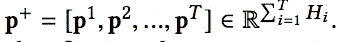

# 极端深度因子分解机器(xDeepFM)

> 原文：<https://towardsdatascience.com/extreme-deep-factorization-machine-xdeepfm-1ba180a6de78?source=collection_archive---------5----------------------->

## 推荐系统领域的新热点


Photo by [Nathan Dumlao](https://unsplash.com/@nate_dumlao?utm_source=unsplash&utm_medium=referral&utm_content=creditCopyText) on [Unsplash](https://unsplash.com/s/photos/choice?utm_source=unsplash&utm_medium=referral&utm_content=creditCopyText)

我们生活在一个被选择宠坏的时代。无论是食物、音乐还是娱乐，我们拥有的选择之多简直令人难以置信。但是由于推荐引擎为这些应用/网站提供了燃料，这些备选方案以排名列表的形式提供给我们。在这篇博客中，我们将讨论一种新的推荐算法，称为极端深度分解机器(xDeepFM)。

本博客组织如下:

1.  *当前生产中的推荐系统*
2.  *介绍 xDeepFM*
3.  *介绍 CIN(xDeepFM 的核心支柱)
    3.1 CIN 特性
    3.2 CIN 隐层
    3.3 与 RNN 相似
    3.4 与 CNN 相似
    3.5 隐层的池化与串接
    3.6 xDeepFM 的输出*
4.  *CIN 复杂度
    4.1 空间复杂度
    4.2 时间复杂度*

*5。使用 deepCTR 库的编码示例*

*6。参考文献*

7。概要

开始吧！！

# 1.当前推荐系统

当前的推荐格局由基于 FM/DNN 的模型主导。但是也出现了一些融合 FM 和 DNN 系统的混合架构。

*1。基于因式分解机(FM)的方法*

*   +ve:自动学习组合特征的模式
*   +ve:很好地概括看不见的特征
*   -ve:试图捕获所有导致无用交互学习的特征交互。这可能会引入噪声。
*   示例:推荐领域最受信任的主力

*2。基于深度神经网络(DNN)的方法*

*   +ve:学习复杂和选择性的功能交互
*   -ve:功能交互是在元素级别上建模的。一种热编码用于分类变量，以在维度 d 中表示它们。这将被馈送到完全连接的层中。这与基于 FM 的方法形成鲜明对比，基于 FM 的方法在向量级别(用户向量*项目向量)对特征交互进行建模。
*   例如:神经协同过滤的 DNN 部分(NCF)，Youtube 推荐的 DNN

*3。DNN +调频(混合)方法*

*   +ve:学习低/高阶特征交互
*   例如:宽深度网络(Youtube)、神经协同过滤(NCF)、深度和交叉网络(DCN)、深度分解机(DeepFM)和极端深度分解机(xDeepFM)

你可以看看这篇文章，了解一下神经协同过滤(NCF)的概况。这是所有混合动力车型中被引用最多的。

[](https://medium.com/@abhisheksharma_57055/neural-collaborative-filtering-96cef1009401) [## 神经协同过滤

### 基于神经网络的增压协同过滤

medium.com](https://medium.com/@abhisheksharma_57055/neural-collaborative-filtering-96cef1009401) 

所有混合类别的例子都使用 DNN 来学习隐式的按位特征交互。它们的不同之处在于如何学习高阶特征相互作用。

# 2.xDeepFM 简介


Figure 1: The architecture of xDeepFM

xDeepFM 由 3 部分组成:

1.  线性模型(直接在原始输入要素上工作)
2.  普通 DNN(在密集要素嵌入的基础上工作)
3.  CIN(在密集特征嵌入之上工作)

> 在这三个国家中，CIN 是 xDeepFM 独有的。

# 3.介绍***【CIN】***压缩互动网络

基于 DNN 的系统的问题是它们隐含地学习高阶交互。在 xDeepFM 中，通过压缩交互网络(CIN)学习显式高阶特征交互。

## 3.1 CIN 的特点

xDeepFM 推荐 CIN 是因为以下好处:

*   它在向量层次上学习功能交互，而不是在逐位层次上。
*   它明确地测量高阶特征相互作用。
*   它的复杂性不会随着相互作用的程度呈指数增长。

## 3.2 CIN 隐藏层

CIN 通过其隐藏层(图 4 中的每个 x 是一个隐藏层)学习显式特征交互，其定义如下


Equation 1

**X(k-1，i)** *:* 第 k 层(k-1 隐层)第 I 个场的嵌入向量
***X(0，j)*** :第 k 层第 j 个场的嵌入向量(基嵌入/原始特征嵌入)
***W(k，H，I，j)*** :维数为 m * H(k-1)的可学习参数

> *X(k)* 中的每一行仅用 W(k，h)来区分。与 DNN 相反，没有激活来转换隐藏层。

## 3.3 与 RNN 相似

等式 1 类似于基于 RNN 的模型，因为 CIN 的输出取决于最后一个隐藏层和附加输入。

## ***3.4 与 CNN*** 相似


Figure 2: Outer products along each dimension for feature interactions

**m:** 原始特征矩阵的行数
**H(k):** 隐藏层 k 的特征矩阵的行数

> Z(k+1)是一个中间张量，它是隐藏层 X(k)和原始特征矩阵 X(0)的外积。Z(k+1)可以看作一种特殊类型的图像，W(k，h)可以看作一种滤波器。


Figure 3: The k-th layer of CIN. It compresses the intermediate tensor from H(K)*m to H(k+1)

当你沿着维度 D(每个嵌入特征的大小)滑动权重矩阵时，你得到一个隐藏向量 X(k+1，I)。


Figure 4: This is the expansion of CIN component of Figure 1

**T:** 网络的深度

## 3.5 隐藏层的汇集和连接

隐藏层的结果按行相加，然后在馈送到输出层之前连接在一起。

1.  每个隐藏层都与输出单元有联系
2.  总和池应用于每个隐藏层，以创建一个池向量，如下所示:


Equation 2:


Pooling Vector of length H(k) at layer k

隐藏层中的所有池向量在连接到输出单元之前被连接:



Concatenation of pooling vectors of all layers

## 3.6 xDeepFM 的输出方程

线性、CIN 和 DNN 都是用如下输出等式并行训练的:


Equation 3: Output Function of CIN

***适马:***s 形函数
***a:*** 原始特征
**W，b:** 可学参数

> 基于 DNN 和 CIN 的层可以很好地互相补充，一起学习
> 
> 1.隐式(DNN)和显式(CIN)特征交互。
> 
> 2.低阶(DNN)和高阶(两者)特征相互作用。

# 4.CIN 空间和时间复杂性

## 4.1 ***空间复杂度***


Space Complexity of CIN

第一项表示输出层的参数数量
第二项表示每层 k
的参数数量，如果我们假设所有隐藏层具有相同数量的特征向量 H。参数数量可以表示为 O(m*H*H*T)

## 4.2 ***时间复杂度***

时间复杂度相当于 O(mHD * H * T)。
***mhd:*** 计算 1 行 Z(k+1，H)的成本
***H:***H 层的特征向量(行数)
***T:***CIN 的隐藏层数

至此，我们完成了 xdeepfm 的理论。是时候看看它的实际效果了。

# 5.编码示例

我使用了 deepCTR 库中的 xDeepFM 实现。对于其他一些实现，请查看参考部分。

从[这里](https://github.com/shenweichen/DeepCTR/blob/master/examples/criteo_sample.txt)下载样本数据，然后使用以下代码读取数据并将特征分为密集或稀疏。

稀疏特征需要嵌入，而密集特征需要归一化。我们使用 MinMax scaler 进行标准化，而 LabelEncoder 进行特征编码。


This is how sparse_feature_columns[0] look

```
# creating a dense feat
dense_feature_columns = [DenseFeat(feat, 1) for feat in dense_features]
```


This is how dense_feature_columns[0] looks like

在下一个代码 blob 中，我们将使用 xDeepFM 进行初始化、编译、训练和预测

# 6.参考

1.  [xDeepFM 论文](https://arxiv.org/abs/1803.05170)
2.  一些现成的 xDeepFM 实现有:-
    1。[代码来自论文作者 xDeepFM](https://github.com/Leavingseason/xDeepFM)
    2。[来自微软推荐库](https://github.com/microsoft/recommenders)
    3 的代码。 [deepctr](https://github.com/shenweichen/DeepCTR) 用于以下实施

# 7.摘要

xDeepFM 是混合架构的一个例子。它将 MF 和 DNN 结合起来，以得到更好的性能。这是通过使用 CIN(压缩交互网络)实现的。CIN 有两种特殊的美德:

1.  它可以有效地学习有界度特征交互。
2.  它在向量水平上学习特征交互。

像其他流行的混合方法一样，xDeepFM 将 CIN 和 DNN 结合在一起。
由此可以显式和隐式地学习高阶特征交互。这减少了手动特征工程的需要。

我会敦促你尝试一下微软的库或 xDeepFM 作者的 T2 代码，尝试不同的 xDeepFM 实现。

你也可以看看[这篇](https://medium.com/@abhisheksharma_57055/neural-collaborative-filtering-96cef1009401)帖子来简要了解 NCF，这是另一种流行的混合架构。

[](https://medium.com/@abhisheksharma_57055/neural-collaborative-filtering-96cef1009401) [## 神经协同过滤

### 基于神经网络的增压协同过滤

medium.com](https://medium.com/@abhisheksharma_57055/neural-collaborative-filtering-96cef1009401) 

请在评论区分享你的想法和主意。