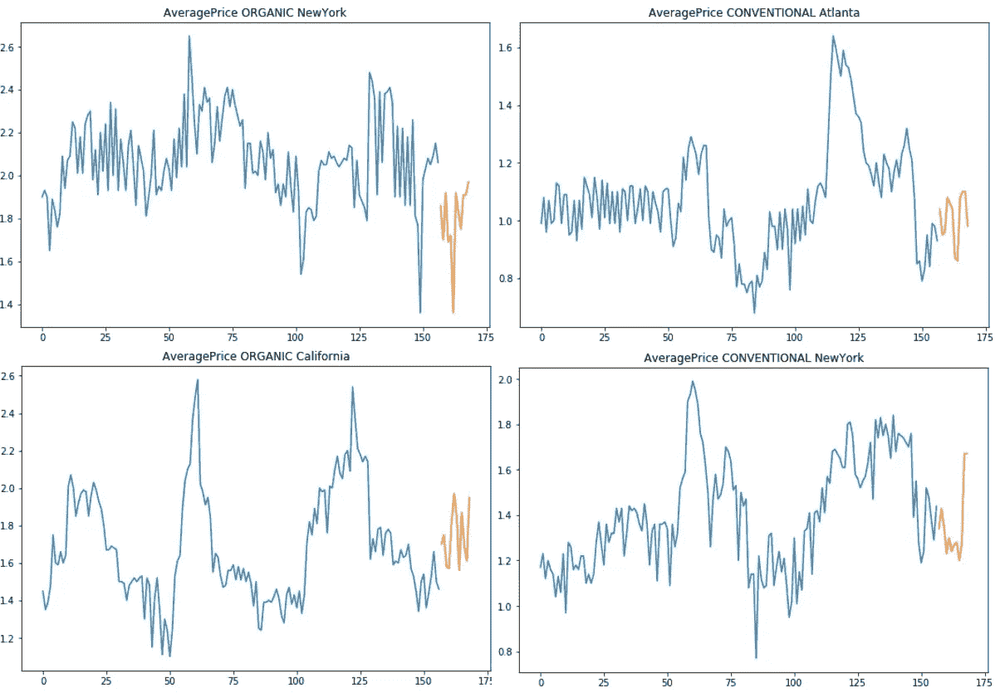
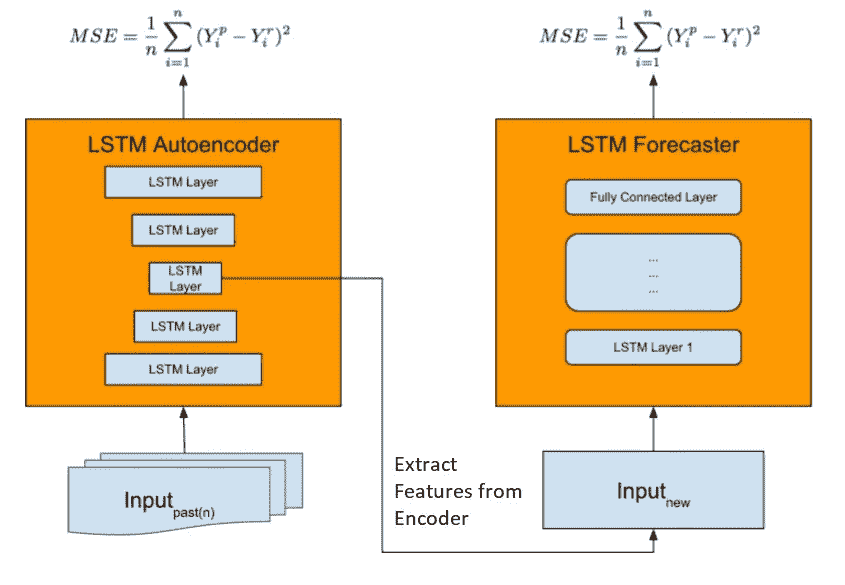
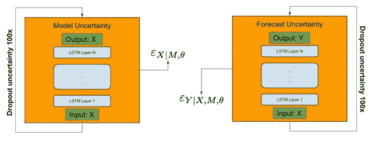
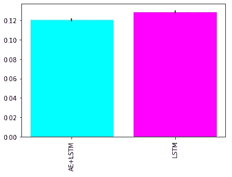

# 用 LSTM 自动编码器预测极端事件

> 原文：<https://towardsdatascience.com/extreme-event-forecasting-with-lstm-autoencoders-297492485037?source=collection_archive---------10----------------------->

## 提高预测性能开发强大的神经网络架构


Photo by [Nur Afni Setiyaningrum](https://unsplash.com/@nurafnisetiyaningrum?utm_source=medium&utm_medium=referral) on [Unsplash](https://unsplash.com?utm_source=medium&utm_medium=referral)

处理极端事件预测是每个数据科学家经常做的噩梦。环顾四周，我发现了处理这个问题的非常有趣的资源。就我个人而言，我简直爱上了优步研究人员发布的方法。在他们的论文中(这里有两个版本[这里有](https://eng.uber.com/neural-networks/)和[这里有](https://arxiv.org/pdf/1709.01907.pdf))，他们开发了一个 ML 解决方案来预测未来的日常出行需求。他们的方法因其友好、解释清楚和易于实施而吸引了我的注意力。所以我的目的是用 pythonic 语言重现他们的发现。我对这个挑战非常满意，最终，我提高了回归预测的知识。

这篇文章最重要的收获可以总结为:

*   开发一个**稳定的方法来评估和比较 Keras 模型**(同时避免权重种子生成器的问题)；
*   **实现一个简单聪明的 LSTM 自动编码器**用于新功能的创建；
*   **用简单的技巧提高时间序列的预测性能**(见上一步)；
*   **处理嵌套数据集**，即我们的观察数据属于不同实体的问题(例如不同商店/引擎/人员的时间序列等)……从这个意义上说，我们只开发了一个适用于所有人的高性能模型！

但是保留 Kalm，让我们一步一步来。

# 问题概述

> 在优步，对已完成行程的准确预测(特别是在特殊活动期间)提供了一系列重要的好处:更有效的司机分配，从而减少乘客的等待时间，预算规划和其他相关任务。

为了实现对驾驶员拼车需求的高精度预测，优步的研究人员开发了一个高性能的时间序列预测模型。他们能够用来自不同地点/城市的大量异类时间序列来拟合(一次性)单一模型。这个过程允许我们提取相关的时间模式。最终，他们能够预测需求，针对不同的地点/城市进行归纳，优于传统的预测方法。

# 数据集

在这项任务中，优步利用了不同城市间日常出行的内部数据集，包括附加功能；即天气信息和城市级信息。他们的目标是从过去的固定观察窗口预测第二天的需求。

不幸的是，我们没有这种数据，所以作为 Kaggle 的粉丝，我们选择了不错的鳄梨价格数据集。该数据显示了两种不同品种鳄梨的历史价格，以及在多个美国市场的销量。

我们的选择是因为需要一个具有时间依赖性的嵌套数据集:我们有每个美国市场的时间序列，总共 54 个，如果我们考虑每种类型(传统和有机)的一个时间序列，这个数字将增长到 108。优步的研究人员强调这种数据结构的重要性，因为它允许我们的模型发现重要的不可见关系。此外，序列之间的相关性为我们的 LSTM 自动编码器在特征提取过程中带来了优势。

为了建立我们的模型，我们利用了截至 2017 年底的价格时间序列。2018 年的前 2 个月被存储并用作测试集。对于我们的分析，我们还将考虑所有提供的回归变量。观察结果以微弱的频率显示，因此我们的目的是:给定一个固定的过去窗口(4 周)的特征，预测即将到来的微弱价格。



Train (blue) Test (orange) overview of avocado prices

由于没有指数增长和趋势行为，我们不需要调整我们的价格系列。

# 建模

为了解决我们的预测任务，我们复制了优步提出的新的模型体系结构，它为异质预测提供了单一的模型。如下图所示，*该模型首先通过自动特征提取启动网络，训练一个 LSTM 自动编码器，这对大规模捕捉复杂的时间序列动态至关重要。然后将特征向量与新输入连接起来，并馈送给 LSTM 预测器进行预测。*

我们的预测工作流程很容易想象:我们有不同市场的每周价格的初始窗口(加上其他功能)。我们开始在它们上面训练我们的 LSTM 自动编码器；接下来，我们移除编码器并将其用作特征创建器。训练用于预测的预测 LSTM 模型所需的第二步也是最后一步。基于真实/现有的回归变量和之前人工生成的特征，我们能够提供下周的鳄梨价格预测。



from [Time-series Extreme Event Forecasting with Neural Networks at Uber](http://roseyu.com/time-series-workshop/submissions/TSW2017_paper_3.pdf)

我们很容易用 Keras 重新创建这个逻辑。

我们的 LSTM 自动编码器由一个简单的 LSTM 编码器层组成，后面是另一个简单的 LSTM 解码器。在评估期间你会明白辍学的效用，在这一点上他们是无害的，相信我！

```
inputs_ae = Input(shape=(sequence_length, n_features))
encoded_ae = LSTM(128, return_sequences=True, dropout=0.5)(inputs_ae, training=True)
decoded_ae = LSTM(32, return_sequences=True, dropout=0.5)(encoded_ae, training=True)
out_ae = TimeDistributed(Dense(1))(decoded_ae)
sequence_autoencoder = Model(inputs_ae, out_ae)
```

我们计算特征提取，并将结果与其他变量连接起来。在这一点上，我做了一点偏离优步的解决方案:他们建议操纵由我们的编码器提取的特征向量，通过集成技术(例如，平均)聚集它们。我决定让他们原创和免费。我做这个选择是因为它允许我在实验中获得更好的结果。

最后，预测模型是另一个简单的基于 LSTM 的神经网络:

```
inputs = Input(shape=(sequence_length, n_features))
lstm = LSTM(128, return_sequences=True, dropout=0.5)(inputs, training=True)
lstm = LSTM(32, return_sequences=False, dropout=0.5)(lstm, training=True)
dense = Dense(50)(lstm)
out = Dense(1)(dense)
```

# 估价

最后，我们几乎准备好看到一些结果，并作出预测。最后的步骤包括创建一个竞争模型和一个用于结果比较的稳健预测方法的结果定义。

就个人而言，评估两种不同程序的最佳方式是尽可能地复制它们，以便只在真正感兴趣的地方引起注意。在这个实现中，我想展示 LSTM Autoencoder 作为时间序列预测相关功能创建工具的能力。从这个意义上来说，为了评估我们方法的优劣，我决定开发一个新的价格预测模型，其结构与我们以前的预测神经网络相同。

它们之间的唯一区别是它们作为输入接收的特征。第一个接收编码器输出加上外部回归量；第二个接收过去的原始价格加上外部回归量。

# 不确定性估计和结果

时间序列预测在本质上对于感兴趣领域的极端可变性是至关重要的。此外，如果你试图建立一个基于神经网络的模型，你的结果也会受到内部权重初始化的影响。为了克服这个缺点，存在许多不确定性估计的方法:从贝叶斯到基于 bootstrap 理论的方法。

在他们的工作中，优步的研究人员*结合了 Bootstrap 和 Bayesian 方法，产生了一个简单、健壮和紧密的不确定性界限，具有良好的覆盖范围和可证明的收敛特性。*

这项技术非常简单和实用…间接我们已经实现了它！如下图所示，*在前馈过程中，丢弃应用于编码器和预测网络中的所有层。因此，编码器中的随机丢失智能地干扰了嵌入空间中的输入，这说明了潜在的模型错误设定，并通过预测网络进一步传播。*



from [Time-series Extreme Event Forecasting with Neural Networks at Uber](http://roseyu.com/time-series-workshop/submissions/TSW2017_paper_3.pdf)

Pythonic 说，我们只需在我们的神经网络中添加可训练的辍学层，并在预测期间重新激活它们(Keras 用于在预测期间减少辍学)。

对于最终的评估，我们必须迭代调用预测函数并存储结果。我还计算每次交互的预测得分(我选择平均绝对误差)。我们必须设置计算求值的次数(在我们的例子中是 100 次)。有了存储的分数，我们就能够计算 MAE 的平均值、标准偏差和相对不确定性。

我们对仅由 LSTM 预测网络制作的“对手模型”重复同样的程序。在平均分数和计算不确定性后，LSTM 自动编码器+ LSTM 预测器的最终结果比单一的 LSTM 预测器更好。



Performance (MAE) comparison on test data

# 摘要

在这篇文章中，我复制了一个在优步开发的用于特殊事件预测的端到端神经网络架构。我想强调:LSTM Autoencoder 在特征提取器角色中的力量；这种解决方案的可扩展性可以很好地概括，避免为每个时间序列训练多个模型；为神经网络评估提供稳定且有利的方法的能力。

我还注意到，当您拥有足够数量的共享共同行为的时间序列时，这种解决方案非常适合…这些行为是否立即可见并不重要，Autoencoder 为我们实现了这一点。

[**查看我的 GITHUB 回购**](https://github.com/cerlymarco/MEDIUM_NoteBook)

保持联系: [Linkedin](https://www.linkedin.com/in/marco-cerliani-b0bba714b/)

**参考文献**

[1]对时间序列的深刻而自信的预测:，朱，拉普捷夫

[2]用神经网络进行时间序列极端事件预测:Nikolay Laptev，Jason Yosinski，Li Erran Li，Slawek Smyl