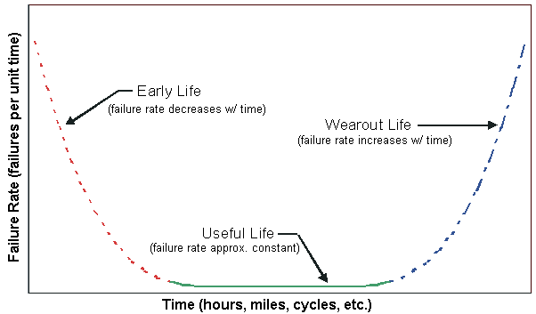
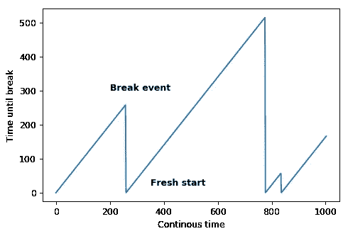
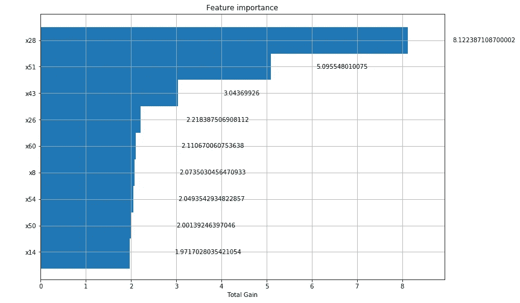
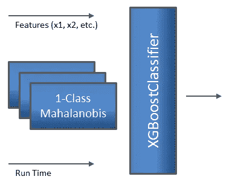

# 极端罕见事件分类:现实世界数据集的直接解决方案

> 原文：<https://towardsdatascience.com/extreme-rare-event-classification-a-straight-forward-solution-58a20ef56ef5?source=collection_archive---------8----------------------->

## 用于检测造纸厂罕见事件(断纸)的预测模型。

首先，感谢 Chitta Ranjan 为我们提供了一个造纸厂的真实数据集。这是一个具有挑战性的时间序列数据集，也是预测维护领域的一个常见问题。本文针对该问题提出了一个可行且直截了当的解决方案。我强烈推荐阅读奇塔以前的文章([链接](/extreme-rare-event-classification-using-autoencoders-in-keras-a565b386f098))。

在预测性维护领域，许多公司面临的挑战是根据设备行为(基于状态的维护)在故障发生之前预测故障。目前，维护人员使用的常用工具是 APM(资产性能管理),它基于风险和可靠性技术(例如威布尔曲线)。

**总结:**这种类型曲线的思想是将概率曲线上的故障分为三个不同的区域:过早故障、随机故障和寿命终止故障。

这是一个简单的想法，可以让我们了解这个领域中重要的特性，比如运行时间(计数器)。



Figure 1 — Weibull curve showing three tipical parts of probabilistic failure [Source: [https://www.weibull.com/hotwire/issue14/relbasics14.htm](https://www.weibull.com/hotwire/issue14/relbasics14.htm)]

# 预处理

首先，您需要使用以下代码创建问题的框架:

```
df['y_1'] = df['y'].shift(-1)
df['y_2'] = df['y'].shift(-2)
df = df.loc[df.y==0] #deleting the downtime eventdf['y'] = df.apply(lambda x: 1 if ((x['y_1'] == 1) | (x['y_2'] == 1)) else 0, axis=1)features = df.columns.tolist()# adding delayed info
features.remove('time')
features.remove('y_1')
features.remove('y_2')
features.remove('x61')
target = 'y'
features.remove(target)
```

一些亮点:由于数据周期(不到一个月)不能证明任何新功能的创建(小时、天、班次、季度、星期几等),所以时间功能被取消了。).另一个被排除的变量是完全冻结的 x61。

少数类约占所有数据的 1.3%。有一个很简单的方法可以稍微改善一下，就是确定活动前 6 分钟和 4 分钟一样好。所以，它将改善 50%的少数阶级，而且可以公平地断言，这不是一种可怕的罪恶:

```
df['y'] = df.apply(lambda x: 1 if ((x['y_1'] == 1) | (x['y_2'] == 1) | (x['y_3'] == 1) ) else 0, axis=1)
```

现在称为 **count_y** 的计数器(运行时间)是为将模型的时间流逝联系起来而创建的特性。



Figure 2 — The counter reset after the failure (y=1)

# 一类策略的异常检测

异常检测的最简单策略是使用一类算法，如 SVM 或马哈拉诺比斯距离，来了解数据中哪些是正常的，哪些是不正常的。

首先，数据将被分为训练和测试。

```
#Splitting
from sklearn.model_selection import train_test_splitx_train, x_test, y_train, y_test = train_test_split(df[features],df[target],shuffle=True,
random_state=10)#Scalling
from sklearn.preprocessing import StandardScaler
scale = StandardScaler()x_train = pd.DataFrame(data=scale.fit_transform(x_train),columns=features,index=y_train.index)
x_test = pd.DataFrame(data=scale.transform(x_test),columns=features,index=y_test.index)
```

数据分离后，SVM 成为候选模型:

```
from sklearn.svm import OneClassSVM
from sklearn.metrics import classification_report
from sklearn.metrics import confusion_matrixsvm1 = OneClassSVM(kernel='rbf', gamma='auto',nu=0.05)svm1.fit(x_train_pos[features])y_pred = pd.DataFrame(data=svm1.predict(x_test[features]))
# need to convert to the same standard, 0 == normal and 1 for break
y_pred.loc[y_pred[0]==1] = 0 # normal 
y_pred.loc[y_pred[0]==-1] = 1 #breakprint(classification_report(y_test,y_pred,digits=3))
confusion_matrix(y_test,y_pred)
```

结果低于基准(F1<0.1)

```
precision    recall  f1-score   support

           0      0.984     0.947     0.965      4486
          ** 1      0.040     0.123     0.061        81**

   micro avg      0.933     0.933     0.933      4567
   macro avg      0.512     0.535     0.513      4567
weighted avg      0.967     0.933     0.949      4567
```

Mahalabonis 距离提供了类似的结果:

```
clf_total = MahalanobisOneclassClassifier(x_train_pos[features], significance_level=0.001)mahalanobis_dist_total = clf_total.predict_proba(x_test_pos[features].values)print(classification_report(y_test,clf_total.predict(x_test[features].values),digits=3))precision    recall  f1-score   support

           0      0.984     0.886     0.932      4486
 **1      0.032     0.210     0.056        81**

   micro avg      0.874     0.874     0.874      4567
   macro avg      0.508     0.548     0.494      4567
weighted avg      0.967     0.874     0.917      4567
```

# 使用一类异常检测的小特征组

两种算法都使用所有的特性作为输入进行了基准测试。对于这种类型的算法来说，问题的规模肯定是复杂的。一种可能的策略是将特征分成相似组。

通常，与领域专家进行一次良好的工作会谈会有所帮助。另一种方法是使用 GradientBoost 树(要素重要性)来支持此定义。



Figure 3— Fragment of feature importance from XGBoost used to create the 1-class groups

通过使用前 20 个标签，将它们分成 2 个标签组，并在一个类别方法中计算 Mahalanobis 距离，我们人工创建了 10 个新特征，它们代表了与训练数据的标准操作的距离。

```
df['maha_dist'] = clf.predict_proba(df[feat_maha].values)
df['maha_dist2'] = clf2.predict_proba(df[feat_maha2].values)
df['maha_dist3'] = clf3.predict_proba(df[feat_maha3].values)
df['maha_dist4'] = clf4.predict_proba(df[feat_maha4].values)
df['maha_dist5'] = clf5.predict_proba(df[feat_maha5].values)
df['maha_dist6'] = clf6.predict_proba(df[feat_maha6].values)
df['maha_dist7'] = clf7.predict_proba(df[feat_maha7].values)
df['maha_dist8'] = clf8.predict_proba(df[feat_maha8].values)
df['maha_dist9'] = clf9.predict_proba(df[feat_maha9].values)
df['maha_dist10'] = clf10.predict_proba(df[feat_maha10].values)
```

问题框架的新功能:

```
['x1', 'x2', 'x3', 'x4', 'x5', 'x6', 'x7', 'x8', 'x9', 'x10', 'x11', 'x12', 'x13', 'x14', 'x15', 'x16', 'x17', 'x18', 'x19', 'x20', 'x21', 'x22', 'x23', 'x24', 'x25', 'x26', 'x27', 'x28', 'x29', 'x30', 'x31', 'x32', 'x33', 'x34', 'x35', 'x36', 'x37', 'x38', 'x39', 'x40', 'x41', 'x42', 'x43', 'x44', 'x45', 'x46', 'x47', 'x48', 'x49', 'x50', 'x51', 'x52', 'x53', 'x54', 'x55', 'x56', 'x57', 'x58', 'x59', 'x60', 'count_y', 'maha_dist', 'maha_dist2', 'maha_dist3', 'maha_dist4', 'maha_dist5', 'maha_dist6', 'maha_dist7', 'maha_dist8', 'maha_dist9', 'maha_dist10']
```

它将使用 GradientBoostClassifier 作为接收这个新特性的主要分类器(图 4)。



Figure 4 — Simplied model structure

应注意避免使用相同的随机状态混合训练样本和测试样本:

```
x_train, x_test, y_train, y_test = train_test_split(df[features],df[target],shuffle=True,
random_state=10)gbc = XGBClassifier(n_estimators=1000,subsample=0.9,max_depth=6,random_state=10, max_features=0.9, n_jobs=2)**%**time gbc.fit(x_train,y_train)**Wall time: 1min 4s**
```

少数类 0.5 的 F1 结果高于问题的基准。

```
precision    recall  f1-score   support

           0      0.989     1.000     0.994      4486
 **1      0.968     0.370     0.536        81**

    accuracy                          0.989      4567
   macro avg      0.978     0.685     0.765      4567
weighted avg      0.988     0.989     0.986      4567
```

# 每个特征的异常检测

一个更简单的策略是使用第一个 XGBoost 特性重要性所指向的前 20 个标签为模型输入中的每个特性创建 AD(异常检测器)。

```
#top 20 tags
original_features = ['count_y','x51', 'x28','x26', 'x43','x60', 'x8','x54', 'x50','x14', 'x18','x24', 'x53','x23', 'x15','x22', 'x52','x42', 'x21', 'x36', 'x3']features_individual_ad = original_features.copy()
ad_maha = []
for feat in original_features:
    if not feat == 'count_y':
        _model = MahalanobisOneclassClassifier(x_train_pos[[feat]], significance_level=0.01)
        ad_maha.append(_model)
        _ad_name = feat + '_ad'
        df[_ad_name] = _model.predict_proba(df[[feat]].values)
        features_individual_ad.append(_ad_name)
```

并且结果甚至比成对特征的组合更好。

```
precision    recall  f1-score   support

           0      0.992     0.998     0.995      4486
 **1      0.865     0.556     0.677        81**

    accuracy                          0.991      4567
   macro avg      0.929     0.777     0.836      4567
weighted avg      0.990     0.991     0.990      4567
```

# 结论

使用人工特征(运行时间特征和 Mahalanobis 距离)和良好的 ML 分类器算法(梯度增强)的非常直接的解决方案为该问题提供了高于初始基准的结果(F1>0.1)。对于少数类，算法的最佳拓扑能够实现 0.67 F1。建议在训练和测试之间进行更稳健的分离(交叉验证),以验证该结果，并对模型参数进行微调。

完整的代码可以在 [GIT](https://github.com/robertoamansur/rare_event_pred_maintanance/blob/master/README.md) 上找到。


Figure 5 — Featured image : All starts here … [source: pexels]