# 极端罕见事件分类:使用 Keras 中的 LSTM 估计剩余使用寿命

> 原文：<https://towardsdatascience.com/extreme-rare-event-classification-remaining-useful-life-estimation-using-lstm-in-keras-81c9b5aa15f0?source=collection_archive---------10----------------------->

一种基于回归的估计造纸厂剩余使用寿命(RUL)的方法，用于纸幅断裂预测问题。

这篇文章中提出的观点、见解和工具是由之前发表在 Medium 上的两篇文章激发的。第一篇([链接](/extreme-rare-event-classification-using-autoencoders-in-keras-a565b386f098))由[奇塔·兰詹](https://medium.com/u/1c9fae27a83?source=post_page-----81c9b5aa15f0--------------------------------)撰写，简要介绍了极端事件分类问题，并使用 LSTM 自动编码器方法来检测异常。通过分析自动编码器重建步骤中的误差，我们可以识别造纸厂中可能的卷筒纸断裂。第二篇([链接](/extreme-rare-event-classification-a-straight-forward-solution-58a20ef56ef5))由 [Roberto Mansur](https://medium.com/u/aa7805b8ef70?source=post_page-----81c9b5aa15f0--------------------------------) 撰写，简要概述了基于状态的维护，并展示了威布尔曲线在概率故障分类中的应用。与 Ranjan 的文章不同，后者通过创建基于变量对之间的 Mahalanobis 距离的新特征来进行异常检测。

结合两篇文章中提出的观点，我们可以创建一个模型，根据造纸厂的历史条件来估计其 RUL。为了获得这种估计，使用具有长短期记忆(LSTM)结构的递归神经网络(RNN)作为回归模型。

图 1 通过显示锂离子电池在连续充电和放电循环中的容量曲线，举例说明了 RUL 的使用情况。为了估计该电池的 RUL，有必要在真实数据点上训练模型，并确定电池将在哪个充电和放电循环中产生其最小可接受容量，或者也称为其故障阈值。

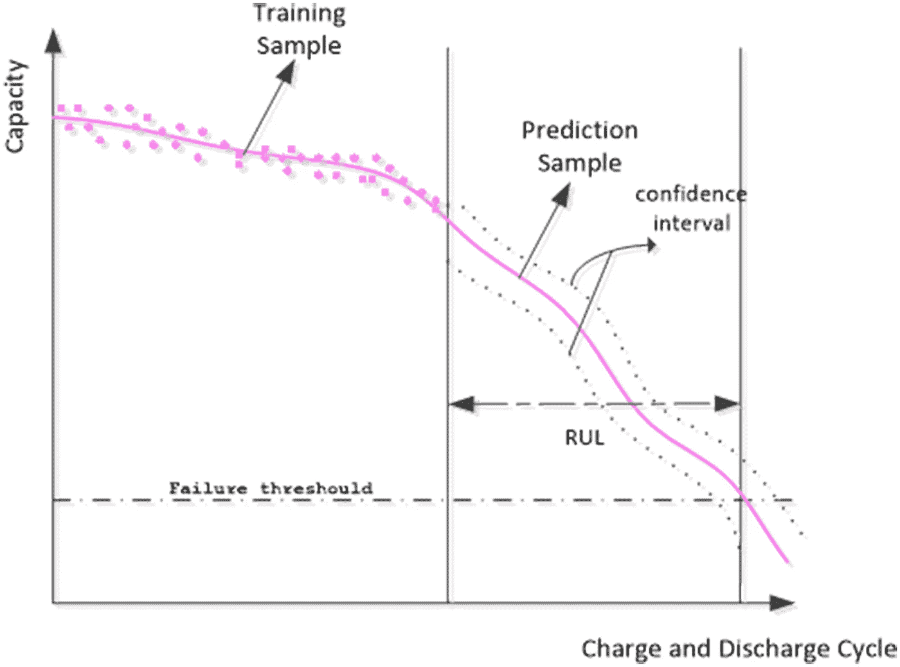

Figure 1 — RUL Prediction for Lithium-Ion Batteries Based on Gaussian Processes Mixture [Source: [https://journals.plos.org/plosone/article/figure?id=10.1371/journal.pone.0163004.g002](https://journals.plos.org/plosone/article/figure?id=10.1371/journal.pone.0163004.g002)]

这个问题用到的源代码和数据集可以在我的 GitHub 上找到([链接](https://github.com/Daniel-Arayala/RUL_estimation_paper_mill))。

# 概观

断纸是所有垂直造纸行业都会遇到的非常复杂的问题，由于其复杂性，很难找到断纸事件的具体原因。此外，中断纸张生产过程来调查和定位可能出现的问题非常耗时且成本高昂。以这种方式，许多直接处理预测性维护的公司利用 RUL 技术来安排老化部件和系统的维护，并监控设备的健康状况。

围绕极端罕见事件(如网页中断)的问题是**不平衡类**(中断和工作区)，这导致在使用标准监督学习算法时对少数类的预测不准确。因此，为了避免这种情况，我们可以**通过创建一个代表每个工作区**RUL 的回归计数器，将二元分类问题转化为回归问题。在用先前的特征和新的目标计数器变量训练 LSTM 模型之后，我们可以预测剩余的使用寿命并确定小的故障阈值(取决于所需的响应时间),该阈值用于将每个事件分类为网断裂或不断裂。

# 逐步实施

## 预处理

在创建中断事件之前，从数据帧和新的 6 分钟区域中移除中断。此外，为了避免在创建这个新区域时出现问题，所有持续时间少于 6 分钟的工作区都从数据帧中删除。此外，由于缺少针对该问题给出的信息，所有冻结的标签也被从数据集中移除。

```
target = 'y'
# Creating 3 time shifts to build the region before break
df['y_1'] = df['y'].shift(-1)
df['y_2'] = df['y'].shift(-2)
df['y_3'] = df['y'].shift(-3)# First generated feature
df = count_change(df,'y','count_y')# Creates an ID for each counter reset
df = count_pikes(df,'y','count_id', True)
# ID Value adjustment - Starts at 0
df['count_id'] = df['count_id'] - df['count_id'].min()# Deleting the downtime events and the working zones with less than 6min
df_grouped = df.groupby('count_id').max()[['count_y', target]]
ids = df_grouped.loc[(df_grouped[target] == 0) & (df_grouped['count_y'] >= 3)].index
df = df.loc[df['count_id'].isin(ids)]# Building the region before the break
df['y'] = df.apply(lambda x: 1 if ((x['y_1'] == 1) | (x['y_2'] == 1) | (x['y_3'] == 1)) else 0, axis=1)# Removing target and unused columns
features = df.columns.tolist()
features.remove('time') # Unused column
features.remove('y_1')      # Aux columns
features.remove('y_2')      # ''
features.remove('y_3')      # ''
features.remove('count_id') # ''
features.remove('x61') # Freezed variable
features.remove(target)
```

## 特征工程

为了创建包含新目标的列，我们使用了在上一步中创建的辅助列: *count_y* 和 *count_id。*RUL 变量基本上是一个递减计数器，从最大剩余使用寿命值到零，这发生在断裂事件之前。

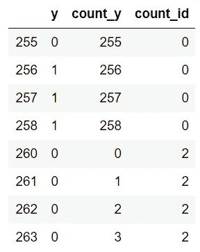

Figure 2 — Break target variable with the auxiliary columns.

总之，参见图 2，可以得出结论，新的目标 RUL 变量与 *count_y* 相反。因此，为了反转计数方向，我们找到了每个 *count_id* 的最大值 *count_y* ，并创建了一个名为 *MAX_RUL 的新辅助列。*

```
max_rul = df.groupby('count_id').max()['count_y'].reset_index()
max_rul.rename(columns={“count_y”:”MAX_RUL”}, inplace=True)
```

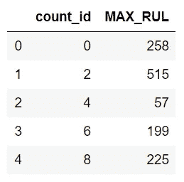

Figure 3 — New dataframe created with the MAX_RUL and the count_id information.

下一步是使用 *count_id 在原始数据帧上执行新创建的数据帧的左连接。*最后，从 *MAX_RUL* 中减去 *count_y* 得到新的目标 *RUL* 列。

```
# Left join on the count_id
df = pd.merge(df,max_rul,how='left',on='count_id')df['RUL'] = df['MAX_RUL'] - df['count_y']# Setting the new target
target = 'RUL'
```

应用所有更改后，数据帧应如下所示:

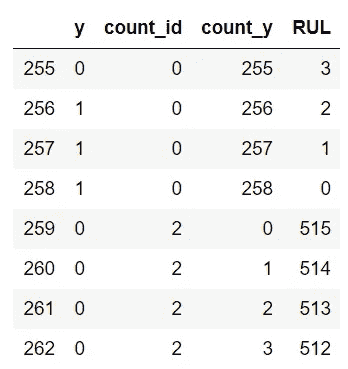

Figure 4— Dataframe with the RUL variable created as the new target.

## 拆分数据

对于这个问题，选择了 5 个时间步长，并使用 *train_test_split* 函数提供的默认测试大小分割数据。应用于数据帧的时移使得在 shuffle 参数设置为 True 的情况下拆分数据成为可能。

```
from sklearn.model_selection import train_test_splittimesteps = 5# List of shifted dataframes according to the number of timesteps
df_list = [df[features].shift(shift_val) if (shift_val == 0) 
                                else df[features].shift(-shift_val).add_suffix(f'_{shift_val}') 
                                for shift_val in range(0,timesteps)]# Concatenating list
df_concat = pd.concat(df_list, axis=1, sort=False)df_concat = df_concat.iloc[:-timesteps,:]# Default train_test_split - test_size=0.25
x_train, x_test, y_train, y_test = train_test_split(df_concat, df[target].iloc[:-timesteps], random_state=10, shuffle=True)
```

## 标准化数据

考虑到在这个问题中使用的递归神经网络(如 LSTM)的尺度敏感性，有必要对数据进行标准化。因此，通过使用 Scikit-Learn 库提供的标准定标器，对数据进行了定标。

```
from sklearn.preprocessing import StandardScalerscaler = StandardScaler()# Scaling and transforming the array back to the dataframe format
# Training
x_train_lstm = pd.DataFrame(data=scaler.fit_transform(x_train), columns=x_train.columns)# Test
x_test_lstm = pd.DataFrame(data=scaler.transform(x_test), columns=x_test.columns)
```

# 使用 LSTM 的回归方法

在这种方法中，我们将使用 Tensorflow 中的 LSTM 和 Keras 层来操作它。考虑到来自少数类的少量样本，使用 LSTM 方法作为不平衡类的分类器太具有挑战性(它使得模型不太专门用于预测中断事件)。也就是说，这个问题可以通过应用剩余使用寿命方法来解决。

因此，定义神经网络架构之前的第一步是格式化数据形状，使其符合 LSTM 的要求:**【样本、时间步长、特征】**。为此，创建了一个名为*到 3D* 的新函数。

```
def to_3D(X, features, timesteps=5):
    '''
        Shapes the dataset so it can fit into 
        LSTM's format requirement.
    '''
    # Creating an empty tridimensional array
    X_trans = np.empty((X.shape[0], timesteps, 0)) # Adjusting the shape of the data
    for feat in features:
        # Regular expressions to filter each feature and
        # drop the NaN values generated from the shift
        df_filtered = X.filter(regex=f'{feat}(_|$)')
        df_filtered=df_filtered.values.reshape(df_filtered.shape[0],
                                               timesteps, 1)
        X_trans = np.append(X_trans, df_filtered, axis=2)

    return X_trans
```

## 定义 LSTM 模型架构

这个模型由 5 层组成:2 层 LSTM，2 层辍学，1 层致密。代码和摘要如下所示:

```
from keras.models import Sequential, load_model
from keras.layers import Dense, Dropout, LSTM
import kerasmodel = Sequential()
model.add(LSTM(input_shape=(timesteps, len(features)), units=15, return_sequences=True))
model.add(Dropout(0.2))
model.add(LSTM(input_shape=(timesteps,len(features)), units=10, return_sequences=False))
model.add(Dropout(0.2))
model.add(Dense(units=1, activation = 'relu'))
model.compile(loss='mean_squared_error', optimizer='adam')
print(model.summary())
```

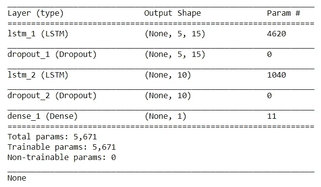

Figure 5 — Model architecture summary.

## 训练 LSTM 回归模型

```
model_path = 'lstm_model.h5'history = model.fit(to_3D(x_train_lstm, features), 
                    y_train, 
                    epochs=1000, 
                    batch_size= 8, 
                    validation_split=0.2, 
                    verbose=1, 
                    callbacks = [
                        keras.callbacks
                             .EarlyStopping(monitor='val_loss',
                                                     min_delta=0, 
                                                     patience=200,
                                                     verbose=1,
                                                     mode='min'), keras.callbacks
                             .ModelCheckpoint(model_path, 
                                              monitor='val_loss',
                                              save_best_only=True, 
                                              mode='min',
                                              verbose=1)])
```

## 评估回归模型

在用均方误差损失训练模型之后，我们获得了以下*损失*和 *val_loss* 曲线:

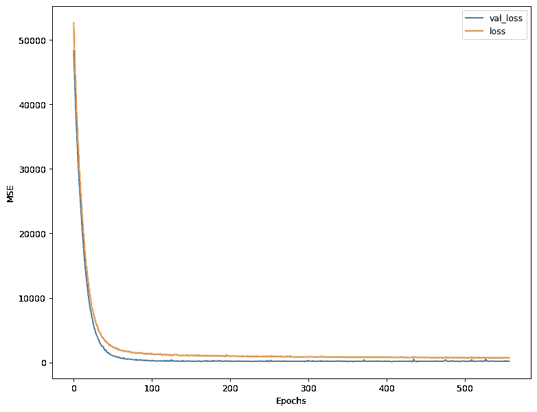

Figure 6 — Curves representing the validation loss and the loss of mean squared error through epochs.

该模型的 R2 分数为 0.9926，这代表了一个很好的结果。但是，我们不得不考虑到，数据是非常不平衡的，高分几乎完全是由于多数阶级造成的。预测值和实际值的比较如下所示:


Figure 7 — True and predicted RUL values.

## 将回归问题转化为分类问题

如前所述，通过选择目标的失效阈值，可以将 RUL 回归问题转化为分类问题。在这种情况下，每 2 分钟采集一次数据，因此在休息前选择 10 分钟的间隔(5 个样本)。检查图 8 中的性能。

```
y_test_class = df.y.reindex(y_test.index)
print(classification_report(y_test_class,rul_pred<=5,digits=3))
confusion_matrix(y_test_class,rul_pred<=5)
```

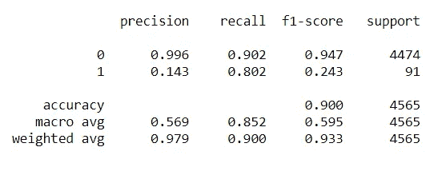

Figure 8— Classification report for a 10-minute failure threshold.

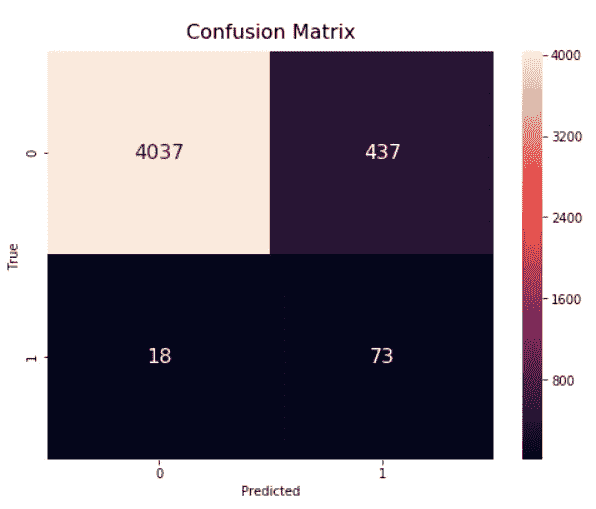

Figure 9— Confusion matrix for a 10-minute failure threshold.

## 故障阈值优化

之前选择了 10 分钟的故障阈值，但是在给定特定指标的情况下，我们如何找到最佳的故障阈值呢？首先，我们需要选择一个分数或指标来优化，对于这个问题，它是 F1 分数，它携带了关于精确度和召回分数的信息。

接下来，创建了一系列不同的故障阈值。我们选取了[1，30]个样本或[2 分钟，60 分钟]的间隔，并计算了每个值的 F1 值。

```
from sklearn.metrics import f1_scorefail_thresh = np.arange(1,31)f1_scores = np.array([])for ft in fail_thresh:
    f1_scores = np.append(f1_scores, round(f1_score(y_test_class,
                                                   rul_pred<=ft),4))
```

计算出每个给定阈值的 F1 分数后，我们通过用 *f1_scores* 数组绘制一个简单的图表，并确定曲线峰值的对应参数，找到了最大值。

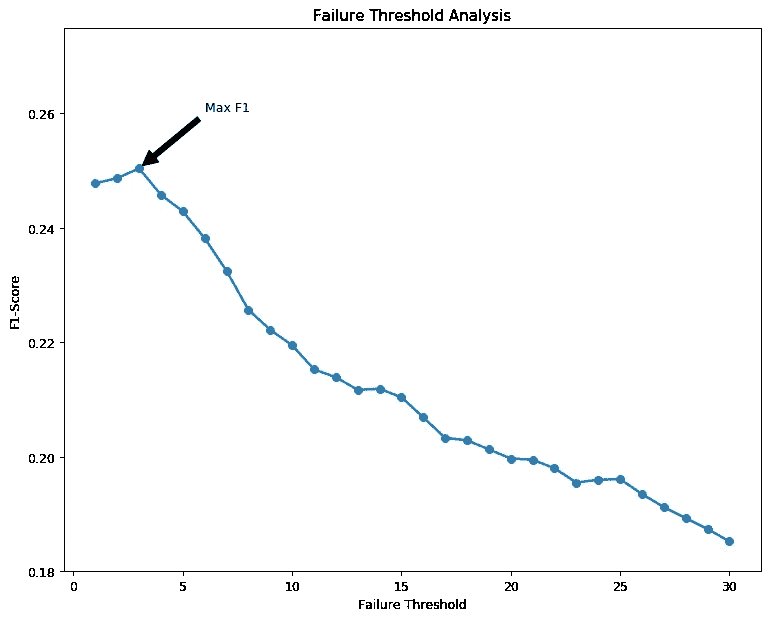

Figure 10— Plotting the F1 scores to optimize the failure threshold value.

从图 10 所示的图中，我们可以看到最佳阈值是 3 个样本(或实际中断前 6 分钟)。完整的分类报告和混淆矩阵如下所示:

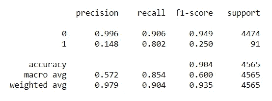

Figure 11— Classification report for a 6-minute failure threshold.

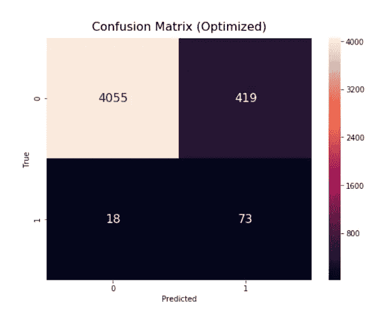

Figure 12— Confusion matrix for a 6-minute failure threshold.

从图 11 中的分类报告中，我们还可以看到少数民族类别的 f1 分数有所提高，大约为 2.88%。对于更大的数据集，行为可能会发生剧烈变化，优化过程将比针对该问题获得的改进百分比更重要。此外，f1 分数已经从 Chitta 文章的基准(f1 分数~0.072)提高了~248%，验证了用于 RUL 问题的方法。

# 使用类别权重的 LSTM 分类

在成功实现 RUL 回归模型之后，我们仍然可以尝试一种分类方法，通过将类权重寻址到 LSTM 来补偿类之间的不平衡。

为了实现分类问题，我们首先需要将中断指示器变量 y 设置为我们的目标，因为它最初是在问题表述中定义的。

用于该问题的 LSTM 拓扑与 RUL 回归方法相同(图 5)，但由于其分类性质，现在使用不同的指标来编译模型。

```
model_class = Sequential()
model_class.add(LSTM(input_shape=(timesteps,len(features)), units=15, return_sequences=True))
model_class.add(Dropout(0.2))
model_class.add(LSTM(input_shape=(timesteps,len(features)), units=10, return_sequences=False))
model_class.add(Dropout(0.2))
model_class.add(Dense(units=1, activation = 'sigmoid'))
model_class.compile(loss='binary_crossentropy', optimizer='adam', metrics=['accuracy'])
print(model.summary())
```

用于拟合模型的参数如下所示:

```
model_path = 'lstm_model_classification.h5'
class_weight = {0: 1,
                1: 50} #2% are breaks ...history = model_class.fit(to_3D(x_train_lstm, features),
                          df['y'].reindex(y_train.index),  
                          epochs=1000, 
                          batch_size= 8, 
                          validation_split=0.2, 
                          verbose=1, 
                          class_weight=class_weight,
                          callbacks = [        
                             keras.callbacks
                                  .EarlyStopping(monitor='val_loss',
                                                        min_delta=0,
                                                       patience=200,
                                                          verbose=1,
                                                        mode='min'),                                                                                                               

                            keras.callbacks
                                  .ModelCheckpoint(model_path, 
                                           monitor='val_loss',
                                          save_best_only=True, 
                                                   mode='min',  
                                                   verbose=1)])
```

在这种情况下，将类权重应用于神经网络会通知模型:类 1 的 1 个实例(中断)表示类 0 的 50 个实例(无中断)。因此，模型将为少数类样本分配较高的值，将损失函数转换为加权平均值，其中样本权重在 class_weight 字典中指定。

## 评估分类模型

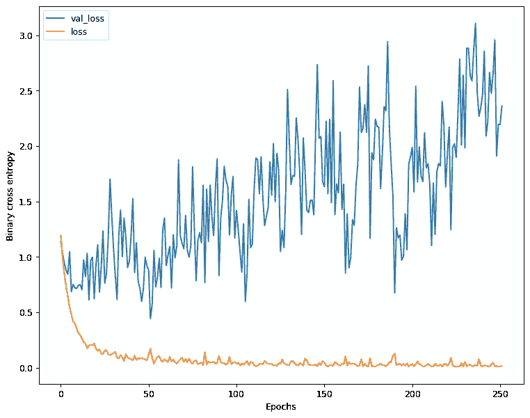

Figure 13- Curves representing the validation loss and the loss for the classification problem.

通过分析少数类的分类报告，我们可以看到 0.544 的出色 f1 得分结果，表明与之前的回归方法相比，模型性能提高了一倍以上。与上一份报告相比，精确度和召回分数也有所提高，这意味着该模型得到了充分优化，并且没有出现性能折衷。

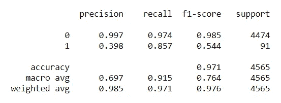

Figure 14 — Classification report for the LSTM model using class weights.

# 模型之间的比较

为了进行方法比较，选择了四种不同的模型:来自 Chitta 文章的 LSTM 自动编码器模型、Roberto 的成对 Mahalanobis 距离模型、RUL 优化模型以及最后的类权重分类模型。用于比较模型的指标有:精确度、召回率和 f1 分数。

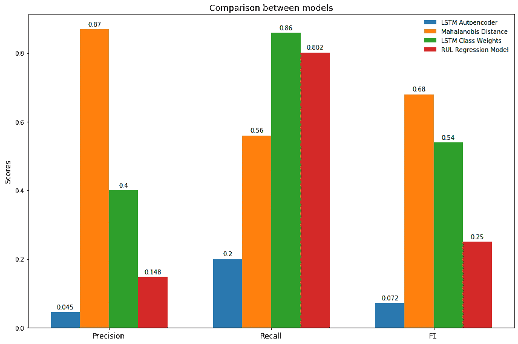

Figure 15 — Evaluating the models with different classification metrics.

我们可以在上面的柱状图中看到，Mahalanobis 距离模型在其他模型中脱颖而出，表现出最高的 f1 分数和精确度。同时，类权重模型在分析召回(敏感度)分值时克服了。

为了更好地理解用于评估模型的分类度量，我推荐阅读下面的文章:([链接](https://medium.com/thalus-ai/performance-metrics-for-classification-problems-in-machine-learning-part-i-b085d432082b))。

# 结论

Web 中断检测是一个非常复杂的问题，主要是因为类之间的不平衡、特征的质量以及收集的数据量。从这个意义上来说，这两个模型，从这篇文章和之前引用的文章，在分类一个真正的造纸厂的断纸方面做了非常好的工作。

RUL 回归模型仍然可以通过微调参数和收集更多数据来优化。还可以通过为每个类别选择最佳权重来改进类别权重模型。当然，为罕见事件检测选择正确的模型是困难的，并且性能可能会根据问题的性质以及数据的大小和质量而变化。考虑到本文中分析的方法，如果目标是实现高精度，最合适的模型是使用 Mahalanobis 距离的模型，但是如果目标是获得高灵敏度，则类权重模型是最佳选择。

RUL 和重量级模型表现出色，f1 值分别为 0.25 和 0.54。它们不仅可以用于 web 中断预测，还可以用于任何罕见的事件检测问题。


Figure 16 — Image used on the story preview of this article [Source: [https://pxhere.com/en/photo/1558069?utm_content=shareClip&utm_medium=referral&utm_source=pxhere](https://pxhere.com/en/photo/1558069?utm_content=shareClip&utm_medium=referral&utm_source=pxhere)]