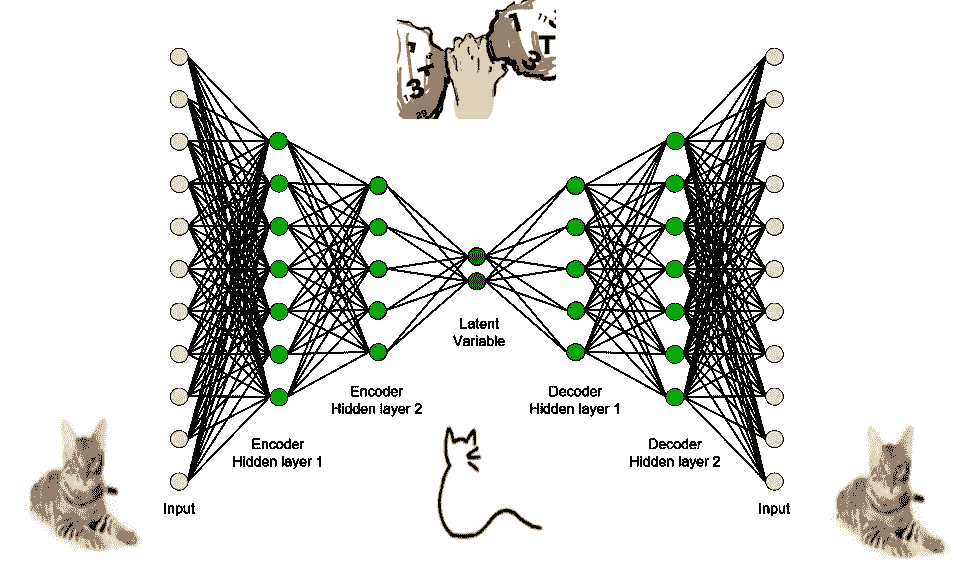
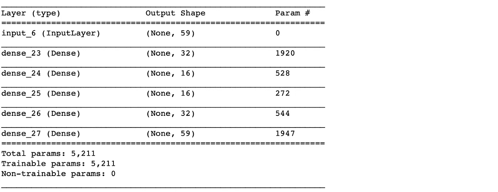
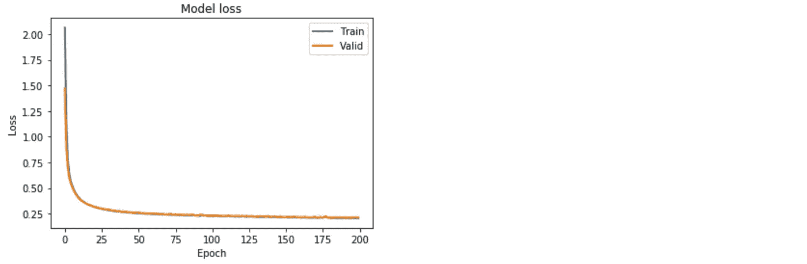
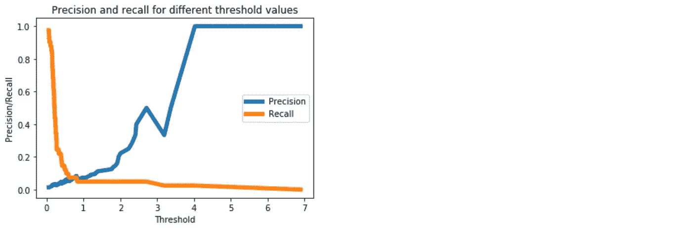
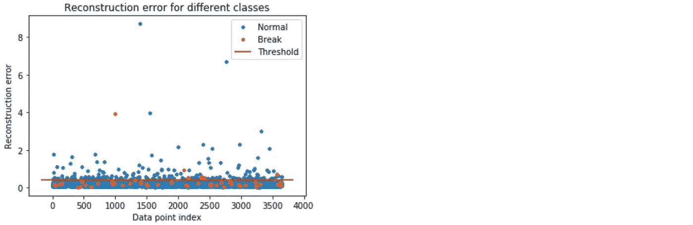
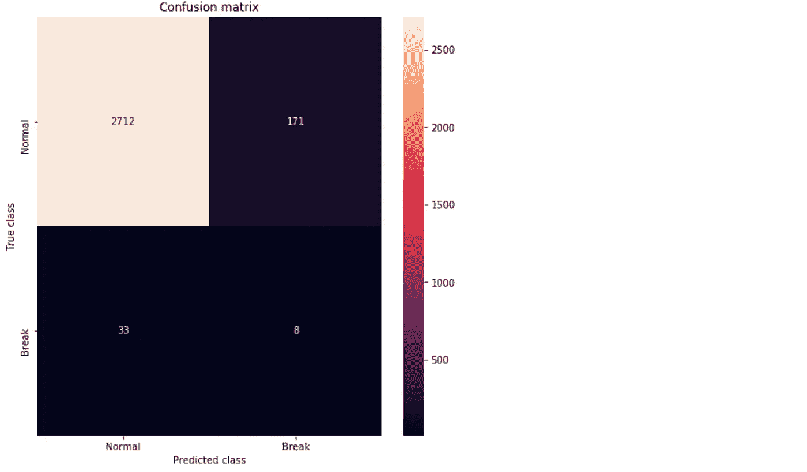
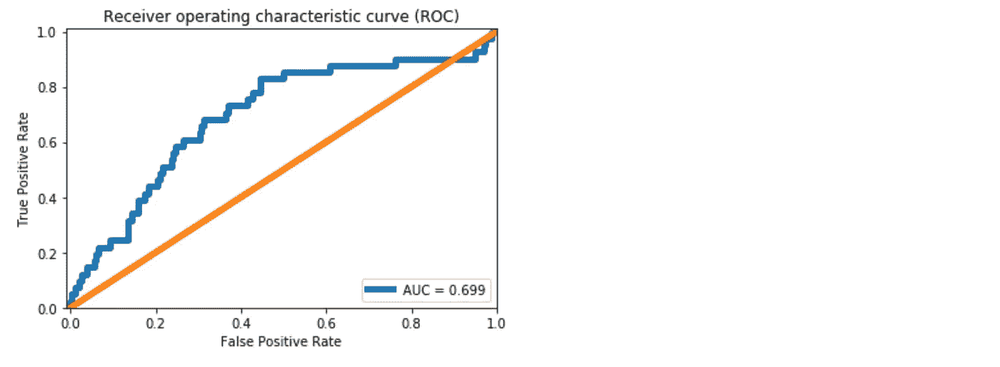

# 使用 Keras 中的自动编码器进行极端罕见事件分类

> 原文：<https://towardsdatascience.com/extreme-rare-event-classification-using-autoencoders-in-keras-a565b386f098?source=collection_archive---------1----------------------->

## 在这篇文章中，我们将学习如何实现一个自动编码器来构建一个罕见事件分类器。我们将在这里使用来自[的真实世界罕见事件数据集](https://arxiv.org/abs/1809.10717) [1]。

<<download the="" free="" book="" class="ae kf" href="https://www.understandingdeeplearning.com/" rel="noopener ugc nofollow" target="_blank">了解深度学习，了解更多> ></download>

# 背景

## **什么是极端罕见事件？**

在一个罕见的问题中，我们有一个不平衡的数据集。也就是说，我们的阳性标记样本比阴性标记样本少。在典型的罕见事件问题中，正面标记的数据约占总数的 5-10%。在一个极端罕见的事件问题中，我们只有不到 1%的正面标记数据。例如，在这里使用的数据集中，它约为 0.6%。

这种极端罕见的事件问题在现实世界中很常见，例如，制造过程中的纸张断裂和机器故障，在线行业中的点击或购买。

对这些罕见事件进行分类相当具有挑战性。最近，深度学习已经相当广泛地用于分类。然而，**少量的正标签样本阻碍了深度学习应用**。无论数据有多大，深度学习的使用都会受到积极标记样本数量的限制。

## 为什么我们还要费心去使用深度学习呢？

这是一个合理的问题。为什么我们不应该考虑使用另一种机器学习方法呢？

答案是主观的。我们总是可以采用机器学习的方法。为了使其工作，我们可以从负标签数据中进行欠采样，以得到接近平衡的数据集。由于我们有大约 0.6%的正标签数据，欠采样将导致大约是原始数据大小的 1%的数据集。机器学习方法，例如 SVM 或随机森林，仍然可以在这种规模的数据集上工作。然而，它的准确性会有局限性。我们不会利用剩余的大约 99%的数据中的信息。

如果数据足够，深度学习方法可能更有能力。通过使用不同的架构，它还允许模型改进的灵活性。因此，我们将尝试使用深度学习方法。

在这篇文章中，**我们将学习如何使用一个简单的密集层自动编码器来构建一个稀有事件分类器**。这篇文章的目的是演示极端罕见事件分类的自动编码器的实现。我们将把探索自动编码器的不同架构和配置的任务留给用户。如果你发现什么有趣的东西，请在评论中分享。

# 分类自动编码器

用于分类的自动编码器方法类似于**异常检测**。在异常检测中，我们学习正常过程的模式。任何不遵循这种模式的都被归类为异常。对于罕见事件的二进制分类，我们可以使用类似的使用自动编码器的方法(从[这里的](https://www.datascience.com/blog/fraud-detection-with-tensorflow) [2】)得到)。

## 快速修订:什么是自动编码器？

*   自动编码器由两个模块组成:编码器和解码器。
*   编码器了解进程的基本特征。这些特征通常尺寸减小。
*   解码器可以从这些底层特征中重建原始数据。



Figure 1\. Illustration of an autoencoder. [[Source](http://i-systems.github.io/HSE545/machine%20learning%20all/Workshop/CAE/06_CAE_Autoencoder.html): Autoencoder by Prof. Seungchul Lee
iSystems Design Lab]

## 如何使用自动编码器稀有事件分类？

*   我们将数据分为两部分:正标和负标。
*   负标记的数据被视为过程的*正常*状态。*正常的*状态是当过程无事件时。
*   我们将忽略带正标签的数据，只对带负标签的数据训练自动编码器。
*   该自动编码器现在已经学习了*正常*过程的特征。
*   一个训练有素的自动编码器将预测来自过程的*正常*状态的任何新数据(因为它将具有相同的模式或分布)。
*   因此，重建误差会很小。
*   然而，如果我们试图从一个罕见的事件中重建一个数据，自动编码器将会很困难。
*   这将使罕见事件期间的重建误差较高。
*   我们可以捕捉如此高的重建误差，并将其标记为罕见事件预测。
*   该过程类似于异常检测方法。

# 履行

## **数据和问题**

这是一个来自纸浆造纸厂的二进制标签数据。纸张断裂是造纸过程中的严重问题。一个单独的纸页断裂会造成几千美元的损失，并且工厂每天至少会看到一个或多个断裂。这导致每年数百万美元的损失和工作危害。

由于过程的性质，检测中断事件具有挑战性。如[1]中所述，即使断裂减少 5%,也会给工厂带来巨大的利益。

我们拥有的数据包含 15 天内收集的大约 18k 行。列`y`包含二进制标签，1 表示分页符。其余列是预测值。大约有 124 个阳性标记样品(~0.6%)。

在这里下载数据[。](https://docs.google.com/forms/d/e/1FAIpQLSdyUk3lfDl7I5KYK_pw285LCApc-_RcoC0Tf9cnDnZ_TWzPAw/viewform)

## **代码**

导入所需的库。

```
%matplotlib inline
import matplotlib.pyplot as plt
import seaborn as snsimport pandas as pd
import numpy as np
from pylab import rcParamsimport tensorflow as tf
from keras.models import Model, load_model
from keras.layers import Input, Dense
from keras.callbacks import ModelCheckpoint, TensorBoard
from keras import regularizersfrom sklearn.preprocessing import StandardScaler
from sklearn.model_selection import train_test_split
from sklearn.metrics import confusion_matrix, precision_recall_curve
from sklearn.metrics import recall_score, classification_report, auc, roc_curve
from sklearn.metrics import precision_recall_fscore_support, f1_scorefrom numpy.random import seed
seed(1)
from tensorflow import set_random_seed
set_random_seed(2)SEED = 123 #used to help randomly select the data points
DATA_SPLIT_PCT = 0.2rcParams['figure.figsize'] = 8, 6
LABELS = ["Normal","Break"]
```

请注意，我们设置随机种子是为了结果的可重复性。

**数据预处理**

现在，我们阅读和准备数据。

```
df = pd.read_csv("data/processminer-rare-event-mts - data.csv")
```

这个罕见事件问题的目的是在板块断裂发生之前预测它。我们会尽量提前 4 分钟预测课间休息。为了构建这个模型，我们将把标签上移 2 行(对应于 4 分钟)。我们可以这样做`df.y=df.y.shift(-2)`。然而，在这个问题中，我们希望进行这样的移位:如果第 *n* 行被正标记，

*   使 row ( *n* -2)和( *n* -1)等于 1。这将帮助分类器学习**到** 4 分钟前的预测。
*   删除第*行第*行。因为我们不希望分类器学习预测已经发生的中断。

我们将为这种曲线移动开发以下 UDF。

```
sign = **lambda** x: (1, -1)[x < 0]

**def** curve_shift(df, shift_by):
    *'''*
 *This function will shift the binary labels in a dataframe.*
 *The curve shift will be with respect to the 1s.* 
 *For example, if shift is -2, the following process*
 *will happen: if row n is labeled as 1, then*
 *- Make row (n+shift_by):(n+shift_by-1) = 1.*
 *- Remove row n.*
 *i.e. the labels will be shifted up to 2 rows up.*

 *Inputs:*
 *df       A pandas dataframe with a binary labeled column.* 
 *This labeled column should be named as 'y'.*
 *shift_by An integer denoting the number of rows to shift.*

 *Output*
 *df       A dataframe with the binary labels shifted by shift.*
 *'''*

    vector = df['y'].copy()
    **for** s **in** range(abs(shift_by)):
        tmp = vector.shift(sign(shift_by))
        tmp = tmp.fillna(0)
        vector += tmp
    labelcol = 'y'
    *# Add vector to the df*
    df.insert(loc=0, column=labelcol+'tmp', value=vector)
    *# Remove the rows with labelcol == 1.*
    df = df.drop(df[df[labelcol] == 1].index)
    *# Drop labelcol and rename the tmp col as labelcol*
    df = df.drop(labelcol, axis=1)
    df = df.rename(columns={labelcol+'tmp': labelcol})
    *# Make the labelcol binary*
    df.loc[df[labelcol] > 0, labelcol] = 1

    **return** df
```

在继续之前，为了简单起见，我们将删除时间和分类列。

```
*# Remove time column, and the categorical columns*
df = df.drop(['time', 'x28', 'x61'], axis=1)
```

现在，我们将数据分为训练集、有效集和测试集。然后，我们将采用只有 0 的数据子集来训练自动编码器。

```
df_train, df_test = train_test_split(df, test_size=DATA_SPLIT_PCT, random_state=SEED)
df_train, df_valid = train_test_split(df_train, test_size=DATA_SPLIT_PCT, random_state=SEED)df_train_0 = df_train.loc[df['y'] == 0]
df_train_1 = df_train.loc[df['y'] == 1]
df_train_0_x = df_train_0.drop(['y'], axis=1)
df_train_1_x = df_train_1.drop(['y'], axis=1)df_valid_0 = df_valid.loc[df['y'] == 0]
df_valid_1 = df_valid.loc[df['y'] == 1]
df_valid_0_x = df_valid_0.drop(['y'], axis=1)
df_valid_1_x = df_valid_1.drop(['y'], axis=1)df_test_0 = df_test.loc[df['y'] == 0]
df_test_1 = df_test.loc[df['y'] == 1]
df_test_0_x = df_test_0.drop(['y'], axis=1)
df_test_1_x = df_test_1.drop(['y'], axis=1)
```

**标准化**

对于自动编码器，通常最好使用标准化数据(转换为高斯数据，均值为 0，方差为 1)。

```
scaler = StandardScaler().fit(df_train_0_x)
df_train_0_x_rescaled = scaler.transform(df_train_0_x)
df_valid_0_x_rescaled = scaler.transform(df_valid_0_x)
df_valid_x_rescaled = scaler.transform(df_valid.drop(['y'], axis = 1))df_test_0_x_rescaled = scaler.transform(df_test_0_x)
df_test_x_rescaled = scaler.transform(df_test.drop(['y'], axis = 1))
```

## 自动编码器分类器

**初始化**

首先，我们将初始化自动编码器架构。我们正在构建一个简单的自动编码器。应该探索更复杂的架构和其他配置。

```
nb_epoch = 200
batch_size = 128
input_dim = df_train_0_x_rescaled.shape[1] *#num of predictor variables,* 
encoding_dim = 32
hidden_dim = int(encoding_dim / 2)
learning_rate = 1e-3

input_layer = Input(shape=(input_dim, ))
encoder = Dense(encoding_dim, activation="relu", activity_regularizer=regularizers.l1(learning_rate))(input_layer)
encoder = Dense(hidden_dim, activation="relu")(encoder)
decoder = Dense(hidden_dim, activation="relu")(encoder)
decoder = Dense(encoding_dim, activation="relu")(decoder)
decoder = Dense(input_dim, activation="linear")(decoder)
autoencoder = Model(inputs=input_layer, outputs=decoder)
autoencoder.summary()
```



**培训**

我们将训练模型并将其保存在文件中。保存训练好的模型是为将来的分析节省时间的好方法。

```
autoencoder.compile(metrics=['accuracy'],
                    loss='mean_squared_error',
                    optimizer='adam')cp = ModelCheckpoint(filepath="autoencoder_classifier.h5",
                               save_best_only=True,
                               verbose=0)tb = TensorBoard(log_dir='./logs',
                histogram_freq=0,
                write_graph=True,
                write_images=True)history = autoencoder.fit(df_train_0_x_rescaled, df_train_0_x_rescaled,
                    epochs=nb_epoch,
                    batch_size=batch_size,
                    shuffle=True,
                    validation_data=(df_valid_0_x_rescaled, df_valid_0_x_rescaled),
                    verbose=1,
                    callbacks=[cp, tb]).history
```



Figure 2\. Loss for Autoencoder Training.

**分类**

在下文中，我们展示了如何将自动编码器重构误差用于罕见事件分类。

如前所述，如果重建误差较高，我们会将其归类为断纸。我们需要确定这方面的门槛。

我们将使用验证集来确定阈值。

```
valid_x_predictions = autoencoder.predict(df_valid_x_rescaled)
mse = np.mean(np.power(df_valid_x_rescaled - valid_x_predictions, 2), axis=1)
error_df = pd.DataFrame({'Reconstruction_error': mse,
                        'True_class': df_valid['y']})precision_rt, recall_rt, threshold_rt = precision_recall_curve(error_df.True_class, error_df.Reconstruction_error)
plt.plot(threshold_rt, precision_rt[1:], label="Precision",linewidth=5)
plt.plot(threshold_rt, recall_rt[1:], label="Recall",linewidth=5)
plt.title('Precision and recall for different threshold values')
plt.xlabel('Threshold')
plt.ylabel('Precision/Recall')
plt.legend()
plt.show()
```



Figure 3\. A threshold of 0.4 should provide a reasonable trade-off between precision and recall.

现在，我们将对测试数据进行分类。

> **我们不应该从测试数据中估计分类阈值。这将导致过度拟合。**

```
test_x_predictions = autoencoder.predict(df_test_x_rescaled)
mse = np.mean(np.power(df_test_x_rescaled - test_x_predictions, 2), axis=1)
error_df_test = pd.DataFrame({'Reconstruction_error': mse,
                        'True_class': df_test['y']})
error_df_test = error_df_test.reset_index()threshold_fixed = 0.4
groups = error_df_test.groupby('True_class')fig, ax = plt.subplots()for name, group in groups:
    ax.plot(group.index, group.Reconstruction_error, marker='o', ms=3.5, linestyle='',
            label= "Break" if name == 1 else "Normal")
ax.hlines(threshold_fixed, ax.get_xlim()[0], ax.get_xlim()[1], colors="r", zorder=100, label='Threshold')
ax.legend()
plt.title("Reconstruction error for different classes")
plt.ylabel("Reconstruction error")
plt.xlabel("Data point index")
plt.show();
```



Figure 4\. Using threshold = 0.4 for classification. The orange and blue dots above the threshold line represents the True Positive and False Positive, respectively.

在图 4 中，阈值线上方的橙色和蓝色圆点分别代表真阳性和假阳性。如我们所见，我们有很多误报。为了看得更清楚，我们可以看到一个混淆矩阵。

```
pred_y = [1 if e > threshold_fixed else 0 for e in error_df.Reconstruction_error.values]conf_matrix = confusion_matrix(error_df.True_class, pred_y)plt.figure(figsize=(12, 12))
sns.heatmap(conf_matrix, xticklabels=LABELS, yticklabels=LABELS, annot=True, fmt="d");
plt.title("Confusion matrix")
plt.ylabel('True class')
plt.xlabel('Predicted class')
plt.show()
```



Figure 5\. Confusion Matrix on the test predictions.

我们可以预测 41 个中断实例中的 8 个。请注意，这些情况包括提前 2 或 4 分钟的预测。这在 20%左右，对于造纸行业来说是一个不错的召回率。假阳性率在 6%左右。对于一个磨坊来说，这并不理想，但也不可怕。

尽管如此，该模型还可以进一步改进，以较小的误报率提高召回率。我们将查看下面的 AUC，然后讨论下一步的改进方法。

**ROC 曲线和 AUC**

```
false_pos_rate, true_pos_rate, thresholds = roc_curve(error_df.True_class, error_df.Reconstruction_error)
roc_auc = auc(false_pos_rate, true_pos_rate,)plt.plot(false_pos_rate, true_pos_rate, linewidth=5, label='AUC = %0.3f'% roc_auc)
plt.plot([0,1],[0,1], linewidth=5)plt.xlim([-0.01, 1])
plt.ylim([0, 1.01])
plt.legend(loc='lower right')
plt.title('Receiver operating characteristic curve (ROC)')
plt.ylabel('True Positive Rate')
plt.xlabel('False Positive Rate')
plt.show()
```



AUC 是 0.69。

## [Github 库](https://github.com/cran2367/autoencoder_classifier)

带注释的全部代码都呈现在[这里](https://github.com/cran2367/autoencoder_classifier)。

[](https://github.com/cran2367/autoencoder_classifier/blob/master/autoencoder_classifier.ipynb) [## cran 2367/自动编码器 _ 分类器

### 稀有事件分类的自动编码器模型。通过创建……为 cran 2367/auto encoder _ classifier 开发做出贡献

github.com](https://github.com/cran2367/autoencoder_classifier/blob/master/autoencoder_classifier.ipynb) 

# 这里有哪些地方可以做得更好？

## 自动编码器优化

自动编码器是 PCA 的非线性扩展。然而，上面开发的传统自动编码器不遵循 PCA 的原理。在[构建正确的自动编码器——使用 PCA 原理进行调整和优化。第一部分](/build-the-right-autoencoder-tune-and-optimize-using-pca-principles-part-i-1f01f821999b)和[第二部分](/build-the-right-autoencoder-tune-and-optimize-using-pca-principles-part-ii-24b9cca69bd6)，解释并实现了自动编码器中应包含的 PCA 优化原则。

## LSTM 自动编码器

这里讨论的问题是一个(多元)时间序列。然而，在自动编码器模型中，我们没有考虑时间信息/模式。在下一篇[文章](https://medium.com/@cran2367/lstm-autoencoder-for-extreme-rare-event-classification-in-keras-ce209a224cfb)中，我们将探索 RNN 是否可行。我们将尝试一个 LSTM 自动编码器。

# 结论

我们研究了来自造纸厂的极端罕见事件二进制标记数据，以构建自动编码器分类器。我们达到了合理的精确度。这里的目的是演示如何使用基本的自动编码器进行罕见事件分类。我们将进一步开发其他方法，包括一个 [LSTM 自动编码器](https://medium.com/@cran2367/lstm-autoencoder-for-extreme-rare-event-classification-in-keras-ce209a224cfb)，它可以提取时间特征以获得更好的准确性。

关于 LSTM 自动编码器的下一个帖子在这里， [LSTM 自动编码器罕见事件分类](https://medium.com/@cran2367/lstm-autoencoder-for-extreme-rare-event-classification-in-keras-ce209a224cfb)。

# 推荐后续阅读

*   [构建正确的自动编码器——使用 PCA 原理进行调整和优化。第一部分](/build-the-right-autoencoder-tune-and-optimize-using-pca-principles-part-i-1f01f821999b)。
*   [构建正确的自动编码器——使用 PCA 原理进行调整和优化。第二部分](/build-the-right-autoencoder-tune-and-optimize-using-pca-principles-part-ii-24b9cca69bd6)。
*   [LSTM 极端罕见事件分类自动编码器。](/lstm-autoencoder-for-extreme-rare-event-classification-in-keras-ce209a224cfb)

# 参考

1.  Ranjan、m . Mustonen、k . pay nabar 和 k . pour AK(2018 年)。数据集:多元时间序列中的稀有事件分类。[T3【arXiv 预印本 arXiv:1809.10717。](https://arxiv.org/abs/1809.10717)
2.  [https://www . data science . com/blog/fraud-detection-with-tensor flow](https://www.datascience.com/blog/fraud-detection-with-tensorflow)
3.  Github 回购:[https://github.com/cran2367/autoencoder_classifier](https://github.com/cran2367/autoencoder_classifier)

*免责声明:这篇文章的范围仅限于构建密集层自动编码器并将其用作罕见事件分类器的教程。通过网络调优，从业者有望获得更好的结果。这篇文章的目的是帮助数据科学家实现一个自动编码器。*