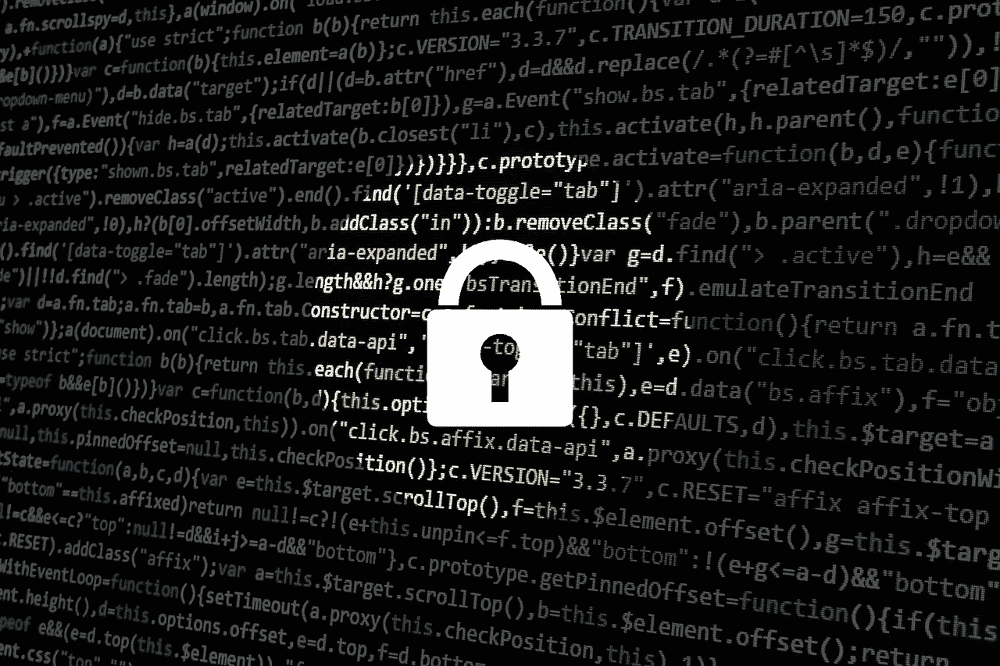
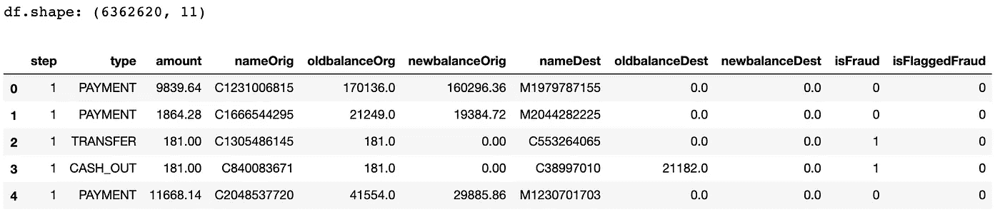
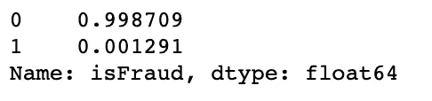
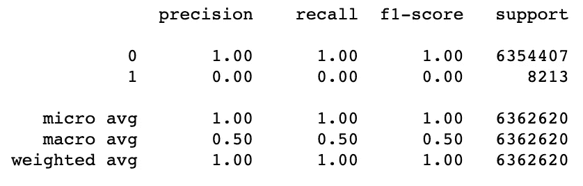
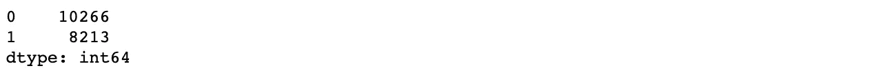
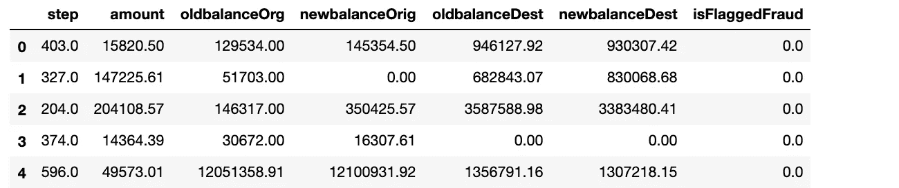
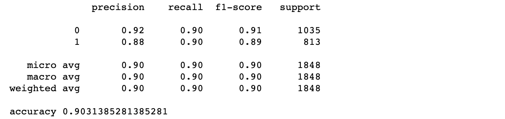
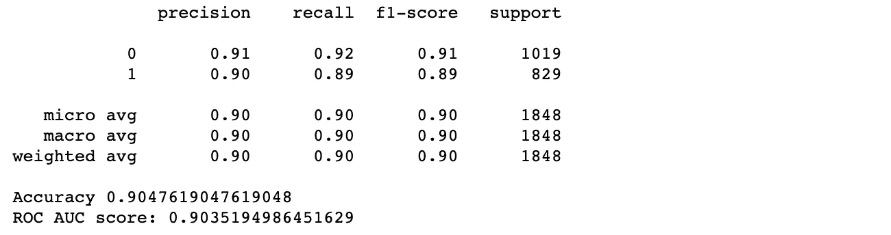
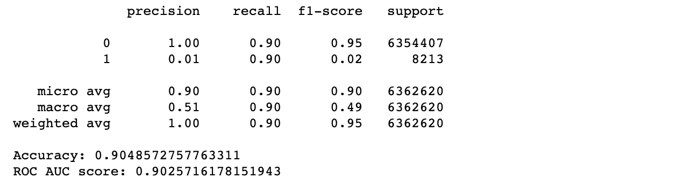

# 极度不平衡的数据—欺诈检测

> 原文：<https://towardsdatascience.com/extremely-imbalanced-data-fraud-detection-a5cc989fd897?source=collection_archive---------5----------------------->



## 欠采样+逻辑回归

为了打击欺诈，我们必须首先发现它。发现欺诈时，您必须考虑:

*   如果你试图找到所有的欺诈案例，其中一些案例将会被误标。这将导致无辜的人被指控犯有欺诈罪。
*   如果你试图让无辜的人免于被指控，你会给一些诈骗犯贴上无辜的标签。在这种情况下，你的公司会损失更多的钱。

你的欺诈检测算法不完美是必然的。你会倾向哪边？

再来看[这个](https://www.kaggle.com/ntnu-testimon/paysim1)数据。

这是一个货币交易的数据集。它给出了发送者的 ID、接收者的 ID、被转移的金额以及交易前后发送者和接收者的余额。它还告诉我们哪些样本是欺诈，哪些不是。它是一个生成的数据集。公司不想让你知道他们损失了多少钱，所以这是我们唯一能做的。

让我们加载数据集，看看它是什么样子:

```
cols = ['step', 'type', 'amount', 'nameOrig', 'oldbalanceOrg', 'newbalanceOrig',
        'nameDest', 'oldbalanceDest', 'newbalanceDest', 'isFraud', 'isFlaggedFraud']
df = pd.read_csv('PS_20174392719_1491204439457_log.csv', header = 0, names = cols)
print('df.shape:', df.shape)
df.head()
```



我们可以把桌子水平分成不同的组。每个集合都有所有的特征，但不是所有的观察值。

对于训练集，我们可以使用 isFraud 列值来训练我们的模型。对测试集应用该模型将为我们提供每次观察的预测 isFraud 值。

一个简单的方法是尝试:

```
pd.value_counts(df.isFraud, normalize = True)
```



另一种方法是使用 isFraud 列的模式:

```
majority_class = df.isFraud.mode()[0]
y_pred = np.full(shape = df.isFraud.shape, fill_value = majority_class)
accuracy_score(df.isFraud, y_pred)
```

这给了我们一个 0.998709 的准确度分值，与 value_counts()相同——这是预期的。与 isFraud=1 相比，isFraud=0 有更多的值。我们可以从上面的 value_counts()或下面打印的分类报告中看到这一点:

```
print(classification_report(df.isFraud, y_pred))
```



我们可以看到，我们得到了完美的召回和精度，但支持值告诉我们另一个故事。我们有 6354407 个值支持 isFraud=0 的情况，有 8213 个值支持 isFraud=1。

不求准确性，就求 ROC AUC 分吧。这个分数衡量我们的模型区分类别的能力。

```
roc_auc_score(df.isFraud, y_pred)
```

这使我们的值为 0.5。ROC AUC 得分的值 1.0 是任何人在任何模型中所能得到的最好值。为什么我们得到了 0.5？这是因为我们可以完美地预测所有 isFraud = 0 的情况，但没有一个 isFraud = 1 的情况。因此，在这两个类别中，我们只能预测 1(这使我们的 ROC AUC 为 0.5)。

为了让我们的模型公平竞争，我们可以对欺诈交易进行过采样，或者对干净交易进行欠采样。我们可以通过使用[不平衡学习](https://github.com/scikit-learn-contrib/imbalanced-learn)库来实现这一点。

```
from imblearn.under_sampling import RandomUnderSamplerX = df.drop(['isFraud', 'type', 'nameOrig', 'nameDest'], axis = 1)
y = df.isFraud
rus = RandomUnderSampler(sampling_strategy=0.8)
X_res, y_res = rus.fit_resample(X, y)
print(X_res.shape, y_res.shape)
print(pd.value_counts(y_res))
```

RandomUnderSampler 的 sampling_strategy 设置为 0.8。这只是为了展示当我们这样做时会发生什么。它允许我们指定少数类样本与多数类样本的比率。它为我们提供了 18479 行数据，其值计数如下:



让我们看看在重采样并删除这些列后，我们的表是什么样子的:

```
cols_numeric = ['step', 'amount', 'oldbalanceOrg', 'newbalanceOrig',
                'oldbalanceDest', 'newbalanceDest', 'isFlaggedFraud']
df_rus = pd.DataFrame(X_res, columns = cols_numeric)
df_rus.head()
```



现在，让我们将数据集分成 3 个部分—训练、验证和测试数据集。我们可以在不同的模型中反复使用验证数据集。一旦我们认为我们得到了最好的模型，我们将使用我们的测试数据集。

我们这样做的原因是，我们的模型不仅应该使用部分训练数据集为我们提供良好的结果，还应该使用我们从未见过的数据提供良好的结果。这就是现实生活中会发生的事情。通过保留只使用一次的测试数据集，我们强迫自己不要过度适应验证数据集。这也是 Kaggle 竞赛所做的。

trainsize/valsize/testsize 显示了应该为训练/验证/测试保留的总数据集的一部分。

```
from sklearn.model_selection import train_test_splitdef train_validation_test_split(
    X, y, train_size=0.8, val_size=0.1, test_size=0.1, 
    random_state=None, shuffle=True): assert int(train_size + val_size + test_size + 1e-7) == 1 X_train_val, X_test, y_train_val, y_test = train_test_split(
        X, y, test_size=test_size, random_state=random_state, shuffle=shuffle) X_train, X_val, y_train, y_val = train_test_split(
        X_train_val, y_train_val,    test_size=val_size/(train_size+val_size), 
        random_state=random_state, shuffle=shuffle) return X_train, X_val, X_test, y_train, y_val, y_test X_train, X_val, X_test, y_train, y_val, y_test = train_validation_test_split(
    X_res, y_res, train_size=0.8, val_size=0.1, test_size=0.1, random_state=1)
class_weight = {0: 4, 1: 5}
model = LogisticRegression(class_weight=class_weight)
model.fit(X_train, y_train)y_pred = model.predict(X_val)
print(classification_report(y_val, y_pred))
print('accuracy', accuracy_score(y_val, y_pred))
roc_auc_score(y_val, y_pred)
```

请注意 class_weight 参数。我们把它放在那里是因为欠采样行数在 isFraud=0 时是 10000，在 isFraud=1 时是 8000。我们要称它们的重量，使它们保持平衡。这样做的比例是 4:5，这是这里使用的类权重。

如果我们在 sampling_strategy=0.8 的情况下进行了欠采样，我们将拥有平衡的类，并且不需要 class_weight 参数。如果我们得到一个新的数据集，它有轻微的不平衡参数，我们可以使用带有类权重的 LogisticRegression 来平衡它，而不需要重采样。



现在我们得到了 0.90 的准确度分数，这是一个很好的分数。我们的 ROC AUC 得分也是 0.9。

现在，让我们在测试数据集上尝试我们的模型:

```
y_pred = model.predict(X_test)
print(classification_report(y_test, y_pred))
print('Accuracy', accuracy_score(y_test, y_pred))
print('ROC AUC score:', roc_auc_score(y_test, y_pred))
```



又是 0.90 的好成绩。看来 RandomUnderSampler 干得不错。

我们必须将我们的模型应用于完整的(未采样的)数据集。让我们接下来做那件事。

```
y_pred = model.predict(X)
print(classification_report(y, y_pred))
print('Accuracy:', accuracy_score(y, y_pred))
print('ROC AUC score:', roc_auc_score(y, y_pred))
```



这个更有意思。准确性和 ROC AUC 得分非常好，isFraud=0 的精确度/召回率/f1 得分也非常好。问题是 isFraud=1 的精度非常非常低，只有 0.01。因为 f1 分数是精确度和召回率的加权平均值，所以它也很低，为 0.02。也许我们没有足够的数据来做好逻辑回归。或者我们应该过采样而不是欠采样。

我们将继续使用这个数据集，在以后的博客文章中应用许多技术。非常感谢 Lambda 学校的讲师 Ryan Herr 提供了 train_validation_test_split()函数。