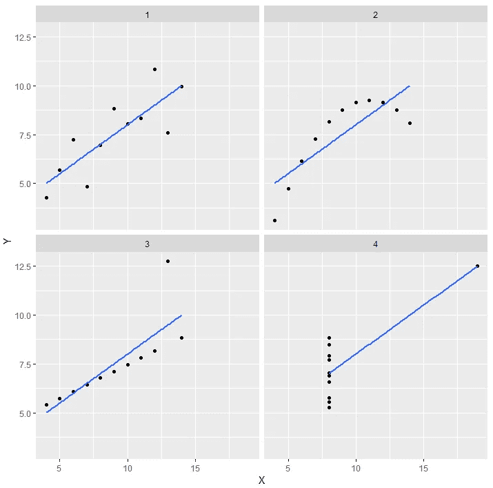

# 数据科学的寓言——安斯科姆的四重奏

> 原文：<https://towardsdatascience.com/fables-of-data-science-anscombes-quartet-2c2e1a07fbe6?source=collection_archive---------22----------------------->

## 寓言是一个简短的**故事，它可以给人一个教训或者传达一个寓意。在这里，我们探索安斯库姆的四重奏，看看它警告我们什么样的恐怖。**


# 从前..

..在一个很远很远的地方，曾经住着一个叫[弗朗西斯·约翰“弗兰克”安斯科姆的人。他是一位非常有名的统计学家。](https://en.wikipedia.org/wiki/Frank_Anscombe)

他四处游荡，会见了许多同行，并坐在城堡里训练年轻的学徒学习神圣的统计学艺术。他对人们说得越多，训练得越多，他就看到了一种危险的趋势。**人们倾向于忽视可视化，而偏爱汇总统计。**大家都说绘制数据太费劲了。


A worried Frank is a Red Frank

这很危险，弗兰克非常担心。这场瘟疫传播得很快，他没有时间去对抗它。他必须做点什么，做点什么来阻止这一切。

所以他跑去和长老议会谈话，但是每个人都嘲笑他。

> “当你有了数据的意思，
> 你还想考察什么？
> 标准差只是崇高，
> 绘图是浪费时间！”PoorPoetrix 大师

弗兰克从来没有预料到议会也遭到了毒害，他不得不睁开眼睛。

所以他旅行了，向北旅行到永远是冬天的地方，到达霜封山的顶峰。他坐在那里，陷入沉思。5 分钟后，他意识到外面的山里冷得要命，他应该多带些羊毛衣服。

他冷得直哆嗦，四处寻找一个洞穴安顿下来，幸运的是他找到了一个。

> 弗兰克在那里冥想，他深度调解，尽管有人声称他只是睡着了。

在他的梦里，他看到了数字，数字和更多的数字，就在那时，他意识到数字是解决问题的关键。他日复一日地琢磨这些数字，终于解开了它们的秘密。


他叫来一只鸟，并通过他送给委员会一张羊皮纸，上面有 4 组 11 个数据点，并请求委员会按照他的遗愿来绘制这些点:

.

.

```
+-------+--------+-------+-------+-------+-------+-------+------+
|   **    I        |       II      |      III      |      IV  **    |
+-------+--------+-------+-------+-------+-------+-------+------+
| x     | y      | x     | y     | x     | y     | x     | y    | +-------+--------+-------+-------+-------+-------+-------+------+
| 10.0  | 8.04   | 10.0  | 9.14  | 10.0  | 7.46  | 8.0   | 6.58 |
| 8.0   | 6.95   | 8.0   | 8.14  | 8.0   | 6.77  | 8.0   | 5.76 |
| 13.0  | 7.58   | 13.0  | 8.74  | 13.0  | 12.74 | 8.0   | 7.71 |
| 9.0   | 8.81   | 9.0   | 8.77  | 9.0   | 7.11  | 8.0   | 8.84 |
| 11.0  | 8.33   | 11.0  | 9.26  | 11.0  | 7.81  | 8.0   | 8.47 |
| 14.0  | 9.96   | 14.0  | 8.10  | 14.0  | 8.84  | 8.0   | 7.04 |
| 6.0   | 7.24   | 6.0   | 6.13  | 6.0   | 6.08  | 8.0   | 5.25 |
| 4.0   | 4.26   | 4.0   | 3.10  | 4.0   | 5.39  | 19.0  |12.50 |
| 12.0  | 10.84  | 12.0  | 9.13  | 12.0  | 8.15  | 8.0   | 5.56 |
| 7.0   | 4.82   | 7.0   | 7.26  | 7.0   | 6.42  | 8.0   | 7.91 |
| 5.0   | 5.68   | 5.0   | 4.74  | 5.0   | 5.73  | 8.0   | 6.89 |
+-------+--------+-------+-------+-------+-------+-------+------+
```

按照他们的习惯，委员会只用描述性统计数据对他们进行分析，他们得到了完全相同的结果，他们想知道老傻瓜弗兰克又在搞什么名堂:

```
 **Summary**
+-----+---------+-------+---------+-------+----------+
| Set | mean(X) | sd(X) | mean(Y) | sd(Y) | cor(X,Y) |
+-----+---------+-------+---------+-------+----------+
|   1 |       9 |  3.32 |     7.5 |  2.03 |    0.816 |
|   2 |       9 |  3.32 |     7.5 |  2.03 |    0.816 |
|   3 |       9 |  3.32 |     7.5 |  2.03 |    0.816 |
|   4 |       9 |  3.32 |     7.5 |  2.03 |    0.817 |
+-----+---------+-------+---------+-------+----------+
```

但是 PoorPoetrix 大师决定尊重他朋友的请求，就在那时，当他绘制数据集时，奇迹出现了:



Anscombe’s quartet — Plot

他发现**图表完全不同，尽管摘要完全相似**。

*   第一个散点图(左上)似乎是一个简单的线性关系，对应于两个相关变量，并遵循正态假设。
*   第二张图(右上)不是正态分布的；虽然这两个变量之间的关系很明显，但它不是线性的，皮尔逊相关系数也不相关。更一般的回归和相应的决定系数会更合适。
*   在第三张图中(左下方)，分布是线性的，但应该有不同的回归线(稳健回归将被要求)。计算的回归被一个异常值抵消，该异常值施加足够的影响以将相关系数从 1 降低到 0.816。
*   最后，第四个图(右下)显示了一个例子，其中一个高杠杆点足以产生高相关系数，即使其他数据点并不表明变量之间的任何关系。

PoorPoetrix 大师意识到了委员会的愚蠢并改正了它们，这个数据集被称为 Anscombe 的四重奏。


弗兰克拯救了世界，作为一个快乐的老人在山洞里度过了他的最后几天。

.

.

# 这个故事的寓意

人们普遍引用 PoorPoetrix 大师用这些不朽的话总结了这一事件:

> 为了得到你可以信任的分析，
> 绘制你的数据，你必须绘制。PoorPoetrix 大师

# 参考

1.  [https://en.wikipedia.org/wiki/Anscombe%27s_quartet](https://en.wikipedia.org/wiki/Anscombe%27s_quartet)
2.  [https://www . r-bloggers . com/using-and-abuse-data-visualization-anscombes-quartet-and-checking-bonferroni/](https://www.r-bloggers.com/using-and-abusing-data-visualization-anscombes-quartet-and-cheating-bonferroni/)
3.  gif 图片取自[https://giphy.com/](https://giphy.com/)