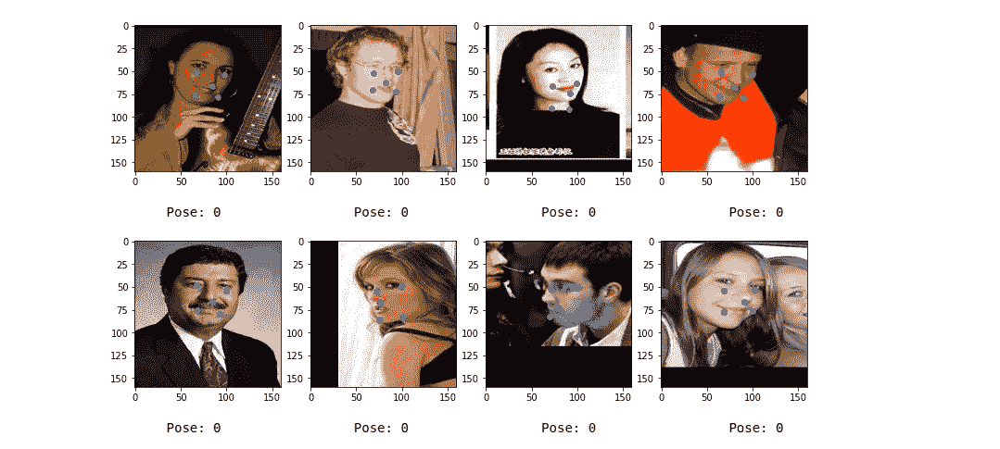

# 人脸对齐:深度多任务学习

> 原文：<https://towardsdatascience.com/face-allignment-deep-multi-task-learning-203f46a22106?source=collection_archive---------11----------------------->

# **1。简介**

面部关键点预测:给定一张面部图片，预测各种面部特征的位置。

这个问题属于计算机视觉的范畴，并伴随着它自身的挑战。

在这方面已经做了很多工作。在本文中，我们将深入研究这篇 [***论文***](http://personal.ie.cuhk.edu.hk/~ccloy/files/eccv_2014_deepfacealign.pdf) 提出的独特方法，并从头实现它，全部使用 keras。


Deep Multi-task learning

# **2。为什么我们需要解决它？它的应用是什么？**

你有没有用过 Snapchat，专门试用过他们的图像滤镜？它是如何变得如此神奇的？它是如何如此准确地用假胡子代替你的胡子的？

要做到这一点，首先它需要识别你脸上与胡子相对应的部分。然后切掉一部分(当然是内部的)并用人造的替换掉。

这就是面部关键点检测发挥作用的地方。识别面部的不同部分。

这只是一个具体的应用，还有很多这样的应用。查看[这篇文章](https://www.learnopencv.com/facial-landmark-detection/)了解更多信息。

# 3.数据概述

这个项目的数据集由论文作者自己提供，可以在 [**这里**](http://mmlab.ie.cuhk.edu.hk/projects/TCDCN.html) 找到。

数据总共有 12295 幅图像，其中 10000 幅是训练图像，2295 幅是测试图像。

数据还附带了两个 txt 文件:`training.txt`和`testing.txt`。这两个文件保存了关于图像路径、面部特征的坐标位置和 4 个其他面部属性的信息:

**第一属性:性别【男/女】**

**第二属性:微笑/不微笑**

**第三属性:戴眼镜/不戴眼镜**

**第四属性:姿态变化**

**3.1 加载和清理数据**

让我们加载 training.txt 文件，并尝试理解和分析数据。当你使用`pandas read_csv`函数读取 training.txt 文件时，使用空格作为分隔符，它不会被正确加载，这是因为每行的开头都有空格。所以，我们需要把它去掉。


Training.txt file

下面的代码将完全做到这一点。

```
f = open('training.txt','r')
f2 = open('training_new.txt','w')
for i,line in enumerate(f.readlines()):
    if i==0:
        continue
    line = line.strip()

    f2.write(line)
    f2.write('\n')
f2.close()
f.close()
```

现在，我们将在项目中使用这个新创建的文件`training_new.txt`。对于`testing.txt`文件也是如此。

读取已清理的`training.txt`文件。

```
names = ['Path']+list('BCDEFGHIJK')+['Gender','Smile','Glasses','Pose']train = pd.read_csv('training_new.txt',sep=' ',header=None,names=names) train['Path'] = train['Path'].str.replace('\\','/')
```

下面是培训文件中每个属性的含义。

*   路径:图像的路径(绝对路径)
*   b:右眼中心的 x 坐标
*   c:左眼中心的 x 坐标
*   鼻中心的 D: x 坐标
*   e:嘴部最右侧点的 x 坐标
*   f:嘴部最左侧点的 x 坐标
*   右眼中心的 G: y 坐标
*   左眼中心的 H: y 坐标
*   鼻中心的 I: y 坐标
*   嘴部最右端点的 y 坐标
*   嘴巴最左边的 y 坐标
*   性别:此人是男是女，1:男，2:女
*   微笑:不管对方是否微笑，1:微笑，2:不微笑
*   眼镜:这个人是否戴眼镜，1:戴眼镜，2:不戴眼镜
*   姿势:【姿势估计】，5 类。

**3.2 可视化数据**

现在，让我们想象一些带有面部关键点的图像。

代码:

```
#visualising the dataset
images = []
all_x = []
all_y= []
random_ints = np.random.randint(low=1,high=8000,size=(9,))
for i in random_ints:
    img = cv2.imread(train['Path'].iloc[i])
    x_pts = train[list('BCDEF')].iloc[i].values.tolist()
    y_pts = train[list('GHIJK')].iloc[i].values.tolist()
    all_x.append(x_pts)
    all_y.append(y_pts)
    img = cv2.cvtColor(img,cv2.COLOR_BGR2RGB)
    images.append(img)fig,axs = plt.subplots(nrows=3,ncols=3,figsize=(14,10))k =0
for i in range(0,3):
    for j in range(0,3):
        axs[i,j].imshow(images[k])
        axs[i,j].scatter(all_x[k],all_y[k])
        k += 1plt.show()
```


# **4。深潜**

现在，我们知道面部关键点预测是怎么回事了。让我们深入了解一下它的技术细节。

> 接受图像作为输入，并给出面部特征的坐标。

这是一个回归问题，因为它预测连续值，即面部标志的坐标。


Face Alignment, Magic box?

盒子里有什么神奇的东西能做这些？

让我们更深入地了解它。

到目前为止，有两种方法可以解决这个问题，一种是普通的计算机视觉技术(如 viola 和 jones 的人脸包围盒预测)，另一种是基于深度学习的，特别是基于卷积神经网络的。

**但是这个卷积神经网络到底是个什么鬼？**

简单地说，它是用来从图像中提取和检测有意义信息的技术。如果你有兴趣了解更多，请点击这里的[](https://bit.ly/2ABv6Ho)**。**

**对于这个问题，我们将采取第二条路线，即基于深度学习。**

# **5.**文献综述****

**不同的研究人员在这个领域做了大量的工作。围绕这个问题的大部分工作把它作为一个单一的任务问题，他们试图单独解决这个问题。但是 [**这篇研究论文**](http://personal.ie.cuhk.edu.hk/~ccloy/files/eccv_2014_deepfacealign.pdf) 提出了一个有趣的想法，那就是，他们把它作为一个深层的多任务问题。**

**什么是多任务问题？**

**多任务问题:与其只解决一个主要问题，不如一起解决相关的多个问题。**

**不要只解决面部标志检测问题，让我们也解决相关的辅助问题，比如:图像中的人是否相似，这个人的性别，等等..**

**但是为什么要一起解决多个任务呢？
上述论文的作者注意到关于面部标志检测(主要任务)的一个非常关键的细节，即面部标志的位置高度依赖于人是否在微笑、图像中人的姿势以及其他支持的任务。因此，他们引入了深度多任务学习的概念，并发现它对于这个问题是准确的。**

# **6.履行**

**如果你已经熟悉深度学习，到现在，你应该知道这是一个多输出问题，因为我们试图同时解决这个多任务。由于我们将使用 **keras** 来实现，所以多输出模型可以通过**功能 API 来实现，而不是顺序 API。****

**根据数据，我们手头有 5 个任务，其中面部对齐是主要的一个。因此，我们将使用多输出模型来训练这 5 项任务的模型。**

****我们将用不同的辅助任务来训练主任务(人脸对齐)，以评估深度多任务学习的有效性。****

***第一个模型:面部对齐+所有其他辅助任务(4)***

***第二种模式:脸部对齐+性别+微笑+眼镜***

***第三种模型:人脸对齐+姿态估计***

***第四种模式:仅面部对齐***

****网络架构****

**我们将使用四个卷积层、三个最大池层、一个密集层，以及用于所有任务的独立输出层。除了图像的输入形状之外，网络架构与本文作者实现的网络架构相同。**

****

**Network architecture. [Source](http://personal.ie.cuhk.edu.hk/~ccloy/files/eccv_2014_deepfacealign.pdf)**

****6.1 第一个模型的实施****

**代码如下:**

```
inp = Input(shape=(160,160,3))#1st convolution pair
conv1 = Conv2D(16,kernel_size=(5,5), activation='relu')(inp)
mx1 = MaxPooling2D(pool_size=(2,2))(conv1)#2nd convolution pair
conv2 = Conv2D(48,kernel_size=(3,3), activation='relu')(mx1)
mx2 = MaxPooling2D(pool_size=(2,2))(conv2)#3rd convolution pair
conv3 = Conv2D(64,kernel_size=(3,3), activation='relu')(mx2)
mx3 = MaxPooling2D(pool_size=(2,2))(conv3)#4th convolution pair
conv4 = Conv2D(64,kernel_size=(2,2), activation='relu')(mx3)flt = Flatten()(conv4)dense = Dense(100,activation='relu')(flt)reg_op = Dense(10,activation='linear',name='key_point')(dense)gndr_op = Dense(2,activation='sigmoid',name='gender')(dense)smile_op = Dense(2,activation='sigmoid',name='smile')(dense)glasses_op = Dense(2,activation='sigmoid',name='glasses')(dense)pose_op = Dense(5,activation='softmax',name='pose')(dense)model = Model(inp,[reg_op,gndr_op,smile_op,glasses_op,pose_op])model.summary()
```

**这将打印出以下输出:**

****

**现在，下一步是提及我们将在 keras 中为每个输出使用的损失函数。这很容易弄清楚。我们将对面部关键点使用**均方误差(MSE)** ，对性别输出、微笑输出和眼镜输出使用**二元交叉熵**，对姿势输出使用**分类交叉熵**。**

```
loss_dic = {'key_point':'mse','gender':'binary_crossentropy','smile':'binary_crossentropy', 'glasses':'binary_crossentropy' , 'pose':'categorical_crossentropy'}
```

**在内部，总损失将是所有单个损失的总和。现在，我们也可以在 keras 中为每个损失函数显式设置权重，得到的损失将是所有单个损失的加权和。**

**由于主要任务是关键点检测，因此我们将给予更多的权重。**

```
loss_weights = {'key_point':7,'gender':2,'smile':4,'glasses':1,'pose':3}
```

**每项任务的衡量标准是:**

```
metrics = {'key_point':'mse','gender':['binary_crossentropy','acc'],'smile':['binary_crossentropy','acc'], 'glasses':['binary_crossentropy','acc'] , 'pose':['categorical_crossentropy','acc']}
```

**一切就绪。让我们训练网络。**

```
epochs = 35
bs = 64H = model.fit(train_images,[train_keypoint_op,]+train_categorical_ops, epochs = epochs, batch_size=bs, validation_data=(val_images,[val_keypoint_op,]+val_categorical_ops),callbacks=[TrainValTensorBoard(log_dir='./log',write_graph=False)])
```

**让我们评价一下 model 的性能。**

```
train_pred = model.predict(train_images)
val_pred = model.predict(val_images)print('MSE on train data: ', mean_squared_error(train_keypoint_op,train_pred[0]))
print('MSE on validation data: ', mean_squared_error(val_keypoint_op,val_pred[0]))
```

**上面的代码片段给出了以下输出:**

```
MSE on train data:  2.0609966325423565
MSE on validation data:  29.55315040683187
```

**可视化验证集上的结果。**

****

**Output Result: Model 1**

**它仅用 35 个纪元和相当简单的模型架构就能很好地工作。**

****6.2 第二种模式的实施****

**这一个的代码如下:**

```
inp = Input(shape=(160,160,3))#1st convolution pair
conv1 = Conv2D(16,kernel_size=(5,5), activation='relu')(inp)
mx1 = MaxPooling2D(pool_size=(2,2))(conv1)#2nd convolution pair
conv2 = Conv2D(48,kernel_size=(3,3), activation='relu')(mx1)
mx2 = MaxPooling2D(pool_size=(2,2))(conv2)#3rd convolution pair
conv3 = Conv2D(64,kernel_size=(3,3), activation='relu')(mx2)
mx3 = MaxPooling2D(pool_size=(2,2))(conv3)#4th convolution pair
conv4 = Conv2D(64,kernel_size=(2,2), activation='relu')(mx3)flt = Flatten()(conv4)dense = Dense(100,activation='relu')(flt)reg_op = Dense(10,activation='linear',name='key_point')(dense)gndr_op = Dense(2,activation='sigmoid',name='gender')(dense)smile_op = Dense(2,activation='sigmoid',name='smile')(dense)glasses_op = Dense(2,activation='sigmoid',name='glasses')(dense)model = Model(inp,[reg_op,gndr_op,smile_op,glasses_op])model.summary()
```

**编译模型。**

```
loss_dic ={'key_point':'mse','gender':'binary_crossentropy','smile':'binary_crossentropy', 'glasses':'binary_crossentropy' }loss_weights = {'key_point':2,'gender':1,'smile':4,'glasses':1}metrics = {'key_point':'mse','gender':['binary_crossentropy','acc'],'smile':['binary_crossentropy','acc'], 'glasses':['binary_crossentropy','acc'] }model.compile(optimizer='adam',loss=loss_dic,loss_weights=loss_weights,metrics=metrics)
```

**一切就绪。让我们训练网络。**

```
H = model.fit(train_images, [train_keypoint_op,]+train_categorical_ops[:-1], epochs = epochs, batch_size=bs, validation_data=(val_images,[val_keypoint_op,]+val_categorical_ops[:-1]),callbacks=[TrainValTensorBoard(log_dir='./log3',write_graph=False)])
```

**让我们评价一下 model 的性能。**

```
train_pred = model.predict(train_images)
val_pred = model.predict(val_images)print('MSE on train data: ', mean_squared_error(train_keypoint_op,train_pred[0]))
print('MSE on validation data: ', mean_squared_error(val_keypoint_op,val_pred[0]))
```

**上面的代码片段给出了以下输出:**

```
MSE on train data:  2.9205250961752722
MSE on validation data:  35.072992153148434
```

**可视化验证集上的结果。**

****

**Output Result: Model 2**

****6.3 第三种模式的实施****

**这一个的代码如下:**

```
inp = Input(shape=(160,160,3))#1st convolution pair
conv1 = Conv2D(16,kernel_size=(5,5), activation='relu')(inp)
mx1 = MaxPooling2D(pool_size=(2,2))(conv1)#2nd convolution pair
conv2 = Conv2D(48,kernel_size=(3,3), activation='relu')(mx1)
mx2 = MaxPooling2D(pool_size=(2,2))(conv2)#3rd convolution pair
conv3 = Conv2D(64,kernel_size=(3,3), activation='relu')(mx2)
mx3 = MaxPooling2D(pool_size=(2,2))(conv3)#4th convolution pair
conv4 = Conv2D(64,kernel_size=(2,2), activation='relu')(mx3)flt = Flatten()(conv4)dense = Dense(100,activation='relu')(flt)reg_op = Dense(10,activation='linear',name='key_point')(dense)pose_op = Dense(5,activation='softmax',name='pose')(dense)model = Model(inp,[reg_op,pose_op])model.summary()
```

**编译模型。**

```
loss_dic = {'key_point':'mse','pose':'categorical_crossentropy'}loss_weights = {'key_point':4,'pose':11}metrics = {'key_point':'mse', 'pose':['categorical_crossentropy','acc']}model.compile(optimizer='adam',loss=loss_dic,loss_weights=loss_weights,metrics=metrics)
```

**一切就绪。让我们训练网络。**

```
H = model.fit(train_images, [train_keypoint_op,train_categorical_ops[-1]], epochs = epochs, batch_size=bs, validation_data=(val_images,[val_keypoint_op,val_categorical_ops[-1]]),callbacks=[TrainValTensorBoard(log_dir='./log4',write_graph=False)])
```

**让我们评价一下 model 的性能。**

```
train_pred = model.predict(train_images)
val_pred = model.predict(val_images)print('MSE on train data: ', mean_squared_error(train_keypoint_op,train_pred[0]))
print('MSE on validation data: ', mean_squared_error(val_keypoint_op,val_pred[0]))
```

**上面的代码片段给出了以下输出:**

```
MSE on train data:  2.825882283863525
MSE on validation data:  31.41507419233826
```

**可视化验证集上的结果。**

****

**Output Result: Model 3**

****6.4 第四种模式的实施****

**这一个的代码如下:**

```
inp = Input(shape=(160,160,3))#1st convolution pair
conv1 = Conv2D(16,kernel_size=(5,5), activation='relu')(inp)
mx1 = MaxPooling2D(pool_size=(2,2))(conv1)#2nd convolution pair
conv2 = Conv2D(48,kernel_size=(3,3), activation='relu')(mx1)
mx2 = MaxPooling2D(pool_size=(2,2))(conv2)#3rd convolution pair
conv3 = Conv2D(64,kernel_size=(3,3), activation='relu')(mx2)
mx3 = MaxPooling2D(pool_size=(2,2))(conv3)#4th convolution pair
conv4 = Conv2D(64,kernel_size=(2,2), activation='relu')(mx3)flt = Flatten()(conv4)dense = Dense(100,activation='relu')(flt)reg_op = Dense(10,activation='linear',name='key_point')(dense)model = Model(inp,reg_op)model.summary()
```

**编译模型。**

```
loss_dic = {'key_point':'mse'}metrics = {'key_point':['mse','mae']}model.compile(optimizer='adam',loss=loss_dic,metrics=metrics)
```

**一切就绪。让我们训练网络。**

```
H = model.fit(train_images, train_keypoint_op, epochs = epochs, batch_size=bs, validation_data=(val_images,val_keypoint_op),callbacks=[TrainValTensorBoard(log_dir='./log5',write_graph=False)])
```

**让我们评价一下 model 的性能。**

```
train_pred = model.predict(train_images)
val_pred = model.predict(val_images)print('MSE on train data: ', mean_squared_error(train_keypoint_op,train_pred ))
print('MSE on validation data: ', mean_squared_error(val_keypoint_op,val_pred ))
```

**上面的代码片段给出了以下输出:**

```
MSE on train data:  2.822843715225789
MSE on validation data:  30.50257287238015
```

**可视化验证集上的结果。**

****

**Output Result: Model 4**

# **结论**

**根据上面的实验，很容易得出结论，多任务学习比单独解决这个问题更有效。**

**有时，解决多任务问题比单独解决问题更有帮助，但请注意，如果主问题依赖于辅助问题，则只解决辅助问题。**

**这个项目的完整源代码可以在 这里找到 [***。***](https://github.com/rishabhgarg7/Face-Allignment)**

**希望，你喜欢这篇文章，如果你从中学到了什么新的东西，那么你可以通过与他人分享和关注我来展示你的爱..花了这么多时间来写这么全面的博文，希望我的努力能帮助你们中的一些人理解这个案例研究的细节，以便你们也能在自己的地方实施它。**

**欢迎在 [**LinkedIn**](https://www.linkedin.com/in/rishabhgarg7/) 上与我联系，在 [**Twitter**](https://twitter.com/rishabh_grg) 和 [**Quora**](https://www.quora.com/profile/Rishabh-Garg-109) 上关注我。**