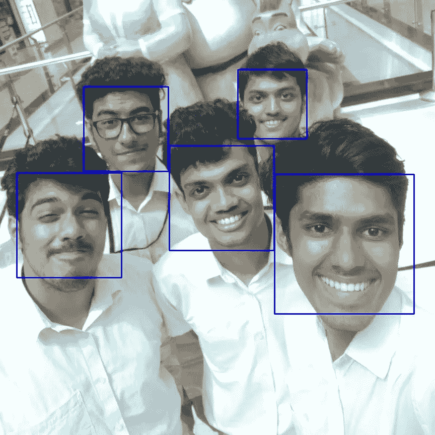

# 使用 OpenCV 和 Python 在 2 分钟内完成人脸检测

> 原文：<https://towardsdatascience.com/face-detection-in-2-minutes-using-opencv-python-90f89d7c0f81?source=collection_archive---------1----------------------->

## 在这篇短文中，我想分享一个在 OpenCV 和 Python 中使用 Haar 级联检测人脸的非常流行和简单的方法。

The video version for those who prefer that !

首先确保你已经安装了 OpenCV。您可以使用 pip 安装它:

```
pip install opencv-python
```

使用 Haar 级联的人脸检测是一种基于机器学习的方法，其中用一组输入数据训练级联函数。OpenCV 已经包含了许多预先训练好的人脸、眼睛、微笑等分类器..今天我们将使用面部分类器。您也可以尝试其他分类器。

需要下载[训练好的分类器 XML 文件](https://raw.githubusercontent.com/opencv/opencv/master/data/haarcascades/haarcascade_frontalface_default.xml)(Haar cascode _ frontal face _ default . XML)，在 [OpenCv 的 GitHub 资源库](https://github.com/opencv/opencv/tree/master/data/haarcascades)中有。将其保存到您的工作位置。

若要检测图像中的人脸:

需要注意一些事情:

*   该检测仅对灰度图像有效。因此，将彩色图像转换为灰度图像非常重要。(第 8 行)
*   **检测多尺度**函数(第 10 行)用于检测人脸。它有 3 个参数——输入图像、*比例因子*和*最小邻居*。*比例因子*指定图像尺寸随每个比例缩小多少。*最小邻居*指定每个候选矩形应该有多少邻居来保留它。你可以[在这里](https://www.bogotobogo.com/python/OpenCV_Python/python_opencv3_Image_Object_Detection_Face_Detection_Haar_Cascade_Classifiers.php)详细了解。您可能需要调整这些值以获得最佳结果。
*   *面*包含找到面的矩形区域的坐标列表。我们使用这些坐标来绘制图像中的矩形。

结果:



同样，我们可以检测视频中的人脸。如你所知，视频基本上是由帧组成的，帧是静止的图像。因此，我们对视频中的每一帧进行人脸检测。代码如下:

这里唯一的区别是，我们使用一个无限循环来遍历视频中的每一帧。我们使用 *cap.read()* 来读取每一帧。返回的第一个值是一个标志，指示帧是否被正确读取。我们不需要它。返回的第二个值是我们将在其上执行检测的静止帧。

*找到这里的代码:【https://github.com/adarsh1021/facedetection】[](https://github.com/adarsh1021/facedetection)*

*希望这对你有用。如果你在实现这个过程中有任何困难或者你需要任何帮助，请联系我。*

**电子邮件:adarsh1021@gmail.com**

**社交媒体:* [*LinkedIn*](https://www.linkedin.com/in/adarsh-menon-739573146/) *，*[*Twitter*](https://twitter.com/adarsh_menon_)*，*[*insta gram*](https://www.instagram.com/adarsh_menon_/)*，* [*YouTube*](https://www.youtube.com/c/adarshmenon)*