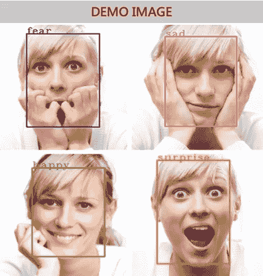

# 8 行代码实现人脸检测、识别和情感检测！

> 原文：<https://towardsdatascience.com/face-detection-recognition-and-emotion-detection-in-8-lines-of-code-b2ce32d4d5de?source=collection_archive---------2----------------------->

## *用数据做酷事！*

# 介绍

人类一直具有识别和区分人脸的先天能力。现在计算机也能做到这一点。这打开了大量的应用。人脸检测和识别可以用来提高访问和安全性，就像最新的苹果 Iphone 一样(见下面的 gif)，允许在没有物理卡的情况下处理支付——Iphone 也是这样做的！，实现罪犯识别，并允许个性化的医疗保健和其他服务。人脸检测和识别是一个深入研究的课题，网上有大量的资源。我们已经尝试了多个开源项目，以找到最容易实现同时又准确的项目。我们还创建了一个管道，用于在图像加载后对任何输入图像进行检测、识别和情感理解，只需 8 行代码！我们的代码在 [Github](https://github.com/priya-dwivedi/face_and_emotion_detection) 上开源。


Facial Biometric

本博客分为三个部分:

1.  面部检测—检测任何输入图像或帧中面部位置的能力。输出是检测到的面的边界框坐标
2.  面部识别—将多张脸放在一起比较，以识别哪些脸属于同一个人。这是通过比较人脸嵌入向量来完成的
3.  情绪检测——将脸上的情绪分为快乐、愤怒、悲伤、中性、惊讶、厌恶或恐惧

所以让我们开始吧！

# 面部检测

面部检测是我们管道的第一部分。我们使用了 python 库[人脸识别](https://github.com/ageitgey/face_recognition)，我们发现它易于安装，并且在检测人脸时非常准确。该库扫描输入图像，并返回所有检测到的面的边界框坐标，如下所示:


Face Detection

下面的代码片段展示了如何使用 face_recognition 库来检测人脸。

```
face_locations = face_recognition.face_locations(image)
top, right, bottom, left = face_locations[0]
face_image = image[top:bottom, left:right]
```

安装和使用面部识别的完整说明也在 [Github](https://github.com/priya-dwivedi/face_and_emotion_detection) 上

# 面部识别

面部识别验证两张脸是否相同。面部识别在安全、生物计量、娱乐、个人安全等方面的应用非常广泛。用于人脸检测的同一个 python 库 [face_recognition](https://github.com/ageitgey/face_recognition) 也可以用于人脸识别。我们的测试表明它具有良好的性能。给定两张匹配的脸，它们可以相互匹配，给出真或假的结果。面部识别涉及的步骤有

*   在图像中查找人脸
*   分析面部特征
*   比较两个输入面的特征
*   如果匹配则返回真，否则返回假。

下面是实现这一点的代码片段。我们为两个人脸创建人脸编码向量，然后使用内置函数来比较向量之间的距离。

```
encoding_1 = face_recognition.face_encodings(image1)[0]

encoding_2 = face_recognition.face_encodings(image1)[0]

results = face_recognition.compare_faces([encoding_1], encoding_2,tolerance=0.50)
```

让我们在下面两张图片上测试模型:


Face 1


Face 2

如右图所示，我们有两张不同姿势的莱昂纳多·迪卡普里奥的脸。在第一张照片中，脸部也不是正面照。当我们使用上面共享的代码运行识别时，人脸识别能够理解这两张脸是同一个人！

# 情感检测



人类习惯于从面部情绪中获取非语言暗示。现在计算机也越来越擅长阅读情感。那么我们如何在图像中检测情绪呢？我们使用了来自 [Kaggle](https://www.kaggle.com/) 的开源数据集——[人脸情绪识别(FER](https://github.com/npinto/fer2013) )并构建了一个 CNN 来检测情绪。情绪可以分为 7 类——快乐、悲伤、恐惧、厌恶、愤怒、中性和惊讶。

模型——我们在 Keras 中构建了一个 6 层卷积神经网络(CNN ),并使用图像增强来提高模型性能。我们尝试了许多不同的模型，并在这个[链接](https://github.com/priya-dwivedi/face_and_emotion_detection/blob/master/src/EmotionDetector_v2.ipynb)上开源了我们的最佳实现。

您可以加载预训练的模型，并使用下面的两行代码在映像上运行它:

```
model = load_model("./emotion_detector_models/model.hdf5")
predicted_class = np.argmax(model.predict(face_image)
```

# 结论

这篇博客演示了在你的应用程序中实现面部检测和识别模型是多么容易。面部检测可以是许多定制解决方案的起点。我希望你自己尝试一下我们的[开源代码](https://github.com/priya-dwivedi/face_and_emotion_detection)。

我有自己的深度学习咨询公司，喜欢研究有趣的问题。我已经帮助许多初创公司部署了基于人工智能的创新解决方案。请到 http://deeplearninganalytics.org/[来看看我们。如果你有一个我们可以合作的项目，那么请通过我的网站或在**info@deeplearninganalytics.org**联系我](http://deeplearninganalytics.org/)

你也可以在[https://medium.com/@priya.dwivedi](https://medium.com/@priya.dwivedi)看到我的其他作品

**参考文献:**

*   [人脸识别库](https://github.com/ageitgey/face_recognition)
*   [FaceNet](https://arxiv.org/abs/1503.03832) —用于了解面部识别模型是如何构建的
*   [情绪检测数据集](https://www.kaggle.com/c/challenges-in-representation-learning-facial-expression-recognition-challenge/data)
*   [好课程](https://www.udemy.com/master-deep-learning-computer-visiontm-cnn-ssd-yolo-gans/)了解我们用于情感检测模型的计算机视觉应用