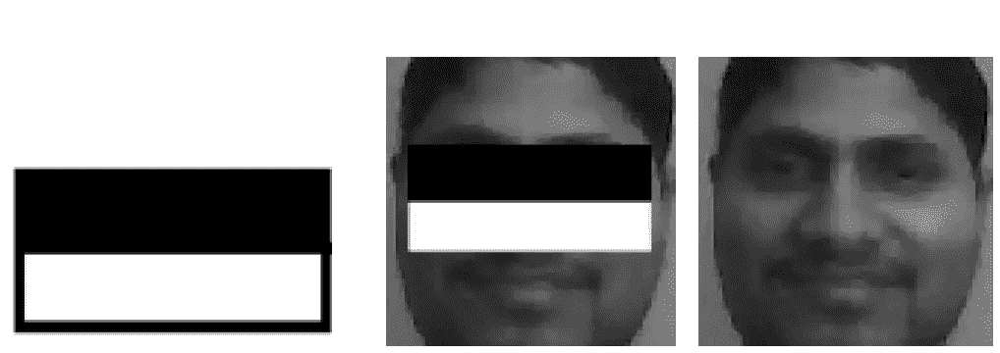
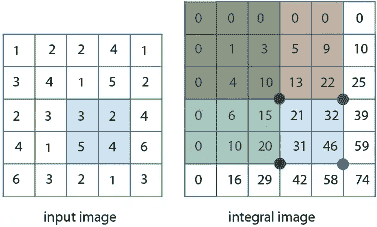
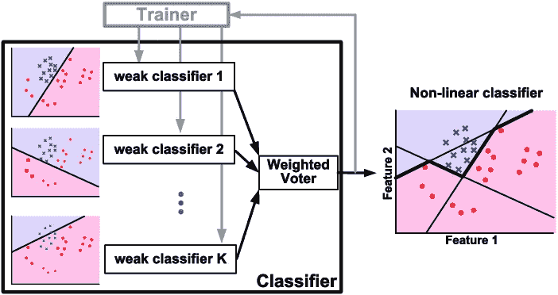
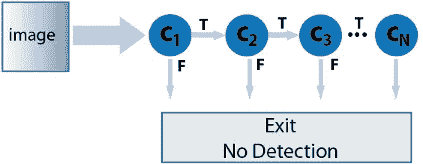
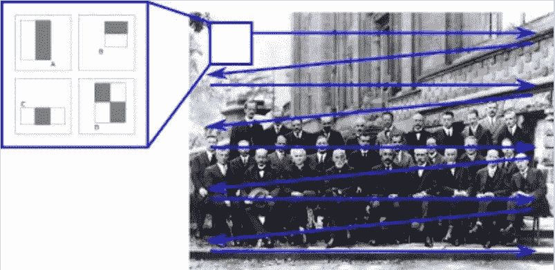

# 面部/关闭:使用 Viola Jones 方法的高速面部跟踪

> 原文：<https://towardsdatascience.com/face-off-high-speed-facial-tracking-using-the-viola-jones-method-f9e0ba491c9f?source=collection_archive---------19----------------------->

有没有想过你数码相机上的盒子是如何准确地知道一张脸在哪里和是什么的？

早在 2011 年，在卷积神经网络或任何其他类型的深度学习技术流行之前，就有了 Viola-Jones 算法。这种算法是如此的创新和有效，以至于这篇论文被引用了 19000 多次。

研究人员的目标是解决面部检测的两个最大问题。该算法实现了以下功能:

*   鲁棒性—高检测率(真阳性率)和极低的假阳性率。
*   速度—对于实时，每秒必须处理至少两帧。

最大限度地利用这两个条件将需要大量的处理能力，而这在 2001 年是不具备的。即使是现在，如果我们希望能够在一个便宜的设备上运行面部检测，例如 Raspberry Pi，这种权衡将是一个优先事项。

显然需要某种创新的方法来实现鲁棒性和速度之间的平衡，从而返回准确的结果。

现在让我们来看看维奥拉和琼斯是如何实现这个目标的。

# **分类器**

研究人员发现了一个过程，在这个过程中，你可以非常成功地识别图像的子窗口是否是一张脸。

首先，图像被转换成灰度。然后，为了识别图像中的一张脸，Viola 和 Jones 决定使用所谓的 Haar Like 特征。这些是图像的子窗口，其中一部分比另一部分暗。

然而，这是一个弱分类器。例如，具有两种对比色的盒子可以被视为一张脸，因为在个人的眼睛和脸颊之间经常设置相似的对比色。

将选择数以千计的这些特征，并且如果它们被证明是真实的，我们将能够以高精度决定图像的子窗口是否包含人脸。

**积分图像**

该算法最聪明的部分是它如何达到它的速度。为了有效地计算特征，它使用所谓的积分图像。

Via Matlab

当一个新的图像被分类时，像素值的总和被跨越行和列，使得像素(I，j)是在它之前的所有像素的总和。

对图像进行这种计算预处理允许计算机通过一些加法和减法运算来计算矩形特征，而不是遍历像素值。

现在，当算法测试图像的一部分是否是特征时，它可以很容易地在**常数时间内取矩形区域的差。**

**分类器学习/选择**

这些矩形框的原始特征数量是天文数字。根据这篇研究论文，仅仅在一个 24x24 的图像窗口中就有 162，336 个特征。

由于每个矩形本身都是一个弱分类器(每个矩形的表现都比猜测略好)，Viola 和 Jones 使用了自适应增强(AdaBoost)。

Zhuo Wang — [**Realizing Low-Energy Classification Systems by Implementing Matrix Multiplication Directly Within an ADC**](https://www.researchgate.net/publication/288699540_Realizing_Low-Energy_Classification_Systems_by_Implementing_Matrix_Multiplication_Directly_Within_an_ADC)

AdaBoost 使用所有矩形特征，并根据训练数据集训练它们。在此过程中，它将通过对弱分类器进行线性组合来寻找弱特征组并使其成为分类器。

简而言之，AdaBoost 构建的每个分类器都是一组固定数量的特征，每个特征都有不同的权重，以确定其形成的分类器的二元分类决策。使用由提升方法形成的这些分类器而不是每个单独的特征，为模型提供了更强的图像分类方法。

**注意力级联**

为了区分一个图像的子窗口实际上是不是一张脸，他们建立了一个注意力级联。它本质上是一棵决策树，其中每个节点都是所构造的分类器之一。

Via Matlab

级联的节点从简单的两个特征分类器开始排序，具有非常高的检测率，但是具有高的假阳性率。随着我们的前进，树节点变成一个更复杂的分类器，这将给我们更多的准确性，但在计算上更复杂。

Via stack overflow

图像的每个子窗口对照树中的第一个分类器进行测试，并且或者被分类为“可能是一张脸”,这将其移动到下一个分类器，或者被分类为“不是一张脸”,并且将不会用下一个分类器进行测试。

每个分类器的计算时间取决于组成分类器的特征数量。因此，该树从具有高检测率的简单分类器开始，该分类器通过将大量子窗口分类为注意力级联的早期节点中的非人脸来丢弃它们。

研究人员训练的模型最终形成了一个 38 层的级联分类器树。

他们的模型结果相当出色。该论文指出，在 700 Mhz 奔腾 III 处理器上，面部检测器可以在大约 0.067 秒内处理 384×288 像素的图像。

**结论**

尽管在图像识别领域已经取得了许多进步，但这表明这种算法虽然仍是机器学习，但比 CNN 更容易解释。在算法的每个阶段，你都能够准确地解释算法实际在做什么。

在实践中，我们可以优化实时识别和跟踪的一种方法是使用 Viola Jones 来检测面部，然后使用像 Kanade–Lucas–Tomasi(KLT)特征跟踪器这样的算法来跟踪视频中检测到的面部。

如果你有兴趣自己尝试一下，OpenCv 有一个实现，我将在下面链接，还有 Viola 和 Jones 的原始论文以及 Mike Pound 博士在 Computerphile 上的一个非常有用的解释。

[https://www . cs . CMU . edu/~ efros/courses/lbmv 07/Papers/viola-cvpr-01 . pdf](https://www.cs.cmu.edu/~efros/courses/LBMV07/Papers/viola-cvpr-01.pdf)

 [## 使用 Haar 级联的人脸检测

### 使用基于 Haar 特征的级联分类器的目标检测是由 Paul…

docs.opencv.org](https://docs.opencv.org/3.0-beta/doc/py_tutorials/py_objdetect/py_face_detection/py_face_detection.html)