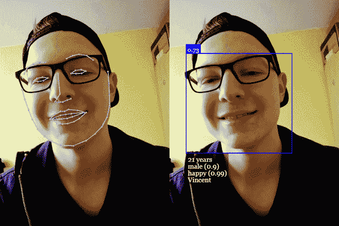
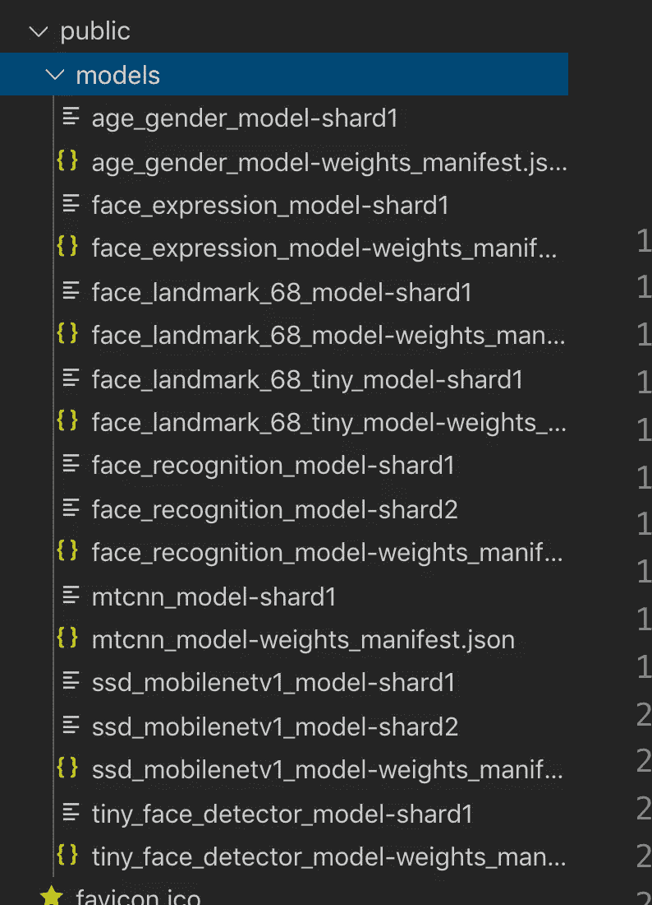
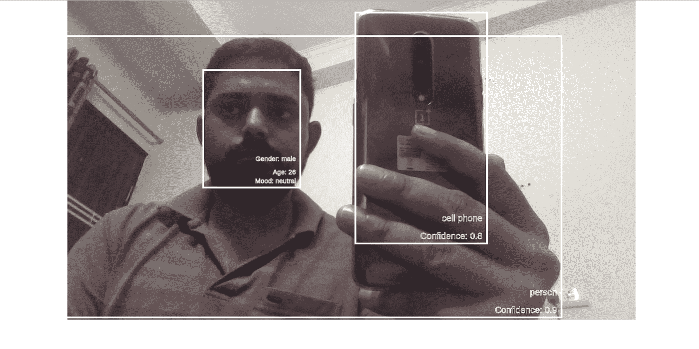

# 使用 JavaScript API 的人脸检测— face-api.js

> 原文：<https://towardsdatascience.com/face-recognition-using-javascript-api-face-api-js-75af10bc3dee?source=collection_archive---------4----------------------->



Face-API.js

在本文中，我们将学习使用`face-api.js`的面部检测(年龄/性别/面部位置/情绪),以及在网络浏览器上使用`coco-ssd`模型的附近物体检测(人/电话等)。

`face-api.js`是一个 javascript 模块，构建在 [**tensorflow.js 核心**](https://github.com/tensorflow/tfjs-core) 之上，实现了几个 **CNN** s **(** 卷积神经网络)来解决人脸检测、人脸识别和人脸地标检测，针对 web 和移动设备进行了优化。

让我们现在开始，

## 先决条件:

1.  对 React.js 有基本的了解(你可以选择任何你喜欢的库或前端框架)
2.  对 p5.js 库的基本了解。
3.  已安装的 create-react-app 和 Node.js 版本> = 10.15.1

## 让我们创建一个 react 项目，

```
npx create-react-app object_face_detection
cd object_face_detection
```

## 现在，安装下面的依赖项

```
npm install @tensorflow-models/coco-ssd
npm install @tensorflow/tfjs-converter
npm install @tensorflow/tfjs-core
npm install face-api.js
npm install p5
npm install react-p5-wrapper
```

让我们一个一个地了解每一个依赖关系——

1.  `@tensorflow-models/coco-ssd` —这将用于其他物体检测，如电话、墙壁等。在脸的周围。`Coco-ssd`是一个 TensorFlow 模型，已经用大量通用图像进行了训练，可以直接在浏览器中使用。你可以在这里阅读—[https://github . com/tensor flow/tfjs-models/tree/master/coco-SSD](https://github.com/tensorflow/tfjs-models/tree/master/coco-ssd)
2.  `@tensorflow/tfjs-converter`—将 TensorFlow 保存的模型和 keras 模型直接转换为 tensorflow.js 使用。我的意思是已经有很多使用 python 或 R 制作/训练的模型，但是模型保存的格式不同于 TensorFlow.js 使用/消费的格式。所以需要这种依赖来将其他模型转换成 TensorFlow 的可消费格式。
3.  `@tensorflow/tfjs-core` — Tensorflow 核心 javascript 库。你可以读读这个——https://www.tensorflow.org/js/tutorials/setup。face-api.js 是在这种依赖的基础上构建的。
4.  `face-api.js` —这是本文的核心 API，将用于人脸检测。了解更多—[https://github.com/justadudewhohacks/face-api.js?files=1](https://github.com/justadudewhohacks/face-api.js?files=1)
5.  这是最近发展起来的另一个伟大的库，在我们的上下文中，我们将使用它来制作网络摄像头视频，并在检测到的人脸和物体周围绘制一个红色框。你可以阅读—[https://p5js.org](https://p5js.org/reference/#/p5/createCapture)
6.  `react-p5-wrapper` —这只是一个在 p5js 功能上编写的 reactjs 包装器。所以与其写一个，不如用它来节省时间。

## 现在让我们深入编码💻

在我们开始之前，我们需要下载`face-api.js` 模型(已经建立做面部和情绪检测)。因此，让我们在我们的`public`文件夹中创建一个名为`models`的文件夹，并下载位于[https://github . com/justadudewhohacks/face-API . js/tree/master/weights](https://github.com/justadudewhohacks/face-api.js/tree/master/weights)的文件

`models`文件夹将会是这样的



我们现在将在我们的`src`文件夹中创建一个名为`ObjectDetectionSketch.js`的文件，它将包含我们所有的逻辑。

该文件将有如下一些导入语句

```
import * as p5 from 'p5'import "p5/lib/addons/p5.dom";import * as cocoSsd from '@tensorflow-models/coco-ssd';import * as faceapi from 'face-api.js';
```

1.  **p5 和 p5.dom** —需配合 p5js，忍着点，过几段你就明白确切用法了。
2.  **cocoSsd** 和**faceapi**——你现在已经知道了。

接下来，我们将定义我们的 face-API 模型 URL

```
const MODEL_URL = '/models' 
// this will pick public folder by default
```

现在，我们将创建名为 **sketch** 的函数(包含所有逻辑的包装函数)

```
export default function sketch (p) {}
```

在 sketch 函数内部，我们将定义几个变量和四个函数，两个自定义的，两个来自 p5.js，分别叫做`setup`和`draw`。

**变量**

```
// Variables// save current camera image
let capture = null;// save cocossd Model
let cocossdModel = null;// to save the result of cocossd and face-api results
let cocoDrawings = [];
let faceDrawings = [];
```

**自定义功能**

```
// Custom Function// Used to store the result of coco-ssd model
function showCocoSSDResults(results) {
    const id = capture.id();
    cocoDrawings = results;
}// used to store the result for the face-api.js model
function showFaceDetectionData(data) {
    faceDrawings = data;
}
```

**P5.js 函数**

```
// P5.js Functions
p.setup = async function() {}
p.draw = function() {}
```

我们来详细了解一下这两个 p5 的功能。🚀

# `Setup`功能

页面加载后，将自动调用 p5.js 设置。我们正在覆盖 p5 内置的`setup`函数来初始化我们需要的一些细节。下面是我们将在设置函数中执行的步骤。

**1。加载我们将用于人脸检测的三个 face-api.js 模型**。

```
await faceapi.loadSsdMobilenetv1Model(MODEL_URL);
await faceapi.loadAgeGenderModel(MODEL_URL);
await faceapi.loadFaceExpressionModel(MODEL_URL);
```

**2** 。**创建一个 p5.js 画布**

```
p.createCanvas(1280, 720);
```

**3** 。**在画布上实现摄像头捕捉功能**。

```
const constraints = {
  video: {
      mandatory: {
      minWidth: 1280,
      minHeight: 720
      },
      optional: [{ maxFrameRate: 10 }]
  },
  audio: false
};capture = p.createCapture(constraints, () => {});
```

**4。** **设置视频 Id 和大小。**

```
capture.id("video_element");
capture.size(1280, 720);
capture.hide(); // this is require as we don't want to show the deafault video input
```

**5** 。**加载 cocoSsd 模型并保存在本地。**

```
cocoSsd.load().then((model) => {
  try {
      cocossdModel = model;
  } catch(e) {
      console.log(e);
  }
}).catch((e) => {
    console.log("Error occured : ", e);
});
```

# 绘图功能

如果在 p5js 画布上绘制任何东西，就会调用 p5js 的 draw 函数。在我们的自定义绘制函数中，我们将执行以下步骤。

1.  将背景设置为白色，并在上面绘制我们的图像。此外，**添加透明度**，这样任何进一步绘制到画布上的东西都将是透明的。

```
p.background(255);
p.image(capture, 0, 0);     
p.fill(0,0,0,0);
```

2.代码**渲染 coco-ssd 模型结果。**

```
cocoDrawings.map((drawing) => {
  if (drawing) {
      p.textSize(20);
      p.strokeWeight(1);
      const textX = drawing.bbox[0]+drawing.bbox[2];
      const textY = drawing.bbox[1]+drawing.bbox[3];

      const confidenetext = "Confidence: "+ drawing.score.toFixed(1);
      const textWidth = p.textWidth(confidenetext);

      const itemTextWidth = p.textWidth(drawing.class);
      p.text(drawing.class, textX-itemTextWidth-10, textY-50);p.text(confidenetext, textX-textWidth-10, textY-10);
      p.strokeWeight(4);
      p.stroke('rgb(100%,100%,100%)');
      p.rect(drawing.bbox[0], drawing.bbox[1], drawing.bbox[2], drawing.bbox[3]);
  }
});
```

这里我们有一个`cocoDrawings`对象，包含 coco-ssd 模型检测到的当前对象细节。这个物体的形状看起来像

```
{
  "bbox": [
    6.165122985839844,
    2.656116485595703,
    1034.7143936157227,
    712.3482799530029
  ],
  "class": "person",
  "score": 0.9296618103981018
}
```

我们使用这个对象数据来绘制一个矩形，该矩形定义了当前对象的位置以及被检测到的对象的名称(在上面的例子中是人)和分数。

这是一个基本的 p5js 代码，用于绘制文本和矩形。如果你觉得很难理解，那么试试 p5.js docs，一个小时之内你就会明白了。—[https://p5js.org/](https://p5js.org/)

我们可以在画布上绘制多个对象，因为它们会被检测到。

3.代码**呈现 face-api.js 模型结果。**

```
faceDrawings.map((drawing) => {
  if (drawing) {
    p.textSize(15);
    p.strokeWeight(1); const textX = drawing.detection.box._x+drawing.detection.box._width;
    const textY = drawing.detection.box._y+drawing.detection.box._height;

    const confidenetext = "Gender: "+ drawing.gender;
    const textWidth = p.textWidth(confidenetext);
    p.text(confidenetext, textX-textWidth, textY-60); const agetext = "Age: "+ drawing.age.toFixed(0);
    const ageTextWidth = p.textWidth(agetext);
    p.text(agetext, textX-ageTextWidth, textY-30); const copiedExpression = drawing.expressions;
    const expressions = Object.keys(copiedExpression).map((key) => {
        const value = copiedExpression[key];
        return value;
    }) const max = Math.max(...expressions);

    const expression_value =    Object.keys(copiedExpression).filter((key) => {
        return copiedExpression[key] === max; 
    })[0]; const expressiontext = "Mood: "+ expression_value;
    const expressionWidth = p.textWidth(expressiontext);
    p.text(expressiontext, textX-expressionWidth, textY-10);

    p.strokeWeight(4);
    p.stroke('rgb(100%,0%,10%)');
    p.rect(drawing.detection.box._x, drawing.detection.box._y, drawing.detection.box._width, drawing.detection.box._height);
  }
});
```

这里我们定义文本大小，将从 face-api.js 获得的数据绘制到 p5.js 画布上。

现在，每个检测到的人脸都有以下由 face-api.js 模型返回的数据

```
{
  "detection": {
    "_imageDims": {
      "_width": 1280,
      "_height": 720
    },
    "_score": 0.6889822483062744,
    "_classScore": 0.6889822483062744,
    "_className": "",
    "_box": {
      "_x": 121.50997161865234,
      "_y": 15.035667419433594,
      "_width": 507.80059814453125,
      "_height": 531.7609024047852
    }
  },
  "gender": "male",
  "genderProbability": 0.9683359265327454,
  "age": 30.109874725341797,
  "expressions": {
    "neutral": 0.9950351715087891,
    "happy": 0.0000017113824242187547,
    "sad": 0.000005796719960926566,
    "angry": 0.00000466804613097338,
    "fearful": 1.3292748013427058e-9,
    "disgusted": 3.015825145169515e-9,
    "surprised": 0.004952521994709969
  }
}
```

你可以看到，我们得到的是一个矩形坐标的人脸、性别、年龄和表情数据

我们可以从`detection._box` 中提取矩形坐标，对于表达式，我们有所有的表达式及其相应的分数。所以，

```
const copiedExpression = drawing.expressions;
const expressions = Object.keys(copiedExpression).map((key) => {
    const value = copiedExpression[key];
    return value;
})const max = Math.max(...expressions);const expression_value = Object.keys(copiedExpression).filter((key) => {
    return copiedExpression[key] === max; 
})[0];
```

用上面的代码，我们将估计和获得高度记分员表达式，并显示在一个矩形内

最困难的部分是将文本放入矩形，所以我们做了一个不太好的实现，但它是可行的。

所以我们从盒子的 x 坐标上去掉这个宽度，再加 10，这样左边界和显示文本就有了一些空白。

```
const ageTextWidth = p.textWidth(agetext);
p.text(agetext, textX-ageTextWidth, textY-30);
```

等一等🤔这一切都很好，但是检测人脸和其他物体的代码在哪里呢？

这就是了👇

4.检测人脸和其他元对象的**代码。**

```
faceapi.detectAllFaces(capture.id())
  .withAgeAndGender()
  .withFaceExpressions()
  .then((data) => {
    showFaceDetectionData(data);
});if(capture.loadedmetadata) {
    if (cocossdModel) {
        cocossdModel
        .detect(document.getElementById("video_element"))
        .then(showCocoSSDResults)
        .catch((e) => {
            console.log("Exception : ", e);
        });
    }
}
```

我们结束了🎢准备测试。

在候机楼里面做什么

```
cd object_face_detection
npm start
```

这是尝试的结果—



https://github . com/overflow js-com/object _ face _ detection _ web cam _ react——如果你觉得很难理解本文的内容，可以参考这里的代码。

> 注意:这个实现很慢，因为我们在浏览器中加载所有的模型，并且是实时的

如果您想被添加到我的电子邮件列表中，请考虑在这里输入您的电子邮件地址 和**关注我的** [**medium**](https://medium.com/@ideepak.jsd) **阅读更多关于 javascript 的文章，并关注**[**github**](https://github.com/dg92)**查看我的疯狂代码**。如果有什么不清楚或者你想指出什么，请在下面评论。

你可能也会喜欢我的其他文章

1.  [Javascript 执行上下文和提升](https://levelup.gitconnected.com/javascript-execution-context-and-hoisting-c2cc4993e37d)
2.  [Javascript —生成器-产出/下一个&异步-等待🤔](https://medium.com/datadriveninvestor/javascript-generator-yield-next-async-await-8442d2c77185)
3.  [理解 Javascript‘this’关键字(上下文)](https://medium.com/datadriveninvestor/javascript-context-this-keyword-9a78a19d5786)。
4.  [Javascript 数据结构与映射、归约、过滤](https://levelup.gitconnected.com/write-beautiful-javascript-with-%CE%BB-fp-es6-350cd64ab5bf)
5.  [Javascript- Currying VS 部分应用](https://medium.com/datadriveninvestor/javascript-currying-vs-partial-application-4db5b2442be8)
6.  [Javascript ES6 —可迭代程序和迭代器](https://medium.com/datadriveninvestor/javascript-es6-iterables-and-iterators-de18b54f4d4)
7.  [Javascript —代理](https://medium.com/datadriveninvestor/why-to-use-javascript-proxy-5cdc69d943e3)
8.  [Javascript —作用域](https://medium.com/datadriveninvestor/still-confused-in-js-scopes-f7dae62c16ee)

# 如果你喜欢这篇文章，请随意分享，以帮助他人找到它！