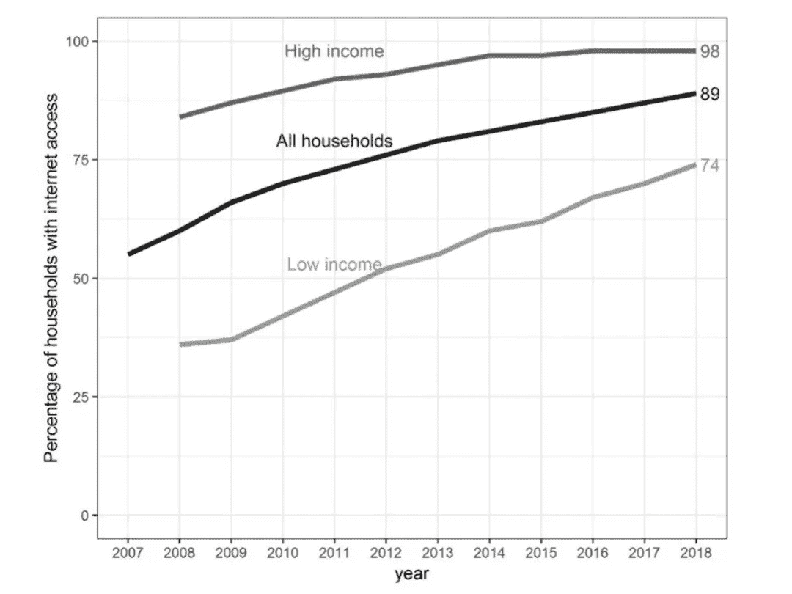

# 脸书 vs .欧盟人工智能和数据政治

> 原文：<https://towardsdatascience.com/facebook-vs-eu-artificial-intelligence-and-data-politics-8ab5ba4abe40?source=collection_archive---------22----------------------->

Photo by [@greystorm](https://unsplash.com/@greystorm)

## 关于人工智能和脸书数据政治的新 FRA 论文

本文是欧盟基本权利机构(FRA)的一篇名为 [*数据质量和人工智能——减轻偏见和错误以保护基本权利*](https://fra.europa.eu/en/publication/2019/artificial-intelligence-data-quality) 的论文的摘要。然后，我继续研究脸书最近在数据政治方面的举措；扎克伯格发表的声明；以及他们最近聘请前副首相尼克克莱格(Nick Clegg)担任全球政策和沟通主管。我希望这能使欧盟的政策更容易理解，并向你们概述脸书在这方面采取的一些行动。

## 什么是 FRA？

欧盟基本权利署是一个欧盟机构，其任务是“……收集和分析原则上涉及《宪章》所列所有权利的基本权利数据”，这里指的是《欧洲联盟基本权利宪章》。*《宪章》规定的这些权利包括:尊严、自由、平等、团结、公民权利和正义。*

# FRA 关于数据质量和人工智能的论文

FRA 有一个关于[人工智能、大数据和基本权利的项目于](https://fra.europa.eu/en/project/2018/artificial-intelligence-big-data-and-fundamental-rights) 2018 年启动。*该报告评估了在选定的欧盟成员国将人工智能(AI)和大数据用于公共管理和商业目的的基本权利的利弊*。2019 年 6 月发表的论文 [*数据质量和人工智能——减少偏见和错误以保护基本权利*](https://fra.europa.eu/sites/default/files/fra_uploads/fra-2019-data-quality-and-ai_en.pdf) 是这个项目的一部分，也是我在这一部分的重点。

> 这篇论文是对正在进行的人工智能和大数据政策讨论的贡献。本部分中的引用将全部来自本文。

该报告声称，机器学习系统和人工智能(AI)中使用的算法只能与用于开发它们的数据一样好。然而，关键问题是如何定义'*质量*'。他们强调透明度，认为数据量往往比质量更重要。

人工智能包含在欧盟委员会关于欧洲人工智能的通信中:“**人工智能(AI)是指通过分析其环境并采取一定程度的自主行动来实现特定目标的智能行为的系统。**

他们提到 AI 不是指一个事物，而是一套流程和技术发展。

在论文中，数据质量是一个宽泛的概念。他们强调了社会科学和调查研究中使用的与数据质量有关的两个通用概念:

*   **表示错误，这意味着数据没有很好地覆盖它应该覆盖的人群；**
*   ****测量误差*** *，这意味着数据并没有测量出它们想要测量的东西。**

*解释复杂算法如何工作一直是一个焦点，但是有人认为 ML 和数据科学忽略了数据质量的关键方面。*

*其他报告和欧洲理事会多次提到这个问题。欧洲科学和新技术伦理小组指出，应避免数据集中的歧视性偏见。*

*欧盟委员会人工智能高级专家组在其道德准则中将数据治理作为可信人工智能的要求之一。*

*由人权和技术组织联盟撰写的“[多伦多宣言](https://www.theverge.com/2018/5/16/17361356/toronto-declaration-machine-learning-algorithmic-discrimination-rightscon)”将一种风险命名为“不完整或不具代表性的数据，或代表历史或系统偏见的数据集”。*

*该报告提到了涉及至少三个不同数据集的机器学习(ML)算法:*

1.  ***训练数据**。在监督学习中，用于学习期望结果的数据是所谓的*特征*。期望的结果通常被称为*标签*。这是算法如何学习模式的基础。*
2.  ***输入数据**。当一个算法被部署时，新的看不见的特征被添加。*
3.  ***推断标签**(或预测、推论、推断动作或输出数据)当看不见的数据馈入 ML 算法时产生。*

*在这篇论文中，他们提出了一个案例研究，重点是来自互联网的数据，以说明“*表示错误*”的可能性。*

*该报告提到了欧盟对大数据的使用。总体而言，欧盟三分之一的大型企业(33 %)使用大数据分析。数据的使用引发了问题。他们列出了以下内容:*

*并非所有人:*

1.  *能接触到社交媒体，报道也不尽相同。*
2.  *想要访问互联网、社交媒体或其他应用程序。*

*有些群体不包括在收集的数据中，只包括那些放弃数据的人。下图显示了数字鸿沟，通常被称为数字鸿沟。*资料来源:2019 年欧洲森林资源管理局【根据欧统局(ISOC _ ci _ in _ h)】:**

**

*还有一个地理上的差异。因此，收集的数据不代表人口中的某些群体。*

*然后，他们继续讨论基本权利，每个权利都有一个简短的例子:*

*   *不歧视。*
*   *男女平等。*
*   *获得公平审判和有效补救。*
*   *私人和家庭生活*
*   *个人资料的保护*

*研究人员已经开始分析这个话题，强调将推断的

数据视为个人数据的重要性。只有这样，GDPR 的权利才能适用，包括了解这些数据的权利，以及访问、纠正、删除和反对这些数据的权利。*

> *对于自动化决策，GDPR 要求数据控制者提供关于所涉及的逻辑的有意义的信息，以及这种处理对于数据主体的重要性和预期后果。*

## *评估数据质量*

*存在着完整性、准确性、一致性、及时性、复制性、有效性、可用性和出处等问题。提到的一个具体问题是:*

*   *大规模移民中的生物特征数据。*

*数据可能不准确，对技术的信任可能导致不幸的情况。“数据质量”的一个定义是所使用的数据是否“符合目的”。*

> *"因此，数据的质量在很大程度上取决于它们的使用目的."*

*文中提到了两种常见的误差来源。这是在经典调查研究的背景下讨论的:测量误差和表示误差。*

***测量误差**指的是所使用的数据指示或反映要测量的内容的准确程度。*

*必须如何评估回答者？编辑和重组数据对此有多大影响？你如何衡量一个好员工？作为一个评论，我可以补充:你如何衡量一个好用户？*

*数据近似于真实世界的现象，测量中总会有误差。多大的误差是可以接受的？数据通常由人工标记(如标记图片)，因此标记过程中的质量控制至关重要。*

***表示错误**:如果数据没有很好地覆盖它应该覆盖的人群，那么得到的统计数据将是不正确的(即有偏见的)。*

*一个重要的问题是，用于构建应用程序的数据是否能够准确地代表未来的用户。人们通常会开始以不同的方式行事。*

## *FRA 的信度和效度*

*社会科学中用来描述某些概念的测量误差的两个概念。可以通过指数等指标来完成；或者当无法直接测量时，使用相关问题的测量。*

***可靠性:**指测量的稳定性和一致性。*

***有效性:**数据和预测是否实际测量了它们打算测量的东西的问题，因此与表示和测量的误差有关。*

*不可靠的数据可能有正确的目标，但显示出太多的变化和不确定性，从而错过了目标，尽管平均结果良好。大的数字减少统计的不确定性，然而低的质量可能不增加有效性。*

## *欧洲统计系统中的 FRA 数据质量——人工智能的教训*

*根据本文，数据质量是一项竞争优势。本文引用了欧洲统计系统的质量减速，我发现将它们包括在内很有价值:*

1.  *质量方针是公开的。*
2.  *制定了计划和监控数据生产流程的

    质量的程序。*
3.  *定期监控、评估

    和报告产品质量。*
4.  *定期对输出进行全面评审，包括由外部专家进行评审。*

*这种统计数据的产生与人工智能相关，因为它们与所使用的机器学习方法相关。在该论文中，提出了统计学和机器学习之间的主要区别如下。统计学旨在描述具有特征、相关性和因果解释的群体。根据洗钱司的意见，案文内容如下:*

> *……机器学习主要关注的是预测一个单位的特征，比如一个人、一个公司或者一个国家。这具有稍微不同的含义，因为与关于人口群体的一般统计相比，预测的准确性变得更加重要。*

## *质量评估数据集描述—行业标准*

*人工智能和人工智能领域的专家提出了数据集描述，称为*‘数据表’*，或*‘营养标签’*。有人建议以与硬件组件相同的方式描述数据集，以检查它们是否符合行业标准。这篇论文声称，在人工智能领域，没有标准化的方法来描述数据集。*

> *这种标准化必须考虑到灵活性，以便能够包括人工智能应用中使用的各种可能的数据格式和集合。这一点很重要，因为如果数据是为一个目的生成的，就需要评估它们是否也适合另一个目的。*

*数据文档倡议(DDI)有一个描述数据集(即元数据)的标准化方法。在某种程度上，这对于共享以供重用是有用的。需要数据收集的背景、方法和元级描述。通过这种方式，使用特定数据集评估工具的潜在误差将更加容易。因此，本文认为统计实践为人工智能方面的数据质量保证提供了潜在的途径。*

## *FRA 结论*

*利用数据的 ML 系统和算法需要更广泛和更灵活的方法来评估和处理数据质量。他们建议询问几个问题，以确定算法使用中的质量问题:*

*   *数据从哪里来？谁负责数据收集、维护和传播？*
*   *数据中包含哪些信息？数据中包含的信息是否适合算法的目的？*
*   *数据涵盖了哪些人？谁在数据中被低估了？*
*   *数据集内是否缺少信息，或者是否只覆盖了部分单元？*
*   *用于构建应用程序的数据收集的时间框架和地理覆盖范围是什么？*

*由于质量可能会对歧视性做法和错误系统产生影响，因此缓解潜在问题非常重要。该论文认为，这可以借鉴社会科学和调查研究的“严谨性”。然而他们说:*

> *“新技术需要对潜在的基本权利挑战进行全面评估[……]为了更好地理解对基本权利的影响，需要进行跨学科研究，因为这一主题结合了许多不同领域的要素，包括法律、计算机科学、统计学和社会科学。”*

# *脸书及其数据政治*

*剑桥分析报告发布后，欧盟美国联邦贸易委员会同意对脸书罚款 50 亿美元以解决隐私侵犯问题。据《卫报》2019 年 7 月 12 日报道，这将是联邦贸易委员会对一家技术公司的最大一笔罚款，也是对任何一家侵犯隐私的公司的最大一笔罚款[。](https://www.theguardian.com/technology/2019/jul/12/facebook-fine-ftc-privacy-violations)*

## *通用数据保护条例(GDPR)*

*GDPR 于 2018 年 5 月 25 日[生效，是“世界上最严厉的隐私和安全法”。在欧盟的](https://gdpr.eu/what-is-gdpr/) [GDPR 页面](https://gdpr.eu/what-is-gdpr/)上写着:*

> ***…违反 GDPR 的罚款非常高**。处罚分为两级，最高为€2000 万英镑或全球收入的 4%(以较高者为准)，此外，数据主体有权寻求损害赔偿*

*看到脸书的例子后，我们可以理解这不仅仅是一个大胆的主张。该文章提到:*

*   ***个人数据**:与个人相关的任何可以直接或间接识别的信息。*
*   ***数据处理**:对数据执行的任何动作，无论是自动还是手动。*
*   ***数据主体**:数据被处理的人。*
*   ***数据控制者**:决定为什么以及如何处理个人数据的人。*
*   ***数据处理者**:代表数据控制者处理个人数据的第三方。例如服务器。*

*特别是，在同意方面有额外的严格规则，使其在更大程度上可以理解。还有三种情况可能需要任命一名数据保护官员(DPO): (1)如果你是一个公共机构；(2)大规模系统地监控人；(3)大规模处理特殊类别的数据(定罪和医学)。法规本身有 88 页，我在这里没有提供足够好的概述。*

## *脸书在 GDPR*

*在“服从”这个表达中，脸书似乎给[在 GDPR](https://www.facebook.com/business/gdpr) 上创建了一个页面。他们在几个段落中概述了关键词。然后，他们继续采取行动，他们将采取遵守。*

*   ***透明度**:脸书的数据政策定义了他们如何处理人们的个人数据。他们承诺提供有关其数据政策的教育。他们将通过(1)产品内通知和(2)消费者教育活动来确保人们了解他们的数据如何被使用以及他们的选择。*
*   ***控制**:提供对数据使用方式的控制。启动控制中心，使隐私设置更容易理解和更新。它们提醒人们在使用脸书时如何查看和编辑他们的设置。*
*   ***责任**:脸书有[隐私原则](https://www.facebook.com/about/basics/privacy-principles)解释他们如何看待隐私和数据保护。他们有一个团队来帮助确保我们记录我们的合规性。此外，他们定期会见来自世界各地的监管者、决策者、隐私专家和学者，通报他们的做法。*

## *扎克伯格拥抱 GDPR 并雇佣政策专家*

*马克·扎克伯格最近积极拥抱 GDPR，尽管他的动机受到质疑。然而，扎克伯格并不是第一个支持 GDPR 式规则的科技公司首席执行官。[微软](https://www.cnbc.com/quotes/?symbol=MSFT)首席执行官塞特亚·纳德拉[称赞欧洲法律](https://www.cnbc.com/2018/11/01/microsoft-ceo-tech-companies-need-to-defend-privacy-as-a-human-right.html)和蒂姆·库克[去年呼吁联邦隐私监管](https://www.cnbc.com/2019/04/01/les-tim-cook-warns-silicon-valley-it-would-be-destructive-to-block-strong-privacy-laws.html)。其他国家，如加拿大，现在开始考虑是否能让脸书参与隐私问题的讨论。*

*最近，脸书聘请英国前副首相尼克克莱格爵士(Sir Nick Clegg)担任其全球政策和沟通主管。这可能是由于公司在过去几年中面临的一系列问题。这包括但肯定不限于:*

*   *[假新闻](https://www.theguardian.com/technology/2019/apr/22/facebook-profit-fall-fake-news-privacy-scandals)*
*   *[数据保护](https://www.theguardian.com/technology/2018/oct/25/facebook-fined-uk-privacy-access-user-data-cambridge-analytica)*
*   *[政府监管的威胁](https://www.independent.co.uk/news/world/americas/mark-zuckerberg-facebook-regulation-internet-government-washington-post-a8847701.html)*
*   *[逃税](https://www.google.com/amp/s/amp.theguardian.com/technology/2018/oct/08/facebook-uk-tax-bill-sales-margaret-hodge)*

*马克·扎克伯格呼吁在四个不同领域进行监管。有害内容、完整性、隐私和数据可移植性是他概述的关键问题:*

*有害内容——他希望社交应用能有总体的规则和基准来衡量*

***选举诚信**——他希望政府对什么构成政治或议题广告做出明确的定义*

***隐私**——他想要 GDPR 式的全球法规，对违反者进行制裁*

*数据可移植性——他希望用户能够将他们的信息从一个应用程序带到另一个应用程序*

## *尼古拉斯爵士威廉彼得克莱格*

*2019 年 7 月 17 日[新政治家](https://www.newstatesman.com/2019/07/nick-clegg-facebook-fixer)报道称，Nick 作为一名翻译有着积极的看法，他的方法是:“忽略意识形态和党派偏见；求进步，求妥协；寻找基于证据和现实解决方案”他能流利地说五种语言:英语、西班牙语、法语、德语和荷兰语。*

*此外，负面的一面是，他会为了利益不择手段。克莱格一家住在门洛帕克一栋 700 万英镑的豪宅里，根据《福布斯》的说法，这是美国“最昂贵的邮政编码”。《卫报》的一篇观点文章称他“在学费问题上背叛了公众和他在学生城的核心选票”。作为一名学生，我在英国生活了三年，我觉得这反映了相当多的英国年轻人的情绪。*

*他最近在欧洲其他国家的首都旅行，要求政府对脸书进行监管。克莱格去了威斯敏斯特学校，在剑桥学习人类学。他声称传统媒体比新媒体对政治的影响更大，声称没有证据表明俄罗斯干涉英国选举。他说脸书希望被监管。*

## *脸书和中国*

*正如 Nick Clegg 在他的观点中所提出的，脸书现在正在争论它作为一个抗衡中国的力量的地位，以及反对[‘专制社会价值观’](https://techcrunch.com/2019/07/17/facebook-or-china/)的个人权利。这一点最近已经为人所知，因为一个关于卡利布拉推动引入新货币的听证会。脸书 Calibra 的负责人 David Marcus 说:*

> ***我相信，如果美国不在数字货币和支付领域引领创新，其他人会的。**如果我们不采取行动，我们很快就会看到一种由价值观截然不同的人控制的数字货币。*

*不到一年前，2018 年 10 月，马克·扎克伯格在 Recode 的一次采访中对卡拉·斯威舍说:*

> *我们在这里长大，我认为我们分享了很多我认为这里的人们非常珍视的价值观，我认为我们这样做总体来说是非常好的，无论是出于安全原因还是从价值观的角度来看。因为**坦率地说，我认为另一个选择将是中国公司**。如果我们采取这样的立场，“好吧，作为一个国家，我们将决定，我们要切断这些公司的翅膀，让它们更难在不同的地方运营，它们必须变得更小，”那么就会有很多其他公司愿意并且能够取代我们正在做的工作。*

*尼克·克莱格[在 2019 年 1 月](https://www.businessinsider.com/facebook-lobbyist-nick-clegg-europe-should-worry-about-china-internet-2019-1?r=US&IR=T)重复了这条信息。2019 年 7 月 19 日，TechCrunch 发表了一篇全面的文章。文章的结论是响亮的:*“也许援引中国的威胁来煽动政府官员的担忧是政治上的精明，甚至可能是有效的。这并不意味着它是正确的。”以这种方式，现在的问题是一家大公司及其作为一家公司的公民责任或地位。**

# *公民责任和数据政治*

*面对越来越多的监管和指控，以及脸书方面以这种方式做出的回应，很难理解下一步该何去何从。然而，我们可能会开始考虑，当一家公司变得如此庞大，有如此多的在线用户以各种方式讨论他们的生活时，会发生什么。*

*不久前的一次聚会上，我听到有人说:*

> *“这些大型科技公司有时和国家一样大。也许他们应该开始这样做，并承担一些公民责任。”*

*对大多数人来说，脸书作为一个国家行为者或具有类似国家的品质似乎有些牵强，包括我在内，但这是一种值得考虑的可能性。公私合作制定公平的数据政策，既保护人民，又为创新敞开大门，这不是一件容易的事情。*

*我们可以大胆地进入福柯式的概念，如生物政治、生物勘探和抵抗——是的，我们当然可以问权力的问题。政治和公司的分离差距越来越大，在国际关系(IR)的意义上，这种观点的相关性越来越大。甚至在涉及国际关系的基本概念时。*

*这是现实主义、自由主义还是社会建构主义？看起来脸书的数据政策正在从自由主义的“自由”向 T2 提出的“基于现实的解决方案”的方向发展。两者都同样模糊不清。*

## *从数据主体到数据公民*

*从私人权力到国家权力的问题，以及随之而来的困惑，在这个*、【结尾】或*中，看看数据政治的学术定义会很有趣。*

***Evelyn RUP pert、Engin Isin 和 Didier Bigo 于 2017 年 12 月在 [Researchgate](https://www.researchgate.net/publication/318459137_Data_politics) 上发表的一份报告中定义了数据政治**:*

> *我们将**‘数据政治’**定义为关于这些世界的政治问题的表达，以及它们通过提出权利主张来激发主体管理自己和他人的方式。我们认为，如果不理解这些可能性条件——世界、主体和权利——就很难干预或塑造数据政治，如果这意味着将数据主体转变为数据公民的话。*

*因此，这种表达当然是说明有**数据公民身份**，他们还没有定义这是隐含的。这些*权限*是在文章中累积数据的上下文中定义的。提交人质疑公民是否有权知道谁:*

1.  *拥有*
2.  *分配*
3.  *卖*
4.  *接近*
5.  *使用*
6.  *挪用*
7.  *修改*
8.  *辞职*

*因此，数据公民权意味着公民义务。如果您有权使用您的数据，并且您拥有这些数据，那么您还有责任管理您的数据。你行使权力或控制——指导该领域政策的制定和管理。这不仅是 GDPR 的敌人，也让人们有权利增加责任感和义务感。*

> *“……每一项权利都意味着一项责任；每一个机会，一种义务；每一份财产，都是一种责任*

*我们必须尽最大努力了解数据公民身份，以及我们在这方面有哪些权利、责任和义务。特别是在人工智能和数据政策的背景下，这两个领域在国际和当地的讨论中受到越来越多的关注。*

# *这是第 500 天的第 48 天*

> **什么是#500daysofAI？
> 我在挑战自己，写下并思考未来 500 天的人工智能话题。一起学习是最大的快乐，所以如果你觉得一篇文章引起了你的共鸣，请给我反馈。感谢您的阅读！**