# FaceMath:人工智能中的思想代数。

> 原文：<https://towardsdatascience.com/facemath-an-algebra-of-ideas-in-a-i-568979737639?source=collection_archive---------21----------------------->

## 人工智能的无监督学习

## 变换面孔、文字和其他很酷的东西

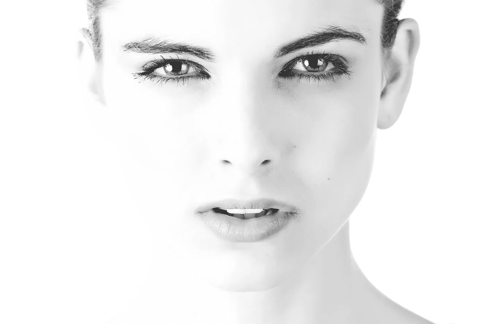

闭上眼睛，在脑海中想象一个洋娃娃。现在想象同一个娃娃会说话。看娃娃说话。你刚才在脑子里所做的——你能看到会说话的东西——是一个娃娃的想法和会说话的想法的结合。事实证明，我们可以使用人工智能通过代数将概念相加，这就是本文的内容。我喜欢称它为**“思想的代数”**，因为我们正在使用基础数学将概念相加，形成复合概念。

让我们来谈谈想法，并把它们变成数字。回到[这篇卡通人工智能文章](/xkcd-com-artificial-intelligence-a4cbf6303b1e)，我们看到了文本块如何被转化为特殊的固定长度的数字列表(嵌入向量)，这些向量的聚类揭示了关于漫画组主题的信息。单个单词也可以嵌入到向量中，通过它们与其他单词的关系给出它们的意思。传统的例子是向量“国王”——“男人”+“女人”=“女王”。这意味着我们可以学习一种表示法，这样国王、男人和女人的向量可以用来**找到**王后的向量。这是文字上的代数，但我们可以做得更多！事实证明**你也可以用图片**来做这件事！

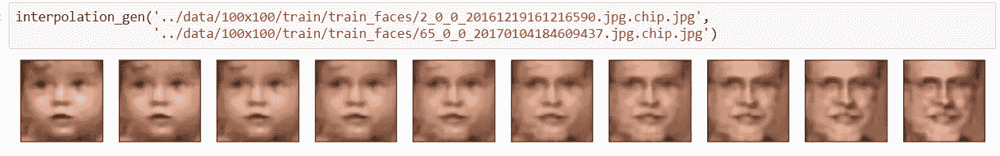

Interpolating between yound and old faces (between faces, not ages). More on how we did this below.

通过为一组图像找到好的编码(即嵌入)，你可以开始做我们在文字上做的那种“特征数学”，以酷的方式修改图片。以面部为例，模型可以被训练成包括诸如年龄、性别或面部是否戴眼镜之类的特征。然而，用于模拟人脸的神经网络(例如，autoencoder 或 gan)不同于用于模拟单词及其相互关系的数学类型(单词嵌入有 [word2vec](https://www.tensorflow.org/tutorials/representation/word2vec) 、 [gloVe](https://spacy.io/usage/vectors-similarity) 、 [fastText](https://github.com/facebookresearch/fastText) 、 [ELMo](https://allennlp.org/elmo) 、 [BERT](/nlp-extract-contextualized-word-embeddings-from-bert-keras-tf-67ef29f60a7b) 、 [XLNet](https://arxiv.org/abs/1906.08237) 等)。).

## 文献中激励人心的例子

将这种概念代数应用于图像有许多实际应用。从 snapchat 的性别交换过滤器(T1)到带有图像特征提取的面部匹配(T2)都有使用案例。这种技术的一个著名例子是 thispersondoesnotexist.com 的，它可以生成看起来很真实的高分辨率人脸照片。

我研究这个主题的动机是几年前亚历克·拉德福德在论文“深度卷积生成对抗网络的无监督表示学习”中所做的一些工作。打开 PDF，看看第 10 页。这是我脑子里的灯真正打开的地方。他们展示了如何通过将想法加在一起，使用神经网络有条件地生成人脸。我们在第 10 页看到,“戴眼镜的男人”减去“不戴眼镜的男人”加上“不戴眼镜的女人”的向量给了我们一张戴眼镜的女人的脸。这种做法很疯狂。这些加号和减号促使我不断了解这方面的进展。就是超级爽。

我稍后将讨论我们为本文构建的内容。首先更多的是关于已经存在的。最新和最伟大的作品是我现在想谈论的。看看[**whichfaceisreal.com**](http://www.whichfaceisreal.com/results.php?r=0&p=1&i1=realimages/35653.jpeg&i2=fakeimages/image-2019-02-17_211225.jpeg)看看你是否能检测出真实与脸部的照片。诀窍是密切注意图像的背景。虽然假图像超级逼真，但它们没有经过良好的训练来生成逼真的背景。生成器确实理解像眼镜的光学、反射、阴影等东西，但是它有时填充背景很差。

下面以视频的形式嵌入了三个即将推出的令人惊叹的项目。在第一个“基于文本的视频编辑”中，我们看到视频编辑将被大规模破坏，因为我们现在可以使用深度学习来编辑人们在视频中说的话。激励人心的例子是一份关于股票市场的报告。在第二个视频中，你看到“[现实神经说话头部模型](https://arxiv.org/abs/1905.08233v1)的少镜头对抗学习”，其中模型学习拍摄几张图片(帧)，并制作一个可以说话的模型(说话头部模型)。这篇论文使用了很多漂亮的技巧，比如元学习和现实主义分数。最后，第三个视频是关于学习和生成人脸的。作者使用了自己的数据集。这类似于我们下面使用自动编码器的方法。我们在项目中采用了一个可变自动编码器(VAE)，但这只是一个细节。他很好地解释了让模特学习低维人脸模型的概念。

Text-based Editing of Talking-head Video (SIGGRAPH 2019)

Few-Shot Adversarial Learning of Realistic Neural Talking Head Models

Face embedding with PCA

看了外面的样品，让我们做自己的事。

## 行动计划

对于本文，我们用于创建人脸嵌入的策略是通过训练卷积自动编码器。我们最终选定了一种可变自动编码器。它基本上是 zip 文件的机器学习版本:你拍摄一幅图像，将其压缩成少量数据，然后尝试使用这些数据来重新绘制原始图像。通过修改压缩数据，您可以调整模型重建图片的方式。该压缩数据成为图像嵌入。我们使用的代码是根据托马斯·德阿纳的优秀文章[修改而来的。](https://becominghuman.ai/variational-autoencoders-for-new-fruits-with-keras-and-pytorch-6d0cfc4eeabd)

我们使用了 [UTKFace 数据集](https://susanqq.github.io/UTKFace/)(参见[本文](https://arxiv.org/abs/1702.08423))，而不是像在原始文章中那样使用水果。它被许可用于研究，所以我们在这里，做研究。该数据集的主要优势在于，它包含正确裁剪的对齐人脸，并按种族、年龄和性别进行标记。

使用[自动编码器](/speaker-differentiation-using-deep-learning-68b2dede498f)，神经网络的输入和输出在训练期间是相同的。这基本上意味着神经网络需要学习压缩然后解压缩图像，在这样做的过程中，它学习了构成人脸的本质特征。如果它可以学习人脸，那么我们就可以使用训练好的模型来做一些很酷的事情，比如**生成新的人脸，在人脸之间变形，给人脸添加概念，比如添加眼镜，或者减去一个性别添加另一个，或者降低年龄，**等等。

你会在这篇文章中注意到，我们并没有试图通过贴标签来分类。相反，我们感兴趣的是对数据集中的数据(面孔)分布进行建模，并使用该模型用数学“做事情”。这是无监督学习中的想法:你从数据中学习，而不强迫模型学习数据的标签。

## 训练模型学习人脸

我和[玛丽·凯特·麦克弗森](https://medium.com/u/c1c775be8058?source=post_page-----568979737639--------------------------------)一起做这个项目，我们的第一步是在人脸数据集上训练自动编码器。该结构与原始文章相比几乎没有变化，只是增加了历元的数量，因为这对 faces 数据集有更好的结果。我花了整整两天的时间，试图根据我过去在音频方面的工作编写自己的卷积自动编码器，但结果不如汤姆的 VAE。正如我们在下图中看到的，重建的脸看起来相当不错，尽管肯定还是有些模糊。稍后我们会看到锐化滤波器可以帮助解决这个问题。

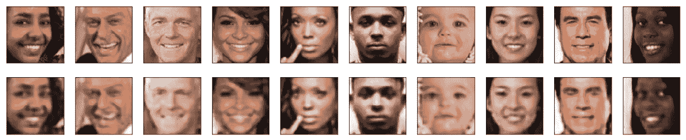

Face reconstruction using variational autoencoder. The first row is the input and the second is the resulting output.

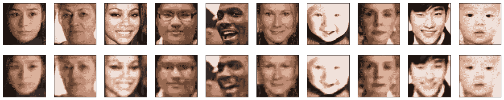

Another example of reconstructed faces.

And even more…

## 代数！对来自验证数据集的人脸进行实验

训练好模型后，是时候对模型没有训练识别的图片进行一些有趣的嵌入实验了。第一个实验是两张脸之间的简单插值。生成这个的等式只是平均两个人脸嵌入，每次迭代加权第二个脸多一点，第一个脸少一点。这得到了一些有趣的结果！

The CEO to CTO morph.

And the gif, for your viewing pleasure.

我们可以拉名人进来！

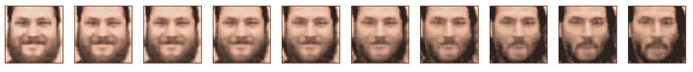

Me morphing into [Keanu Reeves](https://twitter.com/mrkreeves?lang=en). Because awesome!

下面是一张从我到基努过渡的 gif。看到脸是如何变化的很有趣。小胡子长得很迷人。有些地方有点起伏不定，但这是个好的开始。

The [Daniel Shapiro, PhD](https://medium.com/u/e7f791e64e83?source=post_page-----568979737639--------------------------------) to Keanu morph as a gif.

这是下一个合乎逻辑的步骤:

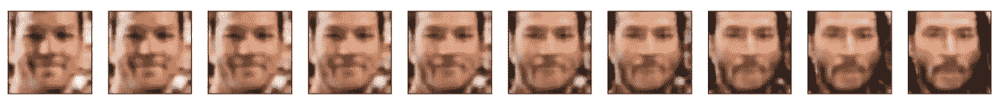

[Mathieu Lemay](https://medium.com/u/f84a70d8f74?source=post_page-----568979737639--------------------------------) to Keanu morph.

我们不得不多做一些，只是为了好玩。

The Sam to [Daniel Shapiro, PhD](https://medium.com/u/e7f791e64e83?source=post_page-----568979737639--------------------------------) morph. The beard gets weird as it grows in from the outside in and the inside out.

下一个实验是研究面部年龄。这个问题的总方程式是:

**“原始脸”——“原始脸年龄的平均脸”+“新年龄的平均脸”**

所以要把一个 35 岁的人变成一个 5 岁的孩子，你会说:

I = 35 岁的形象

a = 35 岁人脸嵌入的平均向量

n =岁人脸嵌入的平均向量

当你将向量 **i-a+n** 推入自动编码器的解码器时，你会得到原始人脸的娃娃脸版本。

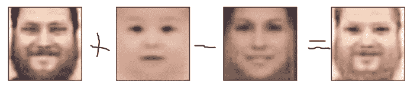

Baby face of me. It didn’t quite delete the beard.

这对于非常年轻的脸比非常老的脸更有效，因为图像的模糊性使得很难显示皱纹之类的东西。下图显示的是[马修·勒梅](https://medium.com/u/f84a70d8f74?source=post_page-----568979737639--------------------------------)变成了一个婴儿。

[Mathieu Lemay](https://medium.com/u/f84a70d8f74?source=post_page-----568979737639--------------------------------) morphing into a devil baby!

而这里是这个神奇过程的 gif:

Baby eyes do not look good on an adult’s face.

添加眼镜效果很好:

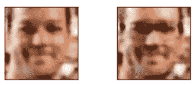

Adding glasses to [Mathieu Lemay](https://medium.com/u/f84a70d8f74?source=post_page-----568979737639--------------------------------).

它对我也有效:

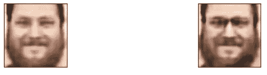

Adding glasses to me.

以下是山姆脸的变形，最大限度地增加了女性特征:

现在我们来谈谈如何生成全新的面孔。我们可以在嵌入空间中进行随机行走，得到这样的人脸:

这个模型似乎理解照明:

Animation of generated faces. You can see that the lighting is a concept the neural network seems to understand.

嵌入空间中附近的人脸看起来相似:

A smaller subset of the same pictures to show the similarity between images.

放大时，生成的面会非常细致:

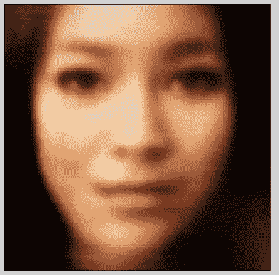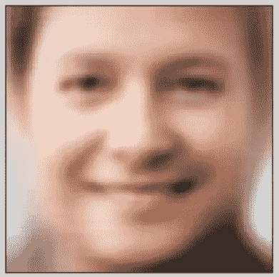

使用后处理步骤来锐化我们的面部生成器的输出看起来更加真实！想象面孔的锐化版本(一个男性；一名女性):

Before

After

Before

After

## 其他数据集呢？

回想一下，我们写过一篇关于[外服一代](/drawing-anime-girls-with-deep-learning-4fa6523eb4d4)和[的文章，Mary Kate MacPherson](https://medium.com/u/c1c775be8058?source=post_page-----568979737639--------------------------------) 想用她策划的数据集尝试这个模型。以下是在外服数据集上训练后的初步结果，动画特征之间的变形:

Waifu morph

一个生成的外服:

外服变形为 gif:

显示组成 gif 的每一帧:

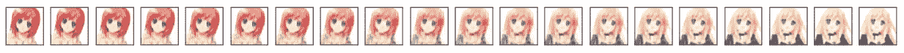

放大 gif，让您更清楚地看到细节:

## 结论？

我们有更多的材料，可能会进入第二篇文章。我认为这篇文章的结论是，我们可以在图像空间中进行数学运算，并像处理想法一样处理图像，包括年龄修改、面部变形、年龄修改、添加眼镜等功能(正如我们在 DCGAN 论文中看到的那样)、添加女性特征、生成面部、学习照明等等。我们看到这个想法也适用于动画角色，并且输出的真实感可以用经典的图像处理技术来提高，比如锐化滤波器。在本文中，您了解了无监督学习在人脸数据集上的一些背景和应用。如果你喜欢这篇文章，那么看看我的其他一些文章，比如“[如何为一个人工智能项目定价](https://medium.com/towards-data-science/how-to-price-an-ai-project-f7270cb630a4)”和“[如何聘请人工智能顾问](https://medium.com/towards-data-science/why-hire-an-ai-consultant-50e155e17b39)”嘿，[看看我们的简讯](http://eepurl.com/gdKMVv)！

下次见！

——丹尼尔
[Lemay.ai](https://lemay.ai)
[丹尼尔@lemay.ai](mailto:daniel@lemay.ai)