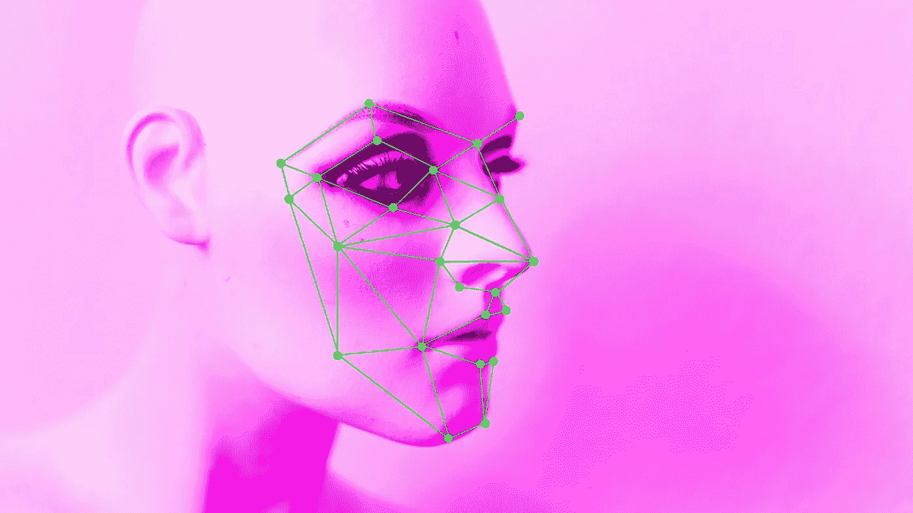
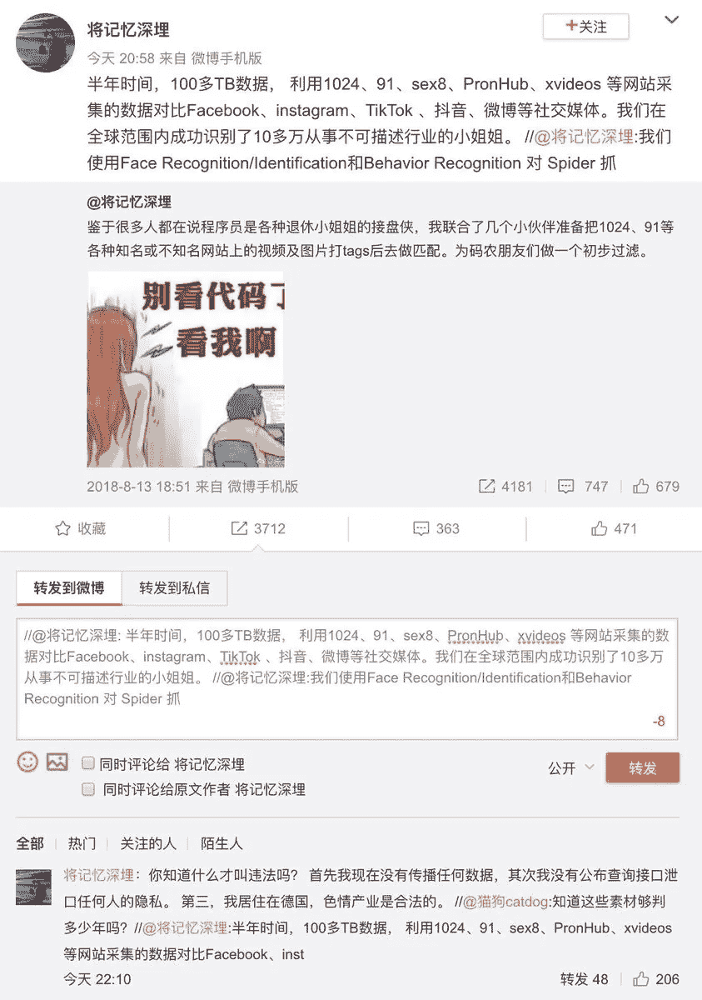

# 色情图片的面部识别仍然是一个糟糕的主意

> 原文：<https://towardsdatascience.com/facial-recognition-for-porn-is-still-a-terrible-idea-bb5dbb9c0281?source=collection_archive---------18----------------------->

(Adapted from Markus Spiske on Unsplash)

## 这个人是否真的建造了他声称建造的东西并不重要。

发生了什么事？几周前，一名在德国的中国开发者声称，他开发了一个应用程序，通过与社交媒体上的图像进行交叉检查，使用面部识别技术来识别网络色情中的女性。他的说法最初在中国微博平台微博上疯传，在评论帖子中引起了极大的兴奋。耶鲁大学法学院保罗·蔡中国中心的副研究员秦怡·傅将这个故事上传到推特上，并翻译给国际观众:

> 一名在德国工作的中国程序员表示，他和一些朋友已经识别出了来自世界各地的 10 万名色情女演员，将色情视频中的面孔与社交媒体上的照片进行交叉引用。目的是帮助其他人检查他们的女朋友是否曾出演过这些电影。''

她进一步报告说，根据最初的微博帖子，来自 PornHub 和 xVideos 等色情网站的超过 100 万亿字节的视频数据与来自脸书、Instagram、抖音、微博和其他社交媒体平台的个人资料图片进行了匹配，以确定 10 万名色情演员。

虽然没有人真正见过这款应用，自称为[徐莉](https://www.scmp.com/news/china/society/article/3013693/chinese-programmer-shuts-down-ai-project-detect-women-porn)的开发者的身份也未得到证实，但这个故事还是流传开来。毕竟是关于色情的。

(Screenshot: [Yiqin Fu](https://twitter.com/yiqinfu/status/1133215940936650754) on Twitter)

在微博上，徐莉向[主板](https://www.vice.com/en_us/article/9kxny7/diy-facial-recognition-for-porn-weibo)证实，他计划在接下来的一周发布一个“数据库模式”和进一步的“技术细节”。这从来没有发生过，因为他取消了他要回答媒体问题的直播。他删除了整个项目及其数据，这更可能是因为这个故事在网上引起的愤怒，而不是出于反省和更好的判断。

社交媒体上关于这个故事的许多讨论都围绕着这个应用程序是否曾经存在和工作过，这个团队在创建它的时候可能看过多少色情内容，以及他们是否有女朋友。不用说——我希望——这个角度分散了人们对将面部识别软件应用于色情内容的关注。

## 这个故事只是更广泛趋势的一个例子

有人会开发这样一款应用，这既不是不可能的，也不是不可能的。当我们根本不应该感到惊讶的时候，询问他们是否真的*开发了这个应用程序，以及它可能或可能没有多准确地工作是假装错误的怀疑。*

Motherboard 两年前就警告过这种用例，当时 [Pornhub](https://www.pornhub.com/press/show?id=1362) 和 [xHamster](https://xhamster.com/blog/posts/712562) 都开始使用面部识别技术来自动标记和分类他们的视频。他们称之为“等待发生的隐私噩梦”

还记得当 [FindFace](https://mashable.com/2016/05/03/facial-recognition-russia-shame-sex-workers/?europe=true) 被用于 dox 性工作者和色情演员，通过将他们的脸与俄罗斯社交媒体平台 [VK](https://www.theguardian.com/technology/2016/may/17/findface-face-recognition-app-end-public-anonymity-vkontakte) 上的个人资料进行匹配？

这个想法既不是新的，也不是原创的。

## 不是每个人都生活在强有力的数据保护立法之下

徐莉最初的印象是，他的项目不存在法律问题，因为他没有公开数据，而且性工作在德国是合法的。后者是正确的，但与个人(更糟糕的是，生物特征)数据的非自愿收集和处理没有什么关系。

[GDPR](https://eur-lex.europa.eu/legal-content/EN/TXT/HTML/?uri=CELEX:32016R0679&from=EN) 定义了许多处理个人数据的许可理由。在这种情况下，显然不存在同意，也不存在任何合同义务或公共利益。当唯一的兴趣是欺骗女性，以便男性可以验证他们的妻子和女朋友是否曾出现在色情作品中时，以合法利益为由立案似乎很困难。

在处理照片时，照片被视为特别敏感的生物特征数据

> "通过特定的技术手段对自然人进行独特的识别或认证."

对于那些生活在欧盟和其他保护公民免受这种剥削性数据使用的国家的人来说，这是一个好消息。但是色情和社交媒体平台吸引了全球用户。到目前为止，并不是每个地区都受到强有力的数据保护，而且执行现有的法规通常既耗时又昂贵。

在色情作品的合法性受到限制或不确定的国家，对表演者的影响尤其成问题，在色情作品中表演是非常可耻的，数据保护立法要么不存在，要么不够强大，无法保护这种特殊的使用情况。

## 性别监控是一个越来越大的威胁

最终，这个项目是关于识别、揭露、羞辱或骚扰从事色情表演的女性。根据 twitter 上的翻译，该应用程序的最初目的是为男性提供一种方法来验证他们的妻子和女朋友是否曾出现在色情作品中。

> "目的是帮助其他人检查他们的女朋友是否曾出演过这些电影。"

许多表演者使用艺名，这对于业余表演者和其他需要将自己的演艺事业与个人生活、家庭或其他职业分开的人来说尤为重要。通过面部识别的方式对他们进行 Doxxing 不仅是令人难以置信的侵犯和严重的隐私侵犯，也是性别化的监视。

而且也不是孤立事件。有针对性的在线骚扰既不是始于也不是止于 Gamergate，而是影响妇女和边缘化群体在网上表达自己的自由。所谓的 [stalkerware](https://www.vice.com/en_us/article/j5kdgd/dont-use-stalkerware-software-to-spy-on-your-spouse) 也是一种增长趋势。也就是说，软件直接或间接销售给虐待者，用于秘密监视配偶或前伴侣。对于任何想了解更多的人来说，Motherboard 在这个话题上有一个优秀的[系列](https://www.vice.com/en_us/topic/when-spies-come-home)。

当前关于 deepfakes 的争论是另一个恰当的例子。大多数关于 deepfakes 的研究和报道都集中在使用的方法和 T2 的政治含义上。诚然，这些都是重要的问题。但值得记住的是， [deepfake](https://www.washingtonpost.com/technology/2018/12/30/fake-porn-videos-are-being-weaponized-harass-humiliate-women-everybody-is-potential-target/?noredirect=on&utm_term=.028a2b9cd1c1) 视频技术的第一个主流用途是将女性的面孔插入[色情](https://www.vice.com/en_us/article/nekqmd/deepfake-porn-origins-sexism-reddit-v25n2)视频中，以骚扰和羞辱她们。

早在当代监控技术出现之前，女性的身体、参与、运动和自主权就已经受到男性和社会的监视和控制。但是，随着数据量的不断增加和机器学习的进步，性别化的监督出现了更多的方式并被放大，正如[监督](https://ojs.library.queensu.ca/index.php/surveillance-and-society/article/view/vaw/vaw)的[学者](https://books.google.co.uk/books?id=v7_FCQAAQBAJ&lpg=PT6&ots=a-eDeZbHRN&dq=facial%20recognition%20gendered%20surveillance&lr&hl=de&pg=PT16#v=onepage&q&f=false)多年来一直指出的那样。

## 最后，使用类似的算法“永远”也不是解决办法

在对他的项目的强烈反对声中，开发者后来补充道，这款应用也可以被女性用来识别复仇色情。虽然我怀疑这种事后的想法是出于对复仇色情受害者的真正关心，但这在技术上是真的。一种能够通过社交媒体识别色情演员的算法也将发现那些从一开始就不想参与色情活动的女性的档案。

然而，在实践中，风险大于潜在收益。发现复仇色情很少是主要问题。受害者更为挣扎的是从各自的平台上删除图像，在他们的家庭地址和电话号码被公布后的个人安全，通常随之而来的骚扰浪潮的创伤，执法部门的不重视，以及处理这种事件对家人、朋友和工作场所的影响。面部识别对此没有任何帮助。

保护数据，保护隐私，安全分享裸照，是对复仇色情最好的防御。教授和学习如何做这些事情比试图用面部识别软件修复复仇色情片更能利用任何人的时间。

Nicole Shephard 是一名独立研究员、顾问和自由撰稿人，她拥有性别研究博士学位和十年的技术和人力资源工作经验。她写了关于数据和技术的性别政治，以及工作场所的多元化包容。

*碎碎念:* [*@kilolo_*](https://twitter.com/kilolo_)