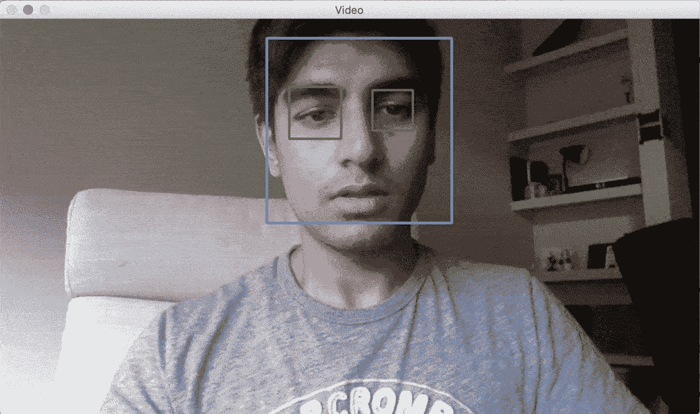

# 如何建立一个微笑探测器

> 原文：<https://towardsdatascience.com/facial-recognition-happiness-bbb3c4293d1d?source=collection_archive---------9----------------------->


Photo by [Nathan Dumlao](https://unsplash.com/@nate_dumlao?utm_source=medium&utm_medium=referral) on [Unsplash](https://unsplash.com?utm_source=medium&utm_medium=referral)

## 使用您自己的网络摄像头，并使用 OpenCV 检测快乐

## 用 Python 建立一个面部识别模型

## 1.介绍

企业努力提供最重要的产品:幸福。


src: [https://cutt.ly/HwrN0KU](https://cutt.ly/HwrN0KU)

为什么？快乐可能不仅仅是一种化学反应。一个快乐的顾客更有可能再次走进这扇门，关于快乐的数据可以帮助企业了解哪些产品会做得更好，并具有更高的保留率。机器可以学习识别快乐，在本教程中，我将向你展示如何创建一个可以识别快乐的面部识别模型。

让我们从基础开始。我们如何表达快乐？在脸上，大多是通过我们的眼神和笑容。当我们看到某人脸上的微笑时，我们会自然而然地推断出他是快乐的。微笑可以有很多变化，但它的形状大多类似于一种扁平的“U”形。

:)

在接下来的步骤中，我将放下我的代码，解释我是如何构建幸福探测器的。要理解算法背后的直觉，请查看之前关于 Viola-Jones 算法的文章。

**你需要什么来建造幸福探测器:**

*   蟒蛇导航员:[https://docs.anaconda.com/anaconda/navigator/](https://docs.anaconda.com/anaconda/navigator/)
*   OpenCV:[https://opencv.org/](https://opencv.org/)
*   哈尔瀑布(链接如下)


我在 Anaconda 上使用 Spyder，但是我想你也可以使用 Jupyter Nb。一旦你拥有了一切，就进入 IDE(代码编辑器)。

如果你使用 spyder，你应该有一个这样的屏幕。
在开始编码之前，请确保下载了 haar cascades(下一节)

## 2.哈尔瀑布


src: [https://cutt.ly/rwrN978](https://cutt.ly/rwrN978)

正如我在上面引用的文章中解释的那样，Viola-Jones 算法使用类似 haar 的特征来检测面部属性。级联是一系列过滤器，它们将一个接一个地应用，以通过面部特征来检测面部。

这些过滤器存储在 [Haar Cascade GitHub 存储库中它们自己的 XML 文件中。](https://github.com/opencv/opencv/tree/master/data/haarcascades)

为了构建我们的幸福探测器，我们需要这 3 个 XML 文件:
-[haarcascade _ eye . XML](https://github.com/opencv/opencv/blob/master/data/haarcascades/haarcascade_eye.xml)
-[haarcascade _ smile . XML](https://github.com/opencv/opencv/blob/master/data/haarcascades/haarcascade_smile.xml)
-[haarcascade _ frontal face _ default . XML](https://github.com/opencv/opencv/blob/master/data/haarcascades/haarcascade_frontalface_default.xml)

这些是脸部、眼睛和微笑的层叠。如果我们的形象是一张快乐的脸，我们必须具备这些特征。从每个链接中获取代码，将其放入文本编辑器中，并根据上面提到的名称保存文件。将所有三个 XML 文件放在同一个文件夹中，在这里您将启动一个 python 笔记本。现在我们有了 Haar Cascades，让我们来看看虚拟环境。

> — — — — — — —现在，终于到了开始编码的时候了。— — — — — — — —

## 3.导入 OpenCV 并加载级联

```
import cv2cascade_face = cv2.CascadeClassifier('haarcascade_frontalface_default.xml')cascade_eye = cv2.CascadeClassifier('haarcascade_eye.xml') cascade_smile = cv2.CascadeClassifier('haarcascade_smile.xml')
```

唯一需要导入的库是 OpenCV。尽管它是一个非常强大的对象识别工具，但它不是最强大的。有更新更好的，但 OpenCV 仍然提供了很多价值，是理解对象识别基础的好方法。
导入 OpenCV (cv2)后，我调用了下载的每个级联。为此，我只需要使用名为 *CascadeClassifier* 的 OpenCV 函数。

## 4.定义面部、眼睛和微笑的检测功能

```
def detection(grayscale, img):
    face = cascade_face.detectMultiScale(grayscale, 1.3, 5) 
    for (x_face, y_face, w_face, h_face) in face:
        cv2.rectangle(img, (x_face, y_face), (x_face+w_face, y_face+h_face), (255, 130, 0), 2) 
```

在为检测定义函数之前，您应该知道它将应用于单个图像，然后将这些图像放在一起以获得最终结果。

由于 Viola-Jones 算法适用于灰度图像，因此我将该函数的第一个参数输入为*灰度*。但是，我也希望最终输出的原始图像是彩色的，所以我为原始图像输入了另一个参数 *img* 。
接下来，我需要得到检测人脸的矩形的坐标。为了定义这些坐标，我取了 4 个元组:x，y，w，h.
x & y 是左上角的坐标，w & h 分别是矩形的宽度和高度。我将这些元组存储在变量 *face* 中，然后使用 OpenCV 的另一个函数*detect scale*来实际获取这些坐标。因此，我们使用我们的对象 *Cascade_face* 并将 *detectMultiScale* 方法应用于它，该方法具有 3 个参数:
-在 b & w
中分析图像时的灰度-比例因子 1.3(图像的大小将减小 1.3 倍)
-可接受的最小邻居区域数:5 个邻居。

接下来，为了实际绘制矩形，我创建了一个“for 循环”,在 faces 中有 4 个元组 x_face，y_face，h_face，w_face。在 for 循环中，我使用了 rectangle 函数，这是另一个 OpenCV 函数。这实际上在你的脸上画出了矩形，并给出了以下参数:
-‘img’因为我们希望矩形画在我们原始的彩色图像上。
-左上角坐标:x 和 y
-右下角坐标:w 和 h
-矩形颜色:我选择了偏蓝的颜色。
-矩形边缘的厚度:我选了 2。(这并不重要，但 2 是个不错的选择)

*注意:下面的代码是续篇(我已经把它们都放在底部了)*

```
 ri_grayscale = grayscale[y_face:y_face+h_face, x_face:x_face     + w_face] 
        ri_color = img[y_face:y_face+h_face, x_face:x_face+w_face]
```

现在我完成了面部，我要检测眼睛。这是唯一有点棘手和难以理解的部分。基本上，上面的几行提到你在面部寻找眼睛，因此面部成为我们的“感兴趣区域”。因为该算法适用于灰度图像，所以我们输入灰度的参数。但是，我也想得到彩色图像，所以我将为彩色图像添加另一个参数。
本质上，有两个感兴趣的区域:一个用于灰度图像，一个用于原始彩色图像。随后，我用矩形 y:y+h 和 x:x+w 的坐标范围在灰度图像上创建*ri _ gray*，然后，在彩色图像上，我用相同的坐标为矩形创建 *ri_color* 。

```
 eye = cascade_eye.detectMultiScale(ri_grayscale, 1.2, 18)

        for (x_eye, y_eye, w_eye, h_eye) in eye:
            cv2.rectangle(ri_color,(x_eye, y_eye),(x_eye+w_eye, y_eye+h_eye), (0, 180, 60), 2) 
```

对于眼睛，我对面部重复了第一步，用 *cascase_eye* 创建了一个名为 eye 的对象，并使用*detect scale*方法找到 4 个元组。我将比例因子改为 1.2，最小邻居数改为 18。(我不得不试验这些值以获得完美的结果)。

接下来，我也为眼睛创建了一个 for 循环。你可以复制粘贴前一个，只需要改变元组名称，并选择不同的颜色。

```
smile = cascade_smile.detectMultiScale(ri_grayscale, 1.7, 20) 
        for (x_smile, y_smile, w_smile, h_smile) in smile:
            cv2.rectangle(ri_color,(x_smile, y_smile),(x_smile+w_smile, y_smile+h_smile), (255, 0, 130), 2)

        return img
```

然后再次为微笑，我重复同样的步骤，我做了脸和眼睛。当使用*检测多尺度*方法时，我使用了 1.7 的比例因子和 20 的最小邻居。(就像我之前说的，这需要一些实验来弄清楚)。完成所有操作后，您只需返回原始框架。

## 5.在网络摄像头上显示输出

```
vc = cv2.VideoCapture(0)while True:
    _, img = vc.read()
    grayscale = cv2.cvtColor(img, cv2.COLOR_BGR2GRAY) 
    final = detection(grayscale, img) 
    cv2.imshow('Video', final)
    if cv2.waitKey(1) & 0xFF == ord('q'): 
        break vc.release() 
cv2.destroyAllWindows() 
```

我首先创建了一个名为 *vc* 的对象，并使用了来自 *OpenCV* 的*视频捕获类*。它只需要一个参数:0 或 1。如果您使用内置网络摄像头，则为 0；如果是外置网络摄像头，则为 1。

由于检测函数只对单个图像起作用，我现在必须创建某种循环来允许它对一系列图像进行检测。所以我开始了一个无限的 while 循环，稍后我将使用一个 *break 函数*来中断它。接下来的几行可能看起来有些混乱，但是基本上，VideoCapture 的 read 方法得到了两个元素:其中一个是来自网络摄像头的最后一帧。因为你只想要那个，所以使用 *_，img* ，因为 read 方法返回 2 帧，而你只想要这个。现在我需要从*视频捕获类*中调用这个方法。

我使用 *cvtColor* 函数将彩色 img 转换为灰度，因为它需要一个 b & w 帧用于检测功能。我称之为灰度，取 *cvtColor* 类，取 2 个参数:
-帧(img)
- cv2。COLOR _ BGR2GRAY 对蓝绿色红色进行平均，以获得正确的灰色阴影。
现在我创建了一个名为' *final* 的新变量，这将是 detect 函数的结果。在' *final* '中，我使用带有参数灰度和 img 的检测函数。

*imshow* 函数是另一个 OpenCV 函数，它允许我们用矩形动画查看来自网络摄像头的原始素材。它以动画方式显示处理过的图像。

然后我用另一个函数在我用完的时候关闭窗口。我应用了一个 *if 条件*，每当我按下键盘上的‘q’按钮时，它就会终止应用程序。这将中断 while 循环以结束该过程。
最后，我用*释放*的方法关闭摄像头，用 *DestroyAllWindows* 函数终止窗口。

我把我的完整代码粘贴在下面，以防上面的摘录有任何混淆。

## 6.结果

起初，有很多原因导致这个模型不起作用。它会把一张没有微笑的脸也检测为微笑。为了得到完美的结果，我不得不使用比例因子和最少的邻居。

