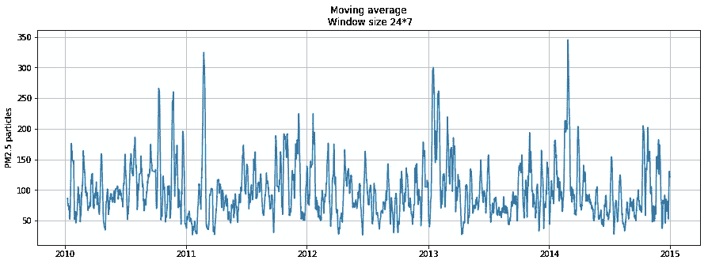
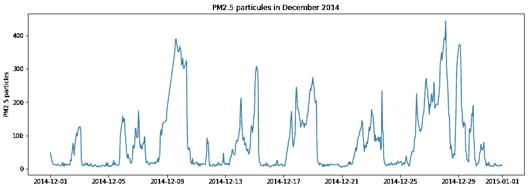

# 面对神经网络的 ARIMA 模型

> 原文：<https://towardsdatascience.com/facing-the-arima-model-against-neural-networks-745ba5a933ca?source=collection_archive---------10----------------------->

## 北京污染的时间序列预测


Photo by [Ling Tang](https://unsplash.com/@linglivestolaugh?utm_source=medium&utm_medium=referral) on [Unsplash](https://unsplash.com?utm_source=medium&utm_medium=referral)

**简介**

T 这个小项目的目的是通过 ARIMA 模型来评估它在单变量数据集中的表现。此外，它的性能将与其他技术进行比较，这些技术目前可用于使用神经网络创建时间序列预测。

将要使用的数据集属于 http://archive.ics.uci.edu/ml/datasets/Beijing+PM2.5+Data 的 UCI 知识库()

它每小时测量北京空气中的 PM2.5 含量。这个数据集带有其他信息，如该城市的气象数据。然而，由于本练习的目的是从单变量变量建立模型，因此不考虑其他信息。
我们将一步一步地介绍整个过程:从导入数据开始，获得一些见解，应用 ARIMA 模型，最后将结果与神经网络进行比较，以评估每个模型的性能。

(披露)
本帖由预测时间序列的不同方法组成。然而，这些方法中没有一个是完美的，因为没有完美的方法来预测未来，所以这些结果应该小心对待，并总是听取专家的建议。

如果你要找的代码在 Jupyter 笔记本里[这里](https://github.com/miguelTorresPorta/TimeSeries/blob/master/timeSeries.ipynb)

# 理解数据

正如我之前提到的，这个数据集包含了关于北京空气中 PM2.5 (ug/m)浓度的信息。

这些是漂浮在空气中的直径小于 2.5 微米的颗粒。
([https://www . who . int/news-room/fact-sheets/detail/ambient-(outdoor)-air-quality-and-health)](https://www.who.int/news-room/fact-sheets/detail/ambient-(outdoor)-air-quality-and-health))
世界卫生组织声明，接触这些颗粒物会导致心血管和呼吸系统疾病以及癌症。他们估计，这种空气污染在 2016 年每年导致 420 万人过早死亡。

# 探索性数据分析

快速浏览一下数据，看看我们需要处理什么。


关于第一个图，我们可以看到，在每年的年底和年初，PM2.5 颗粒的浓度高于一年中的其他时期，但它仍然是模糊的数据，我们几乎无法更好地了解实际发生的情况。因此，需要进行一些转换，以便能够更深入地了解我们的数据。有许多工具可用，这里我们只使用两个，但是还有许多其他工具可以提供更好或不同的见解。

**按不同时间段分组**

第一种方法简单到按周或月计算数据测量的平均值。


Weekly average.


Monthly average,

正如我们从图中看到的，我们使用这种方法从数据中获得的信息不是很清楚。

**移动平均线**

这一次，我们仍将使用平均值，但方式不同，使用移动平均值，计算 N 个给定时间步长的平均值。它将平滑数据，让观众推断出一些可见的模式或趋势。


Weekly Moving average



在最后这张图中，我们可以清楚地发现一些规律。然而，这些方法对异常值非常敏感，正如我们在第一张图中看到的，我们的数据中有许多异常值。

请注意这两种转换的区别，因为它们看起来相似，但并不相同。在平均值中，我们只计算每周的平均值，在移动平均值(MA)中，我们计算 N 个滞后观察值的平均值。不过，第二种方法更有用，因为它可以帮助我们平滑数据，去除噪声。

**第一个结论**

尽管数据中似乎有许多异常值，但我们从数据中得不到任何明确的信息。人们可以认为这些异常值是与任何种类的故障相关的设备的错误测量。然而，做一些研究我们会发现，这些水平已经达到，并记录在中国的首都。

[](https://www.theguardian.com/world/2013/jan/13/beijing-breathe-pollution) [## 如果你要去北京，最好的建议是:不要呼吸

### 由于测量污染的仪器打破所有记录，儿童和老人被敦促留在室内

www.theguardian.com](https://www.theguardian.com/world/2013/jan/13/beijing-breathe-pollution) 

**离最后几周越来越近**

到目前为止，我们评估的数据看起来相当混乱，由于这个小项目的目标是应用不同的预测技术，我们将在整个数据集的最后四周集中精力。通过这样做，可视化将变得更容易，我们将清楚地看到预测如何符合我们的数据。



The caption of the last four weeks

在数据的分布中，我们可以看到大多数数据都分组在第一个值中，看起来像指数分布。


在这个数据集中，有 716 个粒子浓度的测量值，大约一个月的数据。平均每小时 78 个粒子。这种方法被认为是不健康的，人们不应该长时间暴露在这些水平下。

**平稳性**

在应用任何统计模型之前，检查我们的数据是否被认为是平稳的是很重要的

平稳性基本上意味着均值和方差等属性不会随时间而改变。
([https://www . ITL . NIST . gov/div 898/handbook/PMC/section 4/PMC 442 . htm](https://www.itl.nist.gov/div898/handbook/pmc/section4/pmc442.htm))

有各种方法来检查数据是否是平稳的，一种好的方法是 Dickey-Fuller 测试，该测试表明，如果 p 值低于给定的阈值，则认为它不是平稳的。

**测试迪基-富勒**


正如我们用 Dickey-Fuller 检验证明的那样，幸运的是，我们的数据是稳定的，这意味着它没有任何趋势，因此不需要任何转换，我们可以直接应用 ARIMA。

有时时间序列是非平稳的。对于这些情况，可以对数据进行变换，使其保持不变。

# ARIMA

在通过 ARIMA 之前，我们将拆分有助于我们训练模型的数据，然后评估它与测试数据集的准确性。

```
train_dataset = last_weeks['2014-12': '2014-12-29']
test_dataset = last_weeks['2014-12-30': '2014']
```

训练数据集有 29 天的数据，测试集有 2 天的数据。

分割数据集的目的是因为模型必须用一些标记数据进行测试，这意味着要看预测如何接近真实数据。

ARIMA 代表自回归综合移动平均线。它用于时间序列预测。

它包含三个不同的组件。自回归将时间序列回归到自己身上，综合(I)成分是为了校正数据的非平稳性。最后一个分量移动平均(MA)根据过去的误差对误差进行建模。

每个分量接收不同的参数 AR(p)，I(d)，MA(q)。为了估计每个参数的值，我们需要得到自相关函数(ACF)和偏自相关函数(PACF)

**自相关函数(ACF)和偏自相关函数(PACF)**

这个函数将告诉我们在时间序列中观察值的相关程度。

此外，主要目的是让我们知道哪些是在 ARIMA 模型中使用的最佳系数。

在我们的例子中，是 PACF 的模式(在第一或第二个滞后期有显著的相关性，随后是不显著的相关性)。PACF 中显著相关的数量告诉我们自回归(AR)模型的术语。在我们的例子中，系数是 3。

然而，基于 ACF 的模式(函数逐渐减少)，我们无法推断移动平均线(MA)的项，因此最佳选择是使用零。


**应用 ARIMA**

第一个图显示了我们数据的残差，我们可以观察到大部分数据分布在零附近。让我们更详细地看看这是如何分布的。


正如我们所见，它具有与正态分布或高斯分布相似的形状(对称钟形曲线 **)** 。

**得到一些预测**

现在是时候从模型中获得一些预测，以评估我们的模型有多准确，我们将使用我们制作的测试数据集。
此外，我们需要执行滚动预测，这意味着在计算每个预测后添加它并重新计算模型。


Predictions compared with the test dataset

在上面的图中，我们可以看到测试数据的结果，看起来非常吻合！

**评估**

计算均方误差以获得精度

MSE: **338.9**

# 神经网络

现在将应用神经网络模型，具体来说，我们将使用递归神经网络

**递归神经网络(RNN)**

RNN 是一种神经网络，主要用于自然语言处理和时间序列预测。这些类型背后的基本思想是每个神经元的状态被存储并反馈给下一层。这就是为什么它在 NLP 和时间序列中如此使用的原因，因为它在计算上一个观察值时预测下一个观察值。

有一种类型的 RNN 被称为长短期记忆，它被提出来解决所有 RNN 提出的一个巨大的问题，这被称为消失梯度问题，但我们不打算进入这种细节。这就是我们需要知道的应用于数据集的全部内容。

这一部分将比前一部分短得多，因为基本上应用神经网络比应用 ARIMA 模型更容易

为了举例，我们将在最后四周工作。

此外，用于训练和测试网络的数据集将是相同的，以便正确地比较这两个模型。

为了在我们的网络中有更好的准确性，我们需要首先标准化我们的数据值。

现在我们的数据集在 0 和 1 之间。


递归神经网络根据 X 个滞后观测值预测新的观测值。对于我们的例子，让我们试着用 168 个滞后的观察值来得到一个新的预测。

现在是时候创建神经网络的架构了！我们将使用 Keras，这是一个流行的框架，它是在 tensor flow(Google 发布的神经网络库)之上制作的。Keras 之所以如此出名，是因为它让建立网络的任务变得非常容易。

现在是时候创建神经网络的架构了！我们将使用 Keras，这是一个流行的框架，它是在 tensor flow(Google 发布的神经网络库)之上制作的。Keras 之所以如此出名，是因为它让建立网络的任务变得非常容易。

**网络的架构**

我们的网络由 LSTM 层构成，它包含五层，每层有 100×200×300×200×100 个神经元。
我用掉线来提高精度，减少历元后的损失。
为了计算网络的损耗，我使用了和之前一样的损耗函数，均方误差(MSE)函数。

```
regressor.fit(X_train, y_train, epochs = 100, batch_size = 32)
```

现在，该模型符合我们的训练数据集模型，是时候创建预测了。


幸运的是，看起来预测很好地符合真实值，但是 MSE 告诉了一件不同的事情。

MSE: **409.1**

看起来我们有一个赢家，因为我们可以看到神经网络的结果比 ARIMA 得到的结果更差！

# 结论

D 在这个实际案例中，我们看到了许多不同的事情，这些事情是从统计模型和时间序列操作的不同概念(不同的变换、时间序列的平稳性、自相关函数)开始的。接着是一个统计模型(ARIMA)和应用于我们特定数据集的递归神经网络。

我们可以看到，与神经网络提供的 **409.1** 相比，ARIMA 对我们的测试集表现更好，具有更小的均方差 **338.96** 。

还有一些其他的东西可以尝试，但是对于这个有大约 720 个观察值的特定数据集，代价是统计模型！

**未来项目**

一旦理解了这一点，首先想到的是将相同的方法应用于整个数据集(超过 41000 个观察值)。在这里，我们将看到哪一个在数据量更大的情况下表现更好。

下一步(仍然使用相同的数据集)是使用其他变量来创建预测。一开始，我们去掉了大约 7 个不同的变量，这些变量包含了我们模型中没有用到的有价值的信息。

我们也可以改进神经网络的结构，直到我们达到一个最佳点。还有另一种统计模型，如季节性 Arima (SARIMA ),也许可以改进这些指标。

最后，所有这些研究的目的是从数据中提取有用的见解，在我们的例子中，这将是关于北京的 PM2.5 水平。

…但是让我们在新的帖子中看到所有这些东西。

# 参考

[https://towards data science . com/an-end-to-end-to-end-project-on-time-series-analysis-and-forecasting-with-python-4835 e6bf 050 b](/an-end-to-end-project-on-time-series-analysis-and-forecasting-with-python-4835e6bf050b)

[https://towards data science . com/forecasting-exchange-rates-using-ARIMA-in-python-f 032 f 313 fc 56](/forecasting-exchange-rates-using-arima-in-python-f032f313fc56)

[https://www . ka ggle . com/ber hag/CO2-emission-forecast-with-python-seasonal-ARIMA/data](https://www.kaggle.com/berhag/co2-emission-forecast-with-python-seasonal-arima/data)

[https://machinelingmastery . com/ARIMA-for-time-series-forecasting-with-python/](https://machinelearningmastery.com/arima-for-time-series-forecasting-with-python/)

【https://www.udemy.com/deeplearning/ 