# 因素分析 101

> 原文：<https://towardsdatascience.com/factor-analysis-101-31710b7cadff?source=collection_archive---------8----------------------->

## 我们能减少数据集中的变量数量吗？


Not related to Factor Analysis at all.

尽管这是对因子分析的介绍，但我假设读者具有一些数学和统计学知识，并且希望了解多元统计分析。这篇文章将集中在对因子分析的理论理解上，因此我将省略与这个主题相关的代码——除了一个简单的 R 说明。

如果你喜欢这篇文章并想了解更多，请务必关注我的简介 ！

# **我们在谈论什么？**

在现实生活中，数据往往遵循一些模式，但从数据分析开始，原因并不明显。因素分析的基本目的是用一些潜在的和*不可观察的*随机成分来描述几个变量之间的协方差关系，我们将这些成分称为*因素*。

我们将假设变量可以通过查看它们的相关性来分组。也就是说，假设特定组中的所有变量彼此之间具有高相关性，但是与其他组中的变量具有低相关性。在这种情况下，我们可以把每组变量看作是一个单一的基本结构的代表，或者是一个因素，它负责观察到的相关性。

例如，来自包括英语、数学和生物分数的变量组的相关性可能来自潜在的“智力因素”,而代表健康分数的另一组变量可能对应于另一个潜在因素。
因子分析是主成分分析(PCA)的延伸。两个模型都试图逼近协方差矩阵**σ**，但是因子分析质疑数据是否符合某种规定的结构。如果你没有听说过 PCA，我推荐这篇用 R:

[](/principal-component-analysis-pca-101-using-r-361f4c53a9ff) [## 主成分分析(PCA) 101，使用 R

### 一次提高一个维度的可预测性和分类能力！使用 2D 图“可视化”30 个维度！

towardsdatascience.com](/principal-component-analysis-pca-101-using-r-361f4c53a9ff) 

# 所以让我们来看看数学！

矩阵形式的因子分析模型为:

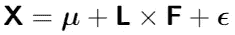

**X** 是一个可观测的随机向量，有 *p* 个分量，均值向量 **μ** 和协方差矩阵**σ**。因子模型说 **X** 是*对少数 *m* 个不可观测随机变量的线性依赖*，

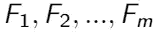

称为*的公因子*和 *p* 的变异源，

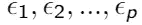

称为*误差*或特定因素。系数 *l* _ *ij* 称为变量 *i* 对因子 *j* 的*加载量*，这样矩阵 **L** 就是因子加载量的*矩阵(我用“_”表示小写字母)。
具体因素*I*ϵ*_*I*只与 *i* 变量 *X* _ *i* 关联。 *p* 偏差、


用随机变量 *p* + *m* 表示，

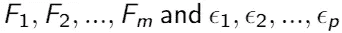

这些都是不可观察的。这就是因子模型与多元回归模型的不同之处，在多元回归模型中可以观察到独立变量。
所有这些不可观察的成分都带来了一些复杂性。如果我们有不可观察的成分，我们不能直接验证因子模型，但是通过对 **F** 和 **ϵ** 的一些假设，模型实现了协方差关系，我们可以尝试解释它们。

然后我们将假设 **F** 和 **ϵ** 的平均值和协方差为:

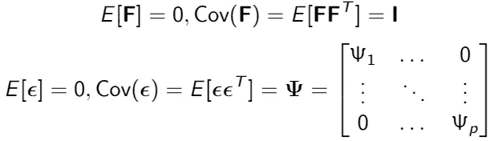

且 **F** 和 **ϵ** 是独立，所以 Cov( **ϵ** ，**f**)= e(**ϵf**’)= 0。
这里的 Cov( **ϵ** )包括**ψ**是每个变量的*唯一性*，即不能用任何因子解释的方差的量。

如果不可观测的随机向量 **F** 和 **ϵ** 满足这些条件，我们就有了一个具有 *m* 个公因子的因子模型:

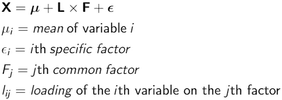

该模型的协方差结构为:


因子模型在公因子上是线性的。如果 **X** 与底层因素的关系不是线性的，那么上面的协方差结构是不充分的。

## 但是等等，还有更多！

第 *i* 个变量由 *m* 个公因子贡献的方差比例称为 *i* 第*个公因子*，h _i .因特定因子而产生的 Var(X _*I*)=σ_*ii*的比例就是唯一性或特定方差。我们将会看到:

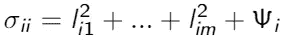

(即 Var(X_i) =公度+特定方差)
或者说

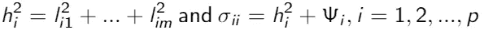

第 *i* 个公因子则是第 *i* 个变量在第 *m* 个公因子上的负载的平方和。

# 最大似然估计

如果共同因素和特定因素可以假设正态分布，我们可以使用最大似然法的因素负荷和具体的变化。似然函数并不漂亮，这里就不收录了，但是要明白它取决于 **L** 和**ψ**通过**σ**=**ll**^t+**ψ**。由于对 **L** 有许多选择，所以没有定义这个模型，这就是唯一性条件的用处:

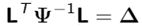

这是一个对角矩阵，它确保了一个最大值，因此可以找到^ **L** 和^**ψ**的估计值(我将在字母前使用^来表示“帽子”运算符)。
从这里开始，第 *j* 个因子中包含的总方差的比例可以用估计的载荷来解释。这里的问题是因子载荷的最大似然解受到唯一性条件的限制，并且在因子旋转之前很难看到它们的清晰模式。

## 我说的旋转是什么意思？

我们的结构是*正交*(例如，如果两个向量形成 90 度角，则认为它们是正交的)。因子载荷的正交变换(因此意味着因子的正交旋转)称为因子旋转。如果^ **L** 是估计的因素负荷矩阵，那么

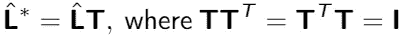

是“旋转”载荷的矩阵。估计的协方差矩阵保持不变，这种旋转可以给出更简单的结构，并使因子更容易解释，就像显微镜一样。分析解决方案是 Varimax 标准(Google it ),它选择正交变换来实现最大化。因子旋转尤其适用于 MLE 的估计，因为它使用了唯一性条件。

# 太好了！我们躲过了理论部分，所以让我们看看 r 中的一个例子。

好的，那么我们刚刚花了 10 分钟读了什么？处理多维数据可能会很困难，所以如果我们能“削减”维度的数量，我们就能使数据更容易查看，并且我们可以主观地尝试解释潜在的因素。

我们将看看你能得到的奥林匹克十项全能数据(约翰逊和威彻恩，第 499 页)

```
od.data <- read.table("http://static.lib.virginia.edu/statlab/materials/data/decathlon.dat")
```

**编辑:**如果您是第一次尝试，如果您没有添加矩阵翻译，您将会得到一个错误。这通过以下方式实现:

```
od.data <- as.matrix(od.data)
rownames(od.data) <- colnames(od.data) <- c("100m","LJ","SP","HJ","400m","100mH","DS","PV","JV","1500m")
```

首先让我们尝试 3 个因素。输出是:

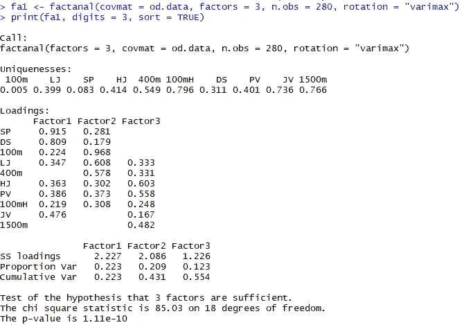

默认情况下，`factanal`提供 ML 估计和 Varimax 旋转。
首先是独特性。它代表早期的^**ψ**。如果唯一性很高，方差就不能用任何一个因子来描述，因此命名为唯一性或特定方差。这不能用一些潜在的因素来解释。这是 1500 米跑的情况，反之亦然。如果我们从 1 中减去唯一性，我们得到公度，然后它会告诉多少方差是由 3 个因素解释的。

负载代表之前的^**l**。我对数据进行了分类，我们可以很容易地看到推铅球(SP)和铁饼(DS)相对于因子 1 中的其他变量具有较高的负荷，这意味着该因子的名称“臂力”。具体来说，这意味着例如推铅球与因子 1 的相关性为 0.915，与其他两个因子的相关性较小。

我们还对“累积 var”感兴趣，即解释的方差的累积比例，它应该是一个“高”数，其中高是主观的。我们可能应该尝试拟合 4 个因子，因为我不认为 0.554 那么高，我们可能会做得更好。最后的低 p 值也拒绝了 3 个因子就足够的假设。
现在的输出是:

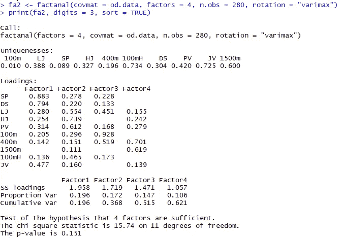

这看起来更有希望。4 个因子就足够了(根据 p 值),我们已经成功地将变量的数量从 10 个减少到 4 个。对这些因素的解释是主观的，我们不能明确地给它们命名，但是通过查看变量的高相关性，一个好的猜测可能是“臂力”、“腿力”、“速度/加速度”和“跑步耐力”。标枪和 100 米栏有很高的独特性，不适合任何一个因素。可能在因素 1 和因素 2 中各有一点。

最重要的部分是找到因子的个数。从这里开始，你可以使用估算和旋转的方法，并锐化显微镜的焦点，但这并不重要。

# 结束语

Johnson 和 Wichern 指出“绝大多数尝试的因素分析没有产生明确的结果。”(第 526 页)不能保证因素分析会导致对有意义因素的满意描述。如果你发现自己对因子分析的结果感到困惑，因为它似乎没有“工作”，很有可能你没有做错什么，因子分析只是没有发现任何有趣的东西。

此外，如果你试图测量诸如“智力”、“同情心”或“潜力”之类的数量，因素分析可能会导致争议。这些量很难测量，它们能对我们知道可以测量的事件负责吗，比如 SAT 高分？因子分析无法回答这个问题。
因素分析的质量更多地取决于“哇”的标准，因为质量还没有量化，如果你能说“哇，我理解这些因素”,那么应用程序可能已经成功了。

正如我之前所说，累积方差是一个主观的衡量标准，很难知道 0.621 是好是坏，直觉上，60%可能不是那么好。
无论哪种方式，如果您能够将维度从 50 减少到 8(或者在我们的情况下从 10 减少到 4)，它可以帮助您更好地探索您的数据，并通过了解变量之间的协方差使其更易于管理。

请记住，这纯粹是介绍性的，不应该是一个结论或详尽的分析。如果我错过了什么或者做错了什么，请随时纠正我(我可能就是这样)。有许多不同的方法来处理多元数据，因子分析甚至比本文讨论的范围还要多。

如果你喜欢这篇文章并想看更多，请务必关注我的简介**！**