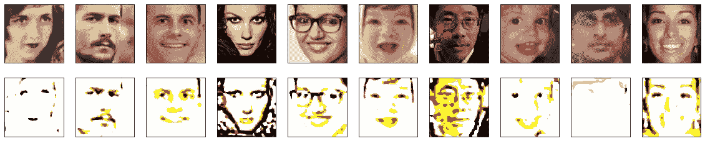
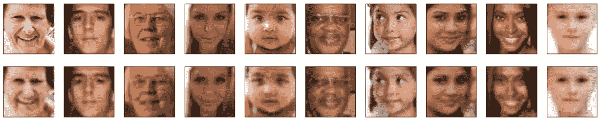
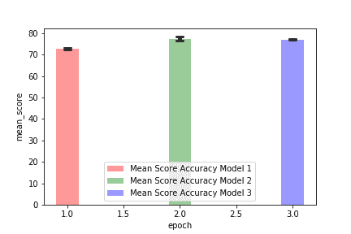
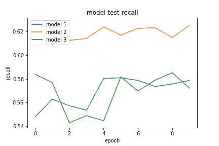
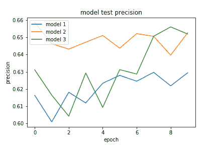
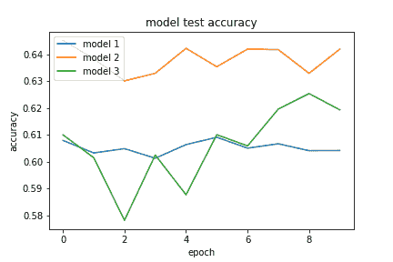
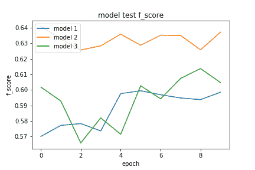
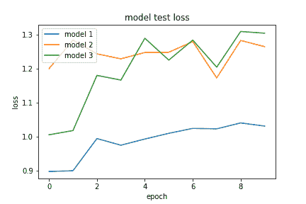

# #失败:人工智能是一门科学

> 原文：<https://towardsdatascience.com/fail-artificial-intelligence-is-a-science-6e543b135193?source=collection_archive---------26----------------------->

## “我没有失败。我刚刚发现了一万种行不通的方法。”—爱迪生

## 科学突破界限，与失败密不可分

科学很乱。我不认为科学领域之外的人欣赏失败与成功的比率。在我的工作中，我经常无法完成一个想法。有时模型不起作用。有时候这个想法是错误的。有时候想法需要改变。人工智能更多的是实验和迭代，而不是从纸面到生产建立强大而清晰的解决方案。

> 科学的巨大悲剧——美丽的假设被丑陋的事实扼杀。赫胥黎

科学有一个基本的方面叫做零假设。如果你在发展你的想法时没有机会接受零假设，那么，简单地说，你不是在做科学。人们做了许多实验来尝试观察以太，但都是徒劳的，因为根本不存在以太。同样，仅仅因为你有一个关于人工智能的优雅应用的想法，并不意味着它会成功。这只是意味着你有一个假设要测试。

在本文的下一部分，我将与你分享我得到的两个负面结果。希望分享这些糟糕的结果会让你更好地了解人工智能科学如何导致失败，以及如何为此做好准备，做出反应，并度过难关。

## 无监督学习机器

监督学习和非监督学习之间的区别是非常基本的:监督学习模型学习(被训练)将输入映射到输出，而在非监督学习中，任务是学习没有标签的数据的底层分布。这些方法的区别不是本文的重点，所以请记住，无监督学习是关于学习事物如何工作，而不是学习将它们放在什么盒子里。如果有创造性的许可，我会说无监督学习的目标是学习本身的行为；为了了解数据集的东西，模型显示。

# 失败介绍(第一部分):面向嵌入的 CAE

在最近的一些研究工作中，我一直试图建立一个卷积自动编码器(CAE)来学习人脸的嵌入。简而言之，我试图找到有意义的小向量来代表人脸的图像。为什么？下面是最近一个令人振奋的使用人脸嵌入来生成内容的例子:

我最初的动机是上面描述的工作的前身 DCGAN 论文。参见本文 (DCGAN)第 10 页和第 11 页[的图 7 和图 8，了解为什么人脸嵌入如此酷。CAE 能做和 DCGAN 一样的事情吗？](https://arxiv.org/pdf/1511.06434.pdf)

下面是 2017 年的一个视频，展示了 DNN(密集)自动编码器和 PCA 的基本概念，促使我相信 CAE 应该可以工作( [2018 更新此处](https://youtu.be/p7k86wwUoJg)):

去年我[和一些同事在 CAE 上发表了一篇关于处理多麦克风音频信号的论文](https://ieeexplore.ieee.org/document/8646307)，所以我有足够的背景来尝试这些想法。不要管 CAE 模型是如何工作的，我突然意识到一张图片胜过千言万语，图像是展示神经网络正在学习什么的一个很好的媒介。那么为什么不用 CAE 代替 GAN 来学习人脸嵌入呢？CAE 应该是在将图像压缩到某个瓶颈尺寸后，将图像重建回原始图像。我的假设是，这将对我的面部图像“有效”。我抓起一个相当不错的[人脸图像数据集](https://susanqq.github.io/UTKFace/)，开始编写 CAE 程序。

大约在这个时候，我正在阅读一篇名为“[ASR 的无监督调制滤波器学习方法的比较](https://pdfs.semanticscholar.org/7d54/893d9ed0eb33fc9db1accc2dd1365e24f679.pdf)的相关论文，其中提到了无监督学习的几种模型(GAN、CAE 和其他网络)。这个想法是，几种类型的模型可以用来学习无监督的数据结构。这给了我一些信心，如果语义图像嵌入，CAE 可以做 GANs 正在做的事情。

让我们看看在最初的模型开发之后，在我的第一天模型训练中，学习过程是什么样子的。下面视频中的第一行是输入人脸图像，输出中的第二行(用于测试数据，而不是训练数据)看起来应该是相同的:

我可以看到这个模型学到了一些东西，并且随着时间的推移变得越来越好。请注意，各通道的输出处于饱和或截止状态:白色表示 3 通道饱和，黄色表示 2 通道饱和(红色=255，绿色=255，蓝色=0)，黑色全为 0，依此类推。没有像 123 或 65 这样的中间像素值，只有 0 和 255。随着时间的推移，亏损在减少，但回报却在减少，约为 0.5。所以我尝试了更长的训练时间，批量标准化，tanh 激活而不是 sigmoid，不同大小的网络和瓶颈，不同大小的图像，以及许多其他方法。以下是第二天的结果:

第三天:

在这一点上，我准备扯掉我的头发，把我的电脑扔出窗外。我采用了和 GAN 论文一样的方法，比如批量标准化，但是失败得很惨。我平行进行实验，并开始拉拢同事加入我失败的探索。这让我恍然大悟。也许我的想法有点离谱。让我们后退一步。为什么不用 VAE 或甘来代替 CAE 呢？

## 改变我的想法:VAE 或者别的什么怎么样？

我不得不面对这样一个事实，我的 CAE 方法和基本上我所有的工作都没有成功，我不知道为什么。我有一些想法，但不知道哪里出了问题。放弃几天的工作不是一种好的感觉，但我不得不接受零假设，即我的 CAE 在重建用于语义嵌入操作的人脸图像方面不够好。GAN 在这项任务中很受欢迎，因为它们确实有效(例如 DCGAN)，我只是花了几天时间尝试做一些最终无效的酷事情。也许变型自动编码器(VAE)会更好地工作？这就是文献所指出的…

在这最低谷的时候，我收到了玛丽·凯特·麦克弗森的回信。她不仅让 CAE 模型工作，她的 CAE 代码看起来几乎和我的代码一模一样。在这一点上，我回过头来对自己说，真的有很多方法可以不做灯泡。这是她几个小时训练后的结果:

Results for [Mary Kate MacPherson](https://medium.com/u/c1c775be8058?source=post_page-----6e543b135193--------------------------------)’s efforts of literally a few hours.

这里学到的经验是，有时候你真的不应该放弃，你绝对应该和聪明人在一起。归根结底，这都是她的事。**就编程而言，我的努力失败了**，但通过一些协作和合作，我们能够取得胜利。我计划写一整篇单独的文章，只是关于有效的东西，作为我和[玛丽·凯特·麦克弗森](https://medium.com/u/c1c775be8058?source=post_page-----6e543b135193--------------------------------)关于[产生深度学习的动漫女孩](/drawing-anime-girls-with-deep-learning-4fa6523eb4d4)的文章的后续。

Morphing from baby picture to picture of me, using deep learning.

# 另一个巨大的失败(第 2 部分):增长神经网络

我正与 Herschel Caytak 博士合作一个项目，我们正在研究在训练期间发展一个深度神经网络的好处。NVIDIA [报道了一些惊人的结果](https://research.nvidia.com/publication/2017-10_Progressive-Growing-of)在训练中使用这种技术生长 GAN 以获得越来越大的输出图像。这里有一个 [github 仓库，里面有一些使用 keras 的类似代码](https://github.com/MSC-BUAA/Keras-progressive_growing_of_gans)。同样，这都与面孔数据有关。

在我们遇到的几个资源中讨论了在训练期间发展神经网络，但是在我们所有的谷歌搜索中，我们无法找到一篇论文证明使用像 keras 这样的现代工具对密集网络(不是 CNN/GAN)的方法的优点。我们在这里谈论的不是遗传算法或其他增长神经网络的随机方法。相反，这种想法是将未经训练的神经元添加到已训练的网络中，训练新的更大的网络，然后再次这样做。在这项工作中，我们也对问题之间的迁移学习不感兴趣。我们狭隘地专注于在任何给定数据集上的分类器训练期间发展深度神经网络的好处(或坏处)。

人们对这种不断发展的神经网络想法已经思考了很长时间。对 2000 年之前的方法的一个很好的回顾是[这个](http://citeseerx.ist.psu.edu/viewdoc/download?doi=10.1.1.103.6196&rep=rep1&type=pdf)。文献中也有许多评估生长神经网络的讨论和想法。例如，参见基于[这篇研究文章](https://arxiv.org/pdf/1708.01547v2.pdf)的[这篇博文](https://hackernoon.com/dynamically-expandable-neural-networks-ce75ff2b69cf)中的“动态网络扩张”。这仍然是一个研究课题，你可以从这个 Quora 帖子中看到。更多[此处](https://www.quora.com/Is-it-possible-to-dynamically-add-neurons-to-a-neural-network-in-the-process-of-training)。

定性地说，一层一层地生长神经网络解决了需要调整的参数太多的问题。它允许在小型网络上进行学习，然后当网络通过增加一层而增长时，网络的大部分参数在一个良好的位置开始，用于训练过程的下一部分。理论上，这是一个好主意，因为添加到神经网络的每一层都可以构建更细粒度的特征，这些特征映射到之前训练的层的一般化。然而，现代反向传播是不可思议的。我们真的能从培养神经网络中获得任何好处吗？这里的无效假设是，从零开始训练一只 DNN 犬和这种奇特的分层训练一样有效。

对于卷积神经网络(CNN)来说，发展神经网络的想法可以解释为[检测总体特征，然后构建激活越来越精细特征的层](/boost-your-cnn-image-classifier-performance-with-progressive-resizing-in-keras-a7d96da06e20)。

我们遇到的问题是缺乏这种方法的科学证据，特别是缺乏 DNNs 的证据。仅仅因为某些东西可以编译，并不意味着它比传统的好方法更好。种植全连接的 DNN 怎么样？我们能拒绝零假设，即发展一个网络和仅仅训练一个大网络是一样的吗？每次训练迭代都按层宽增长网络怎么样？或者可能是通过高度(层数)的方式？证据的缺乏导致我们进行了这里描述的实验。

值得注意的是，生长神经网络与我们对生物神经网络的理解完全不同，在生物神经网络中，网络[往往会被修剪](https://en.wikipedia.org/wiki/Synaptic_pruning) +具有[关键期](https://en.wikipedia.org/wiki/Critical_period_hypothesis)。在生物神经网络中学习新事物可能涉及[招募现有神经元形成新回路](https://www.ncbi.nlm.nih.gov/pmc/articles/PMC5479701/)，但让我们避免陷入关于皮层竞争的讨论，并专注于最初的问题:当训练 DNN 时，我应该尝试培养它吗？值得吗？

令人沮丧的是，我们去年对这个想法做了一些测试，但没有成功。原来我们有一个编程错误。这一次我们又试了一次，但更加小心。对消极的结果做好准备。现在我们开始吧…

## 增长神经网络指标

更快并不意味着更好。例如，我们知道 Adam 比 SGD 训练得更快，但 SGD 在测试数据上比 Adam 做得更好(来源)。同样，在这项工作中，我们检查了增长神经网络对标准测试数据性能的影响。

我们使用标准指标(准确度、精确度、召回率、f1 分数和损失曲线)对 DNNs 进行全面评估和比较。

## 增长 NN **数据集**

我们使用 Colab 笔记本来运行我们的模型(我们使用该平台的动机是通过使用 GPU 选项进行硬件加速来加速模型训练)。我们使用导入的 panda 库将 UCI 机器学习库中的 [covertype 数据集](https://archive.ics.uci.edu/ml/datasets/Covertype)导入到一个数据框架中。该数据集由与林地特征相关的 54 个类别(特征)中的 581012 个数据点的未缩放定量和二进制数据组成。分类任务是为给定的观测值(30 x 30 米像元)预测位于北科罗拉多州罗斯福国家森林的四个荒野地区的森林覆盖类型。森林覆盖类型名称是 1-7 范围内的整数。

## 生长神经网络过程

在数据摄取之后，我们将数据集分成“状态”信息(特征)和类。我们使用 MinMaxScaler(从 sklearn.preprocessing 导入)将所有特性缩放到范围 0–1，并对类进行一键编码。对数据维度的快速检查显示，x(要素)具有(581012，54)的形状，y(类)具有(581012，8)的形状。我们将数据分为 20/80 的测试训练，这意味着该模型将对 80%的数据进行训练，并对其余 20%的数据测试/验证其预测。K-fold 交叉验证用于以 3 种不同的方式随机分割数据，这确保了训练测试分割在整个数据集的许多组合中发生，消除了与不均匀采样和有偏数据相关的问题。

## 成长 NN **模型准备**

分类任务是使用 3 种不同的模型实现的，这 3 种模型的区别仅在于层结构(数量、宽度和可训练层)。我们使用“分类交叉熵”和“adam”分别作为模型损失和优化器。模型性能是使用验证数据集(模型未被训练的数据)测量的，测量的具体指标是丢失、准确度、精确度、召回和 f 分数(请参见此处的[和此处的](https://machinelearningmastery.com/how-to-calculate-precision-recall-f1-and-more-for-deep-learning-models/)和[了解这些指标的含义以及如何计算它们的详细解释)。](https://scikit-learn.org/stable/modules/model_evaluation.html#classification-metrics)

**生长神经网络基础模型 1**

初始模型由 3 层组成。第一层采用 x 特征(54)的形状，然后数据被传递到宽度为 30 的完全连接的第二层。添加脱落层(0.5)，随后是宽度为 25 的另一层。随后是另一个脱落层(0.5)，该脱落层连接到宽度为 8 的最终输出层。我们对输入层和隐藏层使用“relu”激活函数，对最终输出层应用 softmax 函数。训练设置为 10 个时期，批量大小为 128。

**包含冷冻基础模型 1 的生长神经网络模型 2**

第二个模型由第一个模型组成，在网络的输入端增加了另外两层。经训练的第一模型从 HDF5 扩展文件加载。我们通过将先前模型的可训练属性设置为假来“冻结”加载的第一个模型。附加层的宽度分别设置为 100 和 54，激活功能设置为 relu。(第一层被选择为模型宽度的任意但合理的增加。选择第二层是为了与冻结层的输入层的尺寸正确对接。)

**生长神经网络模型 3**

最后，我们生成了第三个模型，该模型在大小和设计上与模型 1 和模型 2 的组合 DNN 相当。模型 3 由完全可训练的层组成。评估所有 3 个 dnn 的性能指标，以查看将预训练模型作为更大模型的一部分进行重用和冻结是否有优势。

## 成长 NN **观察与讨论**

结果如下图所示:

**Figure 1: Bar Chart of K-fold mean accuracy with standard deviation error bars**

**Figure 2: Model recall (left), precision (center) and accuracy (right) for test data**

Figure 3: Model f-score (left) and loss (right) for test data

这些实验的结果非常有趣，尽管有些不确定。我们最初的零假设是，与在单个步骤中训练较大模型相比，使用预训练模型作为较大模型中的冻结层不会提供任何优势。

图 1 显示，所有模型都达到了相似的平均准确度水平。模型 2 似乎具有最高的平均准确度，但是误差线的大小表明模型之间的差异不太可能具有统计学意义。

参见图 2 和图 3，第二个模型在召回率、准确度和 f 值方面表现最佳。然而，图表结果仅针对单个 k 倍迭代显示，并且如前所述，可能不具有统计显著性(所有条形图值在图 1 中处于大约相同的高度，因此要有所保留)。

在任何情况下，我们都可以看到，上面显示的结果并没有否定使用冻结预训练模型的潜在效用，尽管任何优势都可能很小，并且可能不保证实现这一想法所需的努力。看起来那里可能有什么东西，但如果有，那也很小。我称之为否定结果。需要进行更多的研究来确定种植 DNNs 是否是一个好主意，但是到目前为止，运气不好。

## 结论

在这篇文章中，你看到了人工智能研究人员日常生活中的一些负面结果和极度沮丧。人脸嵌入和生长神经网络肯定是真实的，而且肯定很难。是科学，科学很乱！

如果你喜欢这篇文章，那么看看我过去最常读的一些文章，比如“[如何给一个人工智能项目定价](https://medium.com/towards-data-science/how-to-price-an-ai-project-f7270cb630a4)”和“[如何聘请人工智能顾问](https://medium.com/towards-data-science/why-hire-an-ai-consultant-50e155e17b39)”嘿，[加入我们的简讯](http://eepurl.com/gdKMVv)！

下次见！

——丹尼尔
[Lemay.ai](https://lemay.ai)
[丹尼尔@lemay.ai](mailto:daniel@lemay.ai)