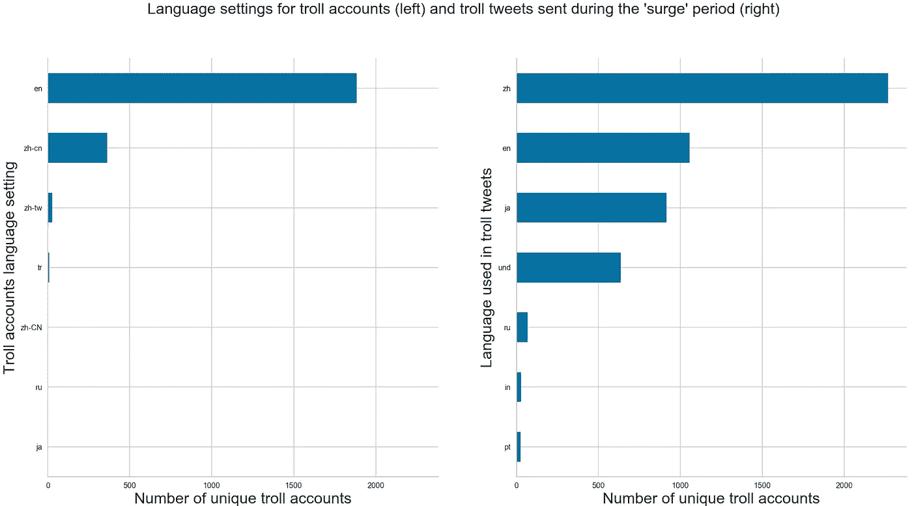
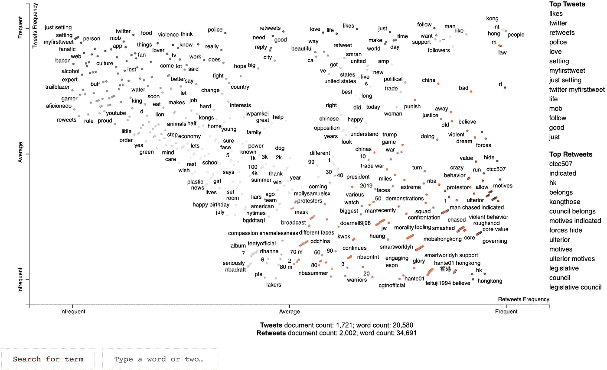

# 失败的激增:分析北京在推特上的虚假信息运动激增

> 原文：<https://towardsdatascience.com/failed-surge-analyzing-beijings-disinformation-campaign-surge-on-twitter-b376aed812ed?source=collection_archive---------35----------------------->

## 随着香港紧张局势从 2019 年 5 月开始急剧加剧，中国加强了在社交媒体上的造谣活动。具有讽刺意味的是，这很可能为 Twitter 最终关闭该操作埋下伏笔。


Bar chart race showing the surge in Chinese state Twitter troll account creation. Online version [here](https://public.flourish.studio/visualisation/704815/).

当[推特首次揭露中国针对香港抗议运动的虚假信息活动](https://blog.twitter.com/en_us/topics/company/2019/information_operations_directed_at_Hong_Kong.html)时，还不完全清楚北京在该平台上的操作最初是如何被发现的。

这家社交媒体公司暗示，不寻常的知识产权活动可能泄露了北京的比赛。根据 Twitter 的新闻稿，Twitter 在中国被禁止，但据报道，来自中国的 troll 帐户使用 VPN 和未封锁的 IP 地址访问该服务。

但在查看 Twitter 于 2019 年 8 月 19 日发布的第一批约 360 万条推文时，没有明显的联系。这一批 890 个巨魔账户中的大部分都是在 2017 年或更早的时候创建的，他们的活动在 2017 年达到顶峰，特别是在当年的 11 月和 12 月([在我之前关于这个主题的中型帖子](/target-hk-a-quick-dive-into-chinas-disinformation-campaign-on-twitter-2b64ab9feb1a)中对这第一批的图表和分析)。

现在，谜题的主要部分终于出现了。9 月 20 日，在首次发布声明一个月后，Twitter 发布了第二批与中国政府针对香港抗议运动的造谣活动有关的推文。

在大约 1020 万条推文中，我发现 2019 年 5 月至 7 月期间，中国国家巨魔的活动明显激增，这是香港政治紧张局势急剧升级的时期。我认为，讽刺的是，这种“竞选热潮”可能是该网络在 Twitter 上拉响警报并被关闭的关键原因之一。

根据我的分析，一些主要数据如下:

*   **第二批 4301 个巨魔账户中有 54%(2320 个)是在 2019 年 5 月至 7 月间创建的。请记住，Twitter 现在是一个传统的社交媒体平台，不再经历指数级的用户增长。像这样的账户创建量激增是不可能躲过 Twitter 的注意的，尤其是在服务被屏蔽的中国。下面图表的互动版本可在[这里](https://github.com/chuachinhon/twitter_hk_trolls_cch/tree/master/charts)获得。**


It wasn’t clear from the first set of Chinese troll tweets how the clandestine network came to Twitter’s attention only in 2019\. Details from a second tranche, on the right, finally gave us a major clue.

*   在香港，当重大政治声明或暴力冲突在部分地区发生时，新 troll 帐户创建的峰值日期就在或接近关键里程碑。巨魔账户单日创建量最大的一次是在 6 月 14 日——在 [**香港行政长官林郑月娥暂停引渡法案**](https://www.scmp.com/news/hong-kong/politics/article/3014669/hong-kong-leader-carrie-lam-backs-down-over-extradition) **的前一天，这引发了抗议**。巧合还是协调？我也不知道，但这个时机值得注意。


*   名义上，在这一“激增”期间，中国官方巨魔账户发出了 87，369 条推文和转发。但事实上只有 27192 条独特的推文，这表明许多账户都在转发对方的推文，或者是来自主要钓鱼者的推文。

**这段时间的推文/转发主要是中文的，英文推文仅占 69，402 条州政府推文的 6%，即 3，723 条，在过滤后的子集**中，我删除了与逃亡的中国亿万富翁郭文贵进行口水战的推文。下面图表的互动版本可在[这里](https://github.com/chuachinhon/twitter_hk_trolls_cch/tree/master/charts)获得。


The difference in the volume of English Vs Chinese troll tweets during this surge period is stark. Did someone in the disinformation campaign decide that they had already lost the battle for the hearts and minds of those who read in English?

*   中国在大陆禁止 Twitter 的决定带来了一些意想不到的后果。由于禁令，一些负责操纵 Twitter 的政府官员对这个平台并不熟悉，导致了一些滑稽的“noobish”行为。

例如，在创建时，43 个新的中国国家巨魔账户继续发出默认的第一条推特——“只是建立我的推特。# myfirstweet”——正如 Twitter 所建议的那样，然后继续转发主要巨魔的消息(@RuthMiller916、@eituji1994 和@bindarsou 在中国国家巨魔的第二批推文中出现得相当突出)。

以下是一个名为“qdu af1 S3 zcbagxgqdzla 3+cxvr 4 TP 5 ssciebdrqqinws =’”的巨魔账户(其用户名被 Twitter 散列)的推文示例:

```
'Just setting up my Twitter. #myfirstTweet',
       '打扮好。恋爱去~🤣🤣🤣 https://t.co/jR3VqsJvtG',
       'RT @RuthMiller916: //醒一醒！唔好再用「是你教我和平示威是沒用」、去為自己暴力衝擊的違法行為合理化！//\n\n【短片】【堅守底線】馬逢國提醒示威者和平表達是公民責任、籲傳媒不要模糊社會道德規範：仲有幾多警員手指可以被咬斷？\n#HongKong #HK #香港…',
       'RT @feituji1994: 冲击警方，扔砖块，扔铁棍，用铁棍殴打警察，这哪还是普通市民，明明就是一群暴徒！此时此刻，那些沉默的大多数难道还要继续沉默？！所有热爱香港热爱家园的人都应该站出来，谴责暴徒，驱逐暴力，支持港警，守护家园！ #HK #HongKong #香港 #逃…',
       'RT @bindarsou: 「反修例」游行中頻頻發生的暴力事件，顯然不是偶然事件，而是有組織有預謀的事件。參與「反修例」的港人應當擦亮眼睛，看清披着「民主」外衣下丑陋而險惡的用心。一腔愛港熱血固然重要，但是是非必須明辨，正邪必須分清，應應當徹底與禍亂香港的暴動分子分清界限。#…'
```

另一个巨魔账号“yuaz 3 l 8 su 2 izeg 7d 7m cdpoxc 2 vavji 5 crbpudsg 8s 08 = "发推文:

```
'Just setting up my Twitter. #myfirstTweet',
       'RT @feituji1994: 那些游行示威的人要求香港民主、法治，殊不知自己的暴力行为，才真正破坏了香港法治的核心价值！😡😡😡😡😡#HongKong #HK #antiELAB #香港 #反修例 https://t.co/4SIu5Upsr9',
       'RT @feituji1994: 说好的理性、和平示威！暴徒却以伞为剑狂殴警察！哪个国家的警察可以被如此对待？！香港的混乱、荒诞让人震惊！#HongKong #HK #香港 #逃犯条例 #沙田示威 #游行 https://t.co/sZXGhfAYfu',
       'RT @feituji1994: 总是把自己包装的很“正义”，是“自由”、“民主”的代言人！看看香港人是怎么说的？！那一小部分人不能代表香港，他们只是最卑微“暴徒”！#HongKong #HK #香港 #逃犯条例 https://t.co/rg4bOvDzh1',
       'RT @feituji1994: 回顧 #香港 修例以來，頻繁 #遊行 到修例壽終正寢，到處處充斥著暴力破壞，到無辜民眾被毆打，到立法會、中聯辦被衝擊，國徽被玷污！反修例只是藉口，不顧民眾安危，搞亂香港，推動顏色革命呼之欲出！境外的黑手，#反對派 的醜惡，暴露無遺！熱愛香港的人…',
       'RT @feituji1994: 穿黑衣、戴头盔的年轻人，竟是反对派会议召集人毛孟静儿子？\n 请全城市民认清他们的真面目！有法律界人士指，示威者已犯暴动、刑事毁坏两项罪名，每罪的最高刑罚均是 10 年监禁。支持警方严正执法，尽快将暴徒绳之于法！\n#搗亂 #立法會 #暴動刑毀 # 毛孟…',
       'RT @bindarsou: 當學校開始給學生洗腦，煽動他們荒廢學業轉而上街遊行時，這個城市還有未來嗎？\n 這不僅是學校的問題，家長也是很關鍵的一環。為人父母，放任子女自甘墮落，這難道就是所謂的自由嗎？長此以往，香港如何進步？\n#香港清醒點吧 https://t.co/eS0Zk…',
```

这条默认的“设置我的 Twitter”信息是 Twitter 的联合创始人兼首席执行官杰克·多西在 2006 年 3 月 21 日发出的著名的“第一条推特”的变体。在他们的行动被推特揭露后，这些巨魔会很快发出他们最后的推文。

这是我分析中国政府针对香港抗议活动的虚假信息系列文章的第三篇。我将在下面的小节中更详细地解释我的方法。我之前关于这个主题的帖子是这里的和这里的。

# **数据和回购**

这里是这个项目的[回购](https://github.com/chuachinhon/twitter_hk_trolls_cch)，和这个帖子的[笔记本](https://github.com/chuachinhon/twitter_hk_trolls_cch/blob/master/notebooks/3.0_Beijing_Surge_cch.ipynb)。由于文件大小的原因，它不太可能在 Github 上正常显示。您最好下载或克隆 repo 并在本地机器上运行它。不过警告，由于大量使用交互式图形，运行笔记本电脑的计算成本很高。

CSV 文件太大，无法上传到 Github 上。[直接从 Twitter](https://about.twitter.com/en_us/values/elections-integrity.html#data)下载。

# **中国国家巨魔推文的两个部分的广泛比较**

在过滤第二部分巨魔推文以关注“激增”时期之前，我首先在广泛的层面上比较了两组:


The second tranche of Chinese state troll tweets released by Twitter was larger by far, comprising 10.2 million rows of data compared to 3.6 million for the first tranche.

在第二批推文中，独立用户的数量要高得多，这提供了从哪里开始挖掘的第一个主要线索——在这种情况下，是账户创建日期。北京行动背后的政府巨魔可能做了两件事之一:获得更多现有账户，或大量创建新账户。后者是国家支持的虚假信息运动的一个主要迹象，比如我们看到俄罗斯在 2016 年总统大选前在美国发动的运动。

# TROLL 帐户创建日期的比较

中国巨魔推文的第二部分不仅在各个方面都更大，而且如右边的第二张图表所示，2019 年创建了大量可疑的新账户。从 5 月到 7 月的峰值远远超过了我们在第一批中国巨魔推文中看到的(左):


2019 年 5 月至 8 月期间创建的 2，320 个账户占第二批 4，301 个 troll 账户总数的近 54%。北京可能认为，面对香港不断升级的紧张局势和抗议活动，它必须加大宣传力度。

但这很可能适得其反，因为 Twitter 的监控团队不可能没有注意到在一个禁止 Twitter 的国家有数量可疑的大量账户***(Twitter 称这些账户来自[【中国】](https://blog.twitter.com/en_us/topics/company/2019/info-ops-disclosure-data-september-2019.html))。***

# 分析“激增”账户

由于时间和资源的限制，我选择重点分析 2019 年 5 月至 8 月期间创建的中国国家巨魔账户。然而，第二批中的一些顶级巨魔是在更早的时候被创造出来的。

对整个第二阶段的深入研究将不得不留给资源更充足的研究机构。以下是我发现的第二部分的一些有趣特征:

**A .语言设置，使用的推文语言**

这两个部分的全部推文包括多种语言，如印度尼西亚语，充满了体育、色情、全球政治等垃圾内容。

但在“激增”阶段，虚假信息运动背后的中国机构似乎更专注于创建主要设置为英文和中文的巨魔账户。这些新的巨魔账户也主要以中文和英文发布推文，如下表所示:



**B .推文活动**

正如所料，在这个“激增”时期创建的巨魔账户在 7 月份的推文/转发次数最多，当时街头抗议和冲突升级到了前所未有的水平。让我们更详细地分析一下:


在 7 月份大约三分之一的时间里，每天至少有 400 个巨魔账户在发微博。峰值出现在 7 月 9 日，当天有 420 个巨魔账号在发推/转发。

值得注意的**7 月 9 日发生了什么:** [**香港特首林郑月娥宣布引渡法案已经胎死腹中**](https://www.channelnewsasia.com/news/asia/hong-kong-protests-carrie-lam-extradition-bill-dead-withdraw-11703542) **她的政府在立法方面的工作已经“彻底失败”**。

我将推文的分布进一步分解为具体的日-小时-分钟时间框架。您可以点击此处下载下面[图表的互动版本，了解详细的细分信息:](https://github.com/chuachinhon/twitter_hk_trolls_cch/blob/master/charts/surge_tweets.html)


Medium doesn’t make it easy for interactive charts to be embedded directly, so best to download the repo and run this chart on your browser. Hover over the specific data points to see the detailed timings for when the troll tweets peaked.

# **对“激增”推文的分析**

对推特的完整语料库进行详细而严格的内容分析超出了我的能力范围。我建议**也单独看一下转发**的内容，因为它们通常反映了这些流氓及其老板试图传播的关键信息。

一个简单的术语频率表也再次证实了一个主要的巨魔帐户的影响作用— @ctcc507，又名梦想新闻。请注意，在“激增”期间，该账户的网名出现在英语转发中最常用的 50 个术语列表中的显著位置:


以下是其他巨魔账户转发的@ctcc507 推文的快速样本:

```
RT @ctcc507: Governing Hong Kong by law is the core value of Hong Kong. We don’t allow anyone to run roughshod over the law. [https://t.co/P…',](https://t.co/P%E2%80%A6',)
       'RT @ctcc507: The legislative council belongs to the people of Hong Kong.Those people with ulterior motives indicated by forces hide behind…',
       'RT @ctcc507: The legislative council belongs to the people of Hong Kong.Those people with ulterior motives indicated by forces hide behind…',
       'RT @ctcc507: Governing Hong Kong by law is the core value of Hong Kong. We don’t allow anyone to run roughshod over the law. [https://t.co/P…',](https://t.co/P%E2%80%A6',)
       'RT @ctcc507: Governing Hong Kong by law is the core value of Hong Kong. We don’t allow anyone to run roughshod over the law. [https://t.co/P…'],](https://t.co/P%E2%80%A6'],)
```

@ctcc507 仅在这个小子集就被转发了 465 次。上面的例子清楚地表明了巨魔账户想要发送的信息。在转发的其他地方，我们看到巨魔继续宣扬外国干预香港抗议的阴谋论(几个“别有用心”的变体排在最前面)。

为了处理中文推文中的大量文本，我只关注了 7 月份的推文。然而，那个月的中国推文是激增期间迄今为止最大的一块，由大约 35，000 条推文组成。就像英文巨魔的内容一样，转发占据了中文巨魔推文的大部分。

中国“原创”推文中的热门词汇:

```
反 對       314
社 會       277
對 派       248
反 對 派     248
瘟 龟       215
行 為       191
瘟 鬼       183
破 壞       178
香港 嘅      160
穩 定       158
香港 法治     151
佢 哋       148
严惩 暴徒     131
香港 警察     126
遊 行       120
嚴 懲       117
一定 要      116
應 該       114
维护 香港     108
勢 力       105
嘅 行       104
香港 和平     103
中 國       102
```

中文转发热门词汇:

```
逃犯 条例            8182
香港 逃犯            7951
香港 逃犯 条例        7299
逃犯 条例 游行        6132
条例 游行            6132
香港 逃犯 条例 游行    5695
護 香港              4751
遊 行                4535
社 會                4257
反 對                4131
游行 暴徒             3885
守 護                3738
逃犯 条例 游行 暴徒    3354
条例 游行 暴徒        3354
反 對 派             3153
對 派                3153
守 護 香港            3011
```

What I’ve noticed from the term frequency counts above and a weekend of looking through the tweets is the higher usage of terms condemning the protestors who turned violent. The term 暴徒 (violent thugs) and the call to punish the violent protestors (严惩 暴徒) came up more prominently in the second tranche of tweets, compared to the first.

但需要更全面的内容分析来确认这是否确实反映了虚假信息运动中“叙述”焦点的变化。

# **散点图**

我之前曾[用散点图来可视化中国国家巨魔推文的第一部分](/hkprotest-visualizing-state-troll-tweets-from-chinas-disinformation-campaign-1dc4bcab437d)。我感觉这种图的视觉价值第二次没有那么高，但我把这些图留在了笔记本上，以便在图的左下角找到有用的搜索功能。

如果您下载了 [html 文件](https://github.com/chuachinhon/twitter_hk_trolls_cch/tree/master/charts)，您可以使用搜索框轻松找到与所需搜索词相关的推文和转发，如“别有用心”。这对未来的研究很有价值。



然而，当你试图从一个大的中文文本语料库中创建散点图时，产生的文件是巨大的，并且在消费级计算机上实际上是不可用的。

所以出于实际原因，我选择只关注第二批国家巨魔推文中的两个顶级巨魔——[@ bindar sou](http://twitter.com/bindarsou)和 [@hk_observer](http://twitter.com/hk_observer) 。这两条微博都被不太活跃的“巨魔”账户定期转发，共转发了约 4.5 万条。 [@bindarsou](http://twitter.com/bindarsou) 是两个账户中最大的一个。


快速重新解读散点图:

## 颜色

*   图表中的单词根据它们之间的联系被涂上颜色。蓝色的与原创推文联系更紧密，而红色的与转发推文联系更紧密。每个点对应一个提到的单词或短语。

## 定位:

*   Words that appear frequently in both tweets and rewteets, like “香港”(Hong Kong) and “暴力”(violence), appear in the upper-right-hand corner, reflecting Beijing’s main line of criticisms against the protests.
*   靠近图顶部的单词代表“原始”推文中最常用的单词。

# 关键领域:

*   左上角:这些词经常出现在推文中，但不在转发中。
*   右下角:同样，在转发中频繁出现的词，而不是推文出现在右下角。

嗯，这大概是像我这样的“公民数据分析师”可以投入到这种分析中的时间。像往常一样，如果你发现任何错误，ping 我@

推特: [@chinhon](https://twitter.com/chinhon)

领英:[www.linkedin.com/in/chuachinhon](https://www.linkedin.com/in/chuachinhon/)

我早期的关于国家的项目[推特上的虚假信息运动](/using-data-science-to-uncover-state-backed-trolls-on-twitter-dc04dc749d69):[https://github.com/chuachinhon/twitter_state_trolls_cch](https://github.com/chuachinhon/twitter_state_trolls_cch)