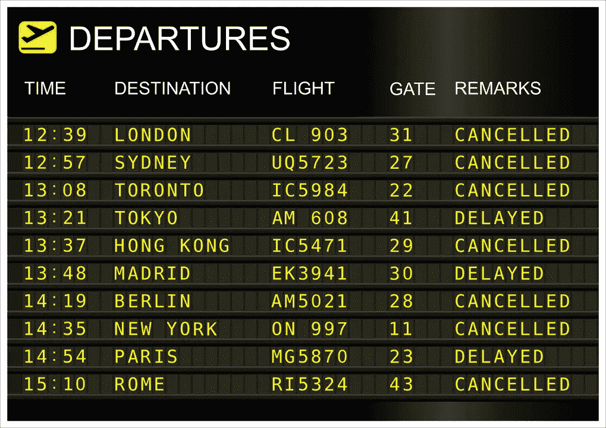
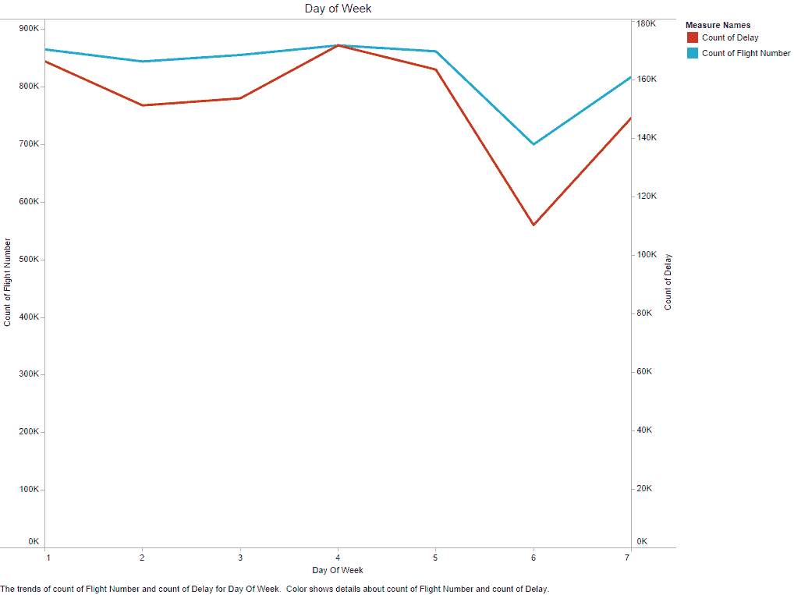
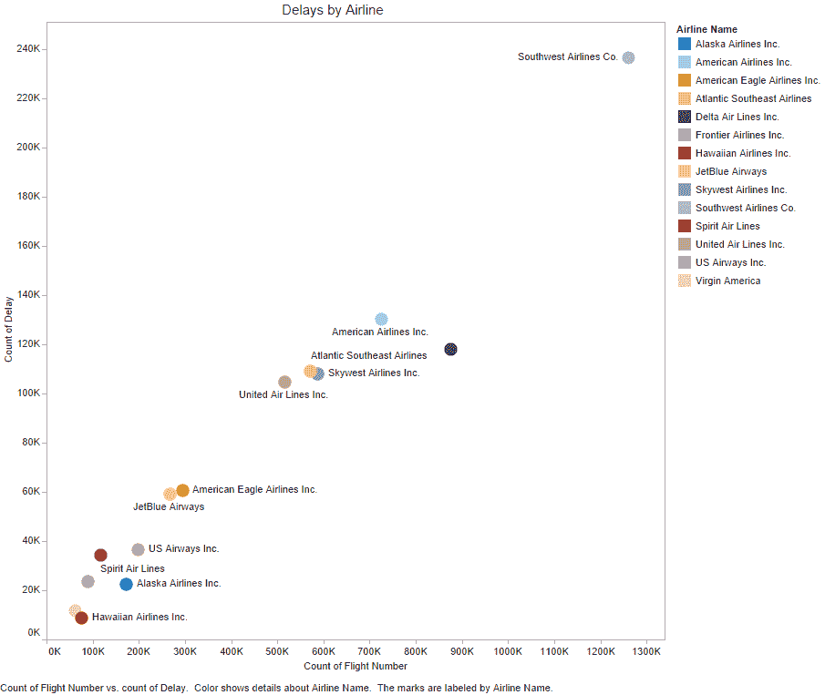
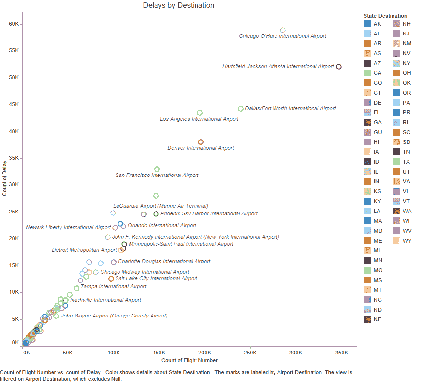
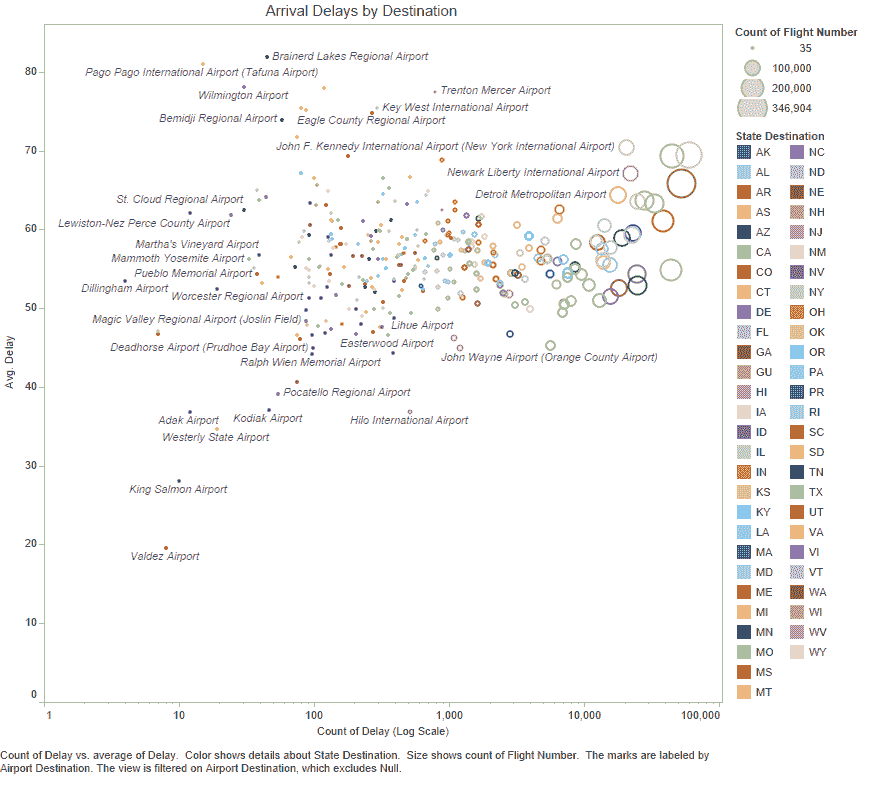

# 未能实现航班延误预测

> 原文：<https://towardsdatascience.com/failing-to-land-flight-delay-predictions-a281689dd602?source=collection_archive---------11----------------------->

在早期的一篇文章(“[推理的损失](https://medium.com/@stephenchen_81455/the-loss-of-inference-a3c2d5f92e9b)”)中，我提到了利用 auto-mpg 数据集的模型中非独立变量的误用，这是数学/技术决定论的一种症状，这种决定论现在充斥着数据科学，原因是对生产的关注贬低了批判性评估。

在这篇文章中，我希望通过查看 2015 年航班延误数据集的使用，说明这种向生产评估和关键评估的转变不一定是一种优点。这是另一个流行的数据集，因为它很大(由美国境内的 580 万次航班组成)，并且易于理解。我已经通过谷歌搜索结果回顾了许多使用这个数据集的文章，那些模型和结论几乎是无用或错误的；在我的评论中，我还没有遇到一个理解航班延误条件概率的人，即没有人(根据我的评论)费心去确定他们正在探索的模式/他们的模型正在预测的模式是否是一个有效的现象，或者仅仅是任何给定日期/航空公司/机场的航班数量的函数。

除了按星期几划分的延误次数之外，绘制航班次数，我们可以看到延误发生率和航班发生率之间有很高的相关性。每天航班延误的任何“模式”都是当天航班数量的假象。

当我们查看航空公司和目的地机场的延误条件概率时，我们观察到每个航空公司和目的地机场的延误条件概率都是相同的(有一两个亮点)——这些点几乎都在同一条线上。换句话说，夏威夷航空公司(延误最少)和西南航空公司(延误最多)航班延误的几率差不多。

这一证据导致的结论是，根据这一数据训练的模型既没有预测任何东西，也没有发现任何有趣的东西。他们的结果只是复制数据中的局部最大值，并不构成任何有意义的模式。

在下图中，我们可以看到平均延误(y 轴)本身取决于延误发生率(x 轴)以及到达机场的航班发生率(气泡大小)。低发生率机场平均延误的高方差随着发生率的增加而收敛(沿 x 轴)*是小样本的基本统计特性。*

就像[早期文章](https://medium.com/@stephenchen_81455/the-loss-of-inference-a3c2d5f92e9b)中的假设示例一样，如果对该特定数据采用 boosting(或基于密度的算法)等技术，则得到的模型将在模型误差/准确性度量方面得分较高，但在该输入数据集之外的预测能力有限；然而，由于低发生率机场的高方差，方法上合适的基于概率/随机的模型将显示“不适合”(在当前天真的更好的“准确性”/更新的技术=更好的时代精神中，将被拒绝为“次等”)。

**模型准确性和过度拟合是同一枚硬币的两面**，再多的正则化、交叉验证或花哨的算法也无法解决关于数据的根本性错误理解或假设。考虑一下，每当航空公司改变其航班时刻表和/或航班目的地时，飞往机场的航班发生率的变化会影响延误发生率以及这些延误发生率的可变性，这将打破大多数“精确”模型。

这具有超出直接数据集的更广泛的含义。考虑对重要但发生率低的客户的处理(如欺诈案件、高价值客户):您的模型在多大程度上被过度设计以抑制或适应其高可变性的趋势？

那些在医疗保健领域工作以训练用于诊断目的的机器学习模型的人应该评估在罕见情况下的数据中是否捕获了超出模型收敛所需的足够的差异。如果不是这样，在*假阳性悖论*之上可能会有额外的不幸，当整体人口的发病率低于假阳性率时，就会发生这种情况(这里有一个[链接，链接到简明易懂的语言解释](http://thewhereblog.blogspot.com/2008/12/paradox-of-false-positive.html))。

希望我已经提出了一个案例，数据科学应该比 scikit.fit 和 scikit.predict(或等效物)的生产流更重要。