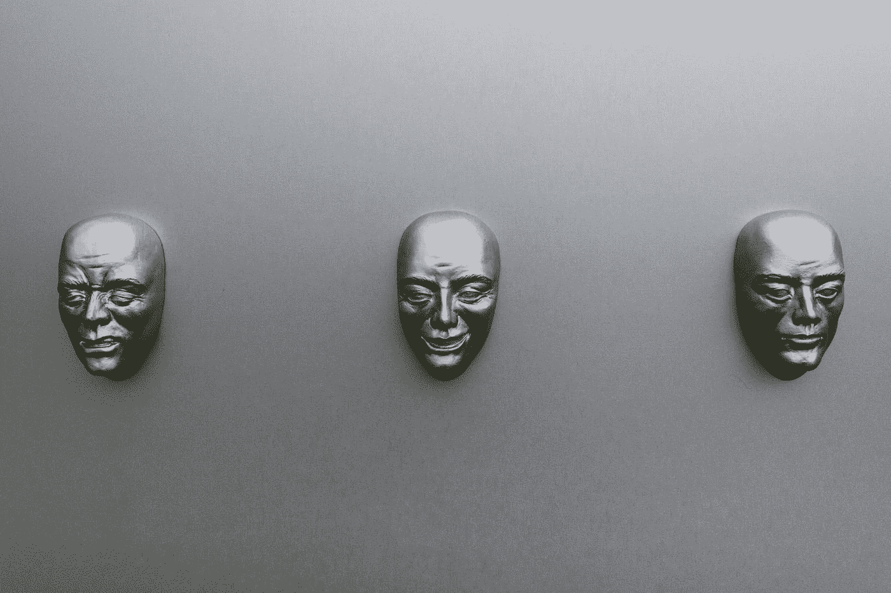
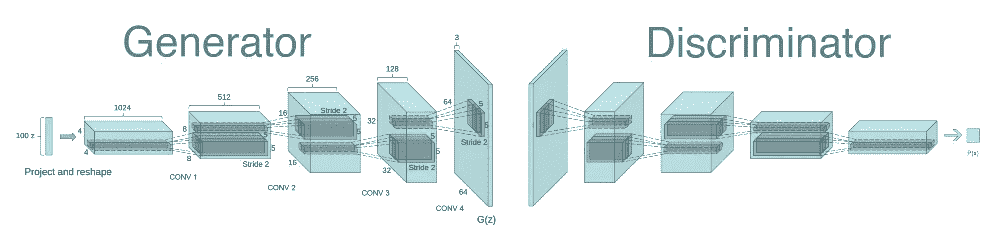
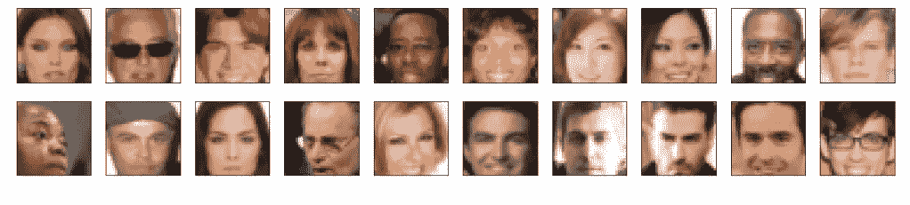
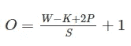
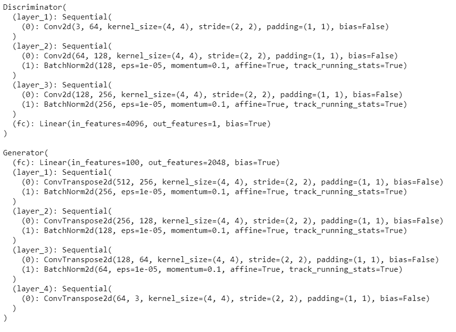
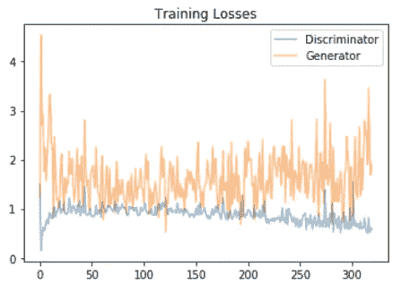
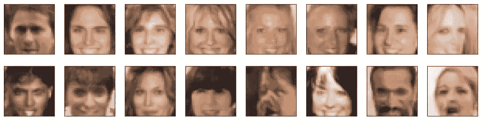

# 基于 DCGAN 模型的人脸生成器

> 原文：<https://towardsdatascience.com/fake-face-generator-using-dcgan-model-ae9322ccfd65?source=collection_archive---------9----------------------->



Photo by [Camilo Jimenez](https://unsplash.com/@coolmilo?utm_source=medium&utm_medium=referral) on [Unsplash](https://unsplash.com?utm_source=medium&utm_medium=referral)

# 概观

在下面的文章中，我们将在人脸数据集上定义和训练一个**深度卷积生成对抗网络 *(DCGAN)*** 模型。该模型的主要目标是获得一个生成器网络来生成看起来尽可能真实的新的假人脸图像。

为此，我们将首先尝试理解 ***GAN*** s 和 ***DCGAN*** s 工作背后的直觉，然后结合这些知识来构建一个**假脸生成器模型**。到本文结束时，您将能够使用本文中的概念在任何给定的数据集上生成您的假样本。

# 介绍

以下文章分为两个部分:

*   **理论** —理解*甘*和 *DCGAN* 工作背后的直觉。
*   **实用** —在 Pytorch 中实现假面生成器。

本文将涵盖这两个部分。所以让我们开始旅程吧…

# 理论

## 生成性对抗网络背后的直觉


**Generative Adversarial Network(GAN)** architecture. Image from [https://sthalles.github.io/intro-to-gans/](https://sthalles.github.io/intro-to-gans/)

*   **定义**

总的来说，GAN 可以被定义为一个生成模型，让我们并行地生成一个完整的图像。与其他几种生成模型一起， *GAN* s 使用由神经网络表示的可微分函数作为*生成器网络*。

*   **发电机网络**

生成器网络将随机噪声作为输入，然后通过可微分函数*(神经网络)*运行噪声，以转换噪声并将其整形为具有与训练数据集中的图像相似的可识别结构。发生器的输出由输入随机噪声的选择决定。在几种不同的随机输入噪声上运行发生器网络会产生不同的真实输出图像。

生成器的最终目标是学习与训练数据集的分布类似的分布，以采样出真实的图像。要做到这一点，需要对发电机网络进行培训。与其他生成模型*相比， *GAN* s 的训练过程非常不同(大多数生成模型通过调整参数来训练，以最大化生成器生成真实样本的概率。For-eg 变分自动编码器(VAE))。另一方面，GAN* s 使用第二个网络来训练发电机，称为*鉴别器网络*。

*   **鉴频器网络**

鉴别器网络是一个基本的分类器网络，它输出图像真实的概率。因此，在训练过程中，鉴别器网络一半时间显示来自训练集的真实图像，另一半时间显示来自生成器的虚假图像。鉴别器的目标是为真实图像分配接近 1 的概率，为虚假图像分配接近 0 的概率。

另一方面，生成器尝试相反的方法，其目标是生成假图像，对于这些假图像，鉴别器将产生接近 1 *(认为它们是来自训练集的真实图像)*的概率。随着训练的进行，鉴别器将会更好地区分真假图像。所以为了骗过鉴别器，生成器将被迫改进以产生更真实的样本。所以我们可以说:

> GANs 可以被认为是一个两人(生产者和鉴别者)非合作博弈，每个参与者都希望最小化其成本函数。

## gan 和 DCGANs 的区别

*DCGAN* 非常类似于 *GAN* s，但特别关注于使用深度卷积网络来代替普通 *GAN* s 中使用的全连接网络

卷积网络有助于发现图像中的深度相关性，也就是说，它们寻找空间相关性。这意味着 DCGAN 将是图像/视频数据的更好选择，而 *GAN* s 可以被认为是一个通用概念，在此基础上开发了 *DCGAN* s 和许多其他架构 *(CGAN、CycleGAN、StarGAN 和许多其他架构)*。

> 在本文中，我们主要研究图像数据，这意味着与普通 GAN 相比，DCGAN 是更好的选择。所以从现在开始，我们将主要关注 DCGANs。

## 训练 DCGANs 的一些技巧

> 所有的训练技巧同样适用于香草甘 *s* 以及*。*

*   确保鉴别器和生成器至少有一个隐藏层。这确保了两个模型都有一个 ***通用近似属性*** 。

> **普适逼近性质**陈述了一个单隐层包含有限个隐单元的前馈网络，在给定足够多隐单元的情况下，可以逼近任意概率分布。

*   对于隐藏单元，许多激活功能可以工作，但泄漏 ReLUs 是最受欢迎的。渗漏的 ReLUs 确保梯度流过整个建筑。这对 DCGAN 非常重要，因为发生器能够学习的唯一方法是从鉴频器接收梯度。
*   对于发电机网络的输出，最流行的激活函数之一是正切双曲线激活函数*(基于* [*对 GANs*](https://video.udacity-data.com/topher/2018/November/5bea0c6a_improved-training-techniques/improved-training-techniques.pdf) *论文的改进训练技术)*。
*   由于鉴别器是二元分类器，我们将使用 Sigmoid 激活函数来获得最终概率。

到目前为止，我们已经讨论了工作直觉和一些训练 *GAN* s/ *DCGAN* s 的技巧和诀窍，但是仍然有许多问题没有得到解答。其中一些是:

> 选择哪个优化器？成本函数是如何定义的？一个网络需要训练多久？以及许多其他内容，将在**实用**部分中介绍。

# 实际的

实施部分被分解为从**加载数据到定义和训练敌对网络**的一系列任务。在本节结束时，您将能够可视化您训练过的生成器的结果，以了解它是如何执行的；你生成的样本应该看起来像带有少量噪点的真实人脸。



**DCGAN Architecture**. Image from [https://gluon.mxnet.io/chapter14_generative-adversarial-networks/dcgan.html](https://gluon.mxnet.io/chapter14_generative-adversarial-networks/dcgan.html)

## (1)获取数据

你将使用[名人面孔属性数据集 *(CelebA)*](http://mmlab.ie.cuhk.edu.hk/projects/CelebA.html) 来训练你的敌对网络。与 MNIST 相比，该数据是一个更复杂的数据集。所以，我们需要定义一个更深的网络 *(DCGAN)* 来产生好的结果。我建议您使用 GPU 进行培训。

## (2)准备数据

由于本文的主要目标是构建一个 *DCGAN* 模型，因此我们将使用一个预处理过的数据集，而不是自己进行预处理。你可以从[这里](https://s3.amazonaws.com/video.udacity-data.com/topher/2018/November/5be7eb6f_processed-celeba-small/processed-celeba-small.zip)下载 **CelebA** 数据集的较小子集。如果您有兴趣进行预处理，请执行以下操作:

*   裁剪图像以移除不包括面部的部分。
*   将它们调整为 64x64x3 的数字图像。

现在，我们将创建一个*数据加载器*来批量访问图像。

```
def get_dataloader(batch_size, image_size, data_dir='train/'):
    """
    Batch the neural network data using DataLoader
    :param batch_size: The size of each batch; the number of images in a batch
    :param img_size: The square size of the image data (x, y)
    :param data_dir: Directory where image data is located
    :return: DataLoader with batched data
    """
    transform = transforms.Compose([transforms.Resize(image_size),transforms.CenterCrop(image_size),transforms.ToTensor()])

    dataset = datasets.ImageFolder(data_dir,transform = transform)

    dataloader = torch.utils.data.DataLoader(dataset = dataset,batch_size = batch_size,shuffle = True)
    return dataloader# Define function hyperparameters
batch_size = 256
img_size = 32# Call your function and get a dataloader
celeba_train_loader = get_dataloader(batch_size, img_size)
```

*数据加载器*超参数:

*   您可以决定任何合理的 *batch_size* 参数。
*   但是，你的 *image_size* 必须是 32。将数据调整到较小的大小将有助于更快的训练，同时仍然可以创建令人信服的人脸图像。

接下来，我们将编写一些代码来获得数据集的可视化表示。

```
def imshow(img):
    npimg = img.numpy()
    plt.imshow(np.transpose(npimg, (1, 2, 0)))# obtain one batch of training images
dataiter = iter(celeba_train_loader)
images, _ = dataiter.next() # _ for no labels# plot the images in the batch, along with the corresponding labels
fig = plt.figure(figsize=(20, 4))
plot_size=20
for idx in np.arange(plot_size):
    ax = fig.add_subplot(2, plot_size/2, idx+1, xticks=[], yticks=[])
    imshow(images[idx])
```

请记住将*张量*图像转换成 *NumPy* 类型，并转置尺寸以正确显示基于上述代码*的图像(在 Dataloader 中，我们将图像转换成张量)*。运行这段代码来获得数据集的可视化。



Images Centered around faces

现在，在开始下一节*(定义模型)*之前，我们将编写一个函数来将图像数据缩放到-1 到 1 的像素范围，我们将在训练时使用该函数。这样做的原因是 tanh 激活的生成器的输出将包含范围从-1 到 1 的像素值，因此，我们需要将我们的训练图像重新缩放到范围从-1 到 1 *(现在，它们在范围 0–1)*。

```
def scale(x, feature_range=(-1, 1)):
    ''' Scale takes in an image x and returns that image, scaled
       with a feature_range of pixel values from -1 to 1\. 
       This function assumes that the input x is already scaled from 0-1.'''
    # assume x is scaled to (0, 1)
    # scale to feature_range and return scaled x
    min, max = feature_range
    x = x*(max-min) + min
    return x
```

# (3)定义模型

一个 *GAN* 由两个对抗网络组成，一个鉴别器和一个生成器。因此，在这一节中，我们将为它们定义架构。

## 鉴别器

这是一个卷积分类器，只是没有任何 *MaxpPooling* 层。这是鉴别器网络的代码。

```
def conv(input_c,output,kernel_size,stride = 2,padding  = 1, batch_norm = True):
    layers =[]
    con = nn.Conv2d(input_c,output,kernel_size,stride,padding,bias = False)
    layers.append(con)

    if batch_norm:
        layers.append(nn.BatchNorm2d(output))

    return nn.Sequential(*layers)class Discriminator(nn.Module):def __init__(self, conv_dim):
        """
        Initialize the Discriminator Module
        :param conv_dim: The depth of the first convolutional layer
        """
        #complete init functionsuper(Discriminator, self).__init__()
        self.conv_dim = conv_dim
        self.layer_1 = conv(3,conv_dim,4,batch_norm = False) #16
        self.layer_2 = conv(conv_dim,conv_dim*2,4) #8
        self.layer_3 = conv(conv_dim*2,conv_dim*4,4) #4
        self.fc = nn.Linear(conv_dim*4*4*4,1)def forward(self, x):
        """
        Forward propagation of the neural network
        :param x: The input to the neural network     
        :return: Discriminator logits; the output of the neural network
        """
        # define feedforward behavior
        x = F.leaky_relu(self.layer_1(x))
        x = F.leaky_relu(self.layer_2(x))
        x = F.leaky_relu(self.layer_3(x))
        x = x.view(-1,self.conv_dim*4*4*4)
        x = self.fc(x)
        return x
```

**解释**

*   以下架构由三个卷积层和一个最终全连接层组成，输出单个 logit。这个逻辑定义了图像是否真实。
*   除了第一个卷积层，每个卷积层后面都有一个*批量归一化(在 conv 辅助函数中定义)*。
*   对于隐藏单元，我们使用了*泄漏 ReLU* 激活功能，如**理论**部分所述。
*   在每个卷积层之后，高度和宽度变成一半。例如，在第一次卷积后，32×32 的图像将被调整为 16×16，以此类推。

> 可以使用以下公式计算输出尺寸:



Formula-1

> 其中 *O* 为输出高度/长度， *W* 为输入高度/长度， *K* 为滤波器尺寸， *P* 为填充， *S* 为步幅。

*   每次卷积后特征图的数量基于参数*conv _ 尺寸(在我的实现中 conv _ 尺寸= 64)* 。

在这个模型定义中，我们没有对最终输出 logit 应用 *Sigmoid* 激活函数。这是因为我们损失函数的选择。这里我们将使用 *BCEWithLogitLoss，*而不是使用普通的 *BCE(二元交叉熵损失)，它被认为是 *BCE* 的数值稳定版本。 *BCEWithLogitLoss* 被定义为首先在 logit 上应用 Sigmoid 激活函数，然后计算损失，与 *BCE* 不同。你可以在这里阅读更多关于这些损失函数[的内容。](https://discuss.pytorch.org/t/bceloss-vs-bcewithlogitsloss/33586)*

## 发电机

生成器应该对输入进行上采样，并生成与我们的训练数据 32X32X3 相同大小的新图像。为此，我们将使用转置卷积层。这是发电机网络的代码。

```
def deconv(input_c,output,kernel_size,stride = 2, padding =1, batch_norm = True):
    layers = []
    decon = nn.ConvTranspose2d(input_c,output,kernel_size,stride,padding,bias = False)
    layers.append(decon)

    if batch_norm:
        layers.append(nn.BatchNorm2d(output))
    return nn.Sequential(*layers)class Generator(nn.Module):

    def __init__(self, z_size, conv_dim):
        """
        Initialize the Generator Module
        :param z_size: The length of the input latent vector, z
        :param conv_dim: The depth of the inputs to the *last* transpose convolutional layer
        """
        super(Generator, self).__init__()
        # complete init function
        self.conv_dim = conv_dim
        self.fc = nn.Linear(z_size,conv_dim*8*2*2)
        self.layer_1 = deconv(conv_dim*8,conv_dim*4,4) #4
        self.layer_2 = deconv(conv_dim*4,conv_dim*2,4) #8
        self.layer_3 = deconv(conv_dim*2,conv_dim,4) #16
        self.layer_4 = deconv(conv_dim,3,4,batch_norm = False) #32

    def forward(self, x):
        """
        Forward propagation of the neural network
        :param x: The input to the neural network     
        :return: A 32x32x3 Tensor image as output
        """
        # define feedforward behavior
        x = self.fc(x)
        x = x.view(-1,self.conv_dim*8,2,2) #(batch_size,depth,width,height)
        x = F.relu(self.layer_1(x))
        x = F.relu(self.layer_2(x))
        x = F.relu(self.layer_3(x))
        x = torch.tanh(self.layer_4(x))
        return x
```

**解说**

*   以下架构由一个全连接层和四个转置卷积层组成。该架构被定义为使得在第四转置卷积层之后的输出产生尺寸为 32×32×3*(来自训练数据集的图像大小)的图像。*
*   发生器的输入是一定长度的矢量 *z_size(z_size 是噪声矢量)*。
*   除了最后一层，每个转置卷积层后面都有一个*批量归一化(在 deconv 辅助函数中定义)*。
*   对于隐藏单元，我们使用了 *ReLU* 激活功能。
*   在每个转置卷积层之后，高度和宽度变成两倍。例如，在第一次转置卷积后，2X2 图像将被调整大小为 4X4，依此类推。

> 可以使用以下公式计算:
> 
> `*# Padding==Same:
> H = H1 * stride*`
> 
> `*# Padding==Valid
> H = (H1-1) * stride + HF*`
> 
> 其中 H =输出尺寸，H1 =输入尺寸，HF =滤波器尺寸。

*   在每个转置卷积之后的特征映射的数量基于参数 *conv_dim(在我的实现中 conv_dim = 64)* 。

# (4)初始化网络的权重

为了帮助模型收敛，我根据[原文 *DCGAN* 论文](https://arxiv.org/pdf/1511.06434.pdf)对模型中卷积层和线性层的权重进行了初始化，该论文称:所有权重都是从以零为中心的正态分布初始化的，标准差为 0.02。

```
def weights_init_normal(m):
    """
    Applies initial weights to certain layers in a model .
    The weights are taken from a normal distribution 
    with mean = 0, std dev = 0.02.
    :param m: A module or layer in a network    
    """
    # classname will be something like:
    # `Conv`, `BatchNorm2d`, `Linear`, etc.
    classname = m.__class__.__name__

    if hasattr(m,'weight') and (classname.find('Conv') != -1 or classname.find('Linear') != -1):

        m.weight.data.normal_(0.0,0.02)

        if hasattr(m,'bias') and m.bias is not None:
            m.bias.data.zero_()
```

*   这会将权重初始化为正态分布，以 0 为中心，标准偏差为 0.02。
*   如果存在偏差项，可以不考虑或设置为 0。

# (5)建立完整的网络

定义您的模型的超参数，并从在**定义模型**部分定义的类中实例化鉴别器和生成器。这是代码。

```
def build_network(d_conv_dim, g_conv_dim, z_size):
    # define discriminator and generator
    D = Discriminator(d_conv_dim)
    G = Generator(z_size=z_size, conv_dim=g_conv_dim)# initialize model weights
    D.apply(weights_init_normal)
    G.apply(weights_init_normal)print(D)
    print()
    print(G)

    return D, G

# Define model hyperparams
d_conv_dim = 64
g_conv_dim = 64
z_size = 100D, G = build_network(d_conv_dim, g_conv_dim, z_size)
```

当您运行上面的代码时，您会得到下面的输出。它还描述了鉴别器和生成器模型的模型架构。



Instantiated **Discriminator** and **Generator** models

# (6)培训过程

> 训练过程包括定义损失函数、选择优化器以及最后训练模型。

## 鉴频器和发电机损耗

**鉴频器损耗**

*   对于鉴别器，总损失是*(d _ real _ loss+d _ fake _ loss)*之和，其中 *d_real_loss* 是从训练数据中的图像上获得的损失， *d_fake_loss* 是从生成器网络生成的图像上获得的损失。对于-例如

> z —噪声矢量
> 
> i —来自训练集的图像
> 
> g(z)-生成的图像
> 
> D(G(z)) —生成图像上的鉴别器输出
> 
> d(I)-训练数据集图像上的鉴别器输出
> 
> 损失=真实损失(D(i)) +虚假损失(D(G(z)))

*   请记住，我们希望鉴别器为真实图像输出 1，为虚假图像输出 0，因此我们需要设置损耗来反映*(在阅读下面的代码时请记住这一行)*。

**发电机损耗**

*   只有在标签翻转的情况下，发电机损耗才会看起来相似。生成器的目标是让鉴别器认为它生成的图像是真实的 T4。对于-例如

> z —噪声矢量
> 
> g(z)-生成的图像
> 
> D(G(z)) —生成图像上的鉴别器输出
> 
> Loss = real_loss(D(G(z))。

下面是*真实损失*和*虚假损失*的代码

```
def real_loss(D_out):
    '''Calculates how close discriminator outputs are to being real.
       param, D_out: discriminator logits
       return: real loss'''
    batch_size = D_out.size(0)
    labels = torch.ones(batch_size)
    if train_on_gpu:
        labels = labels.cuda()
    criterion = nn.BCEWithLogitsLoss()
    loss = criterion(D_out.squeeze(),labels)
    return lossdef fake_loss(D_out):
    '''Calculates how close discriminator outputs are to being fake.
       param, D_out: discriminator logits
       return: fake loss'''
    batch_size = D_out.size(0)
    labels = torch.zeros(batch_size)
    if train_on_gpu:
        labels = labels.cuda()
    criterion =  nn.BCEWithLogitsLoss()
    loss = criterion(D_out.squeeze(),labels)
    return loss
```

## 优化者

对于 GAN，我们定义了两个优化器，一个用于发生器，另一个用于鉴别器。这个想法是同时运行它们以不断改善两个网络。在这个实现中，我在两种情况下都使用了 [*Adam* 优化器](https://arxiv.org/pdf/1412.6980.pdf)。要了解更多关于不同优化器的信息，请参考此[链接](https://d2l.ai/chapter_optimization/index.html)。

```
# Create optimizers for the discriminator D and generator G
d_optimizer = optim.Adam(D.parameters(),lr = .0002, betas = [0.5,0.999])
g_optimizer = optim.Adam(G.parameters(),lr = .0002, betas = [0.5,0.999])
```

*学习率(lr)* 和*β值*基于原始 [DCGAN 纸](https://arxiv.org/pdf/1511.06434.pdf)。

## 培养

训练将包括交替训练鉴别器和发生器。我们将使用之前定义的*真实损耗*和*虚假损耗*函数来帮助我们计算鉴频器和发电机损耗。

*   你应该通过交替使用真实和虚假的图像来训练鉴别者
*   然后是发生器，它试图欺骗鉴别器，应该有一个相反的损失函数

这是训练的代码。

```
def train(D, G, n_epochs, print_every=50):
    '''Trains adversarial networks for some number of epochs
       param, D: the discriminator network
       param, G: the generator network
       param, n_epochs: number of epochs to train for
       param, print_every: when to print and record the models' losses
       return: D and G losses'''

    # move models to GPU
    if train_on_gpu:
        D.cuda()
        G.cuda()# keep track of loss and generated, "fake" samples
    samples = []
    losses = []# Get some fixed data for sampling. These are images that are held
    # constant throughout training, and allow us to inspect the model's performance
    sample_size=16
    fixed_z = np.random.uniform(-1, 1, size=(sample_size, z_size))
    fixed_z = torch.from_numpy(fixed_z).float()
    # move z to GPU if available
    if train_on_gpu:
        fixed_z = fixed_z.cuda()# epoch training loop
    for epoch in range(n_epochs):# batch training loop
        for batch_i, (real_images, _) in enumerate(celeba_train_loader):batch_size = real_images.size(0)
            real_images = scale(real_images)
            if train_on_gpu:
                real_images = real_images.cuda()

            # 1\. Train the discriminator on real and fake ima.ges
            d_optimizer.zero_grad()
            d_out_real = D(real_images)
            z = np.random.uniform(-1,1,size = (batch_size,z_size))
            z = torch.from_numpy(z).float()
            if train_on_gpu:
                z = z.cuda()
            d_loss = real_loss(d_out_real) + fake_loss(D(G(z)))
            d_loss.backward()
            d_optimizer.step()
            # 2\. Train the generator with an adversarial loss
            G.train()
            g_optimizer.zero_grad()
            z = np.random.uniform(-1,1,size = (batch_size,z_size))
            z = torch.from_numpy(z).float()
            if train_on_gpu:
                z = z.cuda()
            g_loss = real_loss(D(G(z)))
            g_loss.backward()
            g_optimizer.step()

            # Print some loss stats
            if batch_i % print_every == 0:
                # append discriminator loss and generator loss
                losses.append((d_loss.item(), g_loss.item()))
                # print discriminator and generator loss
                print('Epoch [{:5d}/{:5d}] | d_loss: {:6.4f} | g_loss: {:6.4f}'.format(
                        epoch+1, n_epochs, d_loss.item(), g_loss.item()))## AFTER EACH EPOCH##    
        # this code assumes your generator is named G, feel free to change the name
        # generate and save sample, fake images
        G.eval() # for generating samples
        samples_z = G(fixed_z)
        samples.append(samples_z)
        G.train() # back to training mode# Save training generator samples
    with open('train_samples.pkl', 'wb') as f:
        pkl.dump(samples, f)

    # finally return losses
    return losses

# set number of epochs 
n_epochs = 40# call training function
losses = train(D, G, n_epochs=n_epochs)
```

> 使用 GPU 进行了 40 多次训练，这就是为什么我必须将我的模型和输入从 CPU 转移到 GPU。

# (6)结果

*   以下是在每个时期之后记录的发生器和鉴别器的训练损失的曲线图。



Training Loss for **Discriminator** and **Generator**

发生器训练损失的高波动是因为发生器网络的输入是一批随机噪声向量*(每个 z_size)* ，每个随机噪声向量从(-1，1)的均匀分布中采样以生成每个时期的新图像。

在鉴别器图中，我们可以观察到训练损失*(x 轴上大约 50)*上升，然后逐渐下降，直到结束，这是因为发生器已经开始生成一些真实的图像，欺骗了鉴别器，导致误差增加。但随着训练的进行，鉴别器在区分真假图像方面变得越来越好，导致训练错误逐渐减少。

*   *40 个历元*后生成的样本。



Generated fake images

我们的模型能够生成看起来尽可能真实的假人脸的新图像。我们还可以观察到，所有图像的阴影都变浅了，甚至棕色的脸也变浅了。这是因为 **CelebA** 数据集有偏差；它由大部分是白人的“名人”面孔组成。也就是说，DCGAN 成功地从纯粹的噪声中生成了接近真实的图像。


Image from [https://memeshappen.com/meme/success-kid-original/finally-we-did-it-6891/5](https://memeshappen.com/meme/success-kid-original/finally-we-did-it-6891/5)

# 参考

*   [DCGAN 原纸](https://arxiv.org/pdf/1511.06434.pdf)
*   [Udacity 深度学习纳米学位课程](https://www.udacity.com/course/deep-learning-nanodegree--nd101)

> 查看我关于这篇文章的 [Github 报告](https://github.com/vjrahil/Face-Generator)。