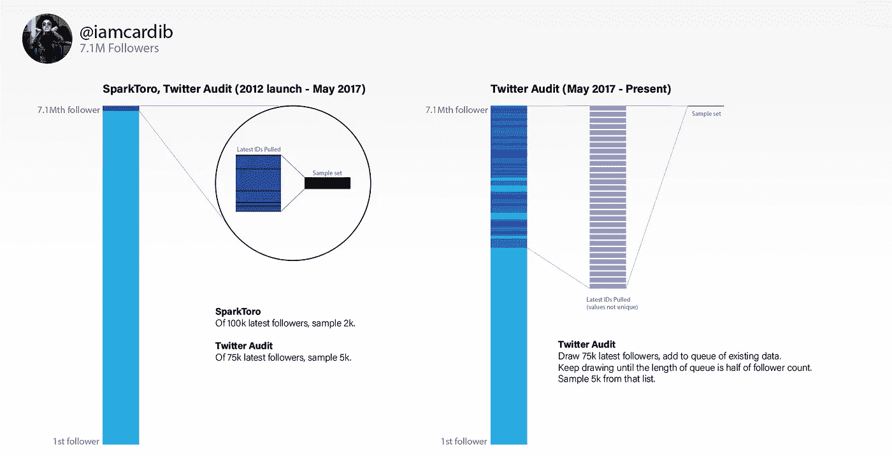

# 伪追随者计算器误导用户，记者提供可疑的统计数据。

> 原文：<https://towardsdatascience.com/fake-follower-calculators-misinform-users-journalists-with-dubious-statistics-659b60fc4d5a?source=collection_archive---------22----------------------->

## 99 点的误差传播

## 第三方 Twitter 应用并不是为拥有数百万粉丝的账户设计的。当然，反正用户就是这么做的。

虚假追随者计算器，尤其是一个名为 Twitter Audit 的平台，已经被许多新闻媒体引用，包括[《每日电讯报》](https://www.telegraph.co.uk/news/worldnews/us-election/12152676/Which-presidential-candidate-has-the-most-fake-Twitter-followers.html)、[、【名利场】](https://www.vanityfair.com/news/2016/08/trumps-biggest-lie-the-size-of-his-twitter-following)和[《哥伦比亚新闻评论》](https://www.cjr.org/the_media_today/trump-twitter-dorsey.php)。但这些平台的统计技术对大账户来说远不严谨。

一个由 SparkToro 创建的假追随者计算器，一家声称获得约 180 万美元资金的初创公司，甚至使用机器学习算法来区分真实账户和虚假账户。但 Twitter 允许第三方开发者在给定时间内访问多少数据的瓶颈，迫使这些网络应用对拥有数百万粉丝的账户使用“随机样本”的模糊定义。

## 数学是错误的。

当程序员向 Twitter 请求数据时，Twitter 在 15 分钟内最多返回 75k 个追随者 id。如果 Twitter 返回的 id 是随机的，就不会有问题。但是这些 id 是按照最近关注用户的顺序排列的。如果我们想知道有多少假账户追随卡迪·B，想想这意味着什么

How the two platforms (SparkToro and Twitter Audit) would calculate fake followers.

左边是 SparkToro 目前的抽样方法和 Twitter Audit 直到 2017 年 5 月的方法。SparkToro 要求 Twitter 提供最新的 10 万名关注者，并对 2k 人进行抽样分析。Twitter 审计要求 75，000 名追随者，并抽样 5，000 名。

当我问 SparkToro 的联合创始人凯西·亨利(Casey Henry)，他是否认为这种方法像他们的应用程序所说的那样是“随机的”(他们后来更新了网站，澄清了他们的方法)，他说，“定义不是:‘对所有追随者随机’。”这是你的追随者的随机抽样。"

抛开语义不谈，这里潜在的错误使得他们的结果对于足够大的账户来说毫无价值。“实际上毫无价值”意味着如果 SparkToro 返回 Cardi B 的数字“65%是假的”,他们实际上说的是这个数字在 1%到 99%之间。可以回答“Cardi B 最近收获了多少假关注者？”但将这一比例扩大到她的数百万粉丝，就好比在康涅狄格州进行了一次民意调查后，预测有多少人会投票给一名全国候选人。

2017 年 5 月，Twitter Audit 的联合创始人大卫·卡普兰(David Caplan)开始存储旧 id，以此作为绕过 Twitter 速度限制的一种方式(右图)。这个过程很复杂，但基本上如果有超过 100 万的关注者，Twitter Audit 会在他们的数据库中存储一半的关注者。他们不检查是否有任何重复。卡普兰认可了这个图形，并尽力解释这个过程，但他不愿意分享他的代码。

卡普兰承认他使用陈旧的数据，但他说，在我联系他之前，他不知道 Twitter 会先返回最新的关注者。他在电子邮件中补充道，“当时，这个网站更像是一个玩具，所以我并不太在乎统计数据的准确性。我也没想到会有很多人用！”

诚然，这种一半关注者、充满重复、陈旧数据的方法比 Twitter Audit 在 2017 年更新之前的方法要好。然而，在最引人注目的情况下，它仍然可能有超过 50 个百分点的误差传播。

重申一下，这些误差线并不是来自用来区分“真实”和“虚假”账户的方法——尽管这总是一个容易出错的困难过程。这些额外的误差条仅来自采样过程。

Twitter Audit 为@realDonaldTrump 进行的计算从他们的 3000 万粉丝数据库中抽取了 5k 个样本，回答了“自 2017 年以来，总统获得了多少假粉丝”这一问题如果我们可以假设虚假粉丝是均匀分布的，那也没什么大不了的，但是来自《纽约时报》的报道表明，如果有人购买粉丝，这些账户可能会高度聚集，并且出现在 Twitter 历史的早期。

值得称赞的是，SparkToro 分析了每个关注@realDonaldTrump 的用户，估计他的粉丝中有 70.2%是假的。相比之下，只查看最新 id 的 Twitter Audit 发布了@realDonaldTrump 有 11%的虚假粉丝。

## **记者被快速统计数据误导了。**

记者们可能太容易相信每个人都使用的网络应用程序。《名利场》(带有踢球者“数字不会说谎”)[引用](https://www.vanityfair.com/news/2016/08/trumps-biggest-lie-the-size-of-his-twitter-following) Twitter Audit 批评@realDonaldTrump。马修·英格拉姆[在《哥伦比亚新闻评论》中提到了](https://www.cjr.org/the_media_today/trump-twitter-dorsey.php) Twitter Audit 对@realDonaldTrump 的统计。他给我写道，“每当我在关于唐纳德·特朗普(Donald Trump)的虚假追随者之类的文章中提到它们时，我都会试图提到和/或链接到对它们价值的怀疑评估。”

自 2012 年出现以来，Twitter Audit 已经成为记者的快速来源。此类出版物不胜枚举:[《华盛顿邮报》](https://www.washingtonpost.com/news/the-switch/wp/2017/06/29/twitter-is-looking-for-ways-to-let-users-flag-fake-news/)、[《新闻周刊》](https://www.newsweek.com/donald-trump-twitter-followers-fake-617873)、 [Quartz](https://qz.com/1212564/media-companies-have-a-fake-follower-twitter-problem-too-twtr/) 和[《每日电讯报》](https://www.telegraph.co.uk/news/worldnews/us-election/12152676/Which-presidential-candidate-has-the-most-fake-Twitter-followers.html)都引用了 Twitter 审计。公平地说，他们没有办法知道平台的错误——即使是它的联合创始人也没有完全意识到这些数字会有多错误。

卡普兰和亨利都提到他们已经为一些记者进行了全面的分析。然而，当被问及具体细节以及上面列出的引用该应用的故事时，卡普兰写道，“对不起，我没有完整的审计记录，所以我不能肯定。”但是由于上面列出的出版物中没有一个作者发表评论，我们不知道哪个发表的数字更可靠。SparkToro 和 Twitter Audit 都表示，他们随时准备对提出要求的记者进行全面审核。

SparkToro 并不同情一个假设的记者，他只相信他们的数字。“作为一名记者，你应该尽职尽责地了解这个工具是如何工作的，”联合创始人亨利说。我反驳说，这款应用的方法有误导性。亨利说:“你想怎么拿就怎么拿。你找到了一个边缘案例。恭喜你。”

## 这些工具不是用来对付政客或凯蒂·佩里的。

据他们各自的创始人称，Twitter Audit 是一个用来发现“完全是欺诈”的账户的工具，SparkToro 是一家分析公司，可以帮助广告商评估影响者的价值，其中大多数人的粉丝不到 10 万。

亨利说:“我们不是在宣传或标榜我们自己是你应该分析和批评 2020 年候选人的地方。”“这不是这个工具的用途……我们可以在上面贴一个红色标志，写着‘这个工具不做这个’但它是一个免费的工具。这对我们来说不是首要任务。这只是我们产品的一小部分。”(不过需要注意的是，SparkToro 发[了一篇博文](https://sparktoro.com/blog/we-analyzed-every-twitter-account-following-donald-trump-61-are-bots-spam-inactive-or-propaganda/)明确计算了各种政客的假追随者，包括三位民主党 2020 总统候选人。)

Twitter Audit 分享说，不到 1%的审核是针对粉丝超过 100 万的账户，SparkToro 分享说，不到 5%的审核是针对粉丝超过 10 万的账户。两者都声称每月有数万的流量。

其他虚假追随者计算器存在，但用户应该怀疑超过 75，000 名追随者的账户上给出的任何快速结果。在一个公共论坛上，Twitter 工作人员安迪·派珀[写道](https://twittercommunity.com/t/possible-to-randomly-sample-followers/129236/2)“我不知道有任何 API 方法可以对追随者进行随机抽样。”这意味着，任何其他假追随者计算器都可能成为 SparkToro 或 Twitter Audit 同样问题的受害者。

在回答我的询问时，双方都考虑更新他们的方法，并更清楚地解释他们平台的局限性。但是，即使我们得到了稍微更准确的数字，用户和记者还应该继续引用这些数字来形容知名人士吗？当一个账户拥有数百万粉丝时——当一个人在公告牌排行榜上名列前茅或成为美国总统时——真的有人会质疑他们的影响力吗？

更新(2019 . 9 . 25):印度总理纳伦德拉·莫迪的账户在 2018 年被批评有假粉丝。[推特审核被引用](https://twitter.com/Twiplomacy/status/966226775683534848)。对此，[推特发言人](https://www.business-standard.com/article/news-ians/reports-claiming-top-indian-leaders-have-fake-followers-deeply-flawed-twitter-118031401378_1.html)表示，“‘推特审计’使用的方法存在严重缺陷，他们的不正确信息不应该被当真。”

*疑问？评论？联系我，查看更多项目在* [*我的网站*](http://www.kmcelwee.com) *。*