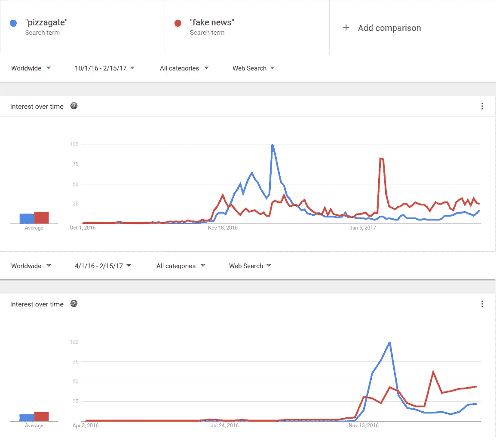
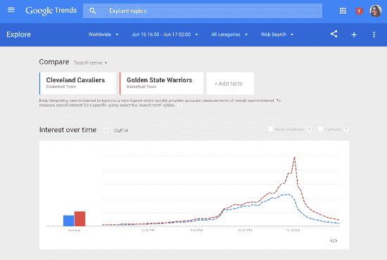

# 基于异常检测的假新闻分类

> 原文：<https://towardsdatascience.com/fake-news-classification-via-anomaly-detection-765c4c71d539?source=collection_archive---------15----------------------->

## 可以用异常检测来检测过滤假新闻吗？

假新闻已经成为我们这个时代最大的问题之一。它污染了线上和线下的话语。我们甚至可以说，迄今为止，假新闻对西方民主构成了明显的现实威胁。

由于技术世界已经创造了允许大规模出版这类出版物的机制，它应该想出一个解决方案来对它们进行分类和过滤，这才是公平的。

在这篇文章中，我们将尝试提出一种基于数据科学的方法，这种方法可以用来对 T2 的假新闻进行分类和过滤。

请注意，这不是一个成熟的算法，而是我们如何解决这个问题的框架描述。如果您对算法有任何建议，或者您是否愿意加入一个开源项目，尝试将它从架构变为实现，请发表评论。

## 算法概述

为了使用异常检测对假新闻进行分类，我们建议采取以下步骤:

*   从多个在线来源(如 Twitter、Google、脸书)提取热门话题
*   检测到的新闻异常
*   交叉检查来源之间和来源内部的异常情况，找出矛盾之处
*   将矛盾异常归类为假新闻

如果不完全清楚，请不要担心，我们会深入研究以上每一项。

## 异常检测

在[数据挖掘](https://en.wikipedia.org/wiki/Data_mining)、**异常检测**(也称**异常检测**)是对罕见项目、事件或观察结果的识别，这些项目、事件或观察结果通过与大多数数据显著不同而引起怀疑。通常，异常项目会转化为某种问题，如[银行欺诈](https://en.wikipedia.org/wiki/Bank_fraud)、结构缺陷、医疗问题或文本中的错误。异常也被称为[异常值](https://en.wikipedia.org/wiki/Outlier)、新奇、噪音、偏差和异常。

Anomaly in a Time Series

本文的目的不是提供一个全面的教程(你可以在这里找到一个非常好的介绍[),也不假设读者精通用于检测异常的底层算法。唯一的先决条件是你对异常现象有一个基本的直觉(见上图)。](https://www.datascience.com/blog/python-anomaly-detection)

## 新闻反常现象

在我们开始之前，让我们定义一下什么是*新闻异常*。想象一天在办公室里，在线阅读新闻。你的 twitter 账户开始关注某个事件的新闻。这可能是一个地方性的事件，一个全球性的事件，或者是你个人感兴趣的事情。不管实际的主题是什么，你都会清楚地注意到关于它的信息传递的峰值。

我们将把*新闻异常*定义为某个**话题**，它是多个来源的趋势，例如 Twitter、脸书、谷歌搜索趋势等。请注意，我们考虑到不同来源之间的时间差，因为新闻可能不会同时触及所有来源。

## 发现新闻异常

在我们对新闻异常进行分类之前，我们必须先检测出一个。

为此，我们需要使用来自[自然语言处理](https://en.wikipedia.org/wiki/Natural_language_processing)的工具来解析 Twitter 提供的趋势话题和标签。我们将在一个预定义的时间窗口内收集多个属于趋势推特列表的推特，并将它们归类到主题中。

我们进一步收集 twits 流中的主要短语，创建一个时间特征向量，保存每个主题和短语随时间的量。我们现在有一个短语的时间序列。

我们继续为每个在线来源(如脸书、谷歌)制作这样一个时间序列，寻找在这些其他来源上收集的主题和短语。我们使用来自 Twitter 的 seed 趋势-主题和短语来查找脸书和谷歌搜索趋势上的上述主题参考。

完成后，我们有三个时间序列对象，每个对象代表每个源上每个趋势主题的数量(也可能是频率——但我们现在不会深入讨论)。

由于一个热门话题可能不会同时出现在所有来源上(例如首先出现在 Twitter 上，然后是脸书，然后人们开始在 Google 上搜索它)，我们需要对时间序列对象进行时间对齐。我们通过尝试对时间序列对象进行相移来做到这一点，直到我们达到[最小对准误差](https://www.sciencedirect.com/science/article/pii/S0031320318301286)。

> ***谎言比真相传播得更快***
> 
> “全世界都在关注虚假新闻及其影响政治、经济和社会福祉的可能性。为了了解虚假新闻是如何传播的，Vosoughi *等人*使用了 2006 年至 2017 年 Twitter 上的谣言瀑布数据集。大约 126，000 个谣言被 300 万人传播。虚假的消息比真实的消息接触到更多的人；前 1%的虚假新闻扩散到 1000 到 100，000 人之间，而真相很少扩散到 1000 人以上。谎言也比真理传播得更快。新奇程度和接受者的情绪反应可能是观察到的差异的原因。”
> 
> 来自[网上](https://science.sciencemag.org/content/359/6380/1146)真假消息的传播，Soroush Vosoughi 等人。麻省理工学院艾尔

我们知道这样一个事实，即时间对齐可能会扭曲假新闻和真新闻之间的区别，但是，在消除不同来源之间的新闻传播延迟和不丢失信息之间存在紧张关系(需要进一步思考)。这是一个很好的问题，可以通过分别测量每个源内某个主题*T*的*传播速度*来解决，将传播速度作为另一个特征添加到下面的分类中。

进入异常检测。

我们将使用任何广泛可用的技术(如 ARIMA、霍尔特-温特斯等。)以便检测上述每个时间序列对象中的原始异常。注意我们**必须**检测正和负的音量异常(一分钟后会有更多)。

使用上面的异常列表，每个异常被检测为跨所有源的提取的趋势主题的时间点(在某些环境下)。

请注意，我们仅讨论音量异常，因为这些异常很容易从所有源类型中提取出来，同时我们也可以将异常转换到频域(使用 FFT ),创建该主题出现在新闻中的频率的时间序列。然而，由于并非所有来源都支持这种转换(例如 Google 搜索趋势)，我们现在将保持在卷域。

## 假新闻分类

一旦我们为某个主题 *T* 很好地对齐了时间序列对象，我们就可以对它们进行比较。

我们正在寻找的是反相关的异常，这意味着一个来源的异常量与其他来源的异常量有很大不同。

我们现在对原始文本数据运行第二步(仅在异常窗口**内**)。我们在这些窗口中收集所有文本数据，寻找证据表明人们已经确定这些是假新闻。这可能包括词语*假，假新闻，*或任何其他暗示人们指的是虚假新闻的短语(为了清楚起见，我们将这一步过于简化，然而词语*假*，*假新闻*等。必须在句子语序中的某个附近的上下文中，或者在句法上连接，但是我们不会在这里进行如此详细的描述)。

Comparing the appearance of the words “Fake news” with “Pizzagate” in Google Trends

然后，我们将运行最终分析步骤，在该步骤中，我们对异常窗口中的原始文本数据使用情感分析，以情感方式标记时间上的反相关点，即，人们对多个来源的文本具有强烈的负面和正面情感。

结合上述发现，我们现在可以在上述每个分类步骤之间执行多数投票，输出一组检测。每一次检测都是一个时间点(或环境)，其中根据上述过程，话题 *T* 被怀疑是假新闻。

在时间轴上设置检测，我们测量检测之间的量趋势，即我们绘制一个图，其中 Y 轴是消息(或搜索)量，X 轴是时间，在该图上我们绘制主题 *T* 随时间的组合量。

如果上面的图表是一个缓慢开始的趋势线，随后是一个峰值，然后下降(快速或缓慢)，我们将该主题定义为假新闻。否则，如果图形显示出很大的变化，我们就完全放弃检测。

Normal News Trend

这一最终过滤步骤背后的原因是，趋势新闻通常表现为波浪，即开始缓慢，达到峰值，然后逐渐减弱。如果我们检测到一个很大的方差信号，这可能表明这根本不是一条新闻(然而，这需要对实际数据进行进一步调查)。

## 呼吁采取行动

正如本文开头提到的，我们并没有提供一个经过测试的假新闻分类器，而是一个算法思想。为了证明以上是具有可接受的召回和准确性水平的可行解决方案，需要在从多个来源提取的大型语料库上实现该算法，并且相对于已知假新闻案例(即，标记数据)来验证该算法。

请随意指出上述方法中的任何问题，或者加入我们实现上述方法的开源计划。