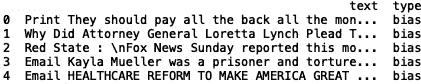

# 基于 BERT 的假新闻分类

> 原文：<https://towardsdatascience.com/fake-news-classification-with-bert-afbeee601f41?source=collection_archive---------15----------------------->


Photo by [Connor Danylenko](https://www.pexels.com/@connor-danylenko-534256) on [Pexels](https://www.pexels.com/photo/person-holding-a-burning-news-paper-close-up-photography-2538122/)

假新闻是一种通过新闻媒体和/或社交媒体故意传播虚假信息的宣传方式。鉴于假新闻的传播可能会产生严重影响，如左右选举、加剧 T2 的政治分歧，开发检测假新闻内容的方法非常重要。在本帖中，我们将使用一种叫做 BERT 的算法来预测新闻报道是否是假的。

BERT 代表来自变压器的双向编码器表示。描述伯特算法的论文由谷歌发表，可以在[这里](https://arxiv.org/pdf/1810.04805.pdf)找到。BERT 的工作原理是随机屏蔽单词标记，并用基于上下文的向量来表示每个被屏蔽的单词。BERT 的两个应用是“预训练”和“微调”。

**预训练 BERT**

对于预训练 BERT 算法，研究人员训练了两个无监督学习任务。第一个任务被描述为屏蔽 LM。其工作原理是随机屏蔽 15%的文档，并预测这些被屏蔽的标记。第二个任务是下一句预测(NSP)。这是由问答和自然语言推理等任务激发的。这些任务需要模型来准确捕捉句子之间的关系。为了解决这个问题，他们对二进制预测任务进行了预训练，该任务可以从单一语言的任何语料库中轻松生成。他们在论文中给出的例子如下:如果你有句子 A 和 B，A 有 50%的时间被标注为“isNext”，另外 50%的时间是从语料库中随机选取的句子，被标注为“notNext”。针对这一任务的预训练被证明对于问题回答和自然语言推理任务是有益的。

**微调伯特**

微调 BERT 的工作原理是用自我关注对连接在一起的文本对进行编码。自我注意是学习当前单词和先前单词之间相关性的过程。这一点的一个早期应用是在长短期记忆()论文(Dong2016)中，研究人员使用自我注意进行机器阅读。BERT 的好处在于，通过对带有自我关注的串联文本进行编码，可以捕捉句子对之间的双向交叉关注。

在本文中，我们将应用 BERT 来预测一个文档是否是假新闻。这个数据集的名字是*关于假新闻*的真相，在这里可以找到[。这篇文章的灵感来自于](https://www.kaggle.com/mrisdal/fake-news) [*BERT to the Rescue*](/bert-to-the-rescue-17671379687f) ，它使用 BERT 对 IMDB 数据集进行情感分类。从 [*伯特到营救*](/bert-to-the-rescue-17671379687f) 的代码可以在[这里](https://github.com/shudima/notebooks/blob/master/BERT_to_the_rescue.ipynb)找到。

BERT 算法的输入是单词序列，输出是编码的单词表示(向量)。对于单句分类，我们使用每个单词的向量表示作为分类模型的输入。

现在让我们开始吧！

1.  **导入包**

```
import pandas as pd 
import numpy as np 
import torch.nn as nn
from pytorch_pretrained_bert import BertTokenizer, BertModel
import torch
from torchnlp.datasets import imdb_dataset
from keras.preprocessing.sequence import pad_sequences
from sklearn.metrics import classification_report
```

2.**数据探索**

首先，让我们将数据读入 dataframe 并打印前五行。我们还可以将最大显示列数设置为“无”。为简单起见，让我们看看“文本”和“类型”列:

```
pd.set_option('display.max_columns', None)
df = df[['text', 'type']]
df = pd.read_csv("fake.csv")
print(df.head())
```



我们的分类模型的目标在“类型”列中。为了了解“type”值的分布和种类，我们可以使用集合模块中的“Counter ”:

```
from collections import Counter
print(Counter(df['type'].values))
```


我们感兴趣的是分类新闻文本是否是假的。我们可以看到我们只有 19 条“假”新闻记录。新闻标签的其他变体对应于不可靠的新闻来源，如“仇恨”，这是一种宣扬种族主义、厌女症、同性恋恐惧症和其他形式的歧视的新闻。另一个是“clickbait ”,通过耸人听闻的标题优化广告收入最大化。数据的完整描述可在[这里](https://github.com/selfagency/bs-detector)找到。理想情况下，我们希望我们的目标具有“假新闻”和“真新闻”的值。不幸的是，这些数据并没有提供一个我们可以用作对照组的新闻类别。为了简单起见，我们可以将我们的目标定义为“虚假”和“讽刺”，看看我们是否可以建立一个分类器来区分这两者。我鼓励读者尝试用一些其他标签构建其他分类器，或者用“真实”新闻增强数据集，这些新闻可以用作对照组。

3.**资料准备**

由于我们想要对应于“假”和“讽刺”的“类型”值的数据，我们可以如下过滤我们的数据:

```
df = df[df['type'].isin(['fake', 'satire'])]
```

我们用“计数器”验证我们得到了期望的输出:

```
print(Counter(df['type'].values))
```


让我们也放弃“南”值:

```
df.dropna(inplace = True)
```

接下来，我们想平衡我们的数据集，这样我们就有相同数量的“假”和“讽刺”类型。我们还应该随机改变目标:

```
df_fake = df[df['type'] == 'fake'] 
df_statire = df[df['type'] == 'satire'] 
df_statire = df_statire.sample(n=len(df_fake))
df = df_statire.append(df_fake)
df = df.sample(frac=1, random_state = 24).reset_index(drop=True)
```

再次验证我们得到了想要的结果:

```
print(Counter(df['type'].values))
```


接下来，我们要格式化数据，这样它就可以用作我们的 BERT 模型的输入。我们将数据分为训练集和测试集:

```
train_data = df.head(19)
test_data = df.tail(19)
```

我们用“文本”和“类型”关键字生成一个字典列表:

```
train_data = [{'text': text, 'type': type_data } for text in list(train_data['text']) for type_data in list(train_data['type'])]
test_data = [{'text': text, 'type': type_data } for text in list(test_data['text']) for type_data in list(test_data['type'])]
```

从字典列表中生成元组列表:

```
train_texts, train_labels = list(zip(*map(lambda d: (d['text'], d['type']), train_data)))
test_texts, test_labels = list(zip(*map(lambda d: (d['text'], d['type']), test_data)))
```

生成令牌和令牌 id:

```
tokenizer = BertTokenizer.from_pretrained('bert-base-uncased', do_lower_case=True)
train_tokens = list(map(lambda t: ['[CLS]'] + tokenizer.tokenize(t)[:511], train_texts))
test_tokens = list(map(lambda t: ['[CLS]'] + tokenizer.tokenize(t)[:511], test_texts))train_tokens_ids = list(map(tokenizer.convert_tokens_to_ids, train_tokens))
test_tokens_ids = list(map(tokenizer.convert_tokens_to_ids, test_tokens))train_tokens_ids = pad_sequences(train_tokens_ids, maxlen=512, truncating="post", padding="post", dtype="int")
test_tokens_ids = pad_sequences(test_tokens_ids, maxlen=512, truncating="post", padding="post", dtype="int")
```

请注意，我们将输入字符串截断为 512 个字符，因为这是 BERT 可以处理的最大令牌数。

最后，为我们的测试和训练集生成一个基于“type”值的布尔数组:

```
train_y = np.array(train_labels) == 'fake'
test_y = np.array(test_labels) == 'fake'
```

4.**模型建立**

我们创建了我们的 BERT 分类器，它包含一个“初始化”方法和一个返回令牌概率的“转发”方法:

```
class BertBinaryClassifier(nn.Module):
    def __init__(self, dropout=0.1):
        super(BertBinaryClassifier, self).__init__()self.bert = BertModel.from_pretrained('bert-base-uncased')self.dropout = nn.Dropout(dropout)
        self.linear = nn.Linear(768, 1)
        self.sigmoid = nn.Sigmoid()

    def forward(self, tokens, masks=None):
        _, pooled_output = self.bert(tokens, attention_mask=masks, output_all_encoded_layers=False)
        dropout_output = self.dropout(pooled_output)
        linear_output = self.linear(dropout_output)
        proba = self.sigmoid(linear_output)
        return proba
```

接下来，我们生成训练和测试掩码:

```
train_masks = [[float(i > 0) for i in ii] for ii in train_tokens_ids]
test_masks = [[float(i > 0) for i in ii] for ii in test_tokens_ids]
train_masks_tensor = torch.tensor(train_masks)
test_masks_tensor = torch.tensor(test_masks)
```

生成用于训练和测试的令牌张量:

```
train_tokens_tensor = torch.tensor(train_tokens_ids)
train_y_tensor = torch.tensor(train_y.reshape(-1, 1)).float()
test_tokens_tensor = torch.tensor(test_tokens_ids)
test_y_tensor = torch.tensor(test_y.reshape(-1, 1)).float()
```

最后，准备我们的数据加载器:

```
train_dataset =  torch.utils.data.TensorDataset(train_tokens_tensor, train_masks_tensor, train_y_tensor)
train_sampler =  torch.utils.data.RandomSampler(train_dataset)
train_dataloader =  torch.utils.data.DataLoader(train_dataset, sampler=train_sampler, batch_size=BATCH_SIZE)test_dataset =  torch.utils.data.TensorDataset(test_tokens_tensor, test_masks_tensor, test_y_tensor)
test_sampler =  torch.utils.data.SequentialSampler(test_dataset)
test_dataloader =  torch.utils.data.DataLoader(test_dataset, sampler=test_sampler, batch_size=BATCH_SIZE)
```

5.**微调**

我们使用 Adam 优化器来最小化二进制交叉熵损失，并且我们使用 1 个时期的批量大小 1 来训练:

```
BATCH_SIZE = 1
EPOCHS = 1bert_clf = BertBinaryClassifier()
optimizer = torch.optim.Adam(bert_clf.parameters(), lr=3e-6)for epoch_num in range(EPOCHS):
    bert_clf.train()
    train_loss = 0
    for step_num, batch_data in enumerate(train_dataloader):
        token_ids, masks, labels = tuple(t for t in batch_data)
        probas = bert_clf(token_ids, masks)
        loss_func = nn.BCELoss()
        batch_loss = loss_func(probas, labels)
        train_loss += batch_loss.item()
        bert_clf.zero_grad()
        batch_loss.backward()
        optimizer.step()
        print('Epoch: ', epoch_num + 1)
        print("\r" + "{0}/{1} loss: {2} ".format(step_num, len(train_data) / BATCH_SIZE, train_loss / (step_num + 1)))
```

我们评估我们的模型:

```
bert_clf.eval()
bert_predicted = []
all_logits = []
with torch.no_grad():
    for step_num, batch_data in enumerate(test_dataloader):token_ids, masks, labels = tuple(t for t in batch_data)logits = bert_clf(token_ids, masks)
        loss_func = nn.BCELoss()
        loss = loss_func(logits, labels)
        numpy_logits = logits.cpu().detach().numpy()

        bert_predicted += list(numpy_logits[:, 0] > 0.5)
        all_logits += list(numpy_logits[:, 0])

print(classification_report(test_y, bert_predicted))
```


Classification Report

鉴于我们没有太多的训练数据，结果证明性能精度相当低。随着更多的数据和更大数量的历元，这个问题应该会得到解决。

在[*BERT to the Rescue*](/bert-to-the-rescue-17671379687f)*中可以找到对代码的更彻底的遍历。再次，我鼓励你尝试修改分类器，以预测一些其他标签，如政治宣传中的“偏见”。另一个有趣的标签是“垃圾科学”，这是促进伪科学和其他科学上可疑的说法的来源。可以在[这里](https://github.com/selfagency/bs-detector)找到数据的描述及其标注方式。这篇文章的代码可以在 [GitHub](https://github.com/spierre91/medium_code) 上找到。*

感谢阅读，机器学习快乐！