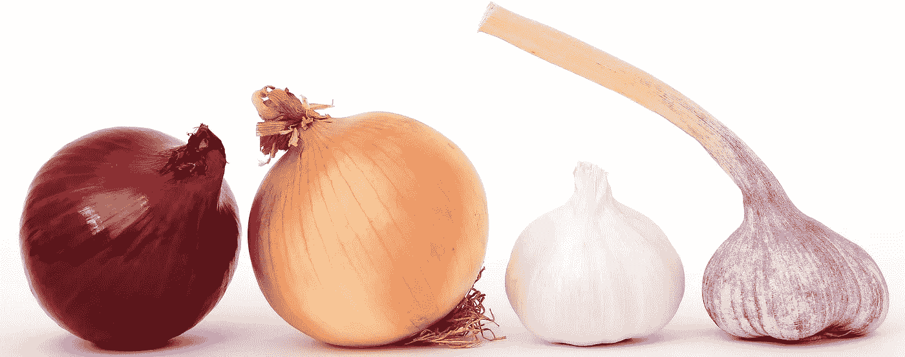
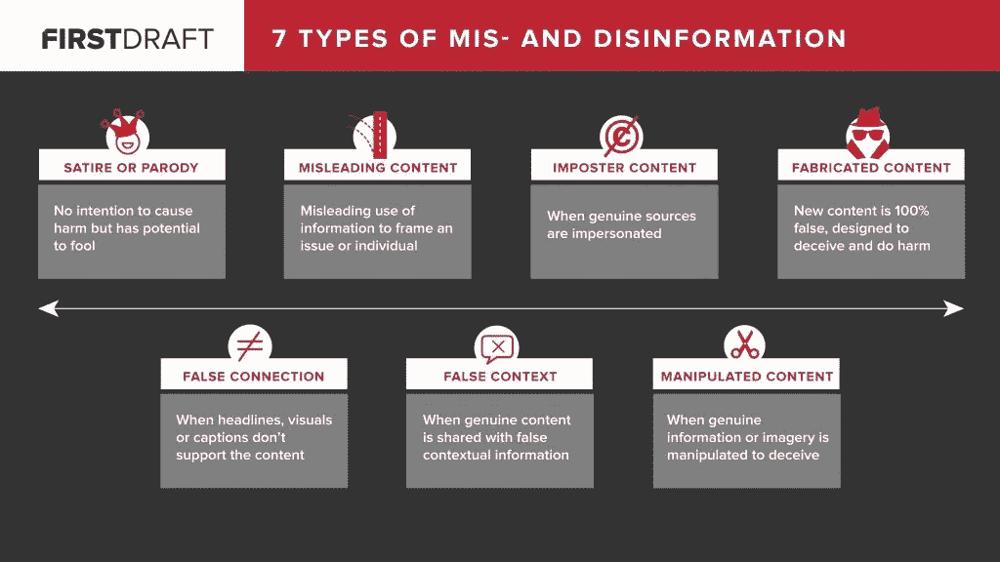
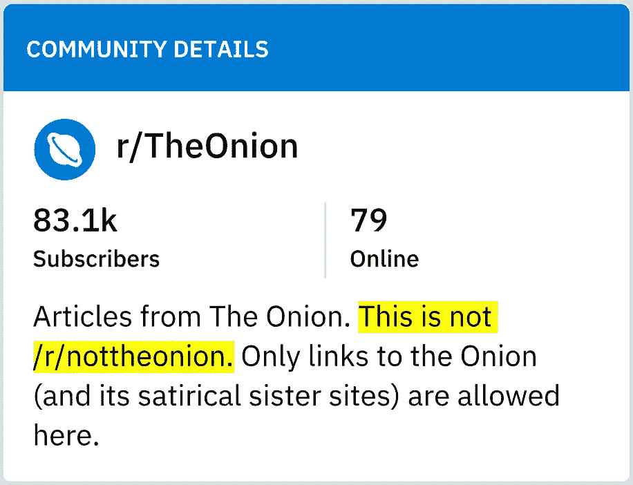
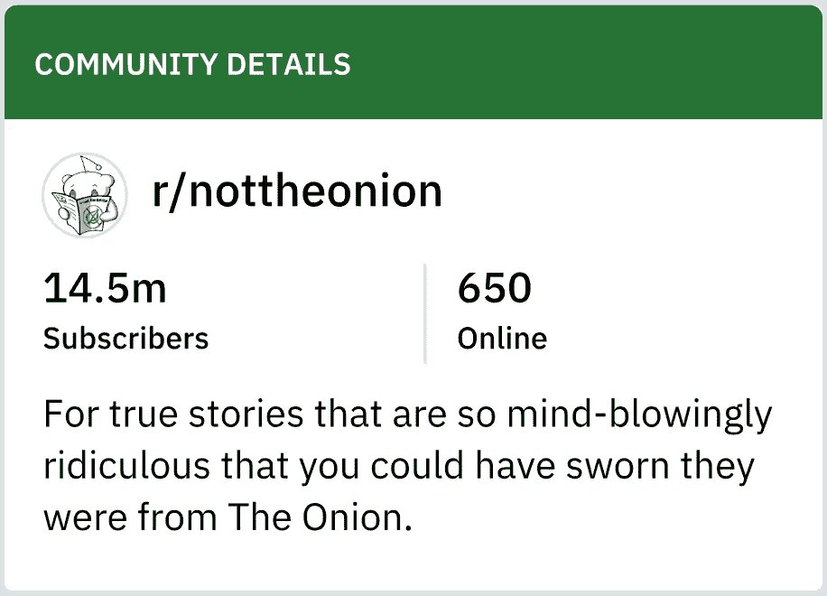
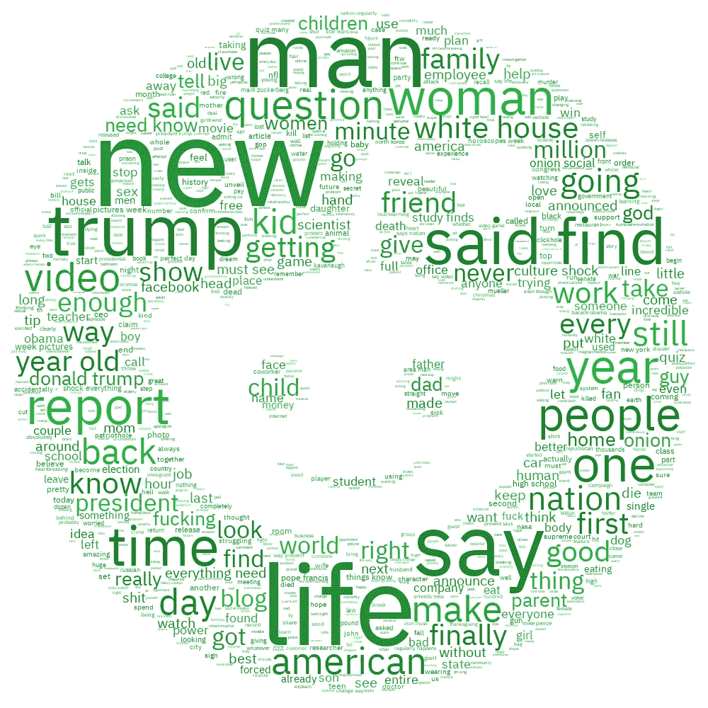

# 假消息还是假消息？

> 原文：<https://towardsdatascience.com/fake-news-or-not-edad1552aa02?source=collection_archive---------14----------------------->

## 使用自然语言处理来识别文章



(Original photo by [Robert Owen-Wahl](https://pixabay.com/en/food-onions-garlic-spices-herbs-1239423/).)

虽然“假新闻”一词近年来成为热门话题，但假新闻本身并不新鲜。事实往往比小说更离奇，这也不是什么新鲜事——有时真实的故事很难让人相信。

研究员克莱尔·沃德尔将假新闻分为七种类型，大致以欺骗的意图来衡量。



7 Types of Mis- and Disinformation (Source: “[Fake News. It’s Complicated.](https://firstdraftnews.org/fake-news-complicated/)”)

[*洋葱*](https://en.wikipedia.org/wiki/The_Onion) 属于第一种:讽刺或戏仿。该组织于 1988 年开始出版讽刺文章，然后于 1996 年上线。来自 *The Onion* 及其讽刺姐妹网站的文章在 Reddit subreddit[**r/The Onion**](https://www.reddit.com/r/TheOnion)上分享，截至 2018 年 12 月 21 日，该网站拥有 83.1 万订户。

还有一个副标题[**r/not theo nion**](https://www.reddit.com/r/nottheonion):“对于真实的故事，它们是如此的荒谬，以至于你可以发誓它们来自洋葱。”它拥有 1450 万订户，远远超过了它所引用的出版物的子编辑数量。

另一个分支 [**联盟**](https://www.reddit.com/r/atetheonion) 拥有 22.9 万用户，数量也超过了**联盟**的用户。这一篇是献给“那些没有把《洋葱》的文章视为讽刺作品的人”

这两种观点都指向了人们对“奇怪但真实”的新闻的兴趣以及将事实与虚构分开的挑战。

这就提出了一个问题:

## 能否利用自然语言处理，仅凭标题来预测一篇文章是来自 r/TheOnion(假新闻)还是来自 r/nottheonion(真新闻)？



Even Reddit users get **r/TheOnion** and **r/nottheonion** mixed up.

# 数据收集

我最初使用 [Reddit API](https://www.reddit.com/dev/api/) 来收集数据，但是被限制在每个 subreddit 1000 个帖子。我还试着使用 PRAW，但无法超过 1000 篇文章的上限，因为它只是 Reddit API 的一个包装器。

然而， [pushshift.io API](https://pushshift.io/api-parameters/) 不受上限限制。使用这个，我收集了每个子主题、 **r/TheOnion** 和 **r/nottheonion** 的 10，000 个最近提交的内容(在收集时)。

向每个部门提交的内容跨越不同的时间范围:

*   **r/TheOnion**:2016 年 9 月 22 日至 2018 年 12 月 17 日
*   **r/nottheonion**:2018 年 10 月 26 日至 2018 年 12 月 17 日

**r/not theon**的较短时间跨度反映了更大的用户基数和更大的信号源多样性。[人们可以提交来自任何用英语撰写的“原始、可靠来源”的](https://www.reddit.com/r/nottheonion/wiki/nto101)新闻文章，而 **r/TheOnion** 只接受来自 *The Onion* 或姐妹网站的文章。

# 处理

在收集之后，根据以下步骤处理每个提交的标题:

1.  重音符号被删除，所以单词不会被不恰当地分开。(例如，“神奇宝贝”被变成了“神奇宝贝”和“神奇宝贝”。)
2.  标点符号被删除。
3.  大写被删除，以便只返回小写单词。
4.  单词被词条化了。
5.  停用字词已被删除。

这些步骤把这个:

```
Fighting Fire With Fire: Mitch McConnell Is Attempting To Channel Alexandria Ocasio-Cortez’s Populist Appeal By Preparing A Supper Of Boiled Dog Live On Instagram
```

变成这个“干净”的标题:

```
fighting fire fire mitch mcconnell attempting channel alexandria ocasio cortez populist appeal preparing supper boiled dog live instagram
```

从这里开始，数据被分成训练和测试数据，然后使用`CountVectorizer()`进行矢量化。

# 建模

由于每个子编辑有 10，000 个提交，基线准确度分数是 50%。换句话说，一个以同样方式对每本书进行分类的模型将会得到一半的正确答案。

我运行了几种不同的分类模型，并获得了每种模型的交叉验证、训练和测试准确度分数。测试分数如下:

*   随机森林(通过 GridSearch 调整超参数):84.5%
*   逻辑回归分析:86.8%
*   多项式朴素贝叶斯:87.1%

所有模型都返回了比基线更好的准确度分数。

# 选定的模型详细信息

尽管多项朴素贝叶斯的表现略好于逻辑回归，但考虑到可解释性，我最终选择了逻辑回归。

准确性得分如下:

*   交叉验证:85.5%
*   培训:97.3%
*   测试:86.8%

分类标准:

*   错误分类率:13.2%
*   召回率/敏感度:86.4%
*   特异性:87.3%
*   精确度:87.2%

该模型显然与训练数据过度拟合，但从交叉验证得分来看，其表现与预期大致相同。它能够仅凭标题就以 86.8%的准确率预测一篇文章是来自 **r/TheOnion** 还是 **r/nottheonion** 。



Word clouds showing the most frequent words in **r/TheOnion** (left, in green) and **r/nottheonion** (right, in red).

# 洞察力

## 关联词语

我生成了上面的单词云来显示每个子编辑的“干净”标题中的单词频率。和 T2 有许多相同的最常用的词:男人，王牌，女人，比如说，新的。

逻辑回归能够提供更多有用的信息:与每个子主题最相关的单词。在 **r/TheOnion** 中，更有可能出现在标题中的单词是小测验、国家、博客、不可思议和提示。更有可能出现在标题中的词是便便、被捕、起诉、说和警察。

## 便便和 r/not theon

该模型识别出包含单词“便便”的标题更有可能来自**r/nottheoneion**。事实上，包含这个词的 47 个标题中有 46 个来自这个子编辑。这些投稿中有许多被删除了，因为它们没有“独特的品质”(看起来更像讽刺而不是新闻，不仅仅是一个有趣的标题)，或者来自不可靠的新闻来源。

下面是一篇提交给**r/not theon**但被删除的文章的例子:

[](https://www.yahoo.com/news/scientists-ate-legos-see-long-takes-poop-them-184836638.html) [## 科学家们吃了乐高玩具，看看需要多长时间才能把它们拉出来

### 儿科医生在日常工作中必须处理各种有趣的情况，包括儿童饮食…

www.yahoo.com](https://www.yahoo.com/news/scientists-ate-legos-see-long-takes-poop-them-184836638.html) 

提交给 **r/TheOnion** 的带有“便便”一词的投稿被删除，因为它不是来自洋葱或其姐妹网站。它包含在测试数据中，但被错误分类。

## 更多的错误分类

如上所述，一些错误分类可能是由包含模型与其他子编辑相关联的单词的标题引起的。仔细观察会发现，由于没有遵循提交指南，此类提交也可能已从给定子编辑中删除。由于各种原因，许多其他的错误分类也被从它们给定的子分类中删除。这表明过滤掉从子编辑中删除的提交内容有助于提高模型的准确性。

## 复制

然而，由于重复，许多提交内容也从 **r/TheOnion** 和 **r/nottheonion** 中删除。能够看到这些提交可以洞察订阅者对文章的兴趣。

在**r/not theon**的情况下，它还可以洞察订户认为哪些文章适合子编辑，即使它们最终被删除。例如，在 2018 年 12 月 2 日至 12 月 4 日期间，下面这篇文章(或来自其他网站的类似标题的文章)在 **r/nottheonion** 上提交了 80 多篇，显示出新闻发布后不久的一系列活动。

[](https://www.theguardian.com/world/2018/dec/03/its-real-me-nigerian-president-denies-dying-and-being-replaced-by-clone?CMP=fb_gu&fbclid=IwAR20Y9NWZdaIfUGiXnwQYlGd3s1bGK32XbGWNJwxlrubVgR3mDZtTZEVDik) [## “这是真正的我”:尼日利亚总统否认死亡和被克隆人取代

### 穆罕默杜·布哈里打破沉默，澄清了一个在社交媒体上流传数月的谣言

www.theguardian.com](https://www.theguardian.com/world/2018/dec/03/its-real-me-nigerian-president-denies-dying-and-being-replaced-by-clone?CMP=fb_gu&fbclid=IwAR20Y9NWZdaIfUGiXnwQYlGd3s1bGK32XbGWNJwxlrubVgR3mDZtTZEVDik) 

## 真实世界的事件

在 **r/TheOnion** 的情况下，讽刺文章的重复发布可能与现实世界的事件有关。在 2017 年 10 月 2 日至 2018 年 11 月 8 日期间，有 27 篇关于枪支暴力的文章提交:

[](https://www.theonion.com/no-way-to-prevent-this-says-only-nation-where-this-r-1830308976) [## 唯一一个经常发生这种情况的国家说，没有办法防止这种情况

### 加利福尼亚州千橡市——在加利福尼亚州发生暴力事件后的几个小时内，一名单独的袭击者杀死了 12 名…

www.theonion.com](https://www.theonion.com/no-way-to-prevent-this-says-only-nation-where-this-r-1830308976) 

这篇文章促成了将单词“nation”与这个子编辑相关联的模型。但更重要的是，这些转发通常与真实的[大规模枪击事件](https://www.gunviolencearchive.org/reports/mass-shooting)相对应，包括:

*   内华达州拉斯维加斯(2017 年 11 月 1 日)
*   德克萨斯州萨瑟兰斯普林斯(2017 年 11 月 5 日)
*   加利福尼亚州特哈马县(2017 年 11 月 14 日)
*   佛罗里达州帕克兰市斯通曼·道格拉斯高中(2018 年 2 月 14 日)
*   德克萨斯州圣菲高中(2018 年 5 月 18 日)
*   马里兰州安纳波利斯《首都公报》(2018 年 6 月 29 日)
*   加利福尼亚州贝克斯菲尔德(2018 年 12 月 9 日)
*   北卡罗来纳州巴特勒高中(2018 年 10 月 29 日)
*   加利福尼亚州千橡市(2018 年 11 月 8 日)

事实上，许多 **r/TheOnion** 用户开始使用转发作为另一场大规模枪击事件发生的信号，其中一位[评论](https://www.reddit.com/r/TheOnion/comments/9vbbcv/no_way_to_prevent_this_says_only_nation_where/e9buxxw/)“通常我在看到洋葱的文章之前就听说了枪击事件。这次不会了。”

# 后续步骤

我想对这个项目采取的一些后续步骤包括:

*   深入理解错误分类的标题。
*   尝试过滤掉从子编辑中删除的提交内容。
*   查看 **r/TheOnion** 中的重复帖子如何与真实新闻相关联。
*   开发更稳健的模型。

*感谢阅读！想法、问题和反馈总是很受欢迎。还可以查看本项目* *的* [*GitHub 回购。*](https://github.com/dawngraham/reddit-theonion)